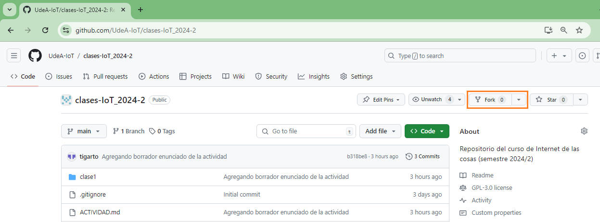

# Respositorio del curso de IoT (2024/2)

## Finalidad

El siguiente repositorio tiene como finalidad:
1. Documentar lo que se hace a lo largo de las clases del semestre 2024/2
2. Colocar actividades para su desarrollo a lo largo del semestre.
3. Propiciar el trabajo colaborativo entre todos los miembros a lo largo del semestre.
4. Fomentar el aprendizaje de nuevas cosas para aplicarlo en nuevas cosas.

## Primeros pasos

El trabajo a lo largo del curso será, en lo posible, lo mas colaborativo posible. Para tal fin se creo el siguiente repositorio con el fin de ir agregando material de utilidad para las clases. 

Como el objetivo es que este sea actualizado no solo por los profesores del curso sino tambien por lo estudiantes, se iran coloando ademas, actividades de seguimiento las cuales deberan ser subidas al repositorio como evidencia. 

Para tal fin, cada uno de los estudiantes matriculados, debera hacer un **Fork** de este repositorio tal y como se muestra en la siguiente figura:

Luego, clone el repositorio resultante del fork (el que quedo asociado a su cuenta) en su maquina para realizar las actividades que se vayan asignando a lo largo del semestre.

Despues haber llevado a cabo las dos actividades previas, tenga en su cuenta los siguientes pasos antes de trabajar en las actividades que sean asignadas:
1. Antes de trabajar en el repo suyo (el forkeado del original en su cuenta), verifique es este se encuentra sincronizado con el repositorio original. Si no lo esta, realice la sincronización antes de proseguir.
2. Despues de sincronizar, realice una actualización del repositorio local (el que clono a su maquina) haciendo un **`pull`**, de este modo los cambios locales quedaran actualizados con los que se encuentra en github.
3. Realice las actividades en su maquina local, actualice este repositorio (**`add`** + **`commit`**).
4. Despues de actualizar el repositorio local, actualice los cambios hachos en su repositorio en github (**`push`**).
5. Finalmente, despues de lo anterior, realice un **`pull request`** para que los cambios y actualizaciones realizadas por usted, sean realizados en el repositorio original.
6. Repetir el paso **1** para que el repositorio suyo este al dia con el original.

Con esto, tanto su repositorio como el original se iran actualizando conforme vaya evolucionando el curso y lo que allí quede no solo nos servira a nosotros sino a cualquier otra persona que este interesada en empezar a cacharrear de manera introductoria con todo esto relacionado con la **IoT**.

## Clases

### Introducción al IoT

La siguiente tabla muestra la lista de clases asociadas a esta sección:

|Clase|Fecha|Tema|Recursos|
|---|---|---|---|
|1|08/08/2023|Introducción al IoT|[[link]](./clase1/)|
|2|13/08/2023|Redes y protocolos |[[link]](./clase2/)|
|3|15/08/2023|Componentes basicos de un Sistema IoT |[[link]](./clase3/)|
|5|20/08/2023|...|[[link]](./clase4/)|

### Capa de percepción

En construcción...

### Capa de Red

En construcción...

### Capa de Aplicación

En construcción...

## Referencias

En construcción...

