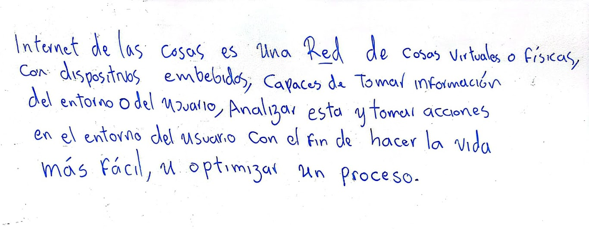
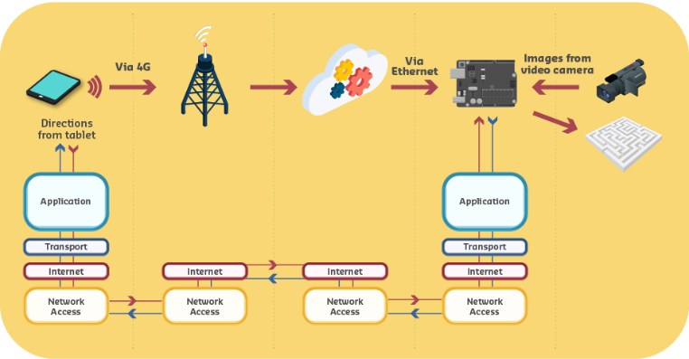

# Sesión 1 - Introducción al IoT

> ## Objetivos
> 1. Introducir el concepto de IoT.
> 2. Estudiar varios escenarios de aplicación.
> 3. Dar los primeros pasos para el planteamiendo de una idea para el proyecto final del curso.

## Agenda

- [x] Revisión del concepto de IoT
  
  
  - [x] 1. Revisión de la definición de IoT [[link](#aspectos-claves)]
  - [x] 2. Video de contextualización **What in the world is The Internet of Things?** [[link]](https://www.youtube.com/watch?v=jhOOxEUG4NM)
  - [x] 3. Ejemplo de una aplicación IoT: Juego del laberinto [[link]](#ejemplo-de-una-aplicación-iot)
  - [x] 4. Presentación **Introduction to IoT** [[link]](https://github.com/microsoft/IoT-For-Beginners/blob/main/slides/lesson-1.pdf)
  - [ ] 5. Videos adicionales sobre IoT.

- [ ] Actividad para la proxima clase.

## Referencias para la sesión

### Definición de IoT

El concepto de **IoT** es bastante amplio y aunque cualquier defición siempre apunta a lo mismo, se tienen muchas visiones al respecto. La siguiente tabla recoge la definición de **IoT** consultada por los estudiantes del semestre 2024/4 ([link](https://docs.google.com/spreadsheets/d/1kTLxHpNz55lLmveciWfcNVhvmvIDLpeG90T5kV-fh-E/edit?usp=sharing)) donde se lista la definición de IoT realizada por diferentes emprezas y organismos del sector tecnologico.

|#|Definición|Fuente|
|---|---|---|
|1|El Internet de las cosas viene de Internet of Things (IoT) y es el proceso que habilita a los dispositivos físicos a conectarse a Internet. Esto se convierte en una red colectiva de colaboración y comunicación entre los equipos y la nube. Sus beneficios son infinitos. Por ejemplo, en la actualidad no nos sorprende que una aspiradora, un celular, un automóvil, o hasta un kindle tengan acceso a internet. Esta función permite que recopilen datos y respondan de forma inteligente ante cualquier problema.|HP|
|2|Red de objetos y dispositivos físicos que están equipados con sensores, software y otras tecnologías con el fin de conectarse e intercambiar datos con otros dispositivos y sistemas a través de Internet.|SAP|
|3|The internet of things, or IoT, is a network of interrelated devices that connect and exchange data with other IoT devices and the cloud. IoT devices are typically embedded with technology such as sensors and software and can include mechanical and digital machines and consumer objects|Techtarget|
|4|El Internet de las cosas (IoT) es el proceso que permite conectar los elementos físicos cotidianos al Internet: desde los objetos domésticos comunes, como las bombillas de luz, hasta los recursos para la atención de la salud, como los dispositivos médicos; las prendas y los accesorios personales inteligentes; e incluso los sistemas de las ciudades inteligentes.|Redhat|
|5|El término IoT, o Internet de las cosas, se refiere a la red colectiva de dispositivos conectados y a la tecnología que facilita la comunicación entre los dispositivos y la nube, así como entre los propios dispositivos.|AWS|
|6|El Internet de las cosas (IoT) se refiere a los objetos físicos (vehículos, electrodomésticos, ropa, etc.) que están conectados a Internet de manera que puedan transmitir datos online. Desde la botella de gas industrial que permite saber al almacén cuándo es necesario cambiarla y el implante coronario que permite que un médico pueda monitorizar a su paciente de forma remota hasta la nevera que anuncia cuándo necesita volver a llenarse, las aplicaciones de IoT para empresas y consumidores continúan proliferando.|Salesforce|
|7|El Internet de las cosas (IdC) es una red global y cada vez mayor de objetos con conexión a Internet que transfieren datos y se comunican entre sí. Todos estos objetos tienen identificadores únicos y pueden ser cualquier cosa, desde dispositivos móviles a electrodomésticos o automóviles. El IdC también puede incluir personas, animales u otros objetos con sensores integrados, como un monitor de frecuencia cardíaca para la prevención de ataques al corazón, collares que pueden seguir la ubicación y la salud de un perro o sensores en equipos agrícolas para detectar problemas en cultivos.|VMWare|
|8|El Internet de las cosas (IoT) se refiere a una red de dispositivos físicos, vehículos, electrodomésticos y otros objetos físicos que están integrados con sensores, software y conectividad de red que les permite recopilar y compartir datos. Estos dispositivos, también conocidos como “objetos inteligentes”, pueden variar desde simples dispositivos “domésticos inteligentes”, como termostatos inteligentes, hasta dispositivos portátiles como relojes inteligentes y ropa con RFID, hasta complejas maquinarias industriales y sistemas de transporte. Los tecnólogos incluso están imaginando “ciudades inteligentes” enteras basadas en tecnologías de IoT.|IBM|
|9|La Internet de las cosas (IoT) describe la red de objetos físicos ("cosas") que llevan incorporados sensores, software y otras tecnologías con el fin de conectarse e intercambiar datos con otros dispositivos y sistemas a través de Internet.|Oracle|
|10|La Iot es un concepto que se refiere a la interconexión de objetos cotidianos a través de Internet. En lugar de limitarse a la comunicación entre personas, el IoT permite que diferentes dispositivos, sensores y sistemas interactúen y compartan información de forma automatizada.|Claro Colombia|
|11|El Internet de las cosas es un sistema tecnológico de soluciones inteligentes que permite que los objetos se conecten a Internet y entre sí. Consiste en sistemas ciberfísicos, computación integrada que usan la infraestructura de Internet y las aplicaciones y servicios que la utilizan.|Carlemany|
|12|"Dicho en pocas palabras, la IoT le permite solucionar los problemas de su negocio usando sus propios datos. La Internet de las cosas no va únicamente de dispositivos conectados, sino de la información que recopilan esos dispositivos y las eficaces conclusiones inmediatas que se pueden obtener con esa información.La Internet de las cosas (IoT) permite que su organización analice los datos y actúe en consecuencia, de modo que puede tomar decisiones inteligentes en tiempo real."|Microsoft|
|13|El Internet de las cosas (IdC) describe objetos físicos (o grupos de estos) con sensores, capacidad de procesamiento, software y otras que se conectan e intercambian datos con otros dispositivos y sistemas a través de internet u otras redes de comunicación|Wikipedia|
|14|"El Internet de las Cosas, abreviado como IoT, es una red interconectada de dispositivos físicos (ordenadores, sensores y maquinaria) y software (aplicaciones) que trabajan juntos para automatizar y agilizar los procesos. Esta red intercambia información y órdenes a través de Internet, recogiendo, registrando y gestionando datos para potenciar la funcionalidad de los dispositivos conectados. Estos dispositivos y aplicaciones incluyen herramientas cotidianas, como tu FitBit o Amazon Dot. También pueden ser sistemas a nivel industrial, como equipos de fabricación o sensores a gran escala."|Kinsta|
|15|El Internet de las cosas (IoT) es una red de objetos físicos que están conectados a Internet. Muchos de estos dispositivos, como los sensores, generan datos.|MongoDB|
|16|Internet de las cosas (IoT) [UIT-T Y.4000]: infraestructura mundial para la sociedad de la información que propicia la prestación de servicios avanzados mediante la interconexión de objetos (físicos y virtuales) gracias a la interoperabilidad de tecnologías de la información y la comunicación presentes y futuras.|UIT-T Y.4101/Y.2067|

Tal y como puede observar en la tabla anterior, la cantidad de  definiciones es abrumadora (y eso que aún faltan), de modo que a continuación se comparte una definición (de los estudiantes de clase del 2023/2) que condensa la tabla anterior:

Lo anterior se explica mejor en **What in the world is The Internet of Things?** cuyo video se muestra a continuación (link en la imagen):

### Ejemplo de una aplicación IoT

A continuación se muestra una aplicación IoT tipica para controlar de manera remota un dispositivo para jugar desarrollado en la universidad de Curtin (https://www.curtin.edu.au/).  

La aplicación consiste en un sistema de control en tiempo real para guiar una canica a lo largo de un laberinto de manera remota. El diagrama de bloques donde se expone la arquitectura de este sistema se muestra a continuación:

### Material audiovisual de apoyo 

Con el concepto de **IoT** mejor comprendido, es hora de abordar algunos de los aspectos basicos a tener en cuenta al conectar **THINGS** los cuales, en el contexto de los videos mostrados a continuación son: **CONECTIVIDAD + ANALITICA + SEGURIDAD**.

La siguiente tabla muestra cada uno de estos aspectos de manera separada fusionando todo al final en **IoT**:

|Aspecto|Video|
|---|---|
|Conectividad|**How things connect** [[URL]](https://www.youtube.com/watch?v=HaVdfpYCVYo&list=PLhWCVvljiWqOgx5WHdd1Xi_uwbBopFiGG)|
|Analitica|**Programming IoT** [[link]](https://www.youtube.com/watch?v=XusIjrVAbuk&list=PLhWCVvljiWqOgx5WHdd1Xi_uwbBopFiGG)|
|Seguridad|**Securing IoT**  [[link]](https://www.youtube.com/watch?v=CgsU8o8MGIQ&list=PLhWCVvljiWqOgx5WHdd1Xi_uwbBopFiGG)|
|IoT (Juntando todo)|**All together now** [[link]](https://www.youtube.com/watch?v=JMfA7EUZsjE&list=PLhWCVvljiWqOgx5WHdd1Xi_uwbBopFiGG)|

### Actividad

Modifique el siguiente archivo ([link](./ACTIVIDAD.md)) de acuerdo a las instrucciones que alli se dan siguiendo las instrucciones dadas en clase.

**Nota**: Como se necesita realizar la modidicación de un archivo markdown, tenga a la mano una tabla donde se resuma la sintaxis empleada. A continuación se muestran algunos enlaces de utilidad:
* **Markdown Cheat Sheet** ([link](https://www.markdownguide.org/cheat-sheet/))
* **Markdown Cheat Sheet** by DataCamp ([link](https://www.datacamp.com/cheat-sheet/markdown-cheat-sheet-23))
* **Markdown Cheatsheet** by Adam Pritchard ([link](https://github.com/adam-p/markdown-here/wiki/Markdown-Cheatsheet))
* **Markdown summary** by Jay Nelson ([link](https://observablehq.com/@jaynel/markdown-summary))

## Referencias

1. **Definition of Internet of Things (IoT)** [[link]](https://dipato.github.io/Material/docs/Theory/Introduction/definition)
2. **Introduction to IoT** [[link]](https://github.com/microsoft/IoT-For-Beginners/blob/main/1-getting-started/lessons/1-introduction-to-iot/README.md)