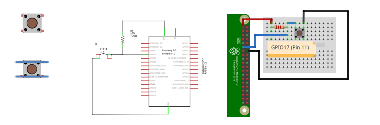
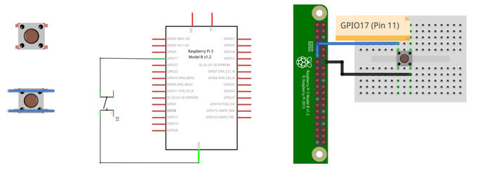
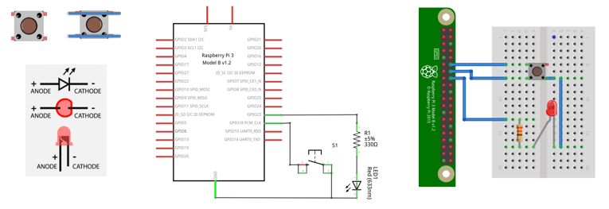
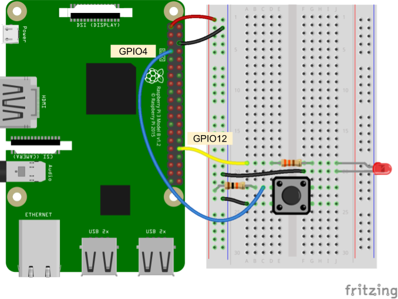

# Ejemplos

## Ejemplos

1. Realizar un programa que haga parpadear un led cada 1 segundo. 

   

   
   

   **Solución** [[link]](gpio_example1/README.md)

2. Realizar un programa imprima en consola "boton presionado" cada vez que se presione el botón, para el caso use una resistencia de pull-up externa.

   

   
   

   **Solución** [[link]](gpio_example2/README.md)

3. Repita el ejemplo 2 pero sin usar resistencia de pull-up externa.

   

   
   

   **Solución** [[link]](gpio_example3/README.md)

4. Realizar un programa que cambie el estado de un led (de ON → OFF y viceversa) cada vez que se presiona un botón. 

   

   
   

   **Solución** [[link]](gpio_example4/README.md)

5. Hacer un programa que permita ingresar el PWM por teclado (0-100) para ir cambiando la intensidad de un led.

   

   
   

   **Solución** [[link]](gpio_example5/README.md)

6. El siguiente ejemplo es tomado del enlace esta asociado al [Experiment 2: Play Sounds](https://learn.sparkfun.com/tutorials/python-programming-tutorial-getting-started-with-the-raspberry-pi/experiment-2-play-sounds) tomado del [Python Programming Tutorial: Getting Started with the Raspberry Pi](https://learn.sparkfun.com/tutorials/python-programming-tutorial-getting-started-with-the-raspberry-pi) de sparkfun. El circuito asociado se muestra a continuación:

   

   
   

   **Solución** [[link]](gpio_example6/)

7. Ejemplo tomado y adaptado del siguiente [enlace](https://learn.adafruit.com/playing-sounds-and-using-buttons-with-raspberry-pi/)
   
   **Solución** [[link]](gpio_example7/)