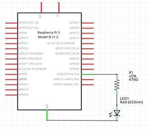

# Ejemplo 1 

## Descripción

Realizar un programa que haga parpadear un led cada 1 segundo. 

## Hardware

La siguiente tabla muestra los componentes principales del circuito a montar:

|Item # |Cantidad |Descripción| Información|
|---|---|---|---|
|1|1|rPi (3 o 4)||
|2|1|Resistencia $470 \Omega$||
|3|1|Led||

> **Archivo Fritzing** <br>
> El archivo fritzing asociado al ejemplo es [led_out.fzz](led_out.fzz)

### Esquematico

<p align = "center">

</p>

### Conexión

<p align = "center">

</p>


## Software


### Codigo

El archivo [led_blink_ex1.py](led_blink_ex1.py) contiene el código solución el cual se muestra a continuación:

```py
import RPi.GPIO as GPIO
import time

# Pin Definitons
ledPin = 18

# Pin Setup
GPIO.setmode(GPIO.BCM) # Broadcom pin-numbering scheme GPIO.setup(ledPin,GPIO.OUT) # LED pin set as output
try:
    while True:
        GPIO.output(ledPin, True)
        time.sleep(1) 
        GPIO.output(ledPin, False)
        time.sleep(1)
except KeyboardInterrupt: # If CTRL+C is pressed, exit cleanly: 
    GPIO.cleanup() # cleanup all GPIO 
```

### Pruebas

To Do...

## Referencias

To Do...
