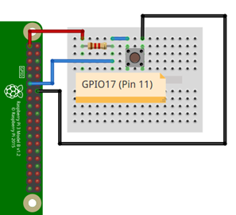

# Ejemplo 2 


## Descripción

Realizar un programa imprima en consola **"boton presionado"** cada vez que se presione el botón, para el caso use una resistencia de pull-up externa. 

## Hardware

La siguiente tabla muestra los componentes principales del circuito a montar:

|Item # |Cantidad |Descripción| Información|
|---|---|---|---|
|1|1|rPi (3 o 4)||
|2|1|Resistencia $1.2 k\Omega$||
|3|1|Pulsador||

<br>

> **Archivo Fritzing** <br>
> El archivo fritzing asociado al ejemplo es [button_external_pullUp.fzz](button_external_pullUp.fzz)

### Esquematico

<p align = "center">

</p>

### Conexión

<p align = "center">

</p>


## Software

### Codigo

El archivo [button_ex2.py](button_ex2.py) contiene el código solución el cual se muestra a continuación:

```py
import RPi.GPIO as GPIO
import time

# Pin Definitons
buttonPin = 17

# Pin Setup
GPIO.setmode(GPIO.BCM) # Broadcom pin-numbering scheme GPIO.setup(buttonPin,GPIO.IN) # LED pin set as output
try:
    while True:
        buttonValue = GPIO.input(buttonPin)
        if buttonValue == True:
            print("Boton presionado")
except KeyboardInterrupt: # If CTRL+C is pressed, exit cleanly: 
    GPIO.cleanup() # cleanup all GPIO 
```


### Pruebas

To Do...

## Referencias

To Do...

