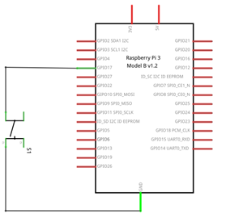
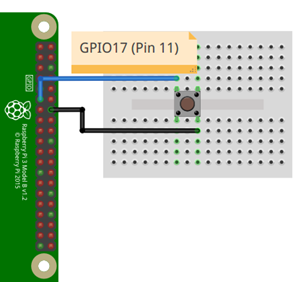
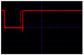

# Ejemplo 3 

## Descripción

Repita el [ejemplo 2](../gpio_example2/README.md) pero sin usar resistencia de pull-up externa.

## Hardware

La siguiente tabla muestra los componentes principales del circuito a montar:

|Item # |Cantidad |Descripción| Información|
|---|---|---|---|
|1|1|rPi (3 o 4)||
|2|1|Pulsador||

> **Archivo Fritzing** <br>
> El archivo fritzing asociado al ejemplo es [button_internal_pullUp.fzz](button_internal_pullUp.fzz)

### Esquematico

<p align = "center">

</p>

### Conexión

<p align = "center">

</p>


## Software

### Codigo

> **Rebote** </br>
> Cuando se presiona o libera un botón lo que sucede es un cambio en su estado (nivel de voltaje). Desde el punto de vista ideal este cambio debería ser instantaneo, sin embargo, en la realidad lo que sucede es una serie de oscilaciones antes de que el botón alcance un valor estable. Estas oscilaciones se conocen como rebotes (bounce).
>
> <p align = "center">
> 
> </p>

El archivo [button_anti_db_ex3.py](button_anti_db_ex3.py) contiene el código solución en el cual, la lectura del valor del botón se lleva a cabo 200 ms (`time.sleep(0.2)`) despues con el fin de que el valor obtenido en la lectura del boton sea el valor ya estabilizado. El código se muestra a continuación:

```py
import RPi.GPIO as GPIO
import time

# Pin Definitons
buttonPin = 17

# Pin Setup
GPIO.setmode(GPIO.BCM) # Broadcom pin-numbering scheme GPIO.setup(buttonPin,GPIO.IN) # LED pin set as output
try:
    while True:
        buttonValue = GPIO.input(buttonPin)
        if buttonValue == True:
            print("Boton presionado")
        time.sleep(0.2)
except KeyboardInterrupt: # If CTRL+C is pressed, exit cleanly: 
    GPIO.cleanup() # cleanup all GPIO 
```


### Pruebas

To Do...

## Referencias

To Do...


