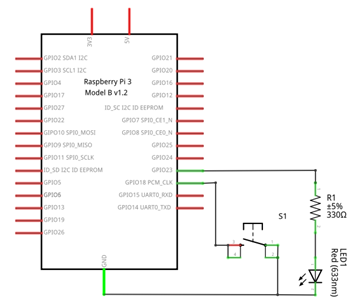
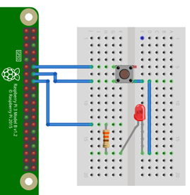

# Ejemplo 4 


## Descripción

Realizar un programa que cambie el estado de un led (de ON → OFF y viceversa) cada vez que se presiona un botón.

## Hardware

La siguiente tabla muestra los componentes principales del circuito a montar:

|Item # |Cantidad |Descripción| Información|
|---|---|---|---|
|1|1|rPi (3 o 4)||
|2|1|Resistencia $330 \Omega$||
|3|1|Pulsador||
|4|1|Led||

### Esquematico

<p align = "center">

</p>

### Conexión

<p align = "center">

</p>

## Software

### Codigo

El archivo [button_led_ex4.py](button_led_ex4.py) contiene el código solución el cual se muestra a continuación:

```py
import RPi.GPIO as GPIO
import time

GPIO.setmode(GPIO.BCM)

switch_pin = 18
led_pin = 23

GPIO.setup(switch_pin, GPIO.IN, pull_up_down=GPIO.PUD_UP)
GPIO.setup(led_pin, GPIO.OUT)

led_state = False
old_input_state = True # pulled-up

try: 
    while True:
        new_input_state = GPIO.input(switch_pin)
        if new_input_state == False and old_input_state == True:
            led_state = not led_state
            time.sleep(0.2)
        old_input_state = new_input_state
        GPIO.output(led_pin, led_state)
finally:
  print("Cleaning Up!")
  GPIO.cleanup()
```


### Pruebas

To Do...

## Referencias

To Do...

