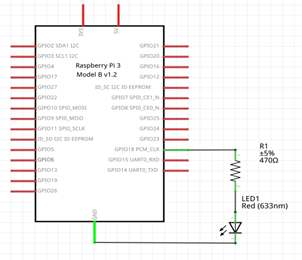

# Ejemplo 5 


## Descripción

Hacer un programa que permita ingresar el PWM por teclado (0-100) para ir cambiando la intensidad de un led.

## Hardware

La siguiente tabla muestra los componentes principales del circuito a montar:

|Item # |Cantidad |Descripción| Información|
|---|---|---|---|
|1|1|rPi (3 o 4)||
|2|1|Resistencia $470 \Omega$||
|3|1|Led||

<br>

> **Archivo Fritzing** <br>
> El archivo fritzing asociado al ejemplo es [led_out.fzz](led_out.fzz)

### Esquematico

<p align = "center">

</p>

### Conexión

<p align = "center">

</p>


## Software

### Codigo

El archivo [pwm_ex5.py](pwm_ex5.py) contiene el código solución el cual se muestra a continuación:

```py
import RPi.GPIO as GPIO

led_pin = 18
GPIO.setmode(GPIO.BCM)
GPIO.setup(led_pin, GPIO.OUT)

pwm_led = GPIO.PWM(led_pin, 500)
pwm_led.start(100)

try: 
  while True:
    duty_s = raw_input("Enter Brightness (0 to 100):")
    duty = int(duty_s)
    pwm_led.ChangeDutyCycle(duty)
finally:
  print("Cleaning Up!")
  pwm_led.stop()
  GPIO.cleanup()
```


### Pruebas

To Do...

## Referencias

To Do...