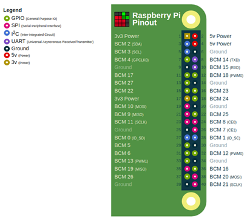
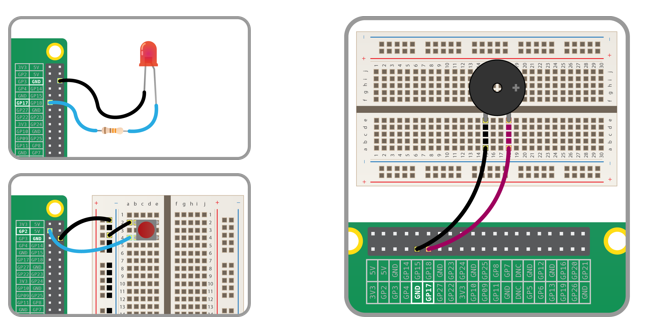
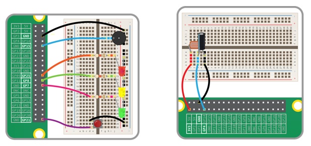
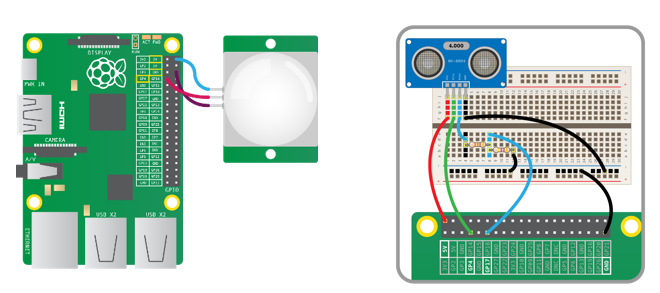
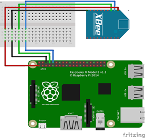
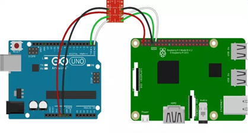
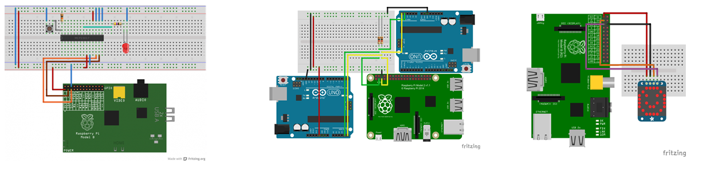
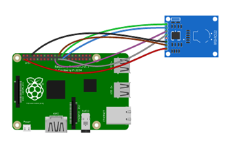

# RPi Pines de proposito general

## Antes de empezar

* https://projects.raspberrypi.org/en/projects/physical-computing/

## 1. Conector GPIO

En mayoria de los modelos de la Raspberry Pi los pines usan el mismo conector (header) de 40 pines (J8) tal y como se muestra en la siguiente figura:

 

De los 40 pines disponibles el en conector, 26 de estos son de proposito general.

 

En el conector se manejan tres tipos de pines los cuales son:

1. **Pines de alimentación**: Como su nombre lo dice, son pines dedicados a fuentes de alimentación (5v, 3.3v, GND):
   
   |Pin|Numero|Descripción|
   |---|---|---|
   |**`3V3`**|1, 17| Cualquier cosa que se conecte a este pin estara alimentadore a 3.3V|
   |**`5V`**|2, 4| Cualquier cosa conectada a este pin estara a 5V| 
   |**`GND`**|6, 9, 14, 20, 25, 30, 34, 39|Tierra del circuito, referencia de 0V|

2. **Pines de propósito general**: Etiquetados como **`GPIO xx`**. Pueden ser configurados como entradas o salidas.    

3. **Pines de propósito especial**: Además de ser pines de propósito general, estos pines pueden ser configurados para llevar a cabo otras funciones especiales (I2C, transmisión serial, etc). 
   
   

   
   

## 2. Pines de propósito general

Los pines de propósito general GPIO (general-purpose input/output (GPIO)) hacen referencia a un conjunto de pines genéricos en un circuito integrado cuyo comportamiento puede ser definido mediante programación.

Estos se caracterizan por ser pines bidireccionales (por lo que pueden ser programados como entradas o salidas). Esto permite conectar a estos diferentes elementos de entrada o salida como: botones, leds, sensores, motores, etc.

  <table border="1">
    <tr>
      <th>Elementos</th>
      <th>Conexiones</th>
    </tr>
    <tr>
      <td>Led, pulsador, buzzer</td>
      <td></td>
    </tr>
    <tr>
      <td>Varios elementos</td>
      <td></td>
    </tr>
    <tr>
      <td>Sensores (PIR, ultrasonido) </td>
      <td></td>
    </tr>     
  </table>

## 3. Pines de propósito especial

### 3.1. UART - Universal Asynchronous Receiver-Transmitter

Estos pines permiten la comunicación entre la rPi y dispositivos de hardware externo. 

   

Por ejemplo, el UART es una manera útil y directa de comunicar Raspberry Pi con Arduino; sin embargo, se debe tener cuidado con los niveles lógicos entre los dos dispositivos: la Pi es de 3.3v y el Arduino de 5V por lo que suele ser necesario algun hardware adicional que realiza la interfaz entre los dos niveles de voltaje:

   

### 3.2. I2C: Inter-Integrated Circuit

El I2C es un bus de datos serial desarrollado en 1982 por Philips para la comunicación entre diferentes partes de un circuito. En el caso de la Raspberry Pi, los pines de I2C son una manera extremadamente útil de permitir la comunicación entre esta con distintos tipos de periféricos externos, desde el expansor de puertos digital MCP23017, hasta un microcontrolador o incluso otra rPi.

   

### 3.3. SPI: Serial Peripheral Interface

Conocido como el bus serial de cuatro cables. El SPI permite encadenar múltiples dispositivos desde un solo conjunto de pines para lo cual asigna a cada chip un pin distinto de Chip Select.

   

## 4. Advertencias

Una advertencia previa muy importante antes de empezar: **los pines GPIO no están protegidos** frente a voltajes excesivos de entrada o amperajes excesivos de salida. Si se conecta algo de manera inapropiada, **se puede quemar la RPi**. Antes de conectar algún montaje es necesario tener seguridad que se sabe lo que se hace.

La siguiente tabla resume algunas recomendaciones importates:

| **Recomendación**                                      | **Descripción**                                                                                                                                             |
|--------------------------------------------------------|-------------------------------------------------------------------------------------------------------------------------------------------------------------|
| **Voltajes de GPIO**                                   | Los pines GPIO funcionan a 3.3V. Evite conectar dispositivos de 5V sin reguladores de nivel lógico para prevenir daños.                                       |
| **Corriente máxima de GPIO**                           | Los pines GPIO soportan hasta 16mA por pin y 50mA en total. Use transistores o relés para controlar dispositivos de alto consumo.                             |
| **Uso de resistencias**                                | Siempre use resistencias de protección (330Ω a 1kΩ) al conectar LEDs o botones para limitar la corriente.                                                     |
| **Protección contra picos de voltaje**                 | Use diodos flyback en dispositivos como motores para evitar que los picos de voltaje dañen la Raspberry Pi.                                                   |
| **Fuentes de alimentación externas**                   | Dispositivos de alto consumo (motores, pantallas) deben usar fuentes de alimentación externas, los puertos GPIO solo son usados para su control.                                      |
| **Protección contra cortocircuitos**                   | Revise bien las conexiones y evite cables sueltos que puedan causar cortocircuitos en los pines GPIO.                                                         |
| **Desconectar periféricos en caliente**                | Apague la Raspberry Pi antes de conectar o desconectar dispositivos para evitar daños eléctricos por picos de corriente.                                       |
| **Condiciones ambientales**                            | Evite trabajar en ambientes con humedad o estática. Use pulseras antiestáticas cuando manipule los componentes.                                            |                                                                               |
| **Transformadores y reguladores de voltaje**           | Asegúrate de que los circuitos de mayor potencia usen fuentes de alimentación estables y reguladores de voltaje.                                              |
| **Pruebas antes de conectar**                          | Prueba tus circuitos en un protoboard antes de conectarlos a la Raspberry Pi para verificar que no haya riesgos de cortocircuito o sobrecorriente.             |
| **Fusibles y reguladores de voltaje**                  | Instala fusibles y reguladores de voltaje para proteger la Raspberry Pi de sobrecorrientes y picos de tensión.                                                |
| **Convertidores de nivel lógico**                      | Usa convertidores de nivel lógico cuando te comuniques con dispositivos de 5V desde los pines GPIO de 3.3V.                                                   |
| **Uso de relés y optoacopladores**                     | Usa relés u optoacopladores para aislar eléctricamente la Raspberry Pi cuando controlas dispositivos de alto voltaje.                                         |
| **Capacitores de filtrado**                            | Agrega capacitores de filtrado para suavizar la señal de voltaje si notas inestabilidad en el sistema por ruidos eléctricos.                                   |

> **Importante** 
> En la siguiente pagina puede consultar el diagrama de pines para diferentes versiones de la rPi. https://pinout.xyz/

## Control de puertos

Para el control de pines GPIO en la Raspberry Pi existen diferentes bibliotecas dentro de las que se destacan:
* **GPIO Zero**: Esta es la opción ideal para empezar pues permite gestionar de manera mas facil e intuitiva el control de los puertos. Para mas información puede consultar la documentación en el siguiente [link](https://gpiozero.readthedocs.io/en/latest/).
* **RPi GPIO**: Esta es una libreria de mas bajo nivel que permite un control mas detallado sobre los pines GPIO de la RPi. Su uso requiere un mayor conocimiento de los pines GPIO de la RPi. La documentación puede ser consultda en el siguiente [link](https://pythonhosted.org/RPIO/).

## Ejemplos

A continuación se muestran algunos ejemplos usando ambas bibliotecas:
1. **Ejemplos biblioteca GPIO Zero** ([link](gpio_zero/README.md))
2. **Ejemplos biblioteca RPi GPIO** ([link](GPIO/README.md))

## Referencias

* https://projects.raspberrypi.org/en/projects/physical-computing/
* https://pi4j.com/1.2/pins/model-3b-rev1.html
* https://www.raspberrypi.com/documentation/computers/raspberry-pi.html
* https://raspberrypi.stackexchange.com/questions/68126/have-the-gpio-pins-changed-between-the-pi-2-and-the-pi-3
* https://www.raspberrypi.com/documentation/computers/os.html
* https://www.raspberrypi.com/software/raspberry-pi-desktop/
* https://randomnerdtutorials.com/raspberry-pi-pinout-gpios/
* https://franciscomoya.gitbooks.io/taller-de-raspberry-pi/content/es/elems/gpio.html
* https://www.hwlibre.com/gpio-raspberry-pi/
* https://raspberry-valley.azurewebsites.net/
* https://raspberry-valley.azurewebsites.net/Pin-Layout-on-Raspberry-Pi/
* https://www.raspberrypi-spy.co.uk/2012/06/simple-guide-to-the-rpi-gpio-header-and-pins/
* https://pinout.xyz/
* https://github.com/iot-udea/sesiones_magistrales/tree/master/ejemplos_26_08_2019
* https://github.com/iot-udea/sesiones_magistrales/tree/master
* https://blog.guruface.com/gpio-zero-library-and-rpi-gpio-library/
* https://learn.sparkfun.com/tutorials/raspberry-gpio/python-rpigpio-api
* https://blog.guruface.com/gpio-zero-library-and-rpi-gpio-library/
* https://www.makeuseof.com/tag/gpio-zero-raspberry-pi/
* https://gpiozero.readthedocs.io/en/stable/migrating_from_rpigpio.html
* https://forums.raspberrypi.com/viewtopic.php?t=204466
