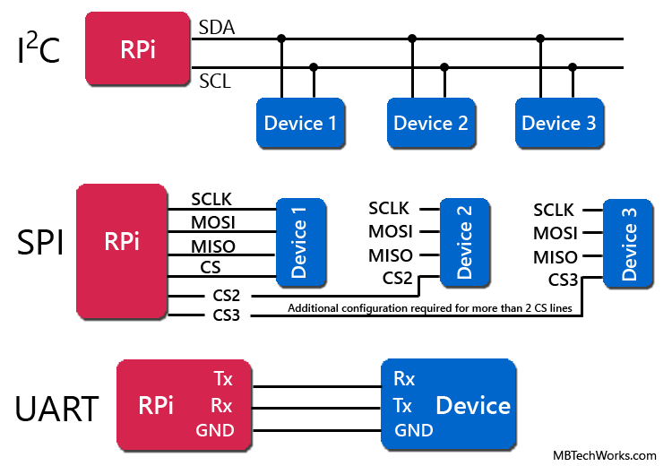

# RPi Pines de proposito general

## Antes de empezar

* https://projects.raspberrypi.org/en/projects/physical-computing/

## Conector GPIO

En mayoria de los modelos de la Raspberry Pi los pines usan el mismo conector (header) de 40 pines (J8) tal y como se muestra en la siguiente figura:

 

De los 40 pines disponibles el en conector, 26 de estos son de proposito general.

 

En el conector se manejan tres tipos de pines los cuales son:

1. **Pines de alimentación**: Como su nombre lo dice, son pines dedicados a fuentes de alimentación (5v, 3.3v, GND):
   
   |Pin|Numero|Descripción|
   |---|---|---|
   |**`3V3`**|1, 17| Cualquier cosa que se conecte a este pin estara alimentadore a 3.3V|
   |**`5V`**|2, 4| Cualquier cosa conectada a este pin estara a 5V| 
   |**`GND`**|6, 9, 14, 20, 25, 30, 34, 39|Tierra del circuito, referencia de 0V|

2. **Pines de propósito general**: Etiquetados como **`GPIO xx`**. Pueden ser configurados como entradas o salidas.    

3. **Pines de propósito especial**: Además de ser pines de propósito general, estos pines pueden ser configurados para llevar a cabo otras funciones especiales (I2C, transmisión serial, etc). 
   
   

   
   

## Pines de propósito general

Los pines de propósito general GPIO (general-purpose input/output (GPIO)) hacen referencia a un conjunto de pines genéricos en un circuito integrado cuyo comportamiento puede ser definido mediante programación.

Estos se caracterizan por ser pines bidireccionales (por lo que pueden ser programados como entradas o salidas). Esto permite conectar a estos diferentes elementos de entrada o salida como: botones, leds, sensores, motores, etc.

  <table border="1">
    <tr>
      <th>Elementos</th>
      <th>Conexiones</th>
    </tr>
    <tr>
      <td>Led, pulsador, buzzer</td>
      <td></td>
    </tr>
    <tr>
      <td>Varios elementos</td>
      <td></td>
    </tr>
    <tr>
      <td>Sensores (PIR, ultrasonido) </td>
      <td></td>
    </tr>     
  </table>

## Pines de propósito especial

### UART - Universal Asynchronous Receiver-Transmitter

Estos pines permiten la comunicación entre la rPi y dispositivos de hardware externo. 

   

Por ejemplo, el UART es una manera útil y directa de comunicar Raspberry Pi con Arduino; sin embargo, se debe tener cuidado con los niveles lógicos entre los dos dispositivos: la Pi es de 3.3v y el Arduino de 5V por lo que suele ser necesario algun hardware adicional que realiza la interfaz entre los dos niveles de voltaje:

   

### I2C: Inter-Integrated Circuit

El I2C es un bus de datos serial desarrollado en 1982 por Philips para la comunicación entre diferentes partes de un circuito. En el caso de la Raspberry Pi, los pines de I2C son una manera extremadamente útil de permitir la comunicación entre esta con distintos tipos de periféricos externos, desde el expansor de puertos digital MCP23017, hasta un microcontrolador o incluso otra rPi.

   

### SPI: Serial Peripheral Interface

Conocido como el bus serial de cuatro cables. El SPI permite encadenar múltiples dispositivos desde un solo conjunto de pines para lo cual asigna a cada chip un pin distinto de Chip Select.

   

## Advertencias

* Una advertencia previa muy importante antes de empezar: **los pines GPIO no están protegidos** frente a voltajes excesivos de entrada o amperajes excesivos de salida. Si se conecta algo de manera inapropiada, **se puede quemar la RPi**. Antes de conectar algún montaje es necesario tener seguridad que se sabe lo que se hace.
* No coloque más de 3.3 V en una señal de entrada ninguno de los pines de la GPIO.
* En un pin de salida no coloque una carga que consuma más de 16 mA. 
* En los conectores GPIO de 26 pines (RPi 1) la suma de las corrientes de todas las salidas no debe superar 50 mA. 
* En los conectores GPIO (Rpi 2, Rpi3) la suma de las salidas no debe superar los 100mA.
* Cuando utilice LEDs, 3 mA es suficiente para encenderlos. Para esto coloque el led con una resistencia en serie de 470 Ω.
* Cuando la Raspberry esté encendida NO toque el conector GPIO con un destornillador o cualquier objeto metálico. 
* No alimente la unidad con más de 5 V En los pines de 5V no coloque una carga que requiera más de 250 mA.
* Los cortocircuitos (conectando +3v o +5v desde un pin de alimentación o un pin de salida directamente a tierra) pueden dañar la RPi.
* Aunque existen pines de alimentación, hay un límite en la cantidad de corriente que estos pueden proporcionar de manera que puede ser posible que se necesite una fuente de alimentación externa si se está controlando un circuito que necesita algo mas que unos cuantos LEDs e interruptores.
* Nunca conecte un motor o un speaker directamente a un GPIO pin. El electrical feedback puede dañarlo.

> **Importante** 
> En la siguiente pagina puede consultar el diagrama de pines para diferentes versiones de la rPi. https://pinout.xyz/

## Control de puertos

Para el control de pines GPIO en la Raspberry Pi existen diferentes bibliotecas dentro de las que se destacan:
* **GPIO Zero**: Esta es la opción ideal para empezar pues permite gestionar de manera mas facil e intuitiva el control de los puertos. Para mas información puede consultar la documentación en el siguiente [link](https://gpiozero.readthedocs.io/en/latest/).
* **RPi GPIO**: Esta es una libreria de mas bajo nivel que permite un control mas detallado sobre los pines GPIO de la RPi. Su uso requiere un mayor conocimiento de los pines GPIO de la RPi. La documentación puede ser consultda en el siguiente [link](https://pythonhosted.org/RPIO/).

## Ejemplos

A continuación se muestran algunos ejemplos usando ambas bibliotecas:
1. **Ejemplos biblioteca GPIO Zero** ([link](gpio_zero/README.md))
2. **Ejemplos biblioteca RPi GPIO** ([link](GPIO/README.md))

## Referencias

* https://projects.raspberrypi.org/en/projects/physical-computing/
* https://pi4j.com/1.2/pins/model-3b-rev1.html
* https://www.raspberrypi.com/documentation/computers/raspberry-pi.html
* https://raspberrypi.stackexchange.com/questions/68126/have-the-gpio-pins-changed-between-the-pi-2-and-the-pi-3
* https://www.raspberrypi.com/documentation/computers/os.html
* https://www.raspberrypi.com/software/raspberry-pi-desktop/
* https://randomnerdtutorials.com/raspberry-pi-pinout-gpios/
* https://franciscomoya.gitbooks.io/taller-de-raspberry-pi/content/es/elems/gpio.html
* https://www.hwlibre.com/gpio-raspberry-pi/
* https://raspberry-valley.azurewebsites.net/
* https://raspberry-valley.azurewebsites.net/Pin-Layout-on-Raspberry-Pi/
* https://www.raspberrypi-spy.co.uk/2012/06/simple-guide-to-the-rpi-gpio-header-and-pins/
* https://pinout.xyz/
* https://github.com/iot-udea/sesiones_magistrales/tree/master/ejemplos_26_08_2019
* https://github.com/iot-udea/sesiones_magistrales/tree/master
* https://blog.guruface.com/gpio-zero-library-and-rpi-gpio-library/
* https://learn.sparkfun.com/tutorials/raspberry-gpio/python-rpigpio-api
* https://blog.guruface.com/gpio-zero-library-and-rpi-gpio-library/
* https://www.makeuseof.com/tag/gpio-zero-raspberry-pi/
* https://gpiozero.readthedocs.io/en/stable/migrating_from_rpigpio.html
* https://forums.raspberrypi.com/viewtopic.php?t=204466
