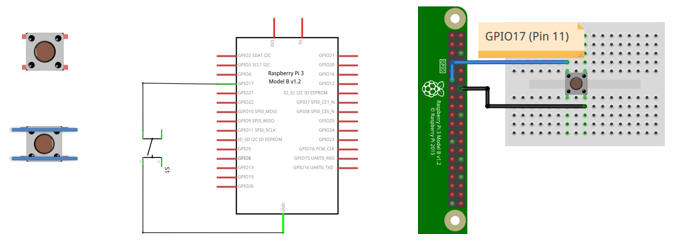
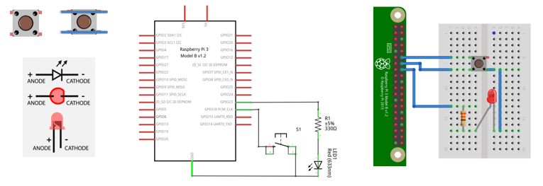
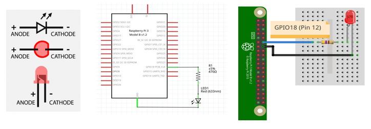

# Ejemplos GPIO Zero

## Antes de empezar

* https://projects.raspberrypi.org/en/projects/physical-computing/0
* https://www.sunfounder.com/

## Ejemplos

1. Realizar un programa que haga parpadear un led cada 1 segundo. 
   
   

   
   

   **Solución** [[link]](gpio-zero_example1/README.md)

2. Realizar un programa imprima en consola "boton presionado" cada vez que se presione el botón, para el caso use una resistencia de pull-up externa. 
   
   

   
   

   **Solución** [[link]](gpio-zero_example2/README.md)

3. Repita el ejemplo 2 pero sin usar resistencia de pull-up externa.
   
   

   
   

   **Solución** [[link]](gpio-zero_example3/README.md)

4. Realizar un programa que cambie el estado de un led (de ON → OFF y viceversa) cada vez que se presiona un botón. 
   
   

   
   

   **Solución** [[link]](gpio-zero_example4/README.md)

5. Hacer un programa que permita ingresar el PWM por teclado (0-100) para ir cambiando la intensidad de un led.

   

   
   
 

   **Solución** [[link]](gpio-zero_example5/README.md)

### Otros ejemplos

1. Ejemplo con leds [[link]](gpio-zero_example_leds/)
2. Ejemplo con botones [[link]](gpio-zero_example_buttons/)
3. Ejemplo con buzzer [[link]](gpio-zero_example_buzzer/)

No se han documentado

1. Ejemplo usando el teclado [[link]](gpio-zero_example_keyboard/)
2.  Ejemplo con sensores [[link]](gpio-zero_example_sensors/)
3.  Ejemplo con servos [[link]](gpio-zero_example_servos/)

## Referencias

* https://gpiozero.readthedocs.io/en/stable/recipes.html
* https://readthedocs.org/projects/gpiozero/downloads/pdf/stable/
* https://www.makeuseof.com/tag/gpio-zero-raspberry-pi/
* https://bennuttall.com/gpio-zero-developing-a-new-friendly-python-api-for-physical-computing/
* https://www.raspberrypi.com/news/gpio-zero-a-friendly-python-api-for-physical-computing/
* https://bluedot.readthedocs.io/en/latest/gettingstarted.html
* https://bluedot.readthedocs.io/en/latest/
* https://projects.raspberrypi.org/en/projects/introduction-to-the-pico/0
* https://projects.raspberrypi.org/en/projects/raspberry-pi-getting-started
* https://projects.raspberrypi.org/en/projects/button-switch-scratch-pi
* https://projects.raspberrypi.org/en/projects/remote-control-buggy
* https://projects.raspberrypi.org/en/projects/python-quick-reaction-game
* https://projects.raspberrypi.org/en/projects/temperature-log
* https://projects.raspberrypi.org/en/projects/ultrasonic-theremin
* https://www.raspberrypi.com/documentation/computers/os.html#accessibility-options
* https://www.raspberrypi.com/software/
* https://gpiozero.readthedocs.io/en/stable/recipes.html#pin-numbering
* https://www.farnell.com/datasheets/2236299.pdf
* https://www.albany.edu/faculty/dsaha/teach/2021Fall_ECE553/slides/02_io.pdf
* https://www.albany.edu/faculty/dsaha/
* https://www.albany.edu/faculty/dsaha/teach/2022Fall_ECE553/2022Fall_ECE553.html
* https://d2l.ai/
* https://probml.github.io/pml-book/
* https://www.deeplearningbook.org/
* https://www.albany.edu/faculty/dsaha/teach/2018Spring_CEN200/2018Spring_CEN200.html