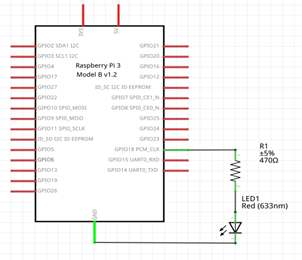
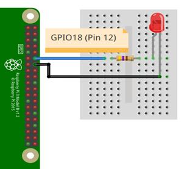

# Ejemplo 1 

## Descripción

Realizar un programa que haga parpadear un led cada 1 segundo. 

## Hardware

La siguiente tabla muestra los componentes principales del circuito a montar:

|Item # |Cantidad |Descripción| Información|
|---|---|---|---|
|1|1|rPi (3 o 4)||
|2|1|Resistencia $470 \Omega$||
|3|1|Led||

> **Archivo Fritzing** <br>
> El archivo fritzing asociado al ejemplo es [led_out.fzz](led_out.fzz)

### Esquematico

<p align = "center">

</p>

### Conexión

<p align = "center">

</p>


## Software


### Codigo

El archivo [gpio_zero_led_blink_ex1.py](gpio_zero_led_blink_ex1.py) contiene el código solución el cual se muestra a continuación:

```py
from gpiozero import LED
from time import sleep

led = LED(18)

while True:
    led.on()
    sleep(1)
    led.off()
    sleep(1)
```


### Pruebas

To Do...

## Referencias

To Do...
