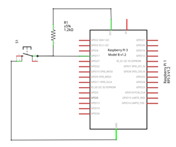
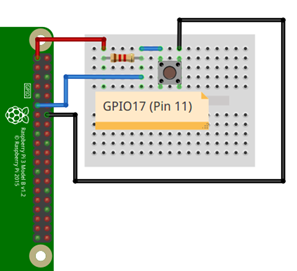

# Ejemplo 2 


## Descripción

Realizar un programa imprima en consola **"boton presionado"** cada vez que se presione el botón, para el caso use una resistencia de pull-up externa. 

## Hardware

La siguiente tabla muestra los componentes principales del circuito a montar:

|Item # |Cantidad |Descripción| Información|
|---|---|---|---|
|1|1|rPi (3 o 4)||
|2|1|Resistencia $1.2 k\Omega$||
|3|1|Pulsador||

> **Archivo Fritzing** <br>
> El archivo fritzing asociado al ejemplo es [button_external_pullUp.fzz](button_external_pullUp.fzz)

### Esquematico

<p align = "center">

</p>

### Conexión

<p align = "center">

</p>


## Software

### Codigo

El archivo [gpio_zero_button_ex2.py](gpio_zero_button_ex2.py) contiene el código solución el cual se muestra a continuación:

```py
from gpiozero import Button

buttonPin = Button(17) # No fue necesario  la resistencia de pull-up

while True:
    if buttonPin.is_pressed:
        print("Boton presionado")
```


### Pruebas

To Do...

## Referencias

To Do...

## Ejemplos

3. Repita el ejemplo 2 pero sin usar resistencia de pull-up externa.
4. Realizar un programa que cambie el estado de un led (de ON → OFF y viceversa) cada vez que se presiona un botón. 
5. Hacer un programa que permita ingresar el PWM por teclado (0-100) para ir cambiando la intensidad de un led.
6.  