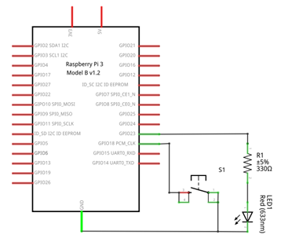
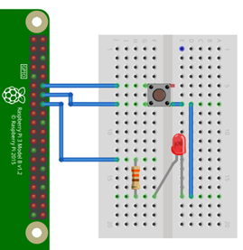

# Ejemplo 4 


## Descripción

Realizar un programa que cambie el estado de un led (de ON → OFF y viceversa) cada vez que se presiona un botón.

## Hardware

La siguiente tabla muestra los componentes principales del circuito a montar:

|Item # |Cantidad |Descripción| Información|
|---|---|---|---|
|1|1|rPi (3 o 4)||
|2|1|Resistencia $330 \Omega$||
|3|1|Pulsador||
|4|1|Led||

### Esquematico

<p align = "center">

</p>

### Conexión

<p align = "center">

</p>

## Software

### Codigo

El archivo [gpio_zero_button_led_ex4.py](gpio_zero_button_led_ex4.py) contiene el código solución el cual se muestra a continuación:

```py
from gpiozero import Button, LED

switch_pin = Button(18, bounce_time=0.2) 
ledPin = LED(23)
ledPin.off()

led_state = False
old_input_state = True 

while True:
    new_input_state = switch_pin.is_pressed
    if new_input_state == False and old_input_state == True:
        led_state = not led_state
        old_input_state = new_input_state
    ledPin.toggle()
```

### Pruebas

To Do...

## Referencias

To Do...

