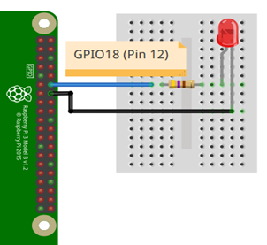

# Ejemplo 5 


## Descripción

Hacer un programa que permita ingresar el PWM por teclado (0-100) para ir cambiando la intensidad de un led.

## Hardware

La siguiente tabla muestra los componentes principales del circuito a montar:

|Item # |Cantidad |Descripción| Información|
|---|---|---|---|
|1|1|rPi (3 o 4)||
|2|1|Resistencia $470 \Omega$||
|3|1|Led||

> **Archivo Fritzing** <br>
> El archivo fritzing asociado al ejemplo es [led_out.fzz](led_out.fzz)

### Esquematico

<p align = "center">

</p>

### Conexión

<p align = "center">

</p>


## Software

### Codigo

El archivo [gpio_zero_pwm_ex5.py](gpio_zero_pwm_ex5.py) contiene el código solución el cual se muestra a continuación:

```py
from gpiozero import PWMLED

led_pin = PWMLED(18)
while True:
    duty_s = input("Enter Brightness (0 to 100): ")
    duty = int(duty_s)/100
    led_pin.value = duty
```

### Pruebas

To Do...

## Referencias

To Do...