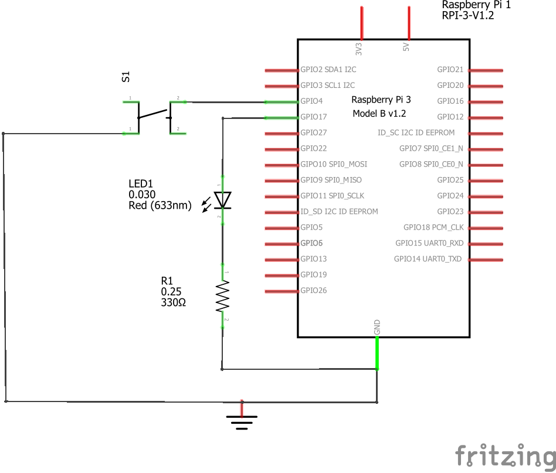
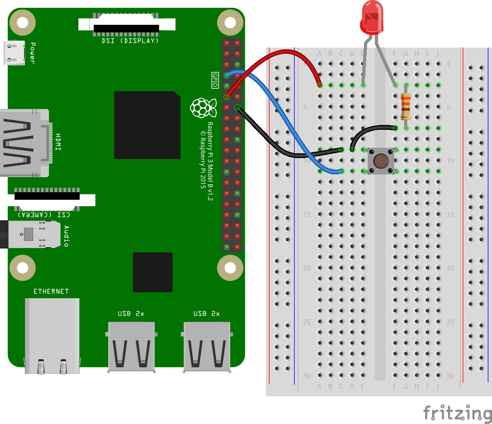
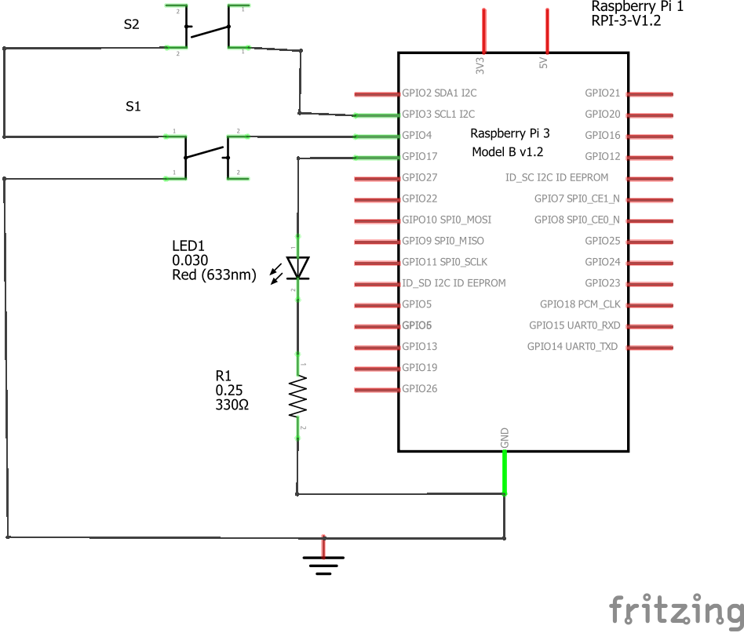
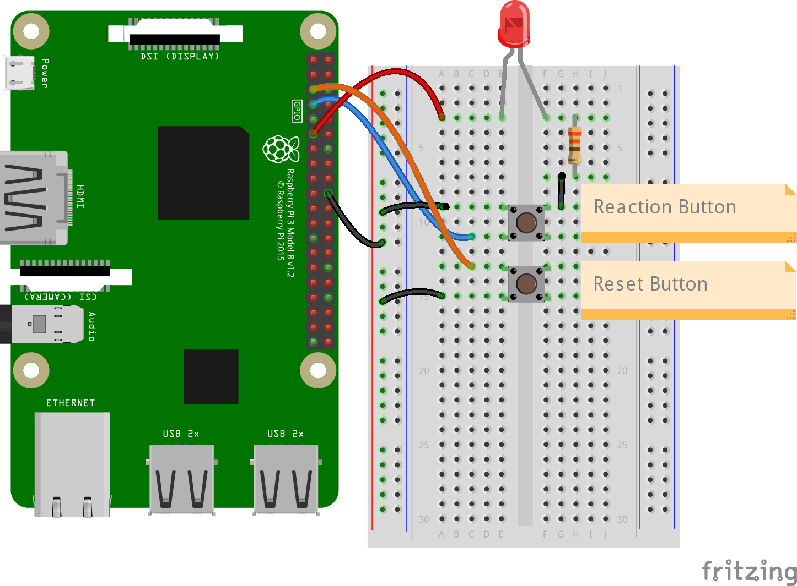

# Ejemplo 7 

## Descripción

Realizar un programa permita cambiar el estado de un led cuando se presiona un boton.

## Hardware

La siguiente tabla muestra los componentes principales del circuito a montar:

|Item # |Cantidad |Descripción| Información|
|---|---|---|---|
|1|1|rPi (3 o 4)||
|2|1|Resistencia $330 \Omega$||
|3|1|Led||
|4|1|botón||

<br>

> **Archivo Fritzing** <br>
> El archivo fritzing asociado al ejemplo es [button.fzz](button.fzz)

### Esquematico

<p align = "center">

</p>

### Conexión

<p align = "center">

</p>

## Software

### Codigo

#### Ejemplo 1

El archivo [button.py](button.py) contiene el código solución el cual se muestra a continuación:

```py
from gpiozero import Button
from time import sleep

# I/O contections
btn = Button(4)

# Functionality
while True:
    if btn.is_pressed:
        print("You pressed me")
    sleep(0.1)
```

#### Ejemplo 2

El archivo [button1.py](button1.py) contiene el código solución el cual se muestra a continuación:

```py
from gpiozero import Button, LED

btn = Button(4)
led = LED(17)

# En este caso se usan eventos
btn.when_pressed = led.on

btn.when_released = led.off
```

#### Ejemplo 3

El archivo [button3.py](button3.py) contiene el código solución el cual se muestra a continuación:

```py
from gpiozero import Button, LED

btn = Button(4)
led = LED(17)

# Waiting for events

while True:
    btn.wait_for_press()
    led.on()
    btn.wait_for_release()
    led.off()
```

#### Ejemplo 4

El archivo [button4.py](button4.py) contiene el código solución el cual se muestra a continuación:

```py
from gpiozero import LED, Button
from signal import pause

led = LED(17)
button = Button(4)

led.source = button

pause()
```

#### Ejemplo 5

El archivo [switch.py](switch.py) contiene el código solución el cual se muestra a continuación:

```py
from gpiozero import LED, Button
from time import sleep

led = LED(17)
button = Button(4)

while True:
    button.wait_for_press()
    led.toggle()
    sleep(0.5)
```

### Pruebas

To Do...

## Referencias

To Do...

## Ejemplo de aplicación

Un **juego de reacción** es un juego que consiste en probar el tiempo de reacción del jugador ante un estímulo determinado (visual, auditivo o tactil) que de presenta en forma inesperada. El siguiente programa muestra como se implementa en la RPi un juego de reacción tipico.

> **Nota**: La implementación de este juego mejor implementada y explicada en el siguiente [link](https://projects.raspberrypi.org/en/projects/python-quick-reaction-game)

### Hardware

La siguiente tabla muestra los componentes principales del circuito a montar:

|Item # |Cantidad |Descripción| Información|
|---|---|---|---|
|1|1|rPi (3 o 4)||
|2|1|Resistencia $330 \Omega$||
|3|1|Led||
|4|1|botón||

<br>

> **Archivo Fritzing** <br>
> El archivo fritzing asociado al ejemplo es [reaction_game2.fzz](reaction_game2.fzz)

#### Esquematico

<p align = "center">

</p>

#### Conexión

<p align = "center">

</p>

### Software

#### Codigo 1

A continuación, se muestra una versión simple del juego ([reaction_game.py](reaction_game.py))

```py
from time import time, sleep
from random import randint

# I/O conections
led = LED(17)
btn = Button(4)

#  test your wiring
while True:
    sleep(randint(1,10))
    led.on()
    start = time()
    btn.wait_for_press()
    led.off()
    end = time()
    print(end - start)
```

#### Codigo 2

Una versión un poco mas mejorada del juego se muestra a continuación. ([reaction_game2.py](reaction_game2.py))

```py
from gpiozero import Button, LED
from time import time, sleep
from random import randint

# Variables
best_time = 1000

# I/O conections
led = LED(17)
btn_reaction = Button(4)
btn_reset = Button(3)

def reset():
    global best_time
    print("Reiniciando juego")
    best_time = 1000

btn_reset.when_pressed = reset

#  test your wiring
while True:
    sleep(randint(1,10))
    led.on()
    start = time()
    btn_reaction.wait_for_press()
    led.off()
    end = time()
    reaction_time = end - start    
    if end - start < best_time:
        best_time = reaction_time
    print(f"Tiempo de reaccion: {reaction_time} - Tiempo a superar: {best_time}")    
```