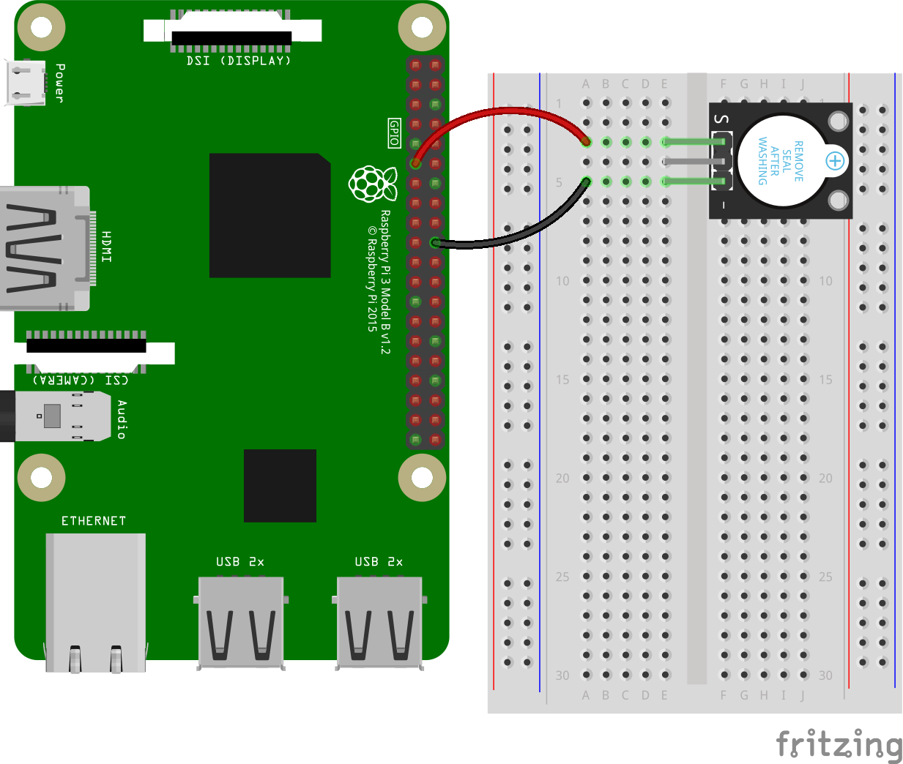

# Ejemplo 8 

## Descripción

Empleando un led, realizar los siguientes programas en la RPi:
1. Un programa que ponga a parpadear un led con un periodo de 2 segundos.
2. Un programa que implemente un codificador morse.

### Hardware

La siguiente tabla muestra los componentes principales del circuito a montar:

|Item # |Cantidad |Descripción| Información|
|---|---|---|---|
|1|1|rPi (3 o 4)||
|2|1|Buzzer activo (KY-012)|Para mas información consultar el siguiente [link](https://eloctavobit.com/modulos-sensores/buzzer-pasivo-ky-006-y-activo-ky-012)|

<br>

> **Archivo Fritzing** <br>
> El archivo fritzing asociado al ejemplo es [buzzer.fzz](buzzer.fzz)

#### Esquematico

<p align = "center">

</p>

#### Conexión

<p align = "center">

</p>

### Software

#### Codigo 1 - Buzzer activo

El archivo [buzzer.py](buzzer.py) un ejemplo de aplicación donde se hace uso de un buzzer:

```py
buzzer = Buzzer(17)

while True:
    buzzer.on()
    sleep(0.5)
    buzzer.off()
    sleep(1)
```
<br>

> **Nota**:
> Para mas información sobre la clase buzzer puede consultar la documentación siguiendo el siguiente [link](https://gpiozero.readthedocs.io/en/stable/api_output.html#buzzer)


#### Código 2 - Beep codes

Un **Beep Code** es una secuencia de pitidos emitidos por el altavoz interno de una computadora (conocido como altavoz del sistema) durante el proceso de arranque del sistema (POST, Power-On Self-Test). Estos códigos de sonido se utilizan para indicar problemas o errores de hardware que impiden que el sistema arranque correctamente. Cada patrón de pitidos corresponde a un tipo específico de error, como fallos en la memoria, en el procesador, en la tarjeta de video, entre otros. La siguiente tabla muestra algunos **beep codes** y su significado:

| Número de Beeps | Significado                                                                 |
|-----------------|-----------------------------------------------------------------------------|
| 1 corto         | Error de refresco DRAM                                                      |
| 2 cortos        | Error de paridad                                                            |
| 3 cortos        | Error de memoria base 64K                                                   |
| 4 cortos        | Error del temporizador del sistema                                          |
| 5 cortos        | Error del procesador                                                        |
| 6 cortos        | Error del teclado o controlador de teclado                                  |
| 7 cortos        | Error de excepción de modo real                                             |
| 8 cortos        | Error de lectura/escritura de video RAM                                     |
| 9 cortos        | Error en la verificación del checksum de la BIOS                            |
| 1 largo, 2 cortos| Error de video                                                             |
| 1 largo, 3 cortos| Error de prueba de video                                                   |
| Beep continuo   | Error de alimentación o mal funcionamiento del hardware                     |

El método [`beep`](https://gpiozero.readthedocs.io/en/stable/api_output.html#gpiozero.Buzzer.beep) de la clase [`Buzzer`](https://gpiozero.readthedocs.io/en/stable/api_output.html#buzzer) puede ser empleada para producir codigos como los anteriores. En el siguiente framento de código ([beep_codes.py](beep_codes.py)) se muestra un ejemplo de uso de esta función:

```py
from gpiozero import Buzzer

buzzer = Buzzer(17)

while True:
    buzzer.beep()
```

Explore como generar alguno de los códigos anteriores usando el método anterior.

### Pruebas

To Do...

