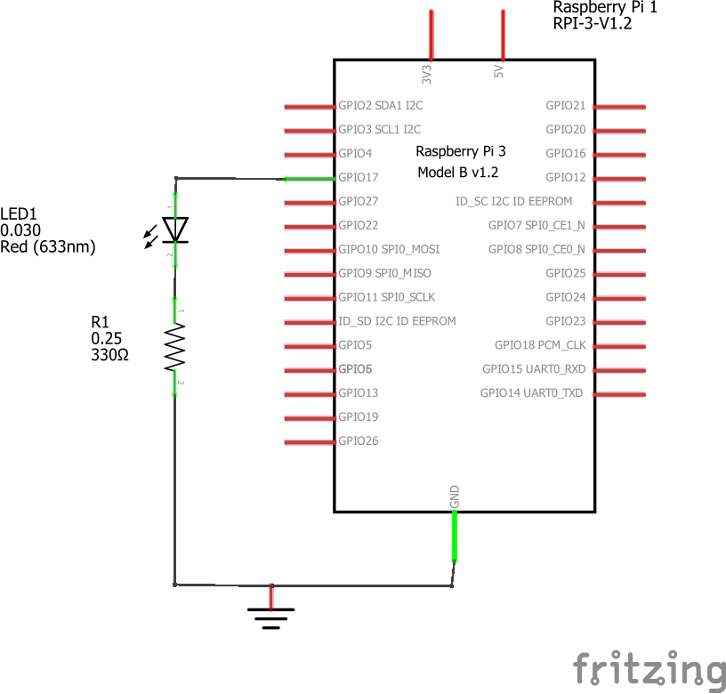
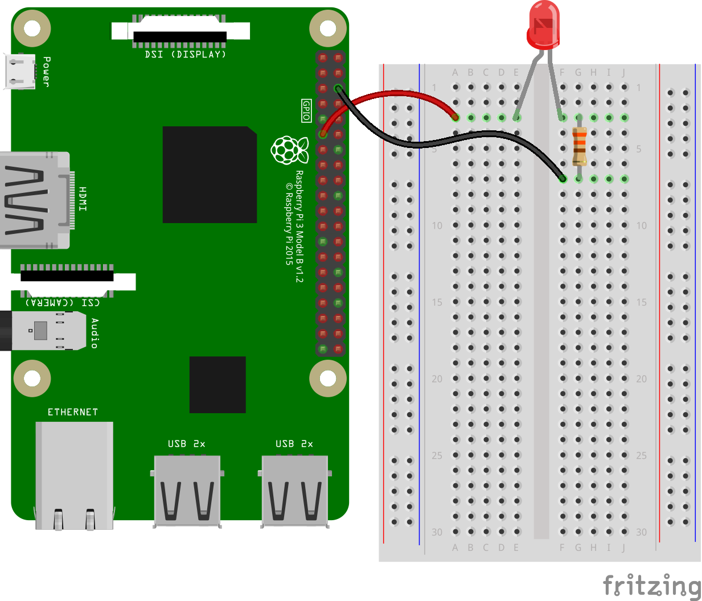
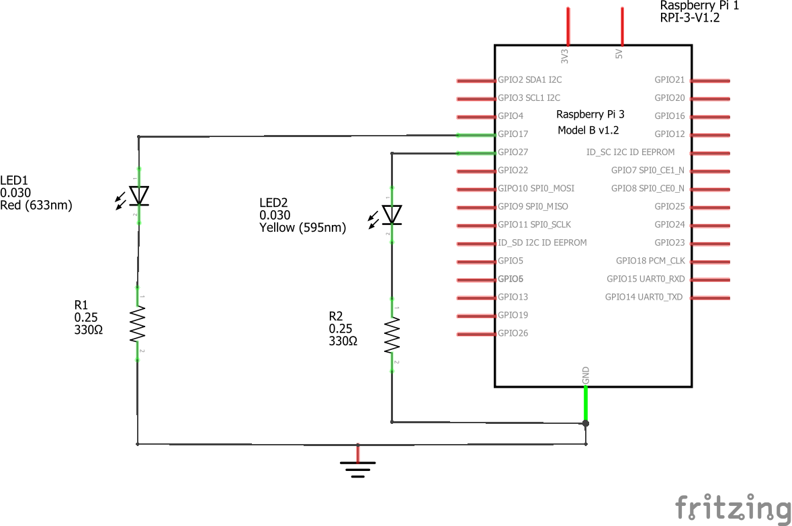
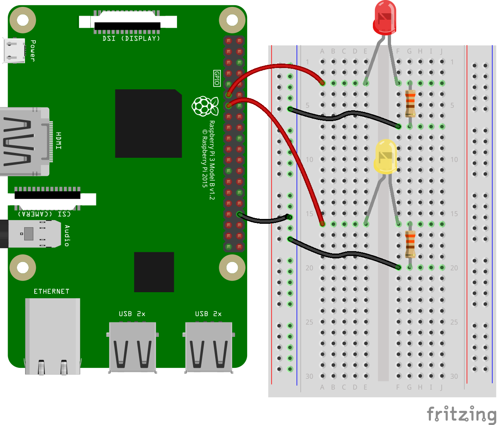

# Ejemplo 6 

## Ejemplo 6.1

### Descripción

Empleando un led, realizar los siguientes programas en la RPi:
1. Un programa que ponga a parpadear un led con un periodo de 2 segundos.
2. Un programa que implemente un codificador morse.

### Hardware

La siguiente tabla muestra los componentes principales del circuito a montar:

|Item # |Cantidad |Descripción| Información|
|---|---|---|---|
|1|1|rPi (3 o 4)||
|2|1|Resistencia $330 \Omega$||
|3|1|Led||

<br>

> **Archivo Fritzing** <br>
> El archivo fritzing asociado al ejemplo es [blink.fzz](blink.fzz)

#### Esquematico

<p align = "center">

</p>

#### Conexión

<p align = "center">

</p>

### Software

#### Codigo 1 - Parpadeo de un led

El archivo [blink.py](blink.py) contiene el código solución el cual se muestra a continuación:

```py
from gpiozero import LED
from time import sleep

red_led = LED(17)

while True:
    red_led.on()
    sleep(1)
    red_led.off()
    sleep(1)
```

#### Código 2 - Codificador Morse

El archivo [morse.py](morse.py) contiene el código solución el cual se muestra a continuación:

```py
from gpiozero import LED
from time import sleep

red_led = LED(17)

# Define the Morse code dictionary.
morse_dict = {
    'A': '.-', 'B': '-...', 'C': '-.-.', 'D': '-..', 'E': '.', 'F': '..-.', 'G': '--.', 'H': '....',
    'I': '..', 'J': '.---', 'K': '-.-', 'L': '.-..', 'M': '--', 'N': '-.', 'O': '---', 'P': '.--.',
    'Q': '--.-', 'R': '.-.', 'S': '...', 'T': '-', 'U': '..-', 'V': '...-', 'W': '.--', 'X': '-..-',
    'Y': '-.--', 'Z': '--..', '0': '-----', '1': '.----', '2': '..---', '3': '...--', '4': '....-',
    '5': '.....', '6': '-....', '7': '--...', '8': '---..', '9': '----.', '.': '.-.-.-', ',': '--..--',
    '?': '..--..', "'": '.----.', '!': '-.-.--', '/': '-..-.', '(': '-.--.', ')': '-.--.-', '&': '.-...',
    ':': '---...', ';': '-.-.-.', '=': '-...-', '+': '.-.-.', '-': '-....-', '_': '..--.-', '"': '.-..-.',
    '$': '...-..-', '@': '.--.-.', ' ': '/'
}


# Convert a message to Morse code.
def to_morse_code(message):    
    morse_code = ''
    for char in message.upper():
        if char in morse_dict:
            morse_code += morse_dict[char] + ' '
    return morse_code

while True:
    message = input("Escriba su mensaje: ")
    message_morse = to_morse_code(message)
    print(f"Mensaje: {message} --> Codigo morse: {message_morse}")
    for l_morse in message_morse:
        red_led.on()
        if l_morse == '.':
            # Punto {.}
            sleep(1)            
        elif l_morse == '-':
            # Raya {-}
            sleep(3)            
        red_led.off()
        sleep(1)
```

### Pruebas

To Do...

## Ejemplo 6.2

### Descripción

Implementar un ejemplo sencillo que simule las luces de un semaforo.

### Hardware

La siguiente tabla muestra los componentes principales del circuito a montar:

|Item # |Cantidad |Descripción| Información|
|---|---|---|---|
|1|1|rPi (3 o 4)||
|2|2|Resistencia $330 \Omega$||
|3|1|Led rojo||
|4|1|Led amarillo||

<br>

> **Archivo Fritzing** <br>
> El archivo fritzing asociado al ejemplo es [traffic.fzz](traffic.fzz)

#### Esquematico

<p align = "center">

</p>

#### Conexión

<p align = "center">

</p>

### Software

#### Codigo

A continuación, se muestra una versión simple del juego ([traffic.py](traffic.py))

```py
from gpiozero import LED
from time import sleep

red_led = LED(17)
yel_led = LED(27)

while True:
   red_led.on()
   sleep(1)
   yel_led.on()
   sleep(1)
   red_led.off()
   sleep(1)
   yel_led.off()
```

#### Desafio

1. Alambre un tercer led de color verde.
2. Agregue el codigo necesario para que los tres leds se comporten como las luces de un semaforo.
3. Codifique un nuevo programa para que los tres leds se comporten como las luces del auto fantastico.
   
   <p align = "center">
   
   </p>
   
