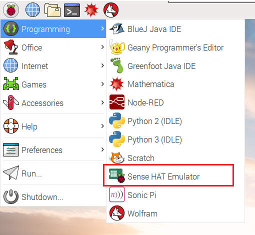
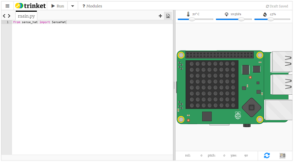

# Sensores

El uso de sensores y actuadores con la RPi se reduce a una conexión a los pines teniendo en cuenta las consideraciones para garantizar el funcionamiento seguro y eficiente de estos. 

La RPi cuenta con gran cantidad de accesorios para exteneder su funcionalidad. Uno de estos es el [Sense HAT](https://projects.raspberrypi.org/en/projects/getting-started-with-the-sense-hat) el cual contiene diferentes tipos de sensores y una matriz de LED RGB de 8x8 para facilitar la diseñado para facilitar la recolección de datos del entorno y su visualización.


Una de las ventajas del sense hat es que puede ser simulado de modo que se pueden hacer pruebas con este aunque no se tenga mediante el uso de un emulador:
* **Sense HAT Emulator**: Esta aplicación se puede instalar en la ultima versión del Rapbian ([instrucciones](https://projects.raspberrypi.org/en/projects/getting-started-with-the-sense-hat/1)) permitiendo emular el Sense Hat.
  
  

  Para mayor información sobre el emulador puede consultar la documentación ([link](https://sense-emu.readthedocs.io/en/v1.1/#))

* **Online sense HAT emulator**: Este es un emulador que puede ser usado desde el navegador.
  
  
  
  Para usarlo, abra el navegador y vaya a la dirección https://trinket.io/sense-hat y borre el demo existente el cual se encuentra codificado en el editor. Para almacenar el trabajo realizado puede crear una cuenta gratuita ([](https://trinket.io/signup)) en Trinket.
  
> **Nota**: Para mas información sobre el **Sense HAT** puede empezar consultando la documentación de la fundación Raspberry Pi ([link](https://projects.raspberrypi.org/en/projects/getting-started-with-the-sense-hat/))


## Algunos ejemplos

A continuación, se encuentran algunos ejemplos donde se hace uso del emulador online para interactuar con sensores.


**Ejemplo 1** [[link]](https://trinket.io/python/667839c0c4)

```python
from sense_hat import SenseHat
import time

sense = SenseHat()

temperature = round(sense.temperature, 1)
sense.show_message("It is " + str(temperature) + " degrees")
```

**Ejemplo 2** [[link]](https://trinket.io/python/9dbff599d9)

```python
from sense_hat import SenseHat
import time

sense = SenseHat()

temperature = round(sense.temperature, 1)
sense.show_message("It is " + str(temperature) + " degrees")

pressure = round(sense.pressure, 1)
sense.show_message("It is " + str(pressure) + " hPa")
```

**Ejemplo 3** [[link]](https://trinket.io/python/7c798bd6b2)


```python
from sense_hat import SenseHat
import time

sense = SenseHat()

temperature = round(sense.temperature, 1)

if temperature > 25 and temperature < 35:
    sense.show_message("That's quite warm")

elif temperature > 10 and temperature <= 25:
    sense.show_message("Not too cold")

elif temperature > -15 and temperature <= 10:
    sense.show_message("Brr, it's chilly")

elif temperature >= 100:
    sense.show_message("It's boiling")

elif temperature >= 35 or temperature <= -15:
    sense.show_message("The temperature is extreme!")
```

**Ejemplo 4 - Make an outfit recommender** [[link]](https://trinket.io/python/cca7dc0dd1): Realice un programa utilizando el emulador de Sense HAT que sugiera un atuendo dependiendo de la temperatura y la humedad.

El programa debería sugerir como minimo:
* Una chaqueta de invierno gruesa cuando la temperatura sea inferior a 10°C y la humedad sea superior al 35%.
* Un sombrero cuando la temperatura sea al menos de 22°C O la humedad sea superior al 40%.

```python
from sense_hat import SenseHat
import time

sense = SenseHat()


while True: 
  temperature = round(sense.temperature, 1)
  humidity = round(sense.humidity, 1)

  if temperature < 25 and humidity > 35:
    sense.show_message("You need a thick winter jacket")
  elif temperature >= 22 or humidity >= 40:
    sense.show_message("You need a hat")
```

## Referencias

* https://projects.raspberrypi.org/en/projects/getting-started-with-the-sense-hat/2
* https://sense-emu.readthedocs.io/en/v1.1/#
* https://www.raspberrypi.com/news/sense-hat-emulator/
* https://www.raspberrypi.org/blog/desktop-sense-hat-emulator/
* https://atareao.es/tutorial/raspberry-pi-400/sense-hat-emulator/
* https://www.raspberrypi.com/news/a-hedgehog-cam-or-two/
* https://iancarpenter.dev/2016/08/28/a-step-by-step-guide-to-building-a-raspberry-pi-hedgehog-camera/
* https://blog.adafruit.com/2022/12/15/outdoor-case-raspberry-pi-zero-for-hedgehog-house-3dthursday-3dprinting/
* https://makezine.com/article/craft/photography-video/spy-on-garden-critters-with-raspberry-pi-powered-night-vision/
* https://www-users.york.ac.uk/~mjf5/hedgehog_camera/index.html
* https://trinket.io/sense-hat
* https://www.raspberrypi.org/blog/desktop-sense-hat-emulator/
* https://projects.raspberrypi.org/en/projects/getting-started-with-the-sense-hat/2
* https://trinket.io/sense-hat


