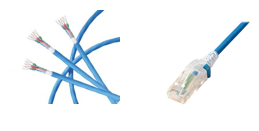
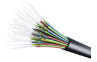
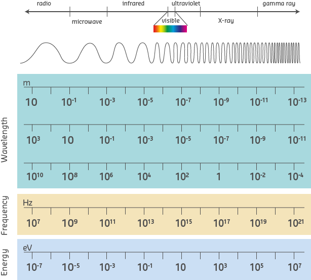
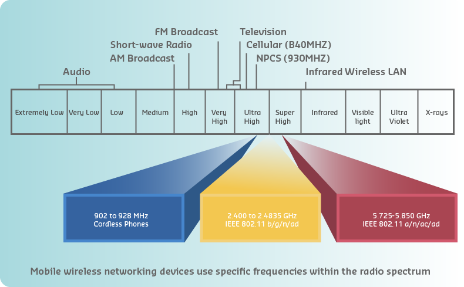
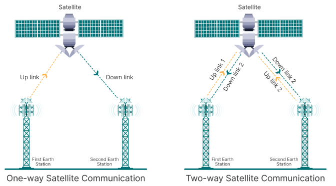
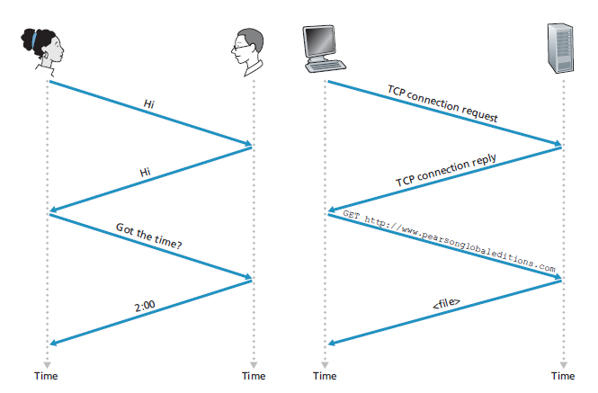
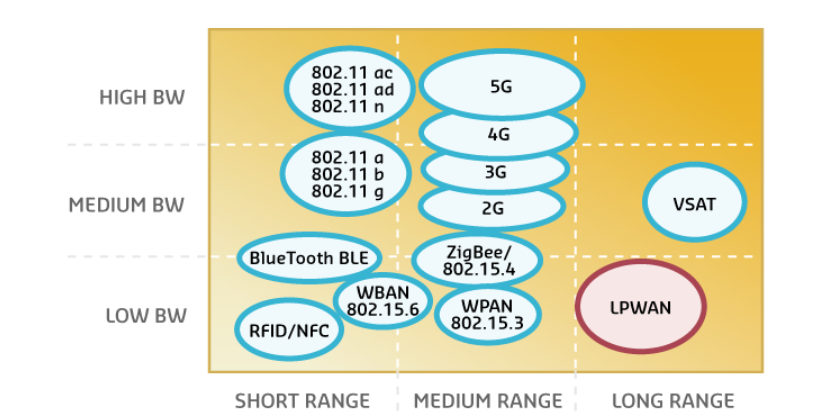
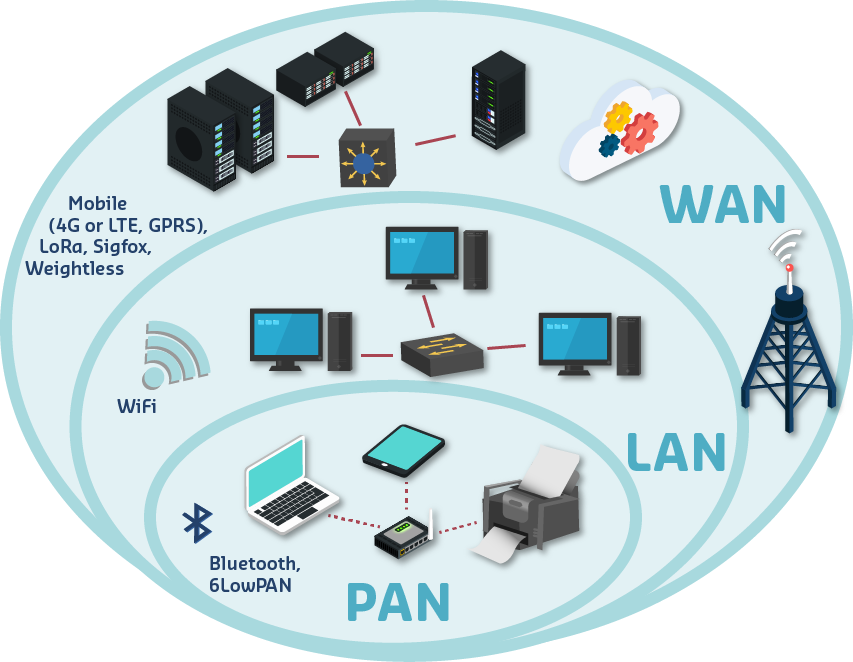
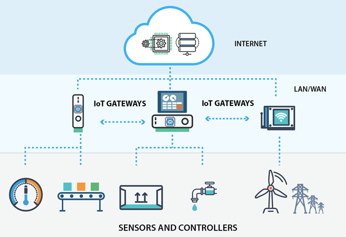

# Redes y protocolos

> ### Objetivos
> 1. Recordar los conceptos de redes.
> 2. Comprender como se lleva a cabo la comunicación entre los dispositivos.
> 3. En construcción...

## Agenda

- [x] Revisión de los conceptos de red.
- [ ] To Do

## 1. ¿Como se conectan las cosas?

Internet es una red de computadoras que interconecta miles de millones de dispositivos informáticos a lo largo de todo el mundo. 

Todos estos dispositivos que estan conectados se conocen como **hosts** o **end systems** y lo que hacen es ejecutar aplicaciones de red en el **edge** (borde de la red). La variedad de dispositivos que se pueden conectar es enorme por ejemplo: equipos de escritorio, servidores, laptops, tablets, celulares, dispositivos de electronica de consumo, vehiculos, elementos de vestir, en resumén, practicamente cualquier **cosa**

¿Pero como es posible entre los **host**?. Pues bien, estos se conectan entre entre sí mediante una red de enlaces de comunicaciones y conmutadores de paquetes.

Cuando un host tiene datos que enviar a otro host; el emisor segmenta los datos y añade bytes de cabecera a cada segmento. Los **paquetes** (**packets**) de información resultantes, se envían entonces a través de la red hasta el sistema terminal receptor, donde vuelven a ser ensamblados para obtener los datos originales.

El envío de los paquetes es realizado a traves de **conmutadores de paquetes** (Packet switches), dentro de los cuales, los mas comunes son los switches de capa de enlace y los routers. Los primeros normalmente se emplean en las redes de acceso, mientras que los ultimos suelen utilizarse en el núcleo (core) de la red. 

La secuencia de enlaces de comunicaciones y conmutadores de paquetes que atraviesa un paquete desde el emisor hasta el sistema terminal receptor, se conoce con el nombre de **ruta** a través de la red.

Los **enlaces de comunicación** son como las autopistas que permiten que todos los paquetes viajen entre los diferentes elementos de la red. 

Existen muchos tipos de enlaces de comunicaciones, los cuales están compuestos por diferentes tipos de medios físicos, entre los que se incluyen el cable coaxial, el hilo de cobre, la fibra óptica y el espectro de radio. Los distintos enlaces pueden transmitir los datos a distintas velocidades y la **velocidad de transmisión** de un enlace se mide en bits/segundo.

Hasta el momento, ya tenemos los componentes necesarios para lograr la comunicación entre los host, sin embargo la configuración y administración de toda la infraestructura interna debe ser realizada por alguien y es aqui donde se hace necesario fragmentar la red (dividirla) en redes mas pequeñas interconectadas entre si, por ello decimos la **Internet** es la *red de redes*.

Dentro de este contexto, una red es una colección de dispositivos administrados por una organización.

Para acceder a Internet, los sistemas terminales (host) se conectan a través de los **ISP** (Internet Service Provider,
Proveedor de servicios de Internet). Cada ISP es en sí mismo una red de conmutadores de paquetes y enlaces de comunicaciones. Los
ISP proporcionan una amplia variedad de tipos de acceso a red a los sistemas terminales. Los ISP también proporcionan acceso a Internet a los proveedores de contenido, conectando sitios web y servidores de vídeo directamente a Internet.

En resumen, la Internet tiene la siguente estructura:
* **Network edge (borde o frontera)**: Compuesto por clientes y servidores, estos ultimos a menudo se encuentran en centros de datos. 
  
  

* **Access networks, physical media**: Compuesto por los dispositivos que permiten conectar la red local con el core y por los enlaces que proporcinan el medio (alambrado o inalambrico) para la transferencia de los datos.
  
  

* **Network core**: Compuesta por los enrutadores y enlaces que permite que las redes existes se comuniquen entre si. Esta es en si la propiamente dicha, red de redes.
  
  

## 2. Clasificación de la redes

Las redes se clasifican de acuerdo a diferentes criterios como el alcance geografico, la topologia y la tecnologia o medio de transmición entre otros. A continuación vamos a tratar con algunos casos:

### 2.1. Clasificación dependiendo del alcance

Dependiendo del alcance geografico, las redes se pueden categorizar en:

1. **Red de Área Personal (PAN - Personal Area Network)**: Red cuyo alcance es muy limitado (típicamente unos pocos metros). Se emplea para conectar dispositivos personales (teléfonos móviles, computadoras portátiles, tablets y otros dispositivos cercanos a una persona) entre si.
2. **Red de Área Local (LAN - Local Area Network)**: Esta red conecta dispositivos dentro de una area geografica pequeña (residencias, oficina, escuela, edificio). El alcance es pequeño pero puede abarcar unos cuantos kilometros. Cuando la red local esta compuesta por varias redes locales puede tener un alcance mayor y recibe el nombre de **Red de Área de Campus (CAN - Campus Area Network)**. Este ultimo caso hace alusión a redes empresariales o redes dentro de un campus.  
3. **Red de Área Metropolitana (MAN - Metropolitan Area Network)**: El alcance es mayor (decenas de kilómetros) y cubre una ciudad o región metropolitana. Basicamente es una red que conecta varias LANs (corporativas, universidades, gobierno) dentro de ciudad o región.
4. **Red de Área Amplia (WAN - Wide Area Network)**: Red que abarca grandes distancias geograficas como paises o continentes.
Alcance: Muy amplio, abarca grandes distancias geográficas, como países o continentes. Las redes WAN conectan redes que estan geograficamente muy separadas.

### 2.2. Clasificación dependiendo de la topologia

Esta clasificación toma como criterio la forma en que son conectados los dispositivos. A continuación se resaltan:
1. **Topología en Bus**: Todos los dispositivos de la red están conectados a un único cable principal (bus). Los datos viajan a lo largo de este cable y son recibidos por todos los dispositivos, pero solo el dispositivo al que están dirigidos los datos los acepta y procesa.
   
   
   

2. **Topología en Estrella**: Todos los dispositivos están conectados a un nodo central (hub o switch) que actúa como un punto de concentración para el tráfico de red.
   
   

3. **Topología en Anillo**: Los dispositivos están conectados en una disposición circular, formando un anillo. Cada dispositivo tiene exactamente dos vecinos, y los datos se transmiten en una dirección (o en ambas, en un anillo doble).
   
   
   
4. **Topologia en malla**: Cada dispositivo en la red está conectado a varios otros dispositivos, creando múltiples rutas para los datos. Dependiendo de dependiendo de la cantidad de dispositivos conectados entre si la malla puede ser total o parcial.
   
   
   
5. **Topologia en arbol**: Es una combinación de las topologías en estrella y bus. En esta, un nodo principal actúa como raíz, y otros nodos se conectan a él en una jerarquía. Cada nodo puede tener múltiples dispositivos conectados en una disposición en estrella.
   
   

## 3. Enlaces - Medios fisicoa

Un medio fisico hace alusión al canal empleado para la transmisión de la información (en forma de bits) entre un origen y un destino.

Los medios de transmisión fisicos se pueden clasificar dentro de dos grandes categorias:
* **Medios guiados**: En estos las señales se canalizan 
a través de un medio sólido. La siguiente tabla resume algunos:
   
  |Medio Guiado | Descripción | Usos ||
  |---|---|---|---|
  |Par Trenzado (UTP/STP)|Cables compuestos por pares de hilos de cobre que se trenzan para reducir la interferencia electromagnética|Redes LAN, Telefonía, PoE||
  |Cable Coaxial|Cable de cobre con un conductor central, un aislamiento dieléctrico y una malla de blindaje.|Televisión por cable, Internet por cable, CCTV||
  |Fibra Óptica (SMF/MMF)|Utiliza filamentos de vidrio o plástico para transmitir datos a través de pulsos de luz.|Conexiones de larga distancia, WAN, FTTH||
  
* **Medios no guiados**: En estos, las ondas se propagan a traves de la atmosfera y el espacio exterior. Dentro de estos se encuentran: los canales de radio terrestre y los canales de radio satelidal.

  
  
  * **Canales de radio terrestre**: En este caso, la información es transportada a traves de diferentes canales (bandas) dentro del espectro electromagnético. 
  
  
  
  Dependiendo de la distancia de operación las bandas de radio se pueden clasificar en tres grandes grupos:
     
     |Grupo|Descripción|Aplicación|
     |---|---|---|
     |1|Aquellos que operan a cortas distancias (1 ~2 m)|Redes PAN|
     |2|Aquellos con un alcance entre diez y cientos de metros|Redes LAN|
     |3|Aquellos que operan en un area extensa con una alcance de decenas de kilometros|MAN|

  * **Canales de radio via satelite**: Un satélite de comunicaciones enlaza dos o más transmisores/receptores de microondas situados en la superficie, que se conocen como estaciones terrestres. El satélite recibe las transmisiones en una banda de frecuencia, regenera la señal utilizando un repetidor y transmite la señal a otra frecuencia. En este tipo de comunicaciones se emplean dos tipos de satélites: los satélites geoestacionarios y los satélites de la órbita baja terrestre (LEO, Low-Earth Orbiting).
    
    
   
## 4. Protocolos

Cualquier actividad de Internet que implique dos o más entidades remotas que se comunican está gobernada por un protocolo. 

Basicamente, define el conjunto de reglas que hacen posible la comunicación, esto es:

> Un **protocolo** define el formato y el orden de los mensajes intercambiados entre dos o más entidades que se comunican, así como las acciones tomadas al producirse la transmisión y/o recepción de un mensaje u otro suceso.

Existen muchos protocolos de red los cuales pueden ser clasificados en función del ancho de banda y el alzance tal y como se muestra en la siguiente figura:

Sin embargo, otra clasificación que puede ser empleada tiene que ver con el tipo de red en la que se emplean:

La siguiente tabla resume algunos protocolos dependiendo el tipo de red en la que se usan:

| **Tipo de Red** | **Protocolo**           | **Descripción**                                                                                      | **Uso Principal**                          |
|-----------------|-------------------------|------------------------------------------------------------------------------------------------------|-------------------------------------------|
| **PAN (Personal Area Network)** | **Bluetooth**           | Tecnología de comunicación inalámbrica de corto alcance para conectar dispositivos personales.         | Conexión de dispositivos personales como auriculares y teclados. |
|                 | **Zigbee**              | Protocolo de comunicación inalámbrica para redes de bajo consumo de energía y bajo ancho de banda.       | Automatización del hogar, sensores IoT.   |
|                 | **IrDA (Infrared Data Association)** | Protocolo para la transferencia de datos mediante luz infrarroja en distancias cortas.                  | Transferencia de datos entre dispositivos cercanos.               |
| **LAN (Local Area Network)**    | **Ethernet (IEEE 802.3)** | Tecnología de red que utiliza tramas para la comunicación dentro de una red local.                     | Redes locales en oficinas y hogares.     |
|                 | **Wi-Fi (IEEE 802.11)**   | Estándar para redes inalámbricas que proporciona acceso a redes locales mediante radiofrecuencia.        | Conexión inalámbrica en redes locales.    |
|                 | **Token Ring (IEEE 802.5)** | Protocolo que utiliza un anillo lógico para el control del acceso al medio de comunicación en redes LAN. | Redes LAN basadas en anillo.              |
| **MAN (Metropolitan Area Network)** | **Frame Relay**         | Protocolo de conmutación de tramas utilizado para conectar redes en áreas metropolitanas.                 | Conexión de redes en áreas metropolitanas. |
|                 | **ATM (Asynchronous Transfer Mode)** | Protocolo de conmutación de celdas para la transmisión de datos en redes metropolitanas.                  | Redes WAN y MAN para transmisión de datos a alta velocidad.        |
|                 | **WiMAX (Worldwide Interoperability for Microwave Access)** | Tecnología para redes metropolitanas de área amplia que utiliza microondas para la transmisión de datos. | Provisión de banda ancha en áreas metropolitanas. |

## 5. Arquitectura IoT

Las capas en una arquitectura definen las interacciones entre el hardware del sistema IoT con los dispositivos de red, protocolos de comunicación y el software de interacción con el usuario.

En el caso de IoT existen diferentes arquitecturas con un numero de capas que varian dependiendo del aspectos como el uso de la aplicación, los protocolos de transferencia de informacipon y el grado de seguridad requerido por el sistema IoT.

Sin embargo, la arquitectura de tres capas de Internet de las Cosas IoT es la base fundamental de las demás arquitecturas existentes. Estas capas son:
* **Capa de aplicación**: En esta capa se encuentran las aplicaciones, generalmente interfaces, que se encargan de la interacción con el usuario final de la aplicación.
* **Capa de red**: En esta capa se encuentran los dispositivos de Red que se encargan de gestionar todo el tráfico de información a través de la red mediante protocolos como HTTP, RESTful, MQTT, CoAP.
* **Percepción**: En esta capa se encuentran las cosas (Things) que se encargan de la recolección de la información del ambiente a través de sensores y la interacción con el mismo mediante actuadores.

La siguiente tabla muestra algunos de los protocolos IoT mas comunes de acuerdo al modelo de capas anteriormente visto:

| **Capa**            | **Protocolo**       | **Descripción**                                                                                      | **Uso Principal**                          |
|---------------------|---------------------|------------------------------------------------------------------------------------------------------|-------------------------------------------|
| **Capa de Percepción** | **I2C (Inter-Integrated Circuit)** | Protocolo de comunicación serial para la conexión de sensores y actuadores en un bus de datos.         | Conexión de sensores y dispositivos en la misma placa. |
|                     | **SPI (Serial Peripheral Interface)** | Protocolo de comunicación serial para la transferencia de datos entre microcontroladores y periféricos. | Comunicación entre microcontroladores y dispositivos. |
| **Capa de Red**        | **MQTT (Message Queuing Telemetry Transport)** | Protocolo de mensajería ligero para la comunicación entre dispositivos IoT y servidores.                 | Comunicación en redes de sensores y dispositivos IoT. |
|                     | **CoAP (Constrained Application Protocol)** | Protocolo de transferencia de datos optimizado para dispositivos con recursos limitados.                | Comunicación en redes de dispositivos IoT de bajo consumo. |
|                     | **HTTP/HTTPS (Hypertext Transfer Protocol / Secure)** | Protocolo de transferencia de datos en la web, con HTTPS ofreciendo cifrado para mayor seguridad.       | Comunicación entre dispositivos IoT y servidores web. |
| **Capa de Aplicación** | **REST (Representational State Transfer)** | Estilo de arquitectura para sistemas distribuidos que utiliza HTTP para la comunicación entre aplicaciones. | Interacción con servicios web y APIs en aplicaciones IoT. |
|                     | **WebSocket**       | Protocolo de comunicación que proporciona un canal de comunicación bidireccional y persistente.        | Comunicación en tiempo real entre dispositivos y servidores. |
|                     | **AMQP (Advanced Message Queuing Protocol)** | Protocolo de mensajería para la comunicación entre aplicaciones, que garantiza la entrega de mensajes.  | Intercambio de mensajes en sistemas IoT complejos. |

Desde otro punto de vista, que tiene en cuenta el modelo TCP/IP la internet de las cosas hace uso de los siguiente protocolos.

|Layer|Protocol|
|----|----|
|Application|	CoAP, MQTT|
|Transport|	UDP, TCP, DTLS|
|Internet|	IPv6, 6LoWPAN, RPL, LoRaWAN|
|Network Access|	IEEE 802.15.4, IEEE802.11 a/b/g/n/ac/ad/ah/ax, IEEE 802.3 Ethernet, GSM, LTE, LPWAN, LoRaWAN|

## 5. Referencias

* Capitulo 1 del libro Computer Networking A Top-Down Approach (https://gaia.cs.umass.edu/kurose_ross/index.php)
* https://hackmd.io/@lyqht/Hkb4tAotL
* https://wigle.net/

