# Redes y protocolos

> ### Objetivos
> 1. Recordar los conceptos de redes.
> 2. Comprender como se lleva a cabo la comunicación entre los dispositivos.
> 3. Introducir...

## Agenda

- [x] Revisión de los conceptos de red.
- [ ] To Do

## 1. ¿Como se conectan las cosas?

Internet es una red de computadoras que interconecta miles de millones de dispositivos informáticos a lo largo de todo el mundo. 

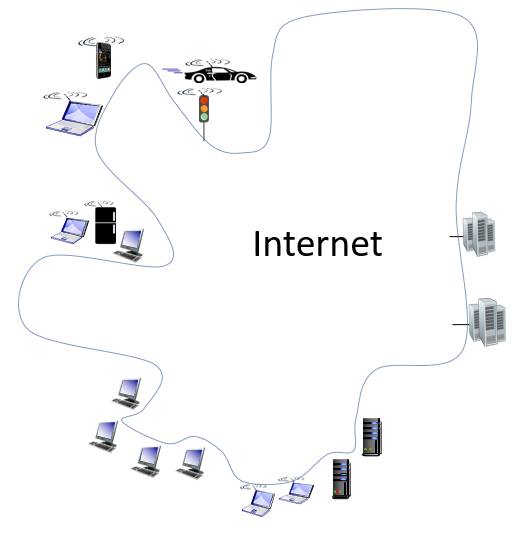

Todos estos dispositivos que estan conectados se conocen como **hosts** o **end systems** y lo que hacen es ejecutar aplicaciones de red en el **edge** (borde de la red). La variedad de dispositivos que se pueden conectar es enorme por ejemplo: equipos de escritorio, servidores, laptops, tablets, celulares, dispositivos de electronica de consumo, vehiculos, elementos de vestir, en resumén, practicamente cualquier **cosa**

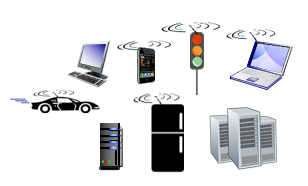

¿Pero como es posible entre los **host**?. Pues bien, estos se conectan entre entre sí mediante una red de enlaces de comunicaciones y conmutadores de paquetes.

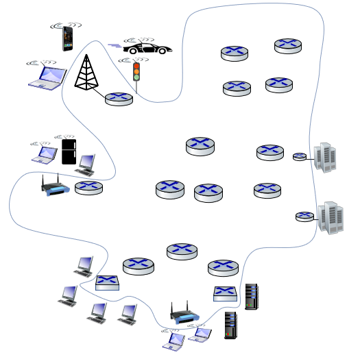

Cuando un host tiene datos que enviar a otro host; el emisor segmenta los datos y añade bytes de cabecera a cada segmento. Los **paquetes** (**packets**) de información resultantes, se envían entonces a través de la red hasta el sistema terminal receptor, donde vuelven a ser ensamblados para obtener los datos originales.

El envío de los paquetes es realizado a traves de **conmutadores de paquetes** (Packet switches), dentro de los cuales, los mas comunes son los switches de capa de enlace y los routers. Los primeros normalmente se emplean en las redes de acceso, mientras que los ultimos suelen utilizarse en el núcleo (core) de la red. 

La secuencia de enlaces de comunicaciones y conmutadores de paquetes que atraviesa un paquete desde el emisor hasta el sistema terminal receptor, se conoce con el nombre de **ruta** a través de la red.

Los **enlaces de comunicación** son como las autopistas que permiten que todos los paquetes viajen entre los diferentes elementos de la red. 

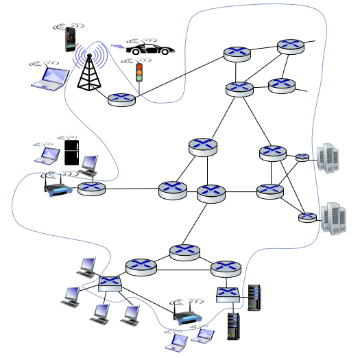

Existen muchos tipos de enlaces de comunicaciones, los cuales están compuestos por diferentes tipos de medios físicos, entre los que se incluyen el cable coaxial, el hilo de cobre, la fibra óptica y el espectro de radio. Los distintos enlaces pueden transmitir los datos a distintas velocidades y la **velocidad de transmisión** de un enlace se mide en bits/segundo.

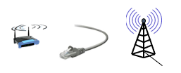

Hasta el momento, ya tenemos los componentes necesarios para lograr la comunicación entre los host, sin embargo la configuración y administración de toda la infraestructura interna debe ser realizada por alguien y es aqui donde se hace necesario fragmentar la red (dividirla) en redes mas pequeñas interconectadas entre si, por ello decimos la **Internet** es la *red de redes*.

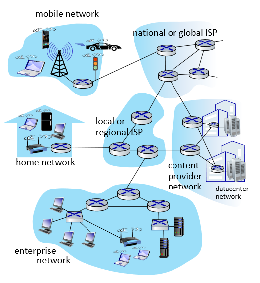

Dentro de este contexto, una red es una colección de dispositivos administrados por una organización.

Para acceder a Internet, los sistemas terminales (host) se conectan a través de los **ISP** (Internet Service Provider,
Proveedor de servicios de Internet). Cada ISP es en sí mismo una red de conmutadores de paquetes y enlaces de comunicaciones. Los
ISP proporcionan una amplia variedad de tipos de acceso a red a los sistemas terminales. Los ISP también proporcionan acceso a Internet a los proveedores de contenido, conectando sitios web y servidores de vídeo directamente a Internet.

En resumen, la Internet tiene la siguente estructura:
* **Network edge (borde o frontera)**: Compuesto por clientes y servidores, estos ultimos a menudo se encuentran en centros de datos. 
  
  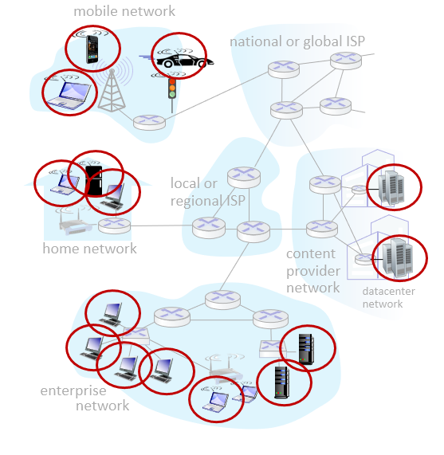

* **Access networks, physical media**: Compuesto por los dispositivos que permiten conectar la red local con el core y por los enlaces que proporcinan el medio (alambrado o inalambrico) para la transferencia de los datos.
  
  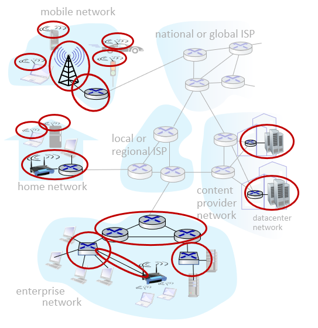

* **Network core**: Compuesta por los enrutadores y enlaces que permite que las redes existes se comuniquen entre si. Esta es en si la propiamente dicha, red de redes.
  
  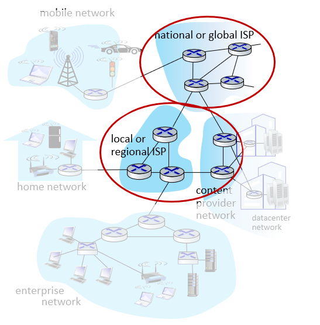

## 2. Clasificación de la redes

Las redes se clasifican de acuerdo a diferentes criterios como el alcance geografico, la topologia y la tecnologia o medio de transmición entre otros. A continuación vamos a tratar con algunos casos:

### 2.1. Clasificación dependiendo del alcance

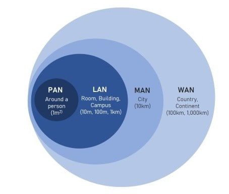

Dependiendo del alcance geografico, las redes se pueden categorizar en:

1. **Red de Área Personal (PAN - Personal Area Network)**: Red cuyo alcance es muy limitado (típicamente unos pocos metros). Se emplea para conectar dispositivos personales (teléfonos móviles, computadoras portátiles, tablets y otros dispositivos cercanos a una persona) entre si.
2. **Red de Área Local (LAN - Local Area Network)**: Esta red conecta dispositivos dentro de una area geografica pequeña (residencias, oficina, escuela, edificio). El alcance es pequeño pero puede abarcar unos cuantos kilometros. Cuando la red local esta compuesta por varias redes locales puede tener un alcance mayor y recibe el nombre de **Red de Área de Campus (CAN - Campus Area Network)**. Este ultimo caso hace alusión a redes empresariales o redes dentro de un campus.  
3. **Red de Área Metropolitana (MAN - Metropolitan Area Network)**: El alcance es mayor (decenas de kilómetros) y cubre una ciudad o región metropolitana. Basicamente es una red que conecta varias LANs (corporativas, universidades, gobierno) dentro de ciudad o región.
4. **Red de Área Amplia (WAN - Wide Area Network)**: Red que abarca grandes distancias geograficas como paises o continentes.
Alcance: Muy amplio, abarca grandes distancias geográficas, como países o continentes. Las redes WAN conectan redes que estan geograficamente muy separadas.

### 2.2. Clasificación dependiendo de la topologia

Esta clasificación toma como criterio la forma en que son conectados los dispositivos. A continuación se resaltan:
1. **Topología en Bus**: Todos los dispositivos de la red están conectados a un único cable principal (bus). Los datos viajan a lo largo de este cable y son recibidos por todos los dispositivos, pero solo el dispositivo al que están dirigidos los datos los acepta y procesa.
   
   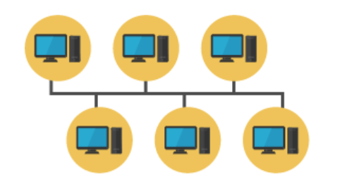
   

2. **Topología en Estrella**: Todos los dispositivos están conectados a un nodo central (hub o switch) que actúa como un punto de concentración para el tráfico de red.
   
   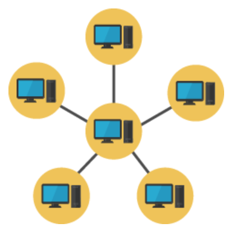

3. **Topología en Anillo**: Los dispositivos están conectados en una disposición circular, formando un anillo. Cada dispositivo tiene exactamente dos vecinos, y los datos se transmiten en una dirección (o en ambas, en un anillo doble).
   
   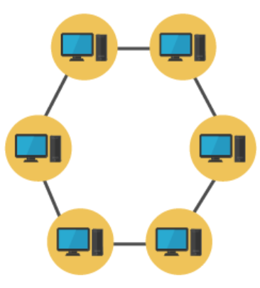
   
4. **Topologia en malla**: Cada dispositivo en la red está conectado a varios otros dispositivos, creando múltiples rutas para los datos. Dependiendo de dependiendo de la cantidad de dispositivos conectados entre si la malla puede ser total o parcial.
   
   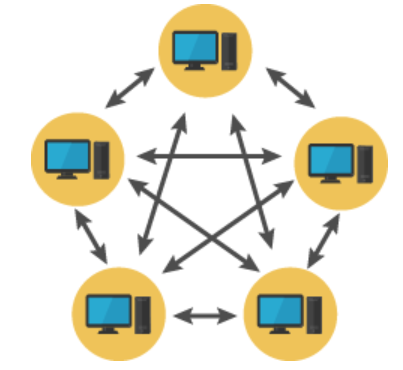
   
5. **Topologia en arbol**: Es una combinación de las topologías en estrella y bus. En esta, un nodo principal actúa como raíz, y otros nodos se conectan a él en una jerarquía. Cada nodo puede tener múltiples dispositivos conectados en una disposición en estrella.
   
   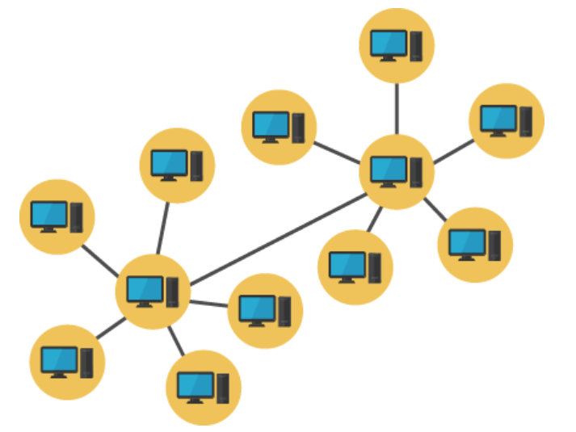

## 3. Protocolos

