# Componentes basicos de un Sistema IoT


## Objetivos

>* Repasar los componentes básicos de un sistema IoT
>* Explorar los componentes básicos que conforman el concepto de cosa.
>* Hacer las primeras pruebas con la placa de desarrollo ESP32
>* Investigar sobre los sistemas de desarrollo disponibles en el laboratorio.

## Referencias principales

1. Lección 2 **A deeper dive into IoT** ([link](https://github.com/microsoft/IoT-For-Beginners/blob/main/1-getting-started/lessons/2-deeper-dive/README.md)) del curso de Microsoft **IoT for Beginners** [[link](https://github.com/microsoft/IoT-For-Beginners)]
2. Lección 3 **Interact with the phisycal world** ([link](https://github.com/microsoft/IoT-For-Beginners/blob/main/1-getting-started/lessons/3-sensors-and-actuators/README.md)) del curso **IoT for Beginners** ([link](https://github.com/microsoft/IoT-For-Beginners)) de Microsoft.

## Conceptos abordados

En la sesión de clase se abordaran los siguientes conceptos:
1. Componentes basicos de un Sistema IoT [[link]](https://udea-iot.github.io/UdeA_IoT-page/docs/sesiones/percepcion/sesion1)
2. Elementos de laboratorio [[link]](https://udea-iot.github.io/UdeA_IoT-page/docs/sesiones/percepcion/sesion2)
3. Arduino Framework [[link]](https://udea-iot.github.io/UdeA_IoT-page/docs/sesiones/percepcion/sesion3)
4. Comunicación serial [[link]](https://udea-iot.github.io/UdeA_IoT-page/docs/sesiones/percepcion/sesion4)

## Trabajo previo

### Aplicaciones locales

Antes de empezar asegurese de tene instalado en su computador el siguiente software:
- [x] Arduino IDE (https://www.arduino.cc/)
- [x] Visual Studio Code (https://code.visualstudio.com/)
- [x] Platformio (Complemento de Visual Studio Code: https://platformio.org/)
- [x] Fritzing (https://fritzing.org/)
- [x] draw.io (https://www.drawio.com/)
- [ ] Mosquitto (https://mosquitto.org/)
- [ ] Mqtt explorer (http://mqtt-explorer.com/)
- [x] Node-red (https://nodered.org/)

> **Nota**: Los programas que no se encuentran seleccinados no son necesarios instalarlos por el momento. Para mas información puede consultar el siguiente [link](https://udea-iot.gitbook.io/introduccion-al-iot/pasos-previos/herramientas-necesarias/software)

### Aplicaciones online

La siguiente es una lista de aplicaciones que se usaran para propositos de simulación. Para usarlas basta con tener una cuenta de correo como la de google poe ejemplo:
- [x] Tinkercad (https://www.tinkercad.com/)
- [x] Wokwi (https://wokwi.com/)

## Trabajo de clase

## 1. Ejemplo de un sistema IoT

A continuación se muestra el diagrama de un sistema de control en tiempo real para jugar con un laberinto hecho en la universidad de Curtin (https://www.curtin.edu.au/):


En el siguiente video se puede observar el funcionamiento de dicho sistema:

[](https://www.youtube.com/watch?v=ErS2W58StIs)


## 2. Sistemas de desarrollo

El corazón de los sistemas IoT son las cosas. Estas, son las encargadas de permitir la interacción del sistema con el medio ambiente mediante la recolección, el procesamiento de los datos y las acciones de control sobre este. 

Para realizar labores de prototipado se emplean sistemas de desarrollo (dev kits) los cuales son de dos tipos *Microcontroladores* y *Computadoras de placa unica* tal y como se muestra en la siguiente figura:

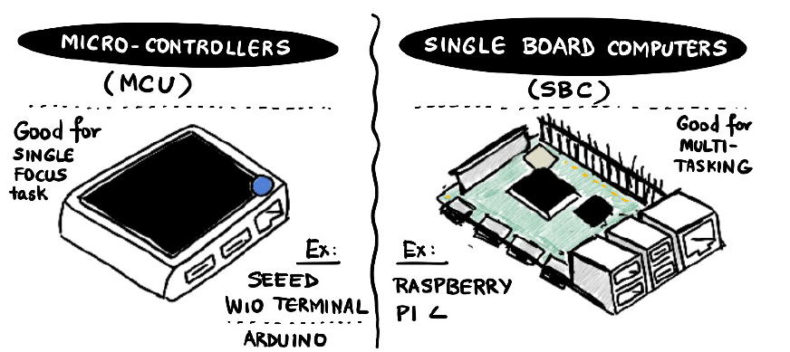


La siguiente tabla muestra una comparación entre ambos tipos de sistemas:

| Característica                | Microcontrolador                         | Computadora de placa única (SBC)     |
|--------------------------------|-----------------------------------------|--------------------------------------|
| **Definición**                | Procesador simple en un solo circuito integrado, diseñado para tareas de control específicas. | Un sistema informático completo en una sola placa, diseñado para computación de propósito general. |
| **Potencia de procesamiento** | Baja potencia de procesamiento, a menudo de un solo núcleo con velocidad de reloj limitada. | Mayor potencia de procesamiento, procesadores de múltiples núcleos con velocidades de reloj más altas. |
| **Memoria**                   | Memoria RAM limitada a bordo, típicamente en el rango de KB. | Mayor memoria RAM, que va desde 256MB hasta 8GB o más. |
| **Almacenamiento**            | Sin almacenamiento dedicado, el programa se almacena en memoria flash. | Opciones de almacenamiento dedicadas como microSD, USB o eMMC a bordo. |
| **Sistema operativo**         | Normalmente ejecuta código que interactua directamente con el hardware (bare-metal code) o sistemas operativos en tiempo real (RTOS). | Ejecuta sistemas operativos completos como Linux, Android o sistemas operativos personalizados. |
| **Conectividad**              | Conectividad básica como UART, SPI, I2C. Sin embargo, hay algunos que integran conectividad WiFi y Bluetooth| Conectividad avanzada que incluye USB, Ethernet, Wi-Fi, Bluetooth. |
| **Consumo de energía**        | Muy bajo consumo de energía, a menudo funcionando con baterías. | Mayor consumo de energía, requiere una fuente de alimentación más robusta. |
| **Casos de uso**              | Sistemas embebidos, dispositivos IoT, robótica, sistemas de control simples. | General-purpose computing, media centers, development platforms, DIY projects. |
| **Entorno de programación**   | Normalmente programado en C/C++ o ensamblador. | Soporta una amplia gama de lenguajes de programación, incluyendo Python, Java, y más. |
| **Costo**                     | Generalmente más barato | Más costoso |
| **Dispositivos de ejemplo**   | Arduino, ESP8266, ESP32, PIC, ATmega328.        | Raspberry Pi, BeagleBone, Orange Pi. |


### Sistemas disponibles en el laboratorio

A continuación se listan algunos sistemas de desarrollo. Los que se encuentran disponibles en el laboratorio estan marcados.

#### Microcontroladores

- [x] Arduino UNO 
- [x] ESP8266 
- [x] ESP32 
- [x] ARDUINO NANO 33 BLE Sense Lite

#### Computadores de una sola placa

- [x]  Raspberry Pi [[link]](https://www.raspberrypi.com/) 
- [ ]  BeagleBoard [[link]](https://www.beagleboard.org/) 
- [ ]  Orange Pi [[link]](http://www.orangepi.org/)  
- [ ]  Banana Pi[[link]](https://www.banana-pi.org/)  
- [ ]  Intel Galileo [[link]](https://ark.intel.com/content/www/us/en/ark/products/78919/intel-galileo-board.html)

<br>

> **Para profundizar** <br>
Para conocer mas sobre estos elementos disponibles en el laboratorio consulte el siguiente [link](https://udea-iot.github.io/UdeA_IoT-page/docs/sesiones/percepcion/sesion2)

## 3. Configuración del entorno de desarrollo para microcontroladores

### Arduino framework

Para programar un microcontrolador se necesitan algunas herramientas para desarrollar el software que se ejecutara en el microcontrolador (firmeware). Debido a la gran cantidad de microcontroladores existentes, cada fabricante ofrece un framework para facilitar el desarrollo de aplicaciones para cualquier microntrolador compatibles con estos. La siguiente tabla muestra un resumen de algunos:

| Característica                 | FreeRTOS                               | Arduino Framework                    | ESP-IDF                              | STM32Cube                            | mbed OS                               | Atmel Start (ASF4)                    | TI-RTOS                                |
|--------------------------------|----------------------------------------|--------------------------------------|--------------------------------------|--------------------------------------|---------------------------------------|---------------------------------------|----------------------------------------|
| **Tipo**                       | Sistema operativo en tiempo real       | Framework de desarrollo              | Framework de desarrollo              | Framework de desarrollo              | Sistema operativo en tiempo real      | Framework de desarrollo               | Sistema operativo en tiempo real       |
| **Compatibilidad**             | Multiplataforma (Cortex-M, AVR, etc.)  | AVR, ESP32, ESP8266, ARM, etc.       | ESP32, ESP8266                       | STM32 series                         | ARM Cortex-M                          | AVR, SAM series                       | MSP430, Tiva C, CC3200, etc.           |
| **Lenguaje de programación**   | C                                      | C/C++                                | C/C++                                | C/C++                                | C++                                   | C/C++                                 | C/C++                                  |
| **Enfoque**                    | Sistemas en tiempo real, multitarea    | Proyectos simples de electrónica     | IoT, Wi-Fi, Bluetooth                | Aplicaciones industriales y embebidas | IoT y sistemas embebidos              | Controladores industriales y embebidos | Sistemas en tiempo real, aplicaciones críticas |
| **Herramientas de desarrollo** | Integración con varios IDEs            | Arduino IDE, PlatformIO              | Eclipse, VSCode, Terminal            | STM32CubeIDE, Keil, IAR              | mbed Online Compiler, VSCode          | Atmel Studio, MPLAB X                 | Code Composer Studio (CCS)            |
| **Bibliotecas**                | Ligero, incluye tareas y temporizadores| Amplia, basada en C++                | APIs para Wi-Fi, Bluetooth, etc.     | HAL, CMSIS                           | RTOS, conectividad IoT                | HAL, SAM Drivers                      | RTOS, APIs para periféricos            |
| **Popularidad**                | Muy popular en sistemas embebidos      | Muy popular en proyectos DIY         | Popular en IoT                       | Popular en aplicaciones industriales | Popular en IoT                        | Usado en aplicaciones industriales    | Usado en aplicaciones críticas        |

Debido a la popularidad y facilidad, en el curso de usará el Framework de Arduino. Arduino es una plataforma de electronica open source que combina hardware y software lo que lo hace ideal para programar placas no solo exclusivas de Arduino, sino tambien de otros fabricantes usando el modelo de programación empleado en Arduino para desarrollar software.

En este modelo, las placas se programa en C o C++ mediante un archivo de código conocido como **sketch** ([link](https://github.com/microsoft/IoT-For-Beginners/blob/main/1-getting-started/lessons/2-deeper-dive/README.md)):

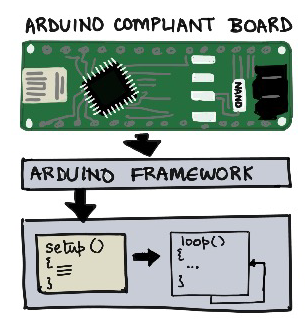

El **sketch** se compone de dos funciones principales (ver figura tomada del siguiente [link](https://github.com/microsoft/IoT-For-Beginners/blob/main/1-getting-started/lessons/2-deeper-dive/README.md)):
* **`setup`**: Código de inicialización (inicialización de puertos, conexión a la red Wi-Fi, servicios de nube, etc) que se ejecuta cuando se enciende el microcontrolador. 
* **`loop`**: Código que se ejecuta de maneta continua mientras el microcontrolador este encendido. Aqui es donde se implementa la logica de la aplicación (lectura de sensores, control de actuadores, envio y recepción de información, etc).

A continuación se muestra una plantilla de código tipica:

```cpp
// Project Name
// Description: Brief description of the project and its functionality

// Include necessary libraries
#include <Arduino.h>


// Define constants and pin assignments


// Global variables

void setup() {
    // Initial setup
    // code...
}

void loop() {
    // Code that runs repeatedly
    // code...
   
}
```

Para desarrollar aplicaciones en dispositivos compatibles con el framework de Arduino, existen varios entornos de desarrollo (IDE), entre los cuales destacan el Arduino IDE y Visual Studio Code, este último utilizado junto con la extensión PlatformIO, que permite el desarrollo de aplicaciones en microcontroladores.

### Configuración del entorno de desarrollo

A lo largo del curso usaremos el Visual Studio Code con Platformio, de modo que el primer paso consiste en realizar la instalación y configuración de la herramienta. En la pagina **Getting Started with VS Code and PlatformIO IDE for ESP32 and ESP8266 (Windows, Mac OS X, Linux Ubuntu)** ([link](https://randomnerdtutorials.com/vs-code-platformio-ide-esp32-esp8266-arduino/)) del sitio **Random Nerd Tutorials** ([link](https://randomnerdtutorials.com/)).

Antes de empezar tenga a la mano un diagrama de pines para es ESP32 tal y como se muestra a continuación:

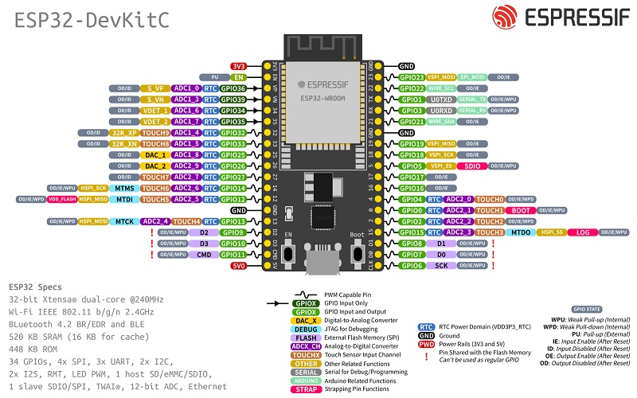

Asi mismo tenga a la mano los siguientes recursos para consulta rapida:
- [x] Arduino cheat sheet ([link](https://www.cheat-sheets.org/saved-copy/Arduino-cheat-sheet-v02c.pdf)
- [X] Arduino Language Reference ([link](https://www.arduino.cc/reference/en/))
  
  

Para montar los siguientes ejemplos siga los pasos descritos la sección del anexo **Uso del Platformio** ([link](#uso-del-platformio))

#### Ejemplo 1

**Descripción**: La siguiente aplicación muestra el encendido y apagado de un led a una frecuencia de 1Hz. 

**Componentes**:

| Item No. | Nombre del componente| Cantidad |
|---|---|---|
|1|ESP32 Development Board|1|
|2|LED (Rojo)|1|
|3|Resistencia 220Ω|1|

**Esquematico**:

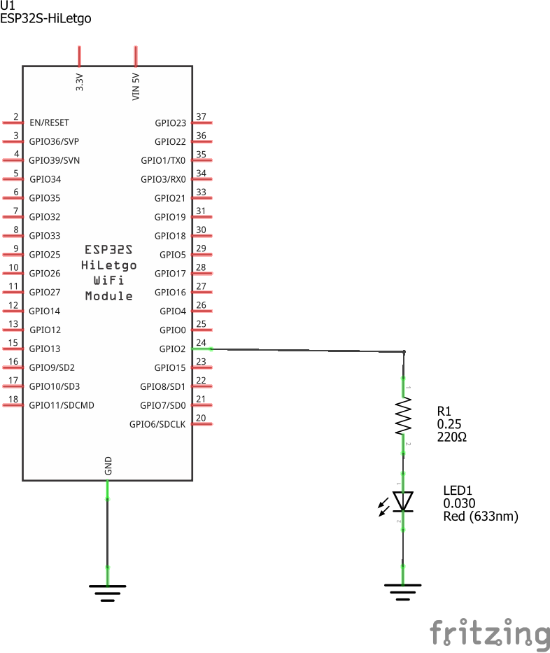

**Diagrama de conexión**:

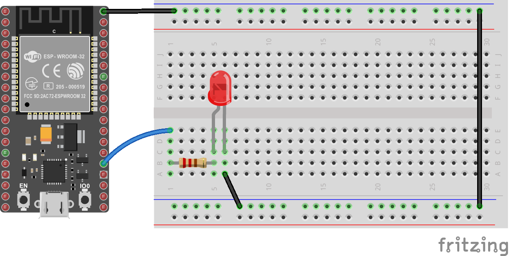


**Código**:

```cpp
// ESP32-blink
// Description: Programa que enciende y apaga led conectado al GPIO2 
// con una frecuencia de 1Hz

// Include necessary libraries
#include <Arduino.h>

// Define constants and pin assignments
#define LED_PIN 2          // P2 (GPIO2)

// Global variables
int delay_ms = 500;

void setup() {
    // Initial setup
    // Port configure
    pinMode(LED_PIN, OUTPUT);    
    digitalWrite(LED_PIN, LOW);
}

void loop() {
    delay(delay_ms);             // Delay 500ms
    digitalWrite(LED_PIN, HIGH); // Led ON
    delay(delay_ms);             // Delay 500ms 
    digitalWrite(LED_PIN, LOW);  // Led OFF
}
```

**Simulación**: La simulación se muestra en el siguiente [link](https://wokwi.com/projects/406255037756300289)

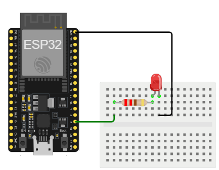

#### Ejemplo 2

**Descripción**: Modifique el ejemplo anterior de tal modo que el encendido y apagado del led dependa de los siguientes comandos enviados via serial.

|Comando|Descripción|
|---|---|
|H|	Comando empleado para encender el Led.|
|L|	Comando empleado para apagar el Led.|


**Componentes**:

| Item No. | Nombre del componente| Cantidad |
|---|---|---|
|1|ESP32 Development Board|1|
|2|LED (Rojo)|1|
|3|Resistencia 220Ω|1|

**Esquematico**:

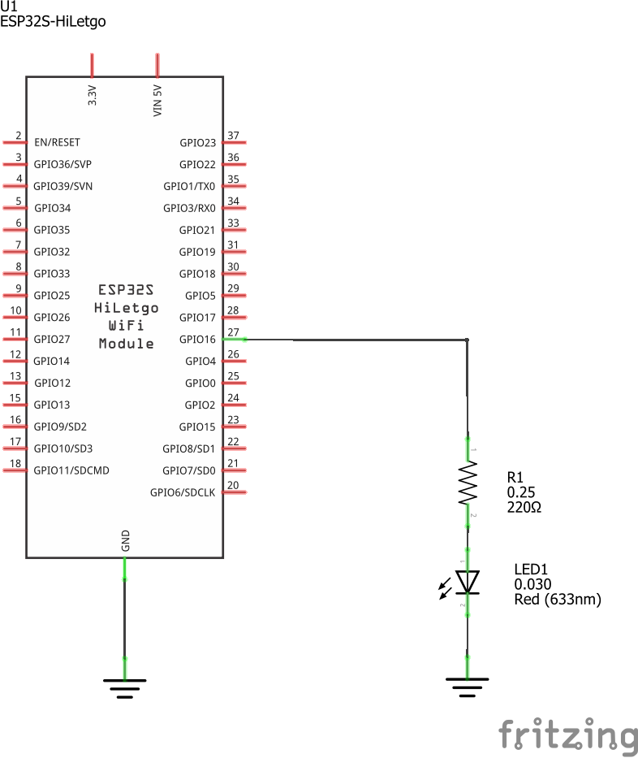

**Diagrama de conexión**:

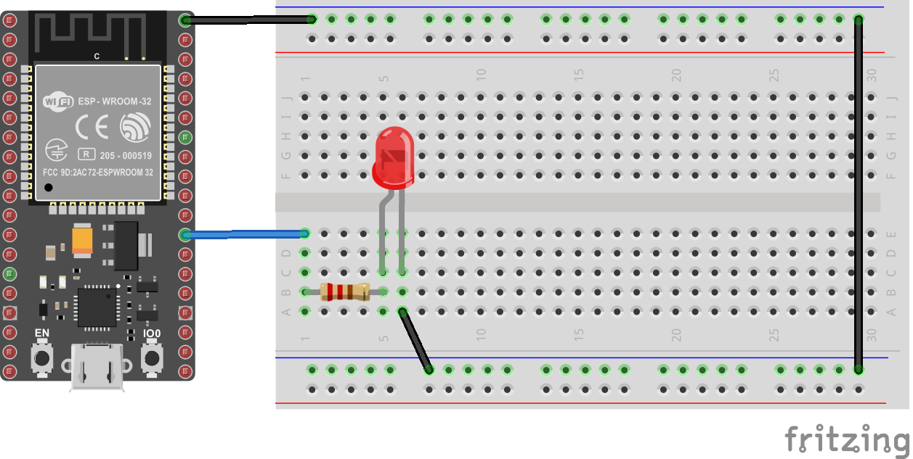


**Código**:

```cpp
// ESP32-ledSerial
// Description: Programa en enciende y apaga un led empleando comandos por serial.

// Include necessary libraries
#include <Arduino.h>
/* Entradas y salidas */
#define LIGHT1 16          // P26 (GPIO26)

/* Comandos */
#define LIGHT_ON 'H'       // Luz encendida  
#define LIGHT_OFF 'L'      // Luz apagada  

int cmd = 0; // Comnado entrado por serial

void setup() {
  // Configuración de los puertos digitales
  pinMode(LIGHT1, OUTPUT);    
  digitalWrite(LIGHT1, LOW);
  // Configuracion del puerto serial
  Serial.begin(9600); 
  Serial.println("Sistema listo para recibir comandos (H: ON - L: OFF)");  
  
}

void loop() {
  // reply only when you receive data:
  if (Serial.available() > 0) {
    // read the incoming byte:
    cmd = Serial.read();

    // Encendido o apagado de la luz segun el comando
    if(cmd == LIGHT_ON) {
      digitalWrite(LIGHT1, HIGH);
      Serial.println("Light -> ON");
    }
    else if(cmd == LIGHT_OFF) {
      digitalWrite(LIGHT1, LOW);    
      Serial.println("Light -> OFF");
    } 
  }
}
```

**Simulación**: La simulación se muestra en el siguiente [link](https://wokwi.com/projects/406259527261320193)


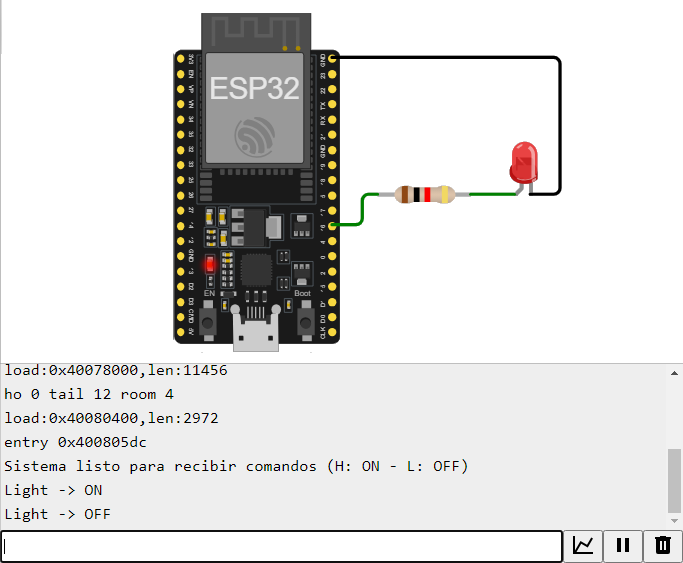

## Actividad

En el siguiente [link](ejemplos_GPIO/README.md) se muestran algunos escenarios de uso donde se usan las funciones anteriormente descritas. El objetivo con estos es que se entrene en el procedimiento, previamente mostrado, para descargar firmware en la tarjeta. 

Para este fin crear un directorio llamado **exampleX** (donde X es el numero del ejemplo que sera agregado a la secuencia). Tenga en cuenta que ya estan los dos primeros ejemplos la numeración empieza en **X=3**. Luego en el directorio creado copie y pegue la siguiente template ([link](template/README.md)) y modifiquela de acuerdo a la descripción dada alli. Puede usar como base el directorio [example1](example1/). Despues de crear el directorio, elija uno de los ejemplos de [link](ejemplos_GPIO/README.md), realice el procedimiento de descarga en la ESP32 usando platformio, tome una foto del montaje físico y adjuntela en el directorio creado, haga un video en youtube del montaje en funcionamiento y finalmente adapte la plantilla adjuntando la foto en el repo y el enlace del video en youtube donde se muestre el funcionamiento real.


## Anexos

### Uso del Platformio

[Platformio](https://platformio.org/) es una extención del VS Code que permite programar y realizar pruebas sobre placas de desarrollo como la ESP32. A continuación, se describe el proceso para codificar y descargar el firmware usando este complemento.
1. Iniciar Platformio
   
   
   
   Si todo esta bien aparecera:

   

2. Crear nuevo proyecto:
   
   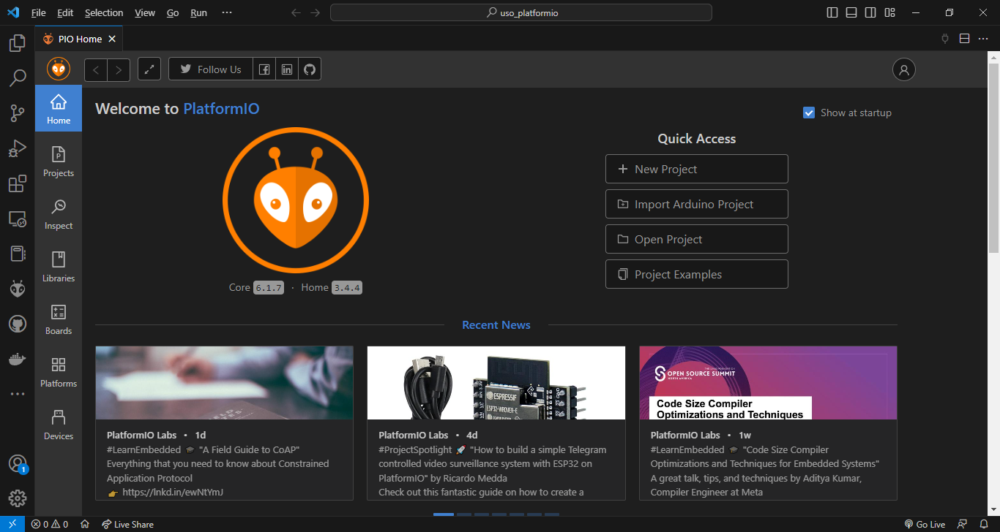

3. Seleccionar la plataforma y el lugar donde estara el proyecto.
   
   
   
   Si todo esta bien el resultado sera como el siguiente:
   
   

4. Abrir el archivo **main.cpp** y editarlo:
   
   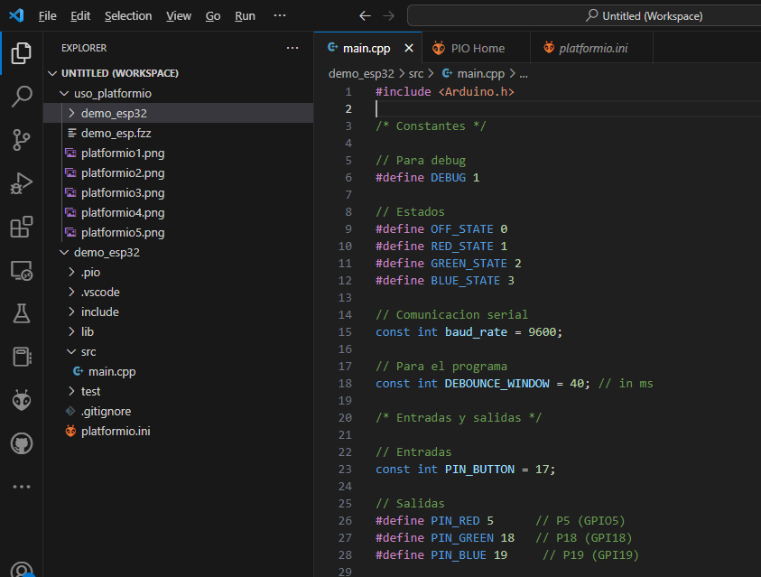

5. Seleccionar el botón para subir el codigo a la tarjeta:
   
   

   Luego se procede a subir el codigo dando click en el botón de upload (**flecha**):

   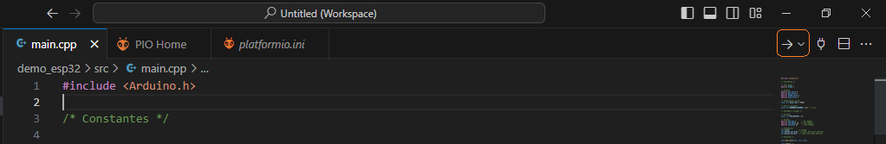

6. Ensayar el funcionamiento. En la imagen mostrada a continuación se muestra la salida en el monitor serial cuando se emplea comunicación serial en la placa:
   
   


## Recursos para ir mas lejos

Explore los siguientes citios para que vaya teniendo una idea de lo que se puede hacer:
* https://randomnerdtutorials.com/
* https://www.adafruit.com/
* https://www.sparkfun.com/
* https://www.seeedstudio.com/
* https://www.luisllamas.es/
* https://www.hackster.io/
* https://hackaday.com/
* https://projecthub.arduino.cc/
* https://makezine.com/
* https://make.co/
* https://es.ubidots.com/
* https://www.wildernesslabs.co/


## Referencias

* https://how2electronics.com/10-essential-iot-starter-kits-to-kickstart-your-journey/
* https://github.com/UdeA-IoT/actividad-4
* https://udea-iot.github.io/UdeA_IoT-page/docs/sensores-actuadores/sensores/intro
* https://gist.github.com/lyqht
* https://github.com/microsoft/IoT-For-Beginners
* https://github.com/microsoft/ML-For-Beginners
* https://github.com/microsoft/Web-Dev-For-Beginners
* https://github.com/microsoft/ai-for-beginners
* https://github.com/microsoft/Data-Science-For-Beginners