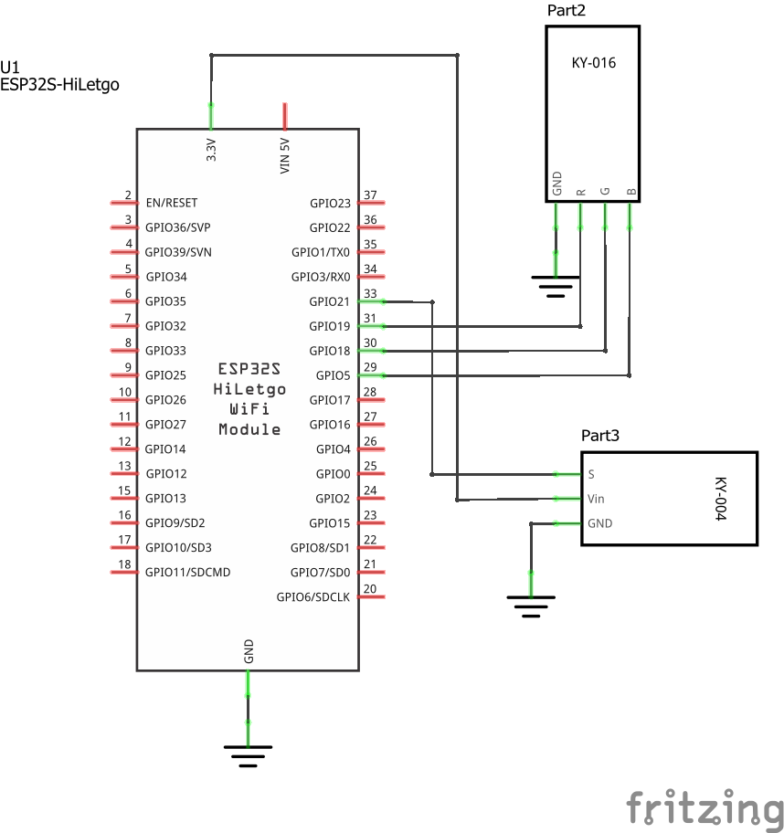

# Ejemplo 2 - Led RGB, pulsador y ESP32

## Descripción

Conectar al ESP32 un led RGB y ponerlo a alumbrar cada vez que el usuario presione un botón.

> **Herramienta** </br> En el siguiente [link](https://www.rapidtables.com/web/color/RGB_Color.html) se encuentra una herramienta para realizar la combinación de colores primarios (RGB) y obtener cualquier color.

## Hardware

La siguiente tabla muestra los componentes principales del circuito a montar:


| Item # | Cantidad | Descripción    | Información |
| ------ | -------- | -------------- | ----------- |
| 1      | 1        | ESP32          | N/A         |
| 2      | 1        | RGB Module | Elegoo 37 SENSOR KIT TUTORIAL|
| 3      | 1        | Switch Module | Elegoo 37 SENSOR KIT TUTORIAL|

### Esquematico

<p align="center">
  
</p>

### Conexión entre los componentes

A continuación se muestra la conexión entre los componentes:

<p align="center">
  
</p>

## Software

### Código

En este código se combino el ejemplo **Debounce on a Pushbutton** ([link](https://docs.arduino.cc/built-in-examples/digital/Debounce/)) con el ejemplo 1 ([link](../example1/README.md)) del led RGB. A continuación se muestra el código resultante con debug serial:

```C++
//uncomment this line if using a Common Anode LED
//#define COMMON_ANODE

// uncomment for debug
//#define DEBUG

// constants won't change. They're used here to set pin numbers:
const int buttonPin = 21;  // the number of the pushbutton pin
const int redPin = 19;
const int greenPin = 18;
const int bluePin = 5;


enum color {
	RED,
	GREEN,
  BLUE
};

color ledColor = RED;
int ledState = HIGH;        // the current state of the output pin
int buttonState;            // the current reading from the input pin
int lastButtonState = LOW;  // the previous reading from the input pin

// the following variables are unsigned longs because the time, measured in
// milliseconds, will quickly become a bigger number than can be stored in an int.
unsigned long lastDebounceTime = 0;  // the last time the output pin was toggled
unsigned long debounceDelay = 50;    // the debounce time; increase if the output flickers

void setup() {
  #ifdef DEBUG
   Serial.begin(9600);
   Serial.println("Init: State -> RED");
  #endif
  pinMode(buttonPin, INPUT);
  pinMode(redPin, OUTPUT);
  pinMode(greenPin, OUTPUT);
  pinMode(bluePin, OUTPUT); 

  // set initial LED state
  setColor(255, 0, 0);  // red
}

void loop() {
  int reading = digitalRead(buttonPin);

  if (reading != lastButtonState) {
    // reset the debouncing timer
    lastDebounceTime = millis();
  }

  if ((millis() - lastDebounceTime) > debounceDelay) {
    if (reading != buttonState) {
      buttonState = reading;
      if (buttonState == HIGH) {
        #ifdef DEBUG
        Serial.print("Button [low -> high]: ");
        #endif
        switch(ledColor) {
          case RED:
            #ifdef DEBUG
              Serial.println("Previus state -> RED");
            #endif            
            ledColor = GREEN;
            break;
          case GREEN:
            #ifdef DEBUG
              Serial.println("Previus state -> GREEN");
            #endif
            ledColor = BLUE;
            break;
          case BLUE:
            #ifdef DEBUG
              Serial.println("Previus state -> BLUE");
            #endif
            ledColor = RED;
            break;
        }
      }
    }
  }

  // set the LED color  
  switch(ledColor) {
          case RED:
            setColor(255, 0, 0);  // red
            break;
          case GREEN:
            setColor(0, 255, 0);  // green
            break;
          case BLUE:
            setColor(0, 0, 255);  // blue
            break;
        }

  // save the reading. Next time through the loop, it'll be the lastButtonState:
  lastButtonState = reading;
}


void setColor(int red, int green, int blue)
{
  #ifdef COMMON_ANODE
    red = 255 - red;
    green = 255 - green;
    blue = 255 - blue;
  #endif
  analogWrite(redPin, red);
  analogWrite(greenPin, green);
  analogWrite(bluePin, blue);  
}
```

## Simulación

### Wokwi - Simulación

Para comprender el funcionamiento del programa se emplea en el simulador la Board **board-esp32-devkit-c-v4** tal y como se muestra en la siguiente conexión: 

<p align="center">
  
</p>

Se realizaron dos simulaciones, una con debug serial y otra sin debug serial. A continuación se muestran los links de acceso:
1. **Simulación 1**: Con degug serial ([link](https://wokwi.com/projects/391344633629636609))
2. **Simulación 2**: Sin degug serial ([link](https://wokwi.com/projects/391211218645463041))

## Referencias

* https://esp32io.com/tutorials/esp32-rgb-led
* https://learn.sparkfun.com/tutorials/tinker-kit-circuit-guide/circuit-4-rgb-night-light
* https://learn.adafruit.com/all-about-leds
* https://learn.sparkfun.com/tutorials/light-emitting-diodes-leds
* https://learn.adafruit.com/adafruit-arduino-lesson-3-rgb-leds/overview
* https://learn.adafruit.com/adafruit-arduino-lesson-3-rgb-leds/using-internet-colors
* https://htmlcolorcodes.com/color-names/
* https://learn.sparkfun.com/tutorials/experiment-guide-for-the-sparkfun-tinker-kit/experiment-4-driving-multiple-leds
* https://www.luisllamas.es/referencia-lenguaje-arduino/
* https://github.com/UdeA-IoT/ejemplos-mqtt/tree/main/ejemplo_2/thing_02
* https://arts.recursos.uoc.edu/programacio-disseny-arts/es/maxmsp-pure-data/
* https://github.com/UdeA-IoT/clases-IoT_capa-percepcion_2023-2/tree/main/dia3/esp32