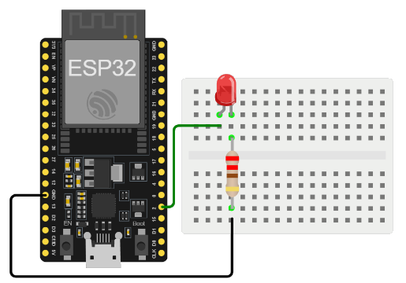

# Ejemplo 1 - blink en el ESP32

## Descripción

Poner a parpadear un led conectado al ESP32 a una frecuencia de 1Hz.

## Hardware

La siguiente tabla muestra los componentes principales del circuito a montar:


| Item # | Cantidad | Descripción    | Información |
| ------ | -------- | -------------- | ----------- |
| 1      | 1        | ESP32          | N/A         |


### Esquematico

<p align="center">
  
</p>

### Conexión entre los componentes

A continuación se muestra la conexión entre los componentes:

<p align="center">
  
</p>

## Software

### Código

```C++
// Puertos
#define LED 2

// Inicializacion
void setup() {
  pinMode(LED, OUTPUT);
}

// Ciclo infinito
void loop() {
  digitalWrite(LED, HIGH);   
  delay(1000);                       
  digitalWrite(LED, LOW);    
  delay(1000);                      
}
```

## Simulación

### Wokwi - Simulación

Para comprender el funcionamiento del programa, puede seguir el siguiente: 
* **Board**: wokwi-esp32-devkit-v1 ([link](https://wokwi.com/projects/357845157032899585))

<p align="center">
  
</p>

* **Board**: board-esp32-devkit-c-v4 ([link](https://wokwi.com/projects/391184511314874369))

<p align="center">
  
</p>

