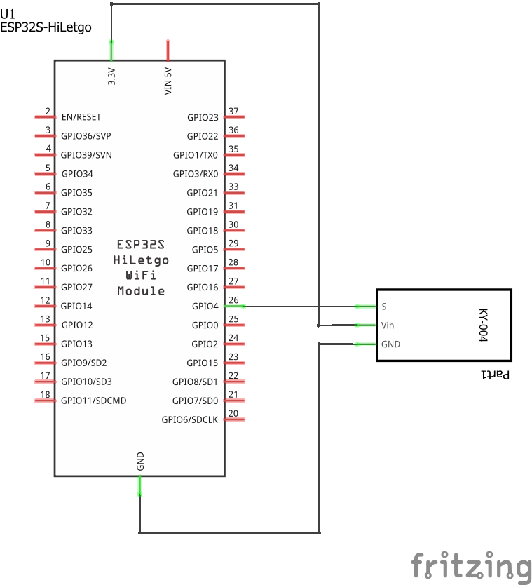
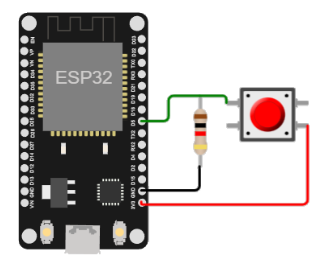

# Ejemplo 2 - Entrada digital en el ESP32

## Descripción

Prender y apagar un led mediante un boton.

## Hardware

La siguiente tabla muestra los componentes principales del circuito a montar:


| Item # | Cantidad | Descripción    | Información |
| ------ | -------- | -------------- | ----------- |
| 1      | 1        | ESP32          | N/A         |
| 1      | 1        | Button module  | Elegoo 37 SENSOR KIT TUTORIAL|

### Esquematico

<p align="center">
  
</p>

### Conexión entre los componentes

A continuación se muestra la conexión entre los componentes:

<p align="center">
  
</p>

## Software

### Código

```C++
// Puertos
const int buttonPin = 4;         //  (GPIO4)
const int ledPin =  2;           //  (GPIO2)

// variables will change
int buttonState = 0;         

// Inicializacion
void setup() {
  pinMode(ledPin, OUTPUT);
  pinMode(buttonPin, INPUT);
}

// Ciclo infinito
void loop() {
  buttonState = digitalRead(buttonPin);

  if (buttonState == HIGH) {
    digitalWrite(ledPin, HIGH);
  } else {
    digitalWrite(ledPin, LOW);
  }
}
```

## Simulación

### Wokwi - Simulación

Para comprender el funcionamiento del programa, puede seguir el siguiente: 
* **Board**: wokwi-esp32-devkit-v1 ([link](https://wokwi.com/projects/335034266233602642))

<p align="center">
  
</p>

* **Board**: board-esp32-devkit-c-v4 ([link](https://wokwi.com/projects/391184895031851009))

<p align="center">
  
</p>

