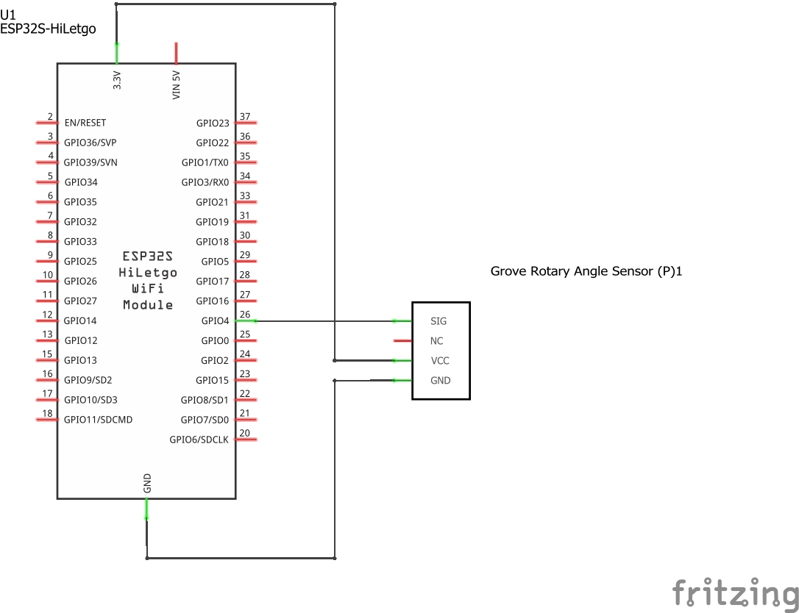

# Ejemplo 4 - Lectura analoga usando el ESP32

## Descripción

Cambiar la intensidad del brillo de un led conectado al ESP32.

## Hardware

La siguiente tabla muestra los componentes principales del circuito a montar:


| Item # | Cantidad | Descripción    | Información |
| ------ | -------- | -------------- | ----------- |
| 1      | 1        | ESP32          | N/A         |
| 2      | 1        | Grove - Rotary Angle Sensor  | Grove - Starter Kit v3 ([link](https://wiki.seeedstudio.com/Grove_Starter_Kit_v3/#grove---rotary-angle-sensor))  |

### Esquematico

<p align="center">
  
</p>

### Conexión entre los componentes

A continuación se muestra la conexión entre los componentes:

<p align="center">
  
</p>

## Software

### Código

```C++
const int analogInPin = 4;  //  GPIO15
const int analogOutPin = 2; //  GPIO2

int sensorValue = 0;        
int outputValue = 0;        

void setup() {
  Serial.begin(9600);
}

void loop() {
  sensorValue = analogRead(analogInPin);
  outputValue = map(sensorValue, 0, 4095, 0, 255); // ADC de 12 bits
  analogWrite(analogOutPin, outputValue);

  Serial.print("sensor = ");
  Serial.print(sensorValue);
  Serial.print("\t output = ");
  Serial.println(outputValue);

  delay(2);
}
```

## Simulación

### Wokwi - Simulación

Para comprender el funcionamiento del programa, puede seguir el siguiente: 
* **Board**: wokwi-esp32-devkit-v1 ([link](https://wokwi.com/projects/335035080677261908))

<p align="center">
  
</p>

* **Board**: board-esp32-devkit-c-v4 ([link](https://wokwi.com/projects/391446138178682881))

<p align="center">
  
</p>

