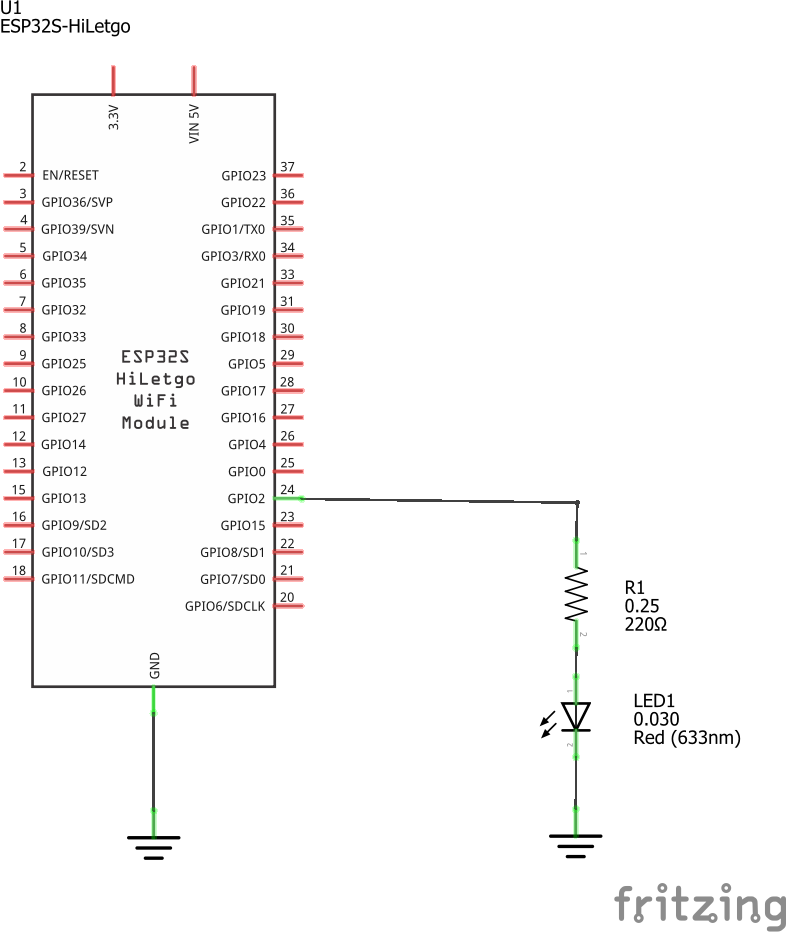
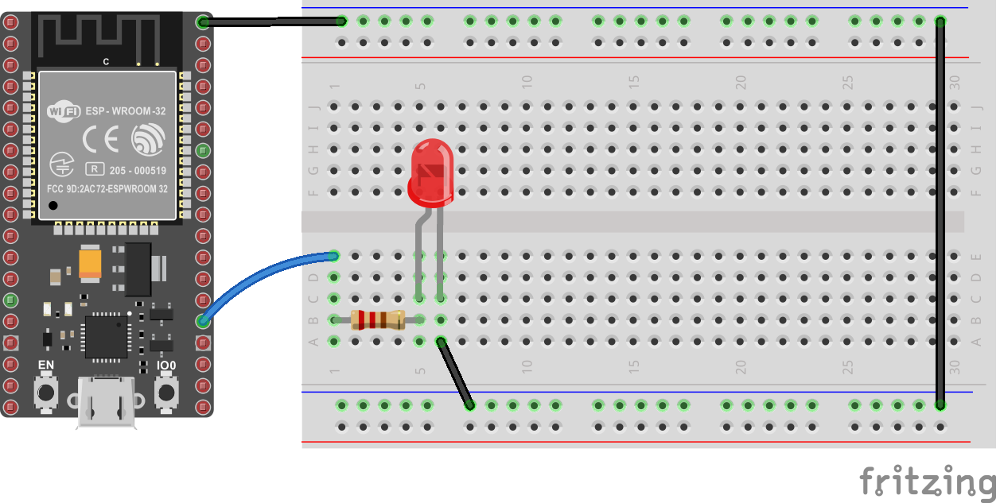

# Ejemplo 1

**Descripción:**
Aplicación que pone a parpadear un led a una frecuencia de 1Hz.

## Materiales Necesarios

| Item No. | Nombre del componente| Cantidad |
|---|---|---|
|1|ESP32 Development Board|1|
|2|LED (Rojo)|1|
|3|Resistencia 220Ω|1|

## Esquema de Conexión

El cirtuito se encuentra en el archivo [ESP32-blink.fzz](ESP32-blink.fzz)

### Esquemático



### Diagrama de conexión



**Conexiones:**

| Pin del ESP32 | Componente | Descripción de la Conexión |
|---------------|------------|---------------------------|
| GPIO02        | Driver Led (Resistencia 220 y led) | Led indicador de parpadeo|

## Código Fuente

```cpp
// ESP32-blink
// Description: Programa que enciende y apaga led conectado al GPIO2 
// con una frecuencia de 1Hz

// Include necessary libraries
#include <Arduino.h>

// Define constants and pin assignments
#define LED_PIN 2          // P2 (GPIO2)

// Global variables
int delay_ms = 500;

void setup() {
    // Initial setup
    // Port configure
    pinMode(LED_PIN, OUTPUT);    
    digitalWrite(LED_PIN, LOW);
}

void loop() {
    delay(delay_ms);             // Delay 500ms
    digitalWrite(LED_PIN, HIGH); // Led ON
    delay(delay_ms);             // Delay 500ms 
    digitalWrite(LED_PIN, LOW);  // Led OFF
}
```

### Simulación

La simulación se muestra en el siguiente [link](https://wokwi.com/projects/406255037756300289)

### Proyecto

El directorio del proyecto en platformio (**ESP32-blink**) se encuentra en el siguiente [link](ESP32-blink/)

---
**Preparado Por:** [Tu Nombre] ([@UsuarioGitHub])  
**Fecha:** [Fecha]

