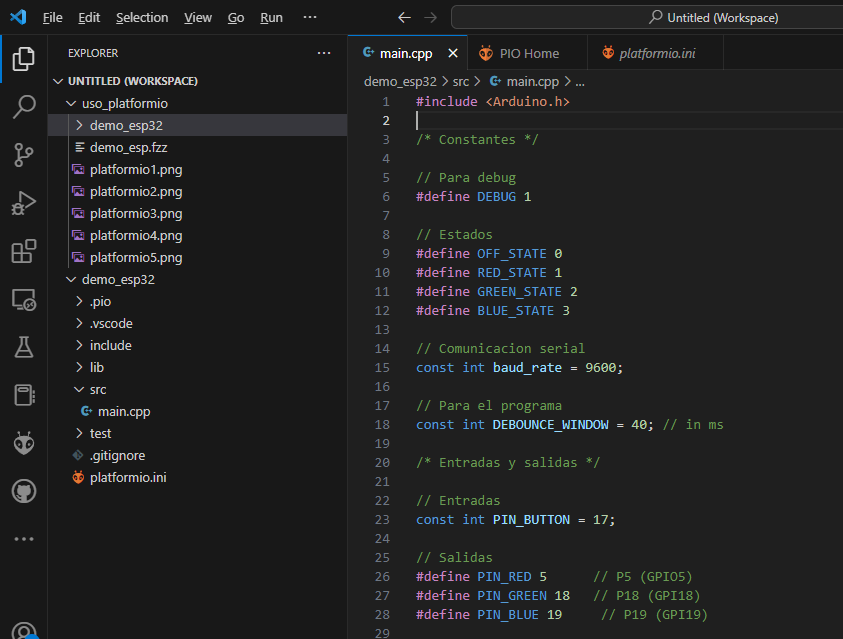
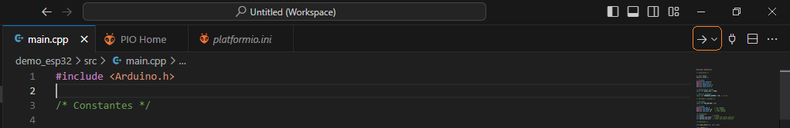

# Primeros pasos con platformio

## Antes de iniciar

[Platformio](https://platformio.org/) es una extención del VS Code que permite programar y realizar pruebas sobre placas de desarrollo como la ESP32.

Para demostrar el procedimiento de descarga de un programa, se asume que ya tiene instalado el Visual Studio Code con la extención platformio configurada.

## Hardware

La siguiente tabla muestra una lista con el hardware a emplear para este ejemplo:

|Elemento |	Descripción | Observaciones |
|----|----|----|
|1 | Placa de desarrollo ESP32 |Hay varias tarjetas distintas en el laboratorio entre las que estan: **`NODEMCU ESP-32S`**, **`YD-ESP32`** y la **`ESP32-DevKitC V4`** |
|2 | Pulsador |	En este caso se uso el modulo **Reed Switch Module** del 37 Sensor Kit - Elegoo |
|3 | Led RGB | Se uso el modulo **RGB LED Module** del 37 Sensor Kit - Elegoo |

El archivo fritzing del ejemplo mostrado es: [demo_esp32.fzz](demo_esp32.fzz) 

### Esquematico

A continuación el esquematico del circuito montado:


### Diagrama de conexión

La siguiente tabla muestra las conexiones entre la placa ESP32 y los modulos externos (led y switch):

|Puerto|Pin|Tipo|Nombre|Descripción|
|---|---|---|---|---|
|```31```|```GPIO19```|Output|```PIN_BLUE```|Puerto que se conecta al pin **B** (azul) del modulo del led RGB|
|```30```|```GPIO18```|Output|```PIN_GREEN```|Puerto que se conecta al pin **G** (verde) del modulo del led RGB|
|```29```|```GPIO5```|Output|```PIN_RED```|Puerto que se conecta al pin **R** (red) del modulo del led RGB|
|```28```|```GPIO17```|Input|```PIN_BUTTON```|Puerto de control que se conecta pin **S** del modulo **switch**|

El diagrama de conexión asociado al esquematico anterior, se muestra a continuación:


## Software

Finalmente el progra a descargarse muestra a continuación:

```cpp
#include <Arduino.h>

/* Constantes */

// Para debug
#define DEBUG 1

// Estados 
#define OFF_STATE 0
#define RED_STATE 1
#define GREEN_STATE 2
#define BLUE_STATE 3

// Comunicacion serial
const int baud_rate = 9600;

// Para el programa
const int DEBOUNCE_WINDOW = 40; // in ms

/* Entradas y salidas */

// Entradas
const int PIN_BUTTON = 17;

// Salidas
#define PIN_RED 5      // P5 (GPIO5)
#define PIN_GREEN 18   // P18 (GPI18)
#define PIN_BLUE 19     // P19 (GPI19)

/* Variables*/
int state;          // Estado
int button_val_prev;  // Valor del boton anterior
int button_val_act;  // Valor del boton anterior

/* Funciones */

void put_color(int, int, int);

void setup() {  
  pinMode(PIN_BUTTON, INPUT);  
  state = OFF_STATE;
  button_val_act = LOW; // Valor inicial del boton
  put_color(0, 0, 0);   // Led inicia apagado
  Serial.begin(baud_rate);   
  Serial.println("Dispositivo iniciado: OK");
  Serial.println("Led -> Apagado");
  #ifdef DEBUG   
    Serial.print("Estado actual: ");
    Serial.println(state);
  #endif
}

void loop() {
  // Lectura inicial del boton  
  button_val_act = digitalRead(PIN_BUTTON); // Se lee el boton
  
  // Ventan de tiempo para el debounce
  delay(DEBOUNCE_WINDOW);                   
  
  // Lectura despues de que pasa el rebote del boton 
  button_val_prev = button_val_act;         // Se almacena el valor previo del boton
  button_val_act = digitalRead(PIN_BUTTON); // Se vuelve a leer el boton

  // Comparacion de los valores previo y actual del boton
  if (button_val_act != button_val_prev) {
    // Se pulso el boton
    if(button_val_act == HIGH) {
      // Se verifica que el boton haya cambiado de LOW a HIGH
      // Maquina de estados
      switch (state) {
      case OFF_STATE:            
        state = RED_STATE;    // Proximo estado -> Rojo
        put_color(255, 0, 0); // Led se pone en rojo
        Serial.println("Led -> Rojo");
        #ifdef DEBUG          
          Serial.print("Estado : ");
          Serial.println(state);
        #endif
        break;
      case RED_STATE:            
        state = GREEN_STATE;  // Proximo estado -> Verde
        put_color(0, 255, 0); // Led se pone en verde
        Serial.println("Led -> Verde");
        #ifdef DEBUG          
          Serial.print("Estado : ");
          Serial.println(state);
        #endif
        break;
      case GREEN_STATE:            
        state = BLUE_STATE;   // Proximo estado -> Azul
        put_color(0, 0, 255); // Led se pone en azul
        Serial.println("Led -> Azul");
        #ifdef DEBUG          
          Serial.print("Estado : ");
          Serial.println(state);
        #endif
        break;
      case BLUE_STATE:            
        state = OFF_STATE;   // Proximo estado -> Apagado
        put_color(0, 0, 0); // Led se apaga
        Serial.println("Led -> Apagado");
        #ifdef DEBUG          
          Serial.print("Estado : ");
          Serial.println(state);
        #endif
        break;
      }    
    }
  }
}

// Funciones
void put_color(int R, int G, int B) {
  analogWrite(PIN_RED,R);
  analogWrite(PIN_GREEN,G);
  analogWrite(PIN_BLUE,B);
}
```

## Procedimiento

A continuación, se describe el proceso para codificar y descargar el firmware usando este complemento.
1. Iniciar Platformio
   
   
   
   Si todo esta bien aparecera:

   

2. Crear nuevo proyecto:
   
   

3. Seleccionar la plataforma y el lugar donde estara el proyecto.
   
   
   
   Si todo esta bien el resultado sera como el siguiente (en este caso se asume que se tiene la tarjeda **`NODEMCU ESP-32S`**):
   
   

4. Abrir el archivo **main.cpp** y editarlo:
   
   

5. Seleccionar el botón para subir el codigo a la tarjeta:
   
   

   Luego se procede a subir el codigo dando click en el botón de upload (**flecha**):

   

6. Ensayar el funcionamiento. En la imagen mostrada a continuación se muestra la salida en el monitor serial cuando se emplea comunicación serial en la placa:
   
   

