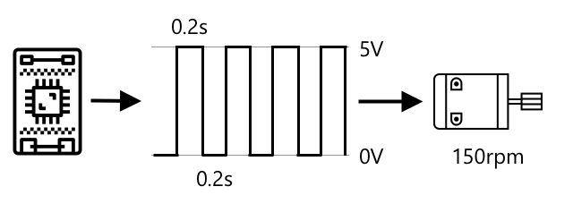
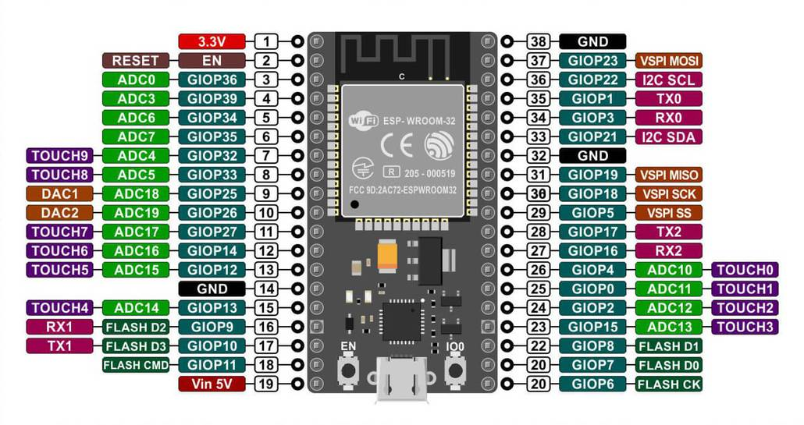
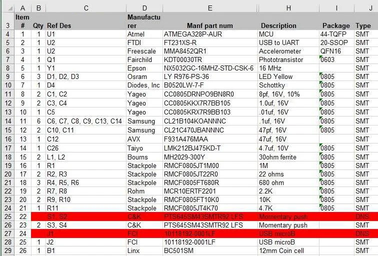
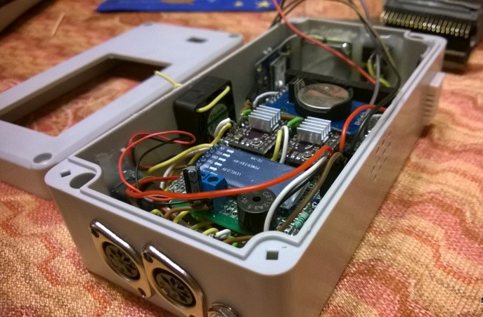
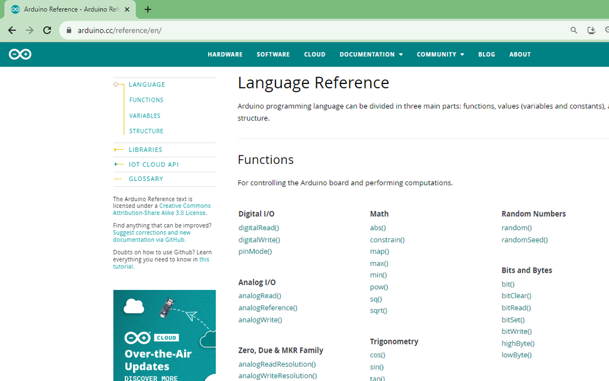

# Implementando una Cosa

## Objetivos

>* Repasar los componentes básicos de un sistema IoT
>* Explorar los componentes básicos que conforman el concepto de cosa.
>* Hacer las primeras pruebas con la placa de desarrollo ESP32
>* Investigar sobre los sistemas de desarrollo disponibles en el laboratorio.
> * To Do...

## Referencias principales

1. Lección 2 **A deeper dive into IoT** ([link](https://github.com/microsoft/IoT-For-Beginners/blob/main/1-getting-started/lessons/2-deeper-dive/README.md)) del curso de Microsoft **IoT for Beginners** [[link](https://github.com/microsoft/IoT-For-Beginners)]
2. Lección 3 **Interact with the phisycal world** ([link](https://github.com/microsoft/IoT-For-Beginners/blob/main/1-getting-started/lessons/3-sensors-and-actuators/README.md)) del curso **IoT for Beginners** ([link](https://github.com/microsoft/IoT-For-Beginners)) de Microsoft.

## 1. Componentes basicos

Dentro del contexto de Internet of Things (IoT), una "thing" se refiere a cualquier dispositivo físico que está conectado a la red y pueda interactuar con otros dispositivos, sistemas, o servicios. 

Los componentes principales de una cosa, desde el punto de vista de Hardware, se pueden resumir en los siguientes:
1. Transductores (Sensores y actuadores)
2. Microcontroladores/Microprocesadores
3. Módulos de conectividad

Vamos a tratar estos con un poco mas de detalle.

### 1.1. Sensores y actuadores

Los **transductores** son los elemetos de la **cosa** que permiten la interación del dispositivo IoT con el ambiente; son el equivalente a los sentidos los seres vivos y los perifericos en los computadores.


Por ejemplo, en la siguiente figura se muestra el diagrama de bloques de un sistema electronico que permite lanzar una alarma cuando la temperatura medida sobrepasa un valor determinado.


A continuación, se va a tratar con mayor detalle cada uno de estos.

#### 1.1.1. Sensores

Un sensor es un tipo de transductor cuya función consiste transformar las señales del entorno (señales fisicas) en señales electricas las cuales son las entradas al sistema. La siguiente tabla, clasifica y resume algunos de los principales tipos de sensores:


Exiten diversas clasificaciones para los sensores dependiendo de diferentes criterios como: El tipo de señal ambiental sensada y el tipo de señal electrica entre otros. A continuación se tratan algunos.

**Tipos de sensores de acuerdo a la señal ambiental sensada**

Los sensores permiten medir muchas cosas, desde propiedades naturales taltes como la temperatura del aire a interacciones fisicas como el movimiento. Algunos tipos de sensores existentes son:
* **Sensores de temperatura**: Permiten medir la temperatura del aire o el medio en el cual se encuentran inmersos. A veces suelen venir cominados con sensores de humedad y presión en un mismo modulo.
  
  

* **Botones**: Permiten sensar cuando estos son presionados.
  
  
  
* **Sensores de luz**: Estos detectan niveles de luz. Tambien permiten medir distintos tipos de luz (de colores especificos, ultravioleta, infraroja o luz visible en general).
  
  

* **Acelerometros**: Permiten medir el movimiento en multiples direcciones.
  
  


* **Microfonos**: estos permiten detectar sonidos.
  
  

**Tipos de sensores de acuerdo a la señal electrica**

De acuerdo al tipo de señal electrica obtenida a la entrada, los sensores se pueden clasificar en dos tipos basicos:
* **Sensores Analógicos**: Son el tipo de sensores mas basicos que existen. Estos sensores son alimentados con voltaje (voltaje de alimentación) desde el dispositivo IoT y devolvuelven (mediante el uso de un **ADC**) a este para su lectura, un voltaje cuya variación depende de la variable medida.

   

  A continuación se muestran algunos ejemplos de este tipo de sensores:

  

* **Sensores Digitales**: Los sensores digitales detectan cambios de voltaje que solo pueden tomar dos posibles valores (**alto** y **bajo**). El tipo mas simple de sensor de este tipo es un **boton** o **switch**, el cual es un sensor con dos estados **ON** y **OFF**.
  
   

  Algunos ejemplos de este tipo de sensores, se muestran a continuación:

  

  Existen sensores digitales mas avanzados que tienen la capacidad de sensar variables analógicas gracias a que possen el hardware necesario para poder procesar la señal leida de modo tal, que pueden ser conectados directamente al dispositivo IoT. Un caso tipico de estos, consiste en los sensores de temperatura que vienen integrados con un ADC de modo que los valores analogos leidos son convertidos en señales digitales que se envian al dispositivo IoT como datos en forma serial.

  

  La siguiente figura muestra algunos tipos de estos sensores:

  

  En este tipo de sensores, el envio de los datos se realiza comunmente por medio de un protocolo serial. La siguiente lista resalta algunos de los mas comunmente usados:

  

  Dentro de los protocolos más comunmente usados para IoT se encuentran el: RS-232, I2C, el SPI y el One Wire, pero esos los veremos despues con mas detalle.

**Tipos de sensores de acuerdo a la alimentación**

Los sensores pueden clasificarse en función de las necesidades de alimentación o de energía:
* **Sensor Activo**: Requiere una fuente de alimentación para su funcionamiento. Algunos ejemplos incluyen: IMUs, LiDAR (Light detection and ranging), CCDs.
* **Sensor pasivo**: No necesitan ser alimentados para funcionar. Algunos ejemplos son: RFID tags, thermistors, y temperature dependant resistors.

> **Para profundizar** <br>
> Para conocer mas sobre la terminologia asociada a los sensores consulte el siguiente material sobre sensores ([link](https://udea-iot.github.io/UdeA_IoT-page/docs/sensores-actuadores/sensores/intro)) disponible en las notas de clase.


#### 1.1.2. Actuadores

Los actuadores realizand la tarea opuesta a los sensores conviertiendo una señal electrica proveniente del dispositivo IoT en una señal ambiental cuyo fin es interactuar con el mundo fisico. Algunos actuadores comunes incluyen:
* **Led**: Estos emiten luz cuando son encendidos.
  
  

* **Altavoz**: Este elemento emite sonido basado en la señal que recibe, desde un buzzer basico a un parlante de audio puede ser empleado en la reproducción de musica.
  
  

* **Motor**: Este convierte una señal electrica en una rotación definida.
  
  

* **Relay**: Son swiches que pueden ser encendidos o apagados por medio de una señal electrica. Estos permiten que pequeños voltajes provenientes de dispositivos IoT puedan manejar altos voltajes.
  
  

* **Pantallas**: Son uno de los actuadores mas completos y muesntran información en un display multi.segmentos. Los displays pueden variar desde display LED sencillos a monitores de video de alta resolución.
  
  

#### **Tipos de actuadores de acuerdo a la señal electrica**

Al igual que para el caso de los sensores, el tipo de señal electrica hace que estos se clasifiquen en:
* **Actuadores analógicos**: Los actuadores analogicos toman una señal analoga y la convierten en alguna clase de interacción la cual esta basada en cambios del voltaje aplicado.
  
  

  Es importante tener en cuenta que asi como los sensores, los dispositivos IoT de la actualidad trabajan con señales digitales y no analogas; de modo que, para enviar una señal analoga, el dispositivo IoT necesita un conversor analogo digital (ADC) el cual puede estar integrado en el dispositivo IoT o adaptado a una placa externa que se conecta al dispositivo. El ADC convertira los 0s y 1s del dispositivo IoT a un voltaje analogo que el actuador pueda usar.

* **Actuadores por modulación PWM**: A diferencia del uso de **ADCs**, otra forma de conversion de señales digitales a señales analogas es por medio de la **modulación PWM** lo cual involucra enviar una tren de pulsos los caules actuan como si fueran una señal analogica cuya amplitud, depende del ancho de los pulsos del tren. Un ejemplo tipico del uso de PWM econsiste en el control de la velocidad de un motor. Para este caso a mayor ancho del pulso de la onda cuadrada, mayor velocidad en el motor.
  
  

  La siguiente figura muestra algunos casos:

  

* **Actuadores digitales**: De modo similar a los sensores digitales, los actuadores digitales, tienen dos estados que son controlados por un voltaje **alto** y uno **bajo** o tienen un ADC que les permite convertir una señal analoga en una digital. 
  
  

  Tal y como en el caso de los sensores, los actuadores digitales mas avanzados pueden involucrar protocolos de comunicación serial para la conexión con el sistem electrónico. 

  

### 2. Microcontroladores y microprocesadores

Como se vió en la sesión anterior, los microcontroladores y los micropocesadores son el componente de la **cosa** (**thing**) encargados de la recolección y procesamiento de los datos del entorno y del desarrollo de las acciones de control.


Para realizar labores de prototipado, se disponen de los elementos listados a continuación:

|Tipo|Ejemplos|
|---|---|
|Single-board Computer|<li> Raspberry Pi 4 <li> Raspberry Pi 3 |
|Development boards|<li> Arduino UNO <li> ESP8266 <li> ESP32 <li> ESP32-CAM <li>ARDUINO NANO 33 BLE Sense Lite|

### 3. Módulos de conectividad

Estos permiten que el dispositivo IoT se conecte a la red y se comunique con otros dispositivos o servicios en la nube. Los módulos pueden ser Wi-Fi, Bluetooth, Zigbee, LoRa, entre otros.


La siguiente tabla resume algunos de los principales modulos de acuerdo a la tecnologia:

| Tecnología          | Módulo de Conectividad                | Descripción                                      |
|---------------------|---------------------------------------|--------------------------------------------------|
| **Wi-Fi**           | ESP8266                               | Módulo Wi-Fi económico y ampliamente utilizado.  |
|                     | ESP32                                 | Microcontrolador con Wi-Fi y Bluetooth integrados.|
|                     | CC3200                                | Módulo Wi-Fi con un procesador ARM Cortex-M4.    |
| **Bluetooth**       | HC-05                                 | Módulo Bluetooth clásico, adecuado para comunicación serie. |
|                     | HC-06                                 | Similar al HC-05, pero solo actúa como esclavo.   |
|                     | nRF24L01                              | Módulo de comunicación inalámbrica de bajo costo, basado en 2.4 GHz, con soporte para Bluetooth Low Energy (BLE). |
| **Zigbee**          | XBee Series 2                         | Módulo Zigbee para redes de malla, muy usado en domótica. |
|                     | CC2530                                | SoC Zigbee de bajo consumo para comunicaciones inalámbricas. |
| **LoRa**            | RFM95W                                | Módulo LoRa para comunicaciones de largo alcance y baja potencia. |
|                     | SX1276                                | Chip LoRa de bajo consumo y largo alcance, utilizado en IoT. |
| **Celular (2G, 3G, 4G, 5G)** | SIM800                      | Módulo GSM/GPRS para comunicación celular 2G.    |
|                     | SIM900                                | Módulo GSM/GPRS ampliamente utilizado en proyectos IoT. |
|                     | Quectel EC25                          | Módulo LTE 4G para comunicación celular de alta velocidad. |
| **Sub-GHz (915 MHz, 868 MHz)** | RFM69                     | Módulo de radiofrecuencia para comunicaciones a 433/868/915 MHz. |
|                     | CC1101                                | Transceptor Sub-1 GHz de bajo consumo, ideal para redes de sensores. |

## 3. Sensores y actuadores

Mediante los sensores y los actuadores es como la cosa interactua con el entorno (ambiente). Existen numerosos kits de iniciación en el mercado. En el laboratorio se disponen de los siguientes modulos:
* **Grove - Starter Kit v3** [[link]](https://udea-iot.github.io/UdeA_IoT-page/docs/sensores-actuadores/inventario-lab#grove---starter-kit-v3)
  
  

  La siguiente tabla detalla la lista de componentes con la que cuenta este kit:
  
  |#|Módulo|Tipo|
  |---|---|---|
  |1|Grove - LCD RGB Backlight|actuador|
  |2|Grove – Relay|actuador|
  |3|Grove – Buzzer|actuador|
  |4|Grove - Sound Sensor|sensor|
  |5|Grove - Touch Sensor|sensor|
  |6|Grove - Rotary Angle Sensor|sensor|
  |7|Grove – Temperature Sensor|sensor|
  |8|Grove - LED|actuador|
  |9|Grove - Light Sensor|sensor|

  > **Documentación**<br>
  > Para mas información consultar la documentación del **Grove - Starter Kit v3** ([link](https://wiki.seeedstudio.com/Grove_Starter_Kit_v3/))

* **37 Sensor Kit - Elegoo** [[link]](https://udea-iot.github.io/UdeA_IoT-page/docs/sensores-actuadores/inventario-lab#37-sensor-kit---elegoo)
  
  

  La lista de elementos para este kit se describe a continuación:

  | No. | Módulo                                 | Tipo     |
  |-----|----------------------------------------|----------|
  | 1   | DHT11 Temperature and Humidity Module  | sensor   |
  | 2   | DS18B20 Temperature Sensor Module      | sensor   |
  | 3   | Button switch module                   | sensor   |
  | 4   | Tilt Switch module                     | sensor   |
  | 5   | IR Transmitter Module                  | actuador |
  | 6   | IR Receiver Module                     | sensor   |
  | 7   | Seven-Color flash Module               | actuador |
  | 8   | Passive Buzzer                         | actuador |
  | 9   | Active Buzzer                          | actuador |
  | 10  | Laser Module                           | actuador |
  | 11  | RGB LED Module                         | actuador |
  | 12  | SMD RGB LED Module                     | actuador |
  | 13  | Photo Interrupter Module               | sensor   |
  | 14  | Two Color LED Module (5mm)             | actuador |
  | 15  | Light Dependent Resistor Module        | sensor   |
  | 16  | Large Microphone Module                | sensor   |
  | 17  | Small microphone module                | sensor   |
  | 18  | Reed Switch Module                     | sensor   |
  | 19  | Digital temperature sensor module      | sensor   |
  | 20  | Linear Magnetic Hall Sensor            | sensor   |
  | 21  | Flame Sensor Module                    | sensor   |
  | 22  | Touch Sensor                           | sensor   |
  | 23  | Seven Color flash Module               | actuador |
  | 24  | Joystick Module                        | sensor   |
  | 25  | Line Tracking Module                   | sensor   |
  | 26  | Obstacle Avoidance Sensor              | sensor   |
  | 27  | Rotary Encode Module                   | sensor   |
  | 28  | Relay Module                           | actuador |
  | 29  | LCD display                            | actuador |
  | 30  | Ultrasonic Sensor Module               | sensor   |
  | 31  | MPU 6050 Module                        | sensor   |
  | 32  | HC SR501 PIR Sensor                    | sensor   |
  | 33  | Water Level Detection Sensor Module    | sensor   |
  | 34  | DS1307 Serial Real Time Clock          | sensor   |
  | 35  | Keypad Module                          | sensor   |

  <br>

  > **Documentación**<br>
  > Para mas información consultar la documentación del **Elegoo-sensor-kit** ([link](https://github.com/ieee-uh-makers/elegoo-sensor-kit))

* **Landzo 37 In 1 Sensors Kit For Arduino** [[link]](https://udea-iot.github.io/UdeA_IoT-page/docs/sensores-actuadores/inventario-lab#landzo-37-in-1-sensors-kit-for-arduino)
  
  

  La lista de modulos se describe a continuación:

  | No. | Módulo                            | Tipo     |
  |-----|-----------------------------------|----------|
  | 1   | KY-023 Joystick module            | sensor   |
  | 2   | KY-026 Flame Sensor Module        | sensor   |
  | 3   | KY-016 RGB LED Module             | actuador |
  | 4   | KY-027 2PCS Light Cup module      | sensor   |
  | 5   | KY-003 Hall Magnetic Sensor       | sensor   |
  | 6   | KY-019 Relay Module               | actuador |
  | 7   | KY-024 Linear Hall Sensor         | sensor   |
  | 8   | KY-009 SMD RGB LED                | actuador |
  | 9   | KY-034 7 Color Flash LED          | actuador |
  | 10  | KY-017 Mercury Tilt Switch        | sensor   |
  | 11  | KY-001 18B20 Temperature Sensor   | sensor   |
  | 12  | KY-037 Big Sound Sensor           | sensor   |
  | 13  | KY-036 Touch Sensor               | sensor   |
  | 14  | KY-011 Two Color LED              | actuador |
  | 15  | KY-008 Laser Emitter              | sensor   |
  | 16  | KY-020 Ball Switch                | sensor   |
  | 17  | KY-013 Analog Temperature Sensor  | sensor   |
  | 18  | KY-038 Small Sound Sensor         | sensor   |
  | 19  | KY-028 Digital Temperature Sensor | sensor   |
  | 20  | KY-029 Mini Two-color LED         | actuador |
  | 21  | KY-004 Button                     | sensor   |
  | 22  | KY-018 Photoresistor              | sensor   |
  | 23  | KY-005 IR Emitter                 | actuador |
  | 24  | KY-033 Tracking Sensor            | sensor   |
  | 25  | KY-012 Buzzer                     | actuador |
  | 26  | KY-025 Reed Switch                | actuador |
  | 27  | KY-002 Shock Sensor               | sensor   |
  | 28  | KY-015 Temperature and Humidity Sensor | sensor   |
  | 29  | KY-022 IR Receiver                | sensor   |
  | 30  | KY-032 Avoidance Sensor           | sensor   |
  | 31  | KY-006 Passive Buzzer             | actuador |
  | 32  | KY-021 Mini Reed Switch           | sensor   |
  | 33  | KY-040 Rotary Encoder             | sensor   |
  | 34  | KY-035 Analog Hall Sensor         | sensor   |
  | 35  | KY-031 - Tap Module               | sensor   |
  | 36  | KY-010 - Light blocking           | sensor   |

  <br>

  > **Documentación**<br>
  > Varios ejemplos asociados a este kit se pueden encontrar en la pagina **Arduino | 37 in 1 Sensors Kit Explained** ([link](https://www.instructables.com/Arduino-37-in-1-Sensors-Kit-Explained/))


La siguiente tabla muestra una clasificación resumida de los sensores anteriormente mostrados de acuerdo a los criterios mencionados en las secciones previas:

| COUNTA de Reference |                      | Comunicación |              |              |              |              |     |              |
|---------------------|----------------------|--------------|--------------|--------------|--------------|--------------|-----|--------------|
| Transductor         | Reference            | 1-Wire       | analog       | digital      | digital + analog | digital + pwm | I2C | Suma total   |
| **Actuador**        |                      |              |              |              |              |              |     |              |
|                     | Active Buzzer        |              |              | x            |              |              |     | x            |
|                     | Grove - LCD RGB Backlight |          |              |              |              |              | x   | x            |
|                     | Grove - LED          |              |              |              |              | x            |     | x            |
|                     | Grove – Buzzer       |              | x            |              |              |              |     | x            |
|                     | Grove – Relay        |              | x            |              |              |              |     | x            |
|                     | IR Transmitter Module |             |              |              |              | x            |     | x            |
|                     | KY-005 IR Emitter    |              | x            |              |              |              |     | x            |
|                     | KY-006 Passive Buzzer |             | x            |              |              |              |     | x            |
|                     | KY-009 SMD RGB LED   |              |              |              |              | x            |     | x            |
|                     | KY-011 Two Color LED |              |              |              |              | x            |     | x            |
|                     | KY-012 Buzzer        |              | x            |              |              |              |     | x            |
|                     | KY-016 RGB LED Module |             |              |              |              | x            |     | x            |
|                     | KY-019 Relay Module  |              | x            |              |              |              |     | x            |
|                     | KY-025 Reed Switch   |              | x            |              |              |              |     | x            |
|                     | KY-029 Mini Two-color LED |         |              |              |              | x            |     | x            |
|                     | KY-034 7 Color Flash LED |          | x            |              |              |              |     | x            |
|                     | Laser Module         |              |              |              |              | x            |     | x            |
|                     | LCD display          |              | x            |              |              |              |     | x            |
|                     | Passive Buzzer       |              | x            |              |              |              |     | x            |
|                     | Relay Module         |              | x            |              |              |              |     | x            |
|                     | RGB LED Module       |              |              |              |              | x            |     | x            |
|                     | Seven Color flash Module |          |              |              |              | x            |     | x            |
|                     | Seven-Color flash Module |          | x            |              |              |              |     | x            |
|                     | SMD RGB LED Module   |              |              |              |              | x            |     | x            |
|                     | Two Color LED Module (5mm) |        | x            |              |              |              |     | x            |
**Sensor**          |                      |              |              |              |              |              |     |              |
|                     | Button switch module |              | x            |              |              |              |     | x            |
|                     | DHT11 Temperature and Humidity Module | x          |              |              |              |              |     | x            |
|                     | digital temperature sensor module | x           |              |              |              |              |     | x            |
|                     | DS1307 Serial Real Time Clock |              |              |              |              |              | x   | x            |
|                     | DS18B20 Temperature Sensor Module | x          |              |              |              |              |     | x            |
|                     | Flame Sensor Module  |              |              |              |              |              | x   | x            |
|                     | Grove - Light Sensor |              | x            |              |              |              |     | x            |
|                     | Grove - Rotary Angle Sensor |      | x            |              |              |              |     | x            |
|                     | Grove - Sound Sensor |              | x            |              |              |              |     | x            |
|                     | Grove - Touch Sensor |              |              | x            |              |              |     | x            |
|                     | Grove – Temperature Sensor |       | x            |              |              |              |     | x            |
|                     | HC SR501 PIR Sensor  |              |              | x            |              |              |     | x            |
|                     | IR Receiver Module   |              |              | x            |              |              |     | x            |
|                     | Joystick Module      |              | x            |              |              |              |     | x            |
|                     | Keypad Module        |              |              | x            |              |              |     | x            |
|                     | KY-001 18B20 Temperature Sensor | x            |              |              |              |              |     | x            |
|                     | KY-002 Shock Sensor  |              |              | x            |              |              |     | x            |
|                     | KY-003 Hall Magnetic Sensor |              | x            |              |              |              |     | x            |
|                     | KY-004 Button        |              |              | x            |              |              |     | x            |
|                     | KY-008 Laser Emitter |              |              |              |              | x            |     | x            |
|                     | KY-010 - Light blocking |          |              | x            |              |              |     | x            |
|                     | KY-013 Analog Temperature Sensor |   | x            |              |              |              |     | x            |
|                     | KY-015 Temperature and Humidity Sensor | x         |              |              |              |              |     | x            |
|                     | KY-017 Mercury Tilt Switch |           |              | x            |              |              |     | x            |
|                     | KY-018 Photoresistor |              | x            |              |              |              |     | x            |
|                     | KY-020 Ball Switch   |              |              | x            |              |              |     | x            |
|                     | KY-021 Mini Reed Switch |             |              | x            |              |              |     | x            |
|                     | KY-022 IR Receiver   |              |              | x            |              |              |     | x            |
|                     | KY-023 Joystick module |              | x            |              |              |              |     | x            |
|                     | KY-024 Linear Hall Sensor |             | x            |              |              |              |     | x            |
|                     | KY-026 Flame Sensor Module |            |              | x            |              |              |     | x            |
|                     | KY-027 2PCS Light Cup module |           |              | x            |              |              |     | x            |
|                     | KY-028 Digital Temperature Sensor | x           |              |              |              |              |     | x            |
|                     | KY-031 - Tap Module |              |              | x            |              |              |     | x            |
|                     | KY-032 Avoidance Sensor |              |              | x            |              |              |     | x            |
|                     | KY-033 Tracking Sensor |              |              | x            |              |              |     | x            |
|                     | KY-035 Analog Hall Sensor |             | x            |              |              |              |     | x            |
|                     | KY-036 Touch Sensor  |              |              | x            |              |              |     | x            |
|                     | KY-037 Big Sound Sensor |              |              |              |              |              |     | x            |
|                     | KY-038 Small Sound Sensor |            |              |              |              |              |     | x            |
|                     | KY-040 Rotary Encoder |              |              | x            |              |              |     | x            |
|                     | Large Microphone Module |            |              |              |              |              |     | x            |
|                     | Light Dependent Resistor Module |      | x            |              |              |              |     | x            |
|                     | Line Tracking Module |              |              | x            |              |              |     | x            |
|                     | Linear Magnetic Hall Sensor |              |              |              |              |              |     | x            |
|                     | MPU 6050 Module |                      |              |              |              |              | x   | x            |
|                     | Obstacle Avoidance Sensor |            |              | x            |              |              |     | x            |
|                     | Photo Interrupter Module |            |              | x            |              |              |     | x            |
|                     | Reed Switch Module |                  |              |              |              |              |     | x            |
|                     | Rotary Encode Module |                |              | x            |              |              |     | x            |
|                     | Small microphone module |             |              |              |              |              |     | x            |
|                     | Tilt Switch module |                  |              | x            |              |              |     | x            |
|                     | Touch Sensor |                        |              | x            |              |              |     | x            |
|                     | Ultrasonic Sensor Module |            |              | x            |              |              |     | x            |
|                     | Water Level Detection Sensor Module | |              | x            |              |              |     | x            |


## 4. Trabajando con las placas de desarrollo a estudiar

Cuando se trabaja con un sistema de desarrollo, lo primero que hay que hacer es conocerlo. Para ello es necesario consultar la documentación de la cual este dispone como manual de usuario, datasheet, ejemplos y el diagrama de pines.

Este último es sumamente importante pues nos indicará los nombres, numeros y funciones que tendran los pines que se conectaran a los elementos externos (sensores, actuadores y/o otros sistemas de desarrollo) a los sistemas de desarrollo. 

El conocimiento de los pines es ademas importante por que constituye el punto de partida para la configuración de los puertos y modulos de software que serán empleados en la aplicación IoT en cuestión.

A continuación se muestra el diagrama de pines (**pinout**) para el Arduino UNO y el ESP32.

* **Mapa de pines Arduino UNO**
  
  

* **Mapa de pines ESP32**

  

* **Mapa de pines ESP8266**
  
  

* **Arduino Nano 33 BLE Sense**

  

<br/>
<br/>

> **Para profundizar** <br>
Para profundizar mas consulte la información relacionada con los sistemas de desarrollo anteriores en el siguiente [link](https://udea-iot.github.io/UdeA_IoT-page/docs/sesiones/percepcion/sesion2)

## 5. Prototipado básico

### 5.1. Primeros pasos con Fritzing

[Fritzing](https://fritzing.org/) es una plataforma para plataforma permitira prototipar hardware en su computador y verificar su funcionamiento antes de hacer el montaje en fisico.


Para realizar prototipado usado Fritzing empleando elementos de terceros (de diferentes fabricantes) realice los siguientes pasos:
1. **Buscar el componente**: En internet hay muchos lugares en los que puede encontrar archivos `**.fzpz files**`  (Fritzing part files). En este caso lo unico que debe hacer es descargar el archivo una vez importado. Por ejemplo en el siguiente [link](https://forum.fritzing.org/t/looking-for-raspberry-pi-5-fritzing-part/21511/2), se encuentra el componente de la **Rpi5**:
   
   
   
2. **Importar el componente**: Despues de descargar el componente vaya al menu de **Compontentes** y seleccione la opción **Importar**:

      

   Luego busque los componentes y agreguelos (en este caso vamos a agregar [Raspberry-Pi5.fzpz](Raspberry-Pi5.fzpz)):

   

   Una vez importado este aparecerá en el almacen de **My Parts** tal y como se muestra en la siguiente figura:

   

   > **Parentesis**<br>
   > Repita el procedimiento anterior agregando los siguientes componentes: [ESP32-C3-DevKitC-02.f](ESP32-C3-DevKitC-02.fzpz), [ESP32S_HiLetgo](ESP32S_HiLetgo.fzpz) y [Arduino Nano 33 BLE Sense](Arduino%20Nano%2033%20BLE%20Sense.fzpz)

       
3. **Guarde el componente agregado**: Cierre el fritzing y cuando aparezca el mensaje para guardar los cambios en el almacen **My Parts** de click en el botón guardar. 
   
   

   Si esto esta bien hecho, la proxima vez que abra fritzing, el almacen **My parts** contendra los nuevos componentes agregados y listos para ser usados en el circuito que vaya a realizar.

   


La siguiente tabla muestra enlaces con componentes disponibles en la Web:

|Fabricante|	Información	|Repositorio	|Link descarga|
|---|---|---|---|
|Adafruit|Using the Adafruit Library with Fritzing [[link]](https://learn.adafruit.com/using-the-adafruit-library-with-fritzing)|https://github.com/adafruit/Fritzing-Library|[[descarga]](https://github.com/adafruit/Fritzing-Library/archive/master.zip)|
|Sparkfun|Make Your Own Fritzing Parts [[link]](https://learn.sparkfun.com/tutorials/make-your-own-fritzing-parts)|https://github.com/adafruit/Fritzing-Library||
|Seeed Studio|Let’s Fritzing: Announcing XIAO Fritzing Parts! [[link]](https://www.seeedstudio.com/blog/2024/07/11/xiao-fritzing-parts/)|https://github.com/Seeed-Studio/fritzing_parts|[[descarga]](https://github.com/Seeed-Studio/fritzing_parts/blob/master/seeed_fritzing_parts.fzbz)|
|Elegoo||https://github.com/marcinwisniowski/ElegooFritzingBin|[[descarga]](https://github.com/marcinwisniowski/ElegooFritzingBin/releases/download/0.6.3/Elegoo-0.6.3.fzbz)|
|StudioPieters|Fritzing – New Parts [[link]](https://www.studiopieters.nl/fritzing/)|https://github.com/AchimPieters/Fritzing-Custom-Parts|[[descarga]](https://github.com/AchimPieters/Fritzing-Custom-Parts/releases/download/0.0.4/Fritzing.parts.rar)|
|ESP32 NodeMCU|ESP32S-HiLetgo Dev Boad with Pinout Template [[link]](https://forum.fritzing.org/t/esp32s-hiletgo-dev-boad-with-pinout-template/5357)||[[descarga]](https://forum.fritzing.org/uploads/default/original/2X/1/1c6c1b0e5bff03730a40b696b354783432fbb506.fzpz)|
|Arduino Nano 33 BLE Sense [[link]](https://store-usa.arduino.cc/products/arduino-nano-33-ble-sense)|||[[descarga]](https://content.arduino.cc/assets/Arduino%20Nano%2033%20BLE%20Sense.fzpz)|
|Fritzing Projects|Pagina de proyectos de Fritzing [[link]](https://fritzing.org/projects/)|
|Arduino Modules Info| ArduinoModulesInfo [[link]](https://arduinomodules.info/)|

> **Para profundizar**<br>
> Para profundizar mas en el uso de la herramienta Fritzing puede seguir los siguientes enlaces:
> 1. **Fritzing - Documentación de Aprendizaje** [[link]](https://fritzing.org/learning/)
> 2. **How to Add Components in Fritzing** [[link]](https://steemit.com/utopian-io/@thinkingmind/how-to-add-components-in-fritzing)
> 2. **Fritzing** [[link]](https://chem.libretexts.org/Courses/University_of_Arkansas_Little_Rock/IOST_Library/07%3A_Electronics_Book/01%3A_Electric_Fundamentals/05%3A_Fritzing)

### 5.2. Pasos para llevar a cabo el prototipado

Un **prototipo** es una versión inicial del producto cuya finalidad es proporcionar una representación tangible y funcional del producto para identificar posibles mejoras, problemas y obtener retroalimentación de usuarios.


En nuestro contexto, antes de empezar, es necesario tener bien claro cuales son los requerimientos que debe cumplir el sistema electronico y proceder a determinar los componentes que haran parte del sistema en cuestión. 


Dentro de los alcances que vamos a manejar definimos algunos pasos los cuales se describen a continuación:

1. **Diseñar el circuito**: Este procedimiento implica el diseño del esquematico (para profundizar respecto al tema acceda al sitio [How to Read a Schematic](https://learn.sparkfun.com/tutorials/how-to-read-a-schematic/)) en el cual se especifique claramente la conexión de los componentes. La siguiente figura muestra algunos simbolos de uso común:
   
   
   
   A la par que se va realizando el diseño del esquematico, se va construyendo el **BOM**, una plantilla sencilla para nuestro caso pude ser la siguiente:

   |Item #|Cantidad|Referencia|Descripción|
   |---|---|---|---|
   |1||||
   |2||||
   |...||||

2. **Realizar el montaje del circuito**: A partir del esquematico, se procede al montaje y prueba del circuito diseñado conectando los diferentes componentes en una protoboard (para mas información consulte [Breadboards for Beginners](https://learn.adafruit.com/breadboards-for-beginners)).
   
   

   Aqui, se llevan a cabo las primeras pruebas de funcionamiento y se hacen las correcciones necesarias antes de seguir con la versión final del producto.

   A veces el proceso de montaje se reduce si se cuentan con modulos externos y tarjetas de expanción ([**sección 6**](#6-tarjetas-de-expación-y-modulos)) tal y como el que se muestra a continuación:

   

3. **Definir la lista de componentes**: Una vez hecho lo anterior, el siguiente paso cosiste en hacer un inventario de los componentes necesarios conocido como **Bill of Materials (BOM)** ([What is a Bill of Materials (BOM) in PCB Design?](https://www.seeedstudio.com/blog/2019/07/24/what-is-a-bill-of-materials-bom-in-pcb-design/)). La siguiente figura (tomada del siguiente [link](https://www.proto-electronics.com/blog/how-to-create-best-bom-for-pcb)) muestra un BOM tipico:
   
   

4. **Diseñar el PCB del prototipo**: Una vez que el diseño es probado y se determina que funciona de acuerdo a las especificaciones, se procede a diseñar el circuito impreso del diseño. Para ello se pueden usar programas de diseño PCB como KiCad o Eagle.
   
   

5. **Ensamblar y probar el protipo**: Una vez se tiene tiene lo anterior lo que se debe realizar es soldar los componentes a la PCB y mostrar el producto funcional.
   
   
   
   Despues de esto, se pueden llevar a cabo nuevas mejoras mediante la aplicación de un proceso iterativo con el fin de obtener el producto ideal.

<br>

> **Para profundizar mas**<br>
> Si desea profundizar un poco mas sobre el proceso de prototipado, lo invitamos a que lea estas paginas:
> 1. **The Essential Guide to Prototyping your Electronic Hardware Product** [[link]](https://www.sparkfun.com/news/3928)
> 2. **The Essential Guide to Prototyping Your New Electronic Hardware Product** [[link]](https://www.elecrow.com/blog/the-essential-guide-to-prototyping-your-new-electronic-hardware-product.html)
> 3. **Ultimate Guide: How to Develop and Prototype a New Electronic Hardware Product in 2024** [[link]](https://predictabledesigns.com/how-to-develop-and-prototype-a-new-product/)
> 4. **7 steps to making a prototype and supercharging your product design** [[link]](https://www.linkedin.com/pulse/7-steps-making-prototype-supercharging-your-product-design-gufhc)

### 5.3. Ejemplo sencillo

El siguiente ejemplo se resume el procedimiento anterior haciendo enfasis en los primeros tres pasos. Para esto suponga que se desea diseñar un circuito que permita encender y apagar un del usando un interruptor.

1. **Diseñar el circuito**: A continuación se muestra el esquematico:
   
   

2. **Realizar el montaje**: Antes de montar el circuito en una protoboard, se usará Fritzing para esto:
   
   
   
   Es importante notar, que en la figura anterior, se mostraron dos posibles conexiones del mismo circuito, la idea es resaltar que para el mismo esquematico pueden existir diferentes montajes de modo que, mas alla del montaje que se haga, lo realmente importante es que las conexiones de los compotentes sea la correcta.
   
   Finalmente, se procede a realizar el montaje fisico tal y como se muestra en la siguiente figura:

   

   A continuación se muestra el circuito simulado en tinkercad ([link](https://www.tinkercad.com/things/3xGQvJq9Oq1-ejemploprototipo)):

   

   La simulación en wokwi ([link](https://wokwi.com/projects/406696186582842369)) tambien se muestra a continuación:

   


3. **Definir la lista de componentes**: A continuación se muestra la lista de componentes del circuito:
   
   |Item #|Cantidad|Referencia|Descripción|
   |---|---|---|---|
   |1|1|LED1|Led rojo|
   |2|1|R1|Resistencia de $330\Omega$|
   |3|1|P1|Pulsador|

Con el objetivo de afianzar el procedimiento anterior, lo invitamos a que desarrolle los siguientes dos ejercicios.

### 5.4. Ejercicios de refuerzo

#### Ejercicio 1

A continuación se muestra un circuito que permite variar la intensidad de un led a traves de un potenciometro conectado a un arduino. 

La lista de componentes se muestra en el siguiente BOM:


|Item #|Cantidad|Referencia|Descripción|
|---|---|---|---|
|1|1|LED1|Arduino Uno R3|
|2|1|R1|Potenciometro de $10k\Omega$|
|3|1|R2|Resistencia de $270\Omega$|


El esquemático se muestra a continuación:


Realizar las siguientes tareas:
1. Realice el montaje en fritzing y guardelo como **variable_led_flash.fzz**. Luego, genere las imagenes asociadas al esquematico y al montaje.
2. El programa que se descarga en el Arduino UNO, se muestra a continuació:
   
   ```c++
   const int voltsInPin = A3;
   const int ledPin = 9;

   void setup() {
     pinMode(ledPin, OUTPUT);
   }
   void loop() {
     int rawReading = analogRead(voltsInPin);
     int period = map(rawReading, 0, 1023, 100, 500);
     digitalWrite(ledPin, HIGH);
     delay(period);
     digitalWrite(ledPin, LOW);
     delay(period);
   }
   ```

3. Empleando [wokwi](https://wokwi.com/), realice el montaje, escriba el código para simular y proceda a realizar la simulación. Luego, haga publico el link de simulación para compartir su trabajo con la comunidad.

### Ejercicio 2

El siguiente sistema muestra un generador de tonos sencillo. La lista de componentes se muestra a continuación:

|Item #|Cantidad|Referencia|Descripción|
|---|---|---|---|
|1|1|LED1|Arduino Uno R3|
|2|2|S1, S2|Pulsadores|
|3|1|Sounder|Buzzer pasivo|

El esquemático se muestra a continuación:


Realizar las siguientes tareas:
1. Realice el montaje en fritzing y guardelo como **sounds.fzz**. Luego, genere las imagenes asociadas al esquematico y al montaje.
2. El programa que se descarga en el Arduino UNO, se muestra a continuació:
   
   ```c++
   const int sw1pin = 6;
   const int sw2pin = 7;
   const int soundPin = 8;

   void setup() {
     pinMode(sw1pin, INPUT_PULLUP);
     pinMode(sw2pin, INPUT_PULLUP);
     pinMode(soundPin, OUTPUT);
   }
   void loop() {
     if (!digitalRead(sw1pin)) {
       tone(soundPin, 220);
     }
     else if (!digitalRead(sw2pin)) {
       tone(soundPin, 300);
     }
     else {
       noTone(soundPin);
     }
   }
   ```

3. Empleando [wokwi](https://wokwi.com/), realice el montaje, escriba el código para simular y proceda a realizar la simulación. Luego, haga publico el link de simulación para compartir su trabajo con la comunidad.

## 6. Tarjetas de expación y modulos

El proceso de prototipado usando protoboard depende de la complejidad del circuito y de los componentes disponible y en el peor de los casos, puede ser sumamente completo (imagen tomada de **BREADBIN IS AN 8-BIT TTL CPU ON A BREADBOARD, IN A BREAD BIN** ([link](https://hackaday.com/2021/10/05/breadbin-is-an-8-bit-ttl-cpu-on-a-breadboard-in-a-bread-bin/))):


Afortunadamente, para ahorrar trabajo como este existen las **tarjetas de expación** o **shields** los cuales permiten conectar de manera externa componentes y modulos externos sin necesidad de usar la protoboard. Por ejemplo, la **Base Shield V2** ([link](https://wiki.seeedstudio.com/Base_Shield_V2/)):


Por otro lado un **modulo externo**, consiste de uno o varios componentes de hardware con todas las conexiónes y elementos necesarios para realizar la conexión directa de los componentes a los puertos de una placa de desarrollo o una tarjeta de expansión, sin necesidad de hacer uso de hardware de acondicionamiento adicional. En resumenn, el uso de un modulo externo hace que la conexión de un componente pase a ser practicamente **plug & play** ahorrandonos el uso de protoboard y alambrado adicional. La siguiente figura muestra un ejemplo donde se usa hardware externo.


En la sección 3, se mostraron algunos de los modulos **plug & play** disponibles en el aboratorio, estos se caracterizan por ser modulos de iniciación ya que la complejidad de los componentes no es mayor. Sin embargo existen modulos mas expecializados como GPS, transeptores, modulos inalambricos y sensores y actuadores de mayor presición y potencia disponibles. 

> **Importante** <br>
Usar modulos y targetas de expanción facilita el prototipado ahorrando trabajo en el [paso 2](#52-pasos-para-llevar-a-cabo-el-prototipado)  del proceso presentado en la sección 5.

Existen una gran cantidad de fabricantes de modulos y tarjetas de expación, a continuación se listan algunos:

|Fabricante|Link|
|---|---|
|Adafruit Industries|	https://www.adafruit.com/|
|SparkFun Electronics|	https://www.sparkfun.com/|
|dfrobot|	https://www.dfrobot.com/|
|Seeeed Studio|	https://www.seeedstudio.com/|
|Elegoo| https://www.elegoo.com/|
|sunfounde|https://www.sunfounder.com/|
|robotistan|https://www.robotistan.com/|
|osoyoo|https://osoyoo.com/|
|thingpulse|https://thingpulse.com/
|keyestudio|https://www.keyestudio.com/|
|Arduino|https://store-usa.arduino.cc/products/|

## 7. Arduino Framework 

Cuando hablamos de Arduino nos referimos al framework para microcontroladores mas popular en la actualidad.

Arduino es una plataforma opensource de electronica que combina software y hardware. Al ser esta plataforma open hardware, es posible usar el modelo de programación de Arduino para escribir codigo para cualquier otra plataforma compatible con Arduino (placas genericas o de otroa fabricantes).

El modelo de programación de arduino esta basado en el **API de Arduino** el cual espone un conjunto de funciónes y estructuras (constantes, variables, tipos de datos, objetos, etc) que permiten la interacción del microcontrolador con hardware externo (sensores y actuadores). La información del API se encuentra en la pagina Language Reference ([link](https://www.arduino.cc/reference/en/)).



Antes de empezar se recomienda que tenga a la mano el documento  **Arduino Cheat Sheet** ([link](https://github.com/UdeA-IoT/reference-sheets/blob/main/percepcion/arduino/Arduino_Cheat_Sheet.pdf)) de Sparkfun.

## 8. Desarrollo básico de aplicaciónes usando las placas base

Desarrollar aplicación implica combinar conocimientos de hardware y software. En lo que respecta al primero, en nuestro caso lo fundamental es tener un conocimiento claro de las capacidades de la placa a emplear y del diagrama de pines (para mas información consulte el siguiente. En lo que respecta al software, el conocimiento implica un conocimiento del lenguaje C++ (para nuestro caso) y del modelo de programación del Framework de Arduino.

> **Para profundizar** <br>
> Puede consultar las notas de clase donde se encuentra un resumen de las funciones mas comunes del API de Arduino en el siguiente [link](https://udea-iot.github.io/UdeA_IoT-page/docs/sesiones/percepcion/sesion3)

### 8.1. Caso para el ESP32

De todos las placas existentes, se va a hacer uso de la ESP32 ([datasheet](https://cdn.sparkfun.com/datasheets/IoT/esp32_datasheet_en.pdf)). De las diferentes diferentes plataformas de desarrollo para ESP32 existentes se dispone de la placa NodeMCU-32S de Ai-Thinker ([Nodemcu-32s Datasheet](https://docs.ai-thinker.com/_media/esp32/docs/nodemcu-32s_product_specification.pdf))


Para empezar, lo que primero debemos tener a la mano es el diagrama de pines de la tarjera el cual, se muestra a continuación:


Una vez se tiene claridad en esto, se procede a realizar los siguientes pasos con el fin de programar la placa:
1. Identificar claramente los pines de la placa de desarrollo que seran impleados para la conexión de dispositivos externos (sensores, actuadores, etc.). Hecho esto proceder a realizar la conexión de los componentes.
2. Proceder a programar la placa empleando el modelo de programación de Arduino (o cualquier otro). Para ello use el IDE que mejor le parezca ya sea el **Arduino IDE** o la extención **Platformio**.
3. Mediante el IDE, compilar y descargar el programa en la placa de desarrollo.
4. Probar que el sistema IoT funcione de acuerdo a los requisitos definidos en la etapa de analisis y diseño.

#### I/O básico en el ESP32

Inicialmente, vamos a explorar el API de Arduino para manejar entradas y salidas analogas y digitales básicas. Como punto de partida se tiene que tener claro los pines que se van a usar y, como estos son multifuncionales, tener claridad en las funciones que estos soportan. Para esto es necesario consultar en el datasheet de la placa el diagrama de pines y las funciones que estos pueden llevar a cabo. A continuación, por comodidad volvemos a mostrar el mapa de pines para la ESP32 disponible en el laboratorio:


La siguiente tabla muestra los pines de la placa clasificados según la funcionalidad:

|Tipo |	Notación pines (placa)|
|---|---|
|Digital (Only input)|`P34 [GPIO34]`, `P35 [GPIO35]`, `SVP [GPIO36]`, `SVN [GPIO39]`|
|Analog in|`SVP [GPIO36]`, `SVN [GPIO39]`, `P35 [GPIO 35]`, `P34 [GPIO34]`, `P32 [GPIO32]`, `P33 [GPIO 33]`, `P25 [GPIO25]`, `P26 [GPIO26]`, `P27 [GPIO27]`, `P14 [GPIO14]`, `P12 [GPIO12]`, `P13 [GPIO13]`, `P15 [GPIO15]`, `P2 [GPIO2]`, `P0 [GPIO0]`, `P4 [GPIO4]`|
|PWM|`SVP [GPIO36]`, `SVN [GPIO39]`, `P35 [GPIO 35]`, `P34 [GPIO 34]`, `P32 [GPIO 32]`, `P33 [GPIO 33]`, `P25 [GPIO25]`, `P26 [GPIO26]`, `P27 [GPIO27]`, `P14 [GPIO14]`, `P12 [GPIO12]`, `P13 [GPIO13]`, `P15 [GPIO15]`, `P2 [GPIO2]`, `P0 [GPIO0]`, `P4 [GPIO4]`|
|Serial (UART)|`Tx [GPI1]`, `Rx [GPI3]`, `D8 [TXD2]`, `D7 [RXD2]`|
|I2C|`P22 [GPI22/SCL]`, `P21 [GPI21/SDA]`|
|Digital SPI|`P23 [MOSI]`, `P19 [MISO]`, `P18 [SCK]`, `P5 [SS]`|
|Flash SPI|`CLK [GPIO6/FLASHCLK]`, `SD0 [GPIO7/FLASHD0]`, `SD1 [GPIO7/FLASHD1]`, `CMD [GPIO7/FLASHCMD]`, `SD2 [GPIO9/FLASHD2]`, `SD3 [GPIO9/FLASHD3]`|
|Capacitive touch|`P0 [GPIO4]/TOUCH1`, `P4 [GPIO0]/TOUCH0`, `P2 [GPIO2/TOUCH2]`, `P15 [GPIO15/TOUCH3]`, `P13 [GPIO13/TOUCH4]`, `P12 [GPIO12/TOUCH5]`, `P14 [GPIO14/TOUCH6]`, `P27 [GPIO7/TOUCH7]`|

Una vez, se tiene claro que pines usar, el siguiente paso es determinar las funciones del API de Arduino ([link](https://www.arduino.cc/reference/en/)) que nos sirven para configurarlos y controlarlos. A continuación, se listan algunas de las más comunmente usadas.

> **Para profundizar mas** </br> Para tener mas claridad al respecto, remitase a la pagina **ESP32 Pinout Reference: Which GPIO pins should you use?** ([link](https://randomnerdtutorials.com/esp32-pinout-reference-gpios/
))

### 8.2. Digital I/O

|Función|Sintaxis|Descripción|
|---|---|---|
|[`pinMode()`](https://www.arduino.cc/reference/en/language/functions/digital-io/pinmode/)|`pinMode(pin, mode)`|Configura el pin especificado en el parametro `pin` como entrada o salida. La configuración como entrada se hace cuando el valor del parametro `mode` es `INPUT` y como salida cuando es `OUTPUT`. Cuando un puerto determinado posee una resistencia de pull-up interna, este puede ser como entrada haciendo usao de esta resistencia haciendo que `mode` sea `INPUT_PULLUP` |
|[`digitalWrite()`](https://www.arduino.cc/reference/en/language/functions/digital-io/digitalwrite/)|`digitalWrite(pin)`|Escribe un `HIGH` o `LOW` en el `pin` espeficicado|
|[`digitalRead()`](https://www.arduino.cc/reference/en/language/functions/digital-io/digitalread/)|`int digitalRead(pin)`|Lee el valor del digital del `pin` especificado, el valor retornado puede ser `HIGH` o `LOW`|

### 8.3. Analog I/O

|Función|Sintaxis|Descripción|
|---|---|---|
|[`analogRead()`](https://www.arduino.cc/reference/en/language/functions/analog-io/analogread/)|`analogRead(pin)`|Lee el valor de un pin ánalogo. El valor leido depende de la resolución (numero de bits) del conversor analogo digital del pin elegido.|
|[`analogWrite()`](https://www.arduino.cc/reference/en/language/functions/analog-io/analogwrite/)|`analogWrite(pin, value)`|Escribe un valor analogo ([señal PWM](https://docs.arduino.cc/learn/microcontrollers/analog-output/)) en el pin. El valor del ciclo de dureza de la señal PWM (`value`) es un valor entre `0` y `255`.|

### 8.4. Tiempo

|Función|Sintaxis|Descripción|
|---|---|---|
|[`delay()`](https://www.arduino.cc/reference/en/language/functions/time/delay/)|`delay(ms)`|Detiene el programa la cantidad de tiempo (en milisegundos) especificada por el parametro (`ms`)|
|[`delayMicroseconds()`](https://www.arduino.cc/reference/en/language/functions/time/delaymicroseconds/)|`delayMicroseconds(us)`|Pausa el programa la cantidad de tiempo (en microsegundos) especificada por el parametro (`us`)|
|[`millis()`](https://www.arduino.cc/reference/en/language/functions/time/millis/)|`time = millis()`|Devuelve la cantidad de milisegundos que pasan desde que el placa empieza la ejecución del programa.|
|[`micros()`](https://www.arduino.cc/reference/en/language/functions/time/micros/)|`time = micros()`|Obtiene el numero de microsegundos que han pasado desde que el placa empieza la ejecución del programa.|

### 8.5. Ejemplos básicos usando GPIO

A continuación, se muestran algunos ejemplos basicos donde se explota el API de Arduino para I/O:

**Circuito 1**: Parpadeo de un led ([link](https://wokwi.com/projects/357845157032899585))

* **Montaje**:
  
  


* **Código**: esp32-ej1.ino
  
  ```ino 
  void setup() {
    pinMode(LED_BUILTIN, OUTPUT);
  }
  void loop() {
    digitalWrite(LED_BUILTIN, HIGH);   
    delay(1000);                       
    digitalWrite(LED_BUILTIN, LOW);    
    delay(1000);                      
  }
  ```

<br/>

> **Nota**: El desarrollo detallado de este ejemplo se encuentra en el siguiente [link](ejemplos_GPIO/basic_examples/example1/)


**Circuito 2**: Lectura de una señal digital ([link](https://wokwi.com/projects/335034266233602642))

* **Montaje**:
  
  


* **Código**: esp32-ej2.ino

    ```ino
    #define LED_BUILTIN 2
    
    const int buttonPin = 5;         //  (GPIO5 - D5)
    const int ledPin =  LED_BUILTIN; 
    
    // variables will change:
    int buttonState = 0;         
    
    void setup() {
      pinMode(ledPin, OUTPUT);
      pinMode(buttonPin, INPUT);
    }
    
    void loop() {
      buttonState = digitalRead(buttonPin);
    
      if (buttonState == HIGH) {
        digitalWrite(ledPin, HIGH);
      } else {
        digitalWrite(ledPin, LOW);
      }
    }
    ```

<br/>

> **Nota**: El desarrollo detallado de este ejemplo se encuentra en el siguiente [link](ejemplos_GPIO/basic_examples/example2/)


**Circuito 3**: Manejo de una señal PWM ([link](https://wokwi.com/projects/335030762714694227))

* **Montaje**:
  
  


* **Código**: esp32-ej3.ino

    ```ino
    int ledPin = 2;    // GPIO2
    
    void setup() {
      // nothing happens in setup
    }
    
    void loop() {
      for (int fadeValue = 0 ; fadeValue <= 255; fadeValue += 5) {
        analogWrite(ledPin, fadeValue);
        delay(30);
      }
    
      for (int fadeValue = 255 ; fadeValue >= 0; fadeValue -= 5) {
        analogWrite(ledPin, fadeValue);
        delay(30);
      }
    }
    ```

<br/>

> **Nota**: El desarrollo detallado de este ejemplo se encuentra en el siguiente [link](ejemplos_GPIO/basic_examples/example3/)

**Circuito 4**: Lectura de una entrada Análoga ([link](https://wokwi.com/projects/335035080677261908)).

* **Montaje**:
  
  


* **Código**: esp32-ej4.ino

    ```ino
    const int analogInPin = 15;  //  GPIO15
    const int analogOutPin = LED_BUILTIN; // ESP32 led
    
    int sensorValue = 0;        
    int outputValue = 0;        
    
    void setup() {
      Serial.begin(9600);
    }
    
    void loop() {
      sensorValue = analogRead(analogInPin);
      outputValue = map(sensorValue, 0, 4095, 0, 255); // ADC de 12 bits
      analogWrite(analogOutPin, outputValue);
    
      Serial.print("sensor = ");
      Serial.print(sensorValue);
      Serial.print("\t output = ");
      Serial.println(outputValue);
    
      delay(2);
    }
    ```

<br/>

> **Nota**: El desarrollo detallado de este ejemplo se encuentra en el siguiente [link](ejemplos_GPIO/basic_examples/example4/)
 
**Circuito 5**: Debug usando el puerto serial ([link](https://wokwi.com/projects/358500354708861953)).

Una de las aplicaciones mas utilies del puerto serial es que facilita el debug de aplicaciones gracias a que por medio de este se pueden imprimir, en tiempo de ejecución, mensajes de log que sirven como verificar el correcto funcionamiento de la logica del programa al usar un programa como el monitor serial o cualquier programa similar. Es muy comun imprimir variables (que pueden indican el estado o valor de un sensor, mensajes de la aplicación, etc). 

* **Montaje**:
  
  


* **Código**: 

    ```ino
    // C++ code

    /* Puertos */

    // Swichtes
    #define SW1 22
    #define SW0 23

    // Leds switches
    #define LED_SW1 21
    #define LED_SW0 19

    // Leds secuencia
    #define LED_PWM 4


    // Potenciometro
    #define POT 2

    /* Variables */
    int pot_value = 0;   // Valor del potenciometro (0 - 2013)
    int val_pwm = 0;     // Valor del pwm (0 - 255)
    int sw_val1;
    int sw_val0;
    int num_seq; 
    int loop_time = 500;

    void inicializar_entradas() {
      // Inicialice aqui las entradas
      pinMode(SW1, INPUT);
      pinMode(SW0, INPUT);
    }

    void inicializar_salidas() {
      // Inicialice aqui las salidas
      pinMode(LED_SW1, OUTPUT);
      pinMode(LED_SW0, OUTPUT);
    }

    void setup() {
      // Inicializacion de las entradas
      inicializar_entradas();
      inicializar_salidas();
      // Debug Serial
      Serial.begin(9600);
      Serial.println("Configuración de I/O -> OK");
    }

    int obtener_numero_secuencia(int sw1, int sw0) {
      // Obtiene el numero asociado a una combinación de switches
      int number;  
      if ((sw1 == LOW)&&(sw0 == LOW)) {
        number = 0;  
      }
      else if ((sw1 == LOW)&&(sw0 == HIGH)) {
        number = 1;
      }
      else if ((sw1 == HIGH)&&(sw0 == LOW)) {
        number = 2;  
      }
      else {
        number = 3;
      }
      //Serial.print("Numero:");
      //Serial.println(number, BIN);
      return number;
    }

    void encender_leds_indicadores(int number) {
      // Encendido de luces indicadores  
      switch(number) {
        case 0:
          digitalWrite(LED_SW1,LOW);
          digitalWrite(LED_SW0,LOW);
          break;
        case 1:
          digitalWrite(LED_SW1,LOW);
          digitalWrite(LED_SW0,HIGH);
          break;
        case 2:
          digitalWrite(LED_SW1,HIGH);
          digitalWrite(LED_SW0,LOW);
          break;
        default:
          digitalWrite(LED_SW1,HIGH);
          digitalWrite(LED_SW0,HIGH);
      }
    }

    void loop() {
      pot_value = analogRead(POT);
      val_pwm = map(pot_value, 0 , 4095, 0, 255);
      analogWrite(LED_PWM,val_pwm);
      Serial.print("POT: ");
      Serial.print(pot_value);  
      Serial.print("; PWM: ");
      Serial.print(val_pwm);
      // Lectura de los switches
      sw_val0 = digitalRead(SW0);  
      sw_val1 = digitalRead(SW1);
      Serial.print("- SW0: ");
      Serial.print(sw_val0);
      Serial.print("; SW1: ");
      Serial.println(sw_val1);
      // Obtencion de la secuencia
      num_seq = obtener_numero_secuencia(sw_val1, sw_val0);  
      // Encendido de los leds
      encender_leds_indicadores(num_seq); 
      delay(loop_time);
    }
    ```

<br/>

> **Nota**: El desarrollo detallado de este ejemplo se encuentra en el siguiente [link](ejemplos_GPIO/basic_examples/example3/)

<br/>

> **Para profundizar**: Para ver mas cosas de lo que se puede realizar con la ESP32 puede consultar dentro de la pagia de **randomnerdtutorials** el link **160+ ESP32 Projects, Tutorials and Guides with Arduino IDE** ([link](https://randomnerdtutorials.com/projects-esp32/))


A continuación se va a mostrar el procedimiento anterior mediante algunos ejemplos.

### 8.6. Ejemplos de refuerzo

#### 8.6.1. Ejemplo 1

En el [**ejercicio 1**](#54-ejercicios-de-refuerzo) se mostró un sistema de sistema de parpadeo manual usando el Arduino UNO:


El código originalmente implementado, se muestra a continuación:

```C++
const int voltsInPin = A3;
const int ledPin = 9;

void setup() {
  pinMode(ledPin, OUTPUT);
}
void loop() {
  int rawReading = analogRead(voltsInPin);
  int period = map(rawReading, 0, 1023, 100, 500);
  digitalWrite(ledPin, HIGH);
  delay(period);
  digitalWrite(ledPin, LOW);
  delay(period);
}
```

Reimplemente el sistema anterior empleando el ESP32 y usando los módulos descritos en la siguiente lista de materiales:

|Item #|Cantidad|Referencia|Descripción|Información|Observaciones|
|---|---|---|---|---|---|
|1|1|LED1|ESP32|||
|2|1|R1|Potenciometro de $10k\Omega$|Grove - Rotary Angle Sensor ([link](https://wiki.seeedstudio.com/Grove-Rotary_Angle_Sensor/))|Este modulo hace parte del Grove - Starter Kit v3 ([link](https://wiki.seeedstudio.com/Grove_Starter_Kit_v3/))|
|3|1|R2|Resistencia de $1k\Omega$|Grove - Red LED ([link](https://wiki.seeedstudio.com/Grove-Red_LED/))|Este modulo hace parte del Grove - Starter Kit v3 ([link](https://wiki.seeedstudio.com/Grove_Starter_Kit_v3/))|

**Actividades**:
- [ ] Usando Fritzing realizar el esquemático y la conexión de los componentes.
- [ ] Reescriba la parte del programa para hacer que este funcione para el ESP32.
- [ ] Simule el sistema usando el [wokwi](https://wokwi.com/)
- [ ] Si la simulación es correcta, realice la conexión fisica del sistema empleando los componentes de la tabla anterior.
- [ ] Codifique, compile y descargue el programa en el ESP32 teniendo en cuenta que el resultado del montaje real coincide con el de la simulación.
  - [ ] Realice este proceso usando el Arduino IDE (Ver la sección de ejemplos introductorios para el ESP32 siguiendo el siguiente [link](https://udea-iot.github.io/UdeA_IoT-page/docs/sesiones/percepcion/sesion3))
  - [ ] Realice este proceso usando el Platformio (Siga los pasos mostrados en el ejemplo 2 de la sesión 4 [link](https://udea-iot.github.io/UdeA_IoT-page/docs/sesiones/percepcion/sesion4c))

#### 8.6.2. Ejemplo 2

Repita los pasos realizados anteriormente para el circuito de [**ejercicio 2**](#54-ejercicios-de-refuerzo)

### 8.7. Descarga de aplicaciones en la placa base

Antes de empezar, tenga a la mano, el diagrama de pines del NodeMCU (dada la importantci de esto, se lo volvemos a mostrar, disculpenos por cansones):


Luego, dependiendo de los requerimientos del sistema determine con claridad los pines a emplear y el funcionamiento que estos tendran. Luego, proceda a codificar el programa y realice las conexiones del montaje y, finalmente, proceda a compilar y a descargar el firmware en la placa usando el IDE apropiado.  En nuestro caso hablaremos de los dos mas empleados:
* Arduino IDE
* Platformio ([link](../clase3/plaftormio_tutorial/))

## 9. Algunos casos de aplicación

A continuación, se muestra una lista de proyectos aplicando algunas de las cosas previamente mensionadas.

|#|Proyecto|Link|Equipo|
|---|---|---|---|
|1|Ultrasonic Security System|https://projecthub.arduino.cc/Krepak/ultrasonic-security-system-a6ea3a||
|2|Arduino Calculator|https://projecthub.arduino.cc/123samridhgarg/arduino-calculator-bce0df||
|3|Arduino Solar Tracker|https://projecthub.arduino.cc/Aboubakr_Elhammoumi/arduino-solar-tracker-77347b||
|4|Line Following Robot|https://projecthub.arduino.cc/lightthedreams/line-following-robot-34b1d3||

## 10. Ejemplos adicionales

### 10.1. Ejemplos usando un led RGB

1. Conectar al ESP32 un led RGB y ponerlo a alumbrar usando diferentes colores [[[simulacion]](https://wokwi.com/projects/391210532094486529) | [[solucion]](ejemplos_GPIO/RGB_example/example1/README.md)].
   
   

2. Conectar al ESP32 un led RGB y ponerlo a alumbrar cambiano a un color diferentes cada vez que el usuario presione un botón [[[simulacion]](https://wokwi.com/projects/391344633629636609) | [[solucion]](ejemplos_GPIO/RGB_example/example2/README.md)].
   
   

### 10.2. Ejemplos usando un sensor PIR

1. Activar un led cuando se detecte presencia a traves del uso de un sensor PIR [[[simulacion]](https://wokwi.com/projects/391364172928279553) | [[solucion]](https://github.com/UdeA-IoT/clases-IoT_2024-2/blob/main/clase4/ejemplos_GPIO/PIR_example/example1/README.md)]
   
   

2. Activar un led cuando se detecte presencia a traves del uso de un sensor PIR. Ademas de la señal luminosa que empleada para indicar la presencia, el sistema contara con un buzzer para generar una alarma sonora. Esta alarma sonora se podrá desactivar o activar por medio de un pulsador. [[[simulacion]](https://wokwi.com/projects/391364988125921281) | [[solucion]](https://github.com/UdeA-IoT/clases-IoT_2024-2/blob/main/clase4/ejemplos_GPIO/PIR_example/example2/README.md)]
   
   


### 10.3. Ejemplos usando un sensor de ultrasonido

1. Este ejemplo fue adaptado de **SparkFun Inventor's Kit Experiment Guide - Project 3: Motion** ([link](https://learn.sparkfun.com/tutorials/sparkfun-inventors-kit-experiment-guide---v40/project-3-motion)) para el ESP32 [[[simulacion]](https://wokwi.com/projects/391349504507707393) | [[solucion]](https://github.com/UdeA-IoT/clases-IoT_2024-2/blob/main/clase4/ejemplos_GPIO/ultrasonic-sensor_example/example1/README.md)].
   
   
  
2. En el siguiente ejemplo muestra, usando el monitor serial, la distancia en centimetros y pulgadas el cual se implemento en el anterior con un led que cambia de color conforme la distancia medida por el sensor ultrasonico cambia. [[[simulacion]](https://wokwi.com/projects/391350736522728449) | [[solucion]](https://github.com/UdeA-IoT/clases-IoT_2024-2/blob/main/clase4/ejemplos_GPIO/ultrasonic-sensor_example/example2/README.md)]
   
   

## 11. Sobre los componentes

### 11.1. Fabricantes

En la siguiente tabla se muestran algunas de las principales empresas que se dedican a la fabricación de modulos para prototipado IoT:

|Fabricante|Link|
|---|---|
|Adafruit Industries|https://www.adafruit.com/|
|SparkFun Electronics|https://www.sparkfun.com/|
|dfrobot|https://www.dfrobot.com/|
|Seeeed Studio|https://www.seeedstudio.com/|
|Elegoo|https://www.elegoo.com/|

Ademas de la fabricación, tambien documentan y muestran ejemplos demostrativos de como usar los componentes que allí se fabrican.

### 11.2. Distribuidores

Si lo que se quiere es comprar son componentes electronicos existen distribuidores para ello, en la siguiente tabla se muestran algunos de los principales distribuidores de componentes a nivel mundial (tomados de la pagina **2023 Top 50 Electronics Distributors List** ([link](https://www.supplychainconnect.com/rankings-research/article/21264998/2023-top-50-electronics-distributors-list))):

|Distribuidores|Link|
|---|---|
|Mouser Electronics|https://www.mouser.com/|
|DigiKey Corporation|https://www.digikey.com/|
|Arrow Electronics|https://www.arrow.com/|
|WPG Holdings|https://www.wpgholdings.com/main/index/en|
|Avnet|https://www.avnet.com/wps/portal/us/|
|Future Electronics|https://www.futureelectronics.com/|

En el caso colombiano, la siguiente lista (tomada del foro **Listado de proveedores de Electrónica - Colombia** ([link](https://www.forosdeelectronica.com/resources/listado-de-proveedores-de-electr%C3%B3nica-colombia.105/))) contiene algunos de los distribuidores en Colombia:

|Distribuidores|Link|
|---|---|
|I + D|https://didacticaselectronicas.com/|
|Sigma Electronica|https://www.sigmaelectronica.net/|
|Electronilab|https://electronilab.co/|
|Suconel|https://suconel.com/|
|La Red Electronica|https://laredelectronica.com/|

## 12. Actividad

Si no lo recuerda, revise el **Tutorial de platformio** ([link](../clase3/plaftormio_tutorial/)) donde se muestra el procedimiento para para descargar una programa en la ESP32. Luego, trate de comprender los ejemplos basicos mostrados en el siguiente [link](ejemplos_GPIO/README.md). El objetivo con estos es que se entrene en el procedimiento, previamente mostrado, para descargar firmware en la tarjeta. 

Una vez entendidos los ejemplos anteriormente mostrados realice las siguientes tareas:
1. Para este fin crear un directorio llamado **exampleX** (donde X es el numero del ejemplo que sera agregado a la secuencia).
2. Copie y pegue en el directorio creado la siguiente template ([link](template/README.md)) y modifiquela de acuerdo a la descripción dada alli. Para esto se puede basar en el directorio como base el directorio [example1](example1/). 
3. Realice el procedimiento de descarga en la ESP32 usando platformio, tome una foto del montaje físico y adjuntela en el directorio creado, haga un video en youtube del montaje en funcionamiento y finalmente adapte la plantilla adjuntando los recursos que necesarios (archivo fritzing, imagen esquematico y montaje, código fuente, directorio con el código fuente generado por platformio) la foto en el repo y el enlace del video en youtube donde se muestre el funcionamiento real.

## 13. Recursos para ir mas lejos

Explore los siguientes citios para que vaya teniendo una idea de lo que se puede hacer:
* https://randomnerdtutorials.com/
* https://www.adafruit.com/
* https://www.sparkfun.com/
* https://www.seeedstudio.com/
* https://www.luisllamas.es/
* https://www.hackster.io/
* https://hackaday.com/
* https://projecthub.arduino.cc/
* https://makezine.com/
* https://make.co/
* https://es.ubidots.com/
* https://www.wildernesslabs.co/


## 14. Referencias

* https://how2electronics.com/10-essential-iot-starter-kits-to-kickstart-your-journey/
* https://github.com/UdeA-IoT/actividad-4
* https://udea-iot.github.io/UdeA_IoT-page/docs/sensores-actuadores/sensores/intro
* https://gist.github.com/lyqht
* https://github.com/microsoft/IoT-For-Beginners
* https://github.com/microsoft/ML-For-Beginners
* https://github.com/microsoft/Web-Dev-For-Beginners
* https://github.com/microsoft/ai-for-beginners
* https://github.com/microsoft/Data-Science-For-Beginners
* https://digitalconcepts.net.au/fritzing/index.php?op=parts
* https://www.studiopieters.nl/fritzing/
* https://codeadam.ca
* https://github.com/Intelligent-Internet-of-Things-Course
* https://github.com/ETSISI-CCforIoT
* https://azure.github.io/IoTTrainingPack/
* https://github.com/orgs/programming-the-iot/repositories
* https://github.com/antmicro/dl-in-iot-course