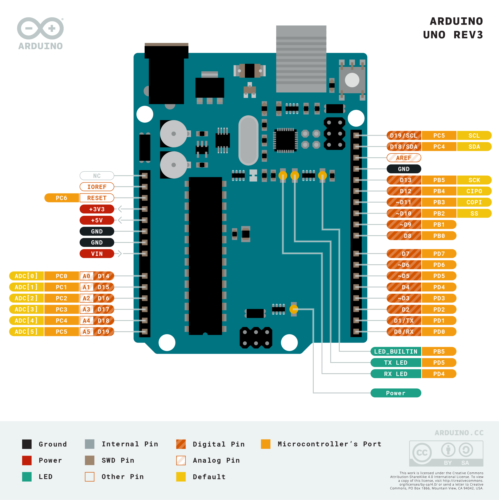
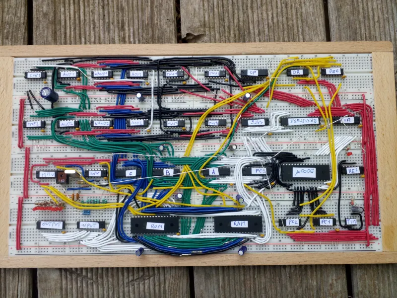
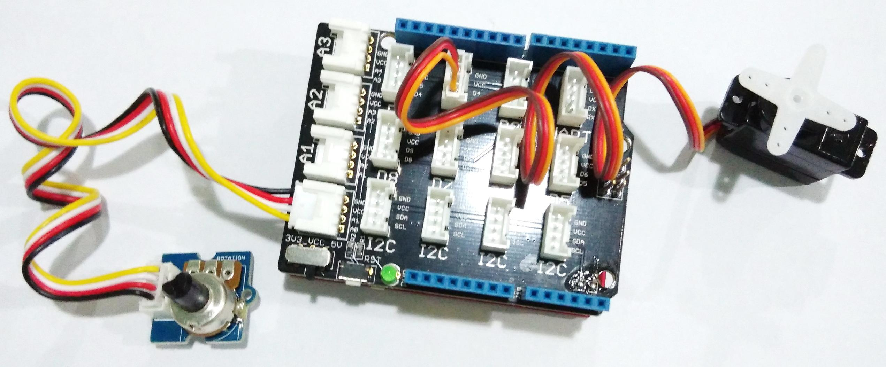
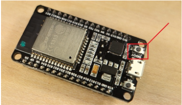

# Implementando una Cosa

## Objetivos

>* Repasar los componentes básicos de un sistema IoT
>* Explorar los componentes básicos que conforman el concepto de cosa.
>* Hacer las primeras pruebas con la placa de desarrollo ESP32
>* Investigar sobre los sistemas de desarrollo disponibles en el laboratorio.
> * To Do...

## Referencias principales

1. Lección 2 **A deeper dive into IoT** ([link](https://github.com/microsoft/IoT-For-Beginners/blob/main/1-getting-started/lessons/2-deeper-dive/README.md)) del curso de Microsoft **IoT for Beginners** [[link](https://github.com/microsoft/IoT-For-Beginners)]
2. Lección 3 **Interact with the phisycal world** ([link](https://github.com/microsoft/IoT-For-Beginners/blob/main/1-getting-started/lessons/3-sensors-and-actuators/README.md)) del curso **IoT for Beginners** ([link](https://github.com/microsoft/IoT-For-Beginners)) de Microsoft.

## Componentes basicos

Dentro del contexto de Internet of Things (IoT), una "thing" se refiere a cualquier dispositivo físico que está conectado a la red y pueda interactuar con otros dispositivos, sistemas, o servicios. 

Los componentes principales de una cosa, desde el punto de vista de Hardware, se pueden resumir en los siguientes:
1. Transductores (Sensores y actuadores)
2. Microcontroladores/Microprocesadores
3. Módulos de conectividad

Vamos a tratar estos con un poco mas de detalle.

### Sensores y actuadores

Los **transductores** son los elemetos de la **cosa** que permiten la interación del dispositivo IoT con el ambiente; son el equivalente a los sentidos los seres vivos y los perifericos en los computadores.


Por ejemplo, en la siguiente figura se muestra el diagrama de bloques de un sistema electronico que permite lanzar una alarma cuando la temperatura medida sobrepasa un valor determinado.


A continuación, se va a tratar con mayor detalle cada uno de estos.

#### Sensores

Un sensor es un tipo de transductor cuya función consiste transformar las señales del entorno (señales fisicas) en señales electricas las cuales son las entradas al sistema. La siguiente tabla, clasifica y resume algunos de los principales tipos de sensores:


Exiten diversas clasificaciones para los sensores dependiendo de diferentes criterios como: El tipo de señal ambiental sensada y el tipo de señal electrica entre otros. A continuación se tratan algunos.

**Tipos de sensores de acuerdo a la señal ambiental sensada**

Los sensores permiten medir muchas cosas, desde propiedades naturales taltes como la temperatura del aire a interacciones fisicas como el movimiento. Algunos tipos de sensores existentes son:
* **Sensores de temperatura**: Permiten medir la temperatura del aire o el medio en el cual se encuentran inmersos. A veces suelen venir cominados con sensores de humedad y presión en un mismo modulo.
  
  

* **Botones**: Permiten sensar cuando estos son presionados.
  
  
  
* **Sensores de luz**: Estos detectan niveles de luz. Tambien permiten medir distintos tipos de luz (de colores especificos, ultravioleta, infraroja o luz visible en general).
  
  

* **Acelerometros**: Permiten medir el movimiento en multiples direcciones.
  
  


* **Microfonos**: estos permiten detectar sonidos.
  
  

**Tipos de sensores de acuerdo a la señal electrica**

De acuerdo al tipo de señal electrica obtenida a la entrada, los sensores se pueden clasificar en dos tipos basicos:
* **Sensores Analógicos**: Son el tipo de sensores mas basicos que existen. Estos sensores son alimentados con voltaje (voltaje de alimentación) desde el dispositivo IoT y devolvuelven (mediante el uso de un **ADC**) a este para su lectura, un voltaje cuya variación depende de la variable medida.

   

  A continuación se muestran algunos ejemplos de este tipo de sensores:

  

* **Sensores Digitales**: Los sensores digitales detectan cambios de voltaje que solo pueden tomar dos posibles valores (**alto** y **bajo**). El tipo mas simple de sensor de este tipo es un **boton** o **switch**, el cual es un sensor con dos estados **ON** y **OFF**.
  
   

  Algunos ejemplos de este tipo de sensores, se muestran a continuación:

  

  Existen sensores digitales mas avanzados que tienen la capacidad de sensar variables analógicas gracias a que possen el hardware necesario para poder procesar la señal leida de modo tal, que pueden ser conectados directamente al dispositivo IoT. Un caso tipico de estos, consiste en los sensores de temperatura que vienen integrados con un ADC de modo que los valores analogos leidos son convertidos en señales digitales que se envian al dispositivo IoT como datos en forma serial.

  

  La siguiente figura muestra algunos tipos de estos sensores:

  

  En este tipo de sensores, el envio de los datos se realiza comunmente por medio de un protocolo serial. La siguiente lista resalta algunos de los mas comunmente usados:

  

  Dentro de los protocolos más comunmente usados para IoT se encuentran el: RS-232, I2C, el SPI y el One Wire, pero esos los veremos despues con mas detalle.

**Tipos de sensores de acuerdo a la alimentación**

Los sensores pueden clasificarse en función de las necesidades de alimentación o de energía:
* **Sensor Activo**: Requiere una fuente de alimentación para su funcionamiento. Algunos ejemplos incluyen: IMUs, LiDAR (Light detection and ranging), CCDs.
* **Sensor pasivo**: No necesitan ser alimentados para funcionar. Algunos ejemplos son: RFID tags, thermistors, y temperature dependant resistors.

> **Para profundizar** <br>
> Para conocer mas sobre la terminologia asociada a los sensores consulte el siguiente material sobre sensores ([link](https://udea-iot.github.io/UdeA_IoT-page/docs/sensores-actuadores/sensores/intro)) disponible en las notas de clase.


#### Actuadores

Los actuadores realizand la tarea opuesta a los sensores conviertiendo una señal electrica proveniente del dispositivo IoT en una señal ambiental cuyo fin es interactuar con el mundo fisico. Algunos actuadores comunes incluyen:
* **Led**: Estos emiten luz cuando son encendidos.
  
  

* **Altavoz**: Este elemento emite sonido basado en la señal que recibe, desde un buzzer basico a un parlante de audio puede ser empleado en la reproducción de musica.
  
  

* **Motor**: Este convierte una señal electrica en una rotación definida.
  
  

* **Relay**: Son swiches que pueden ser encendidos o apagados por medio de una señal electrica. Estos permiten que pequeños voltajes provenientes de dispositivos IoT puedan manejar altos voltajes.
  
  

* **Pantallas**: Son uno de los actuadores mas completos y muesntran información en un display multi.segmentos. Los displays pueden variar desde display LED sencillos a monitores de video de alta resolución.
  
  

#### **Tipos de actuadores de acuerdo a la señal electrica**

Al igual que para el caso de los sensores, el tipo de señal electrica hace que estos se clasifiquen en:
* **Actuadores analógicos**: Los actuadores analogicos toman una señal analoga y la convierten en alguna clase de interacción la cual esta basada en cambios del voltaje aplicado.
  
  

  Es importante tener en cuenta que asi como los sensores, los dispositivos IoT de la actualidad trabajan con señales digitales y no analogas; de modo que, para enviar una señal analoga, el dispositivo IoT necesita un conversor analogo digital (ADC) el cual puede estar integrado en el dispositivo IoT o adaptado a una placa externa que se conecta al dispositivo. El ADC convertira los 0s y 1s del dispositivo IoT a un voltaje analogo que el actuador pueda usar.

* **Actuadores por modulación PWM**: A diferencia del uso de **ADCs**, otra forma de conversion de señales digitales a señales analogas es por medio de la **modulación PWM** lo cual involucra enviar una tren de pulsos los caules actuan como si fueran una señal analogica cuya amplitud, depende del ancho de los pulsos del tren. Un ejemplo tipico del uso de PWM econsiste en el control de la velocidad de un motor. Para este caso a mayor ancho del pulso de la onda cuadrada, mayor velocidad en el motor.
  
  

  La siguiente figura muestra algunos casos:

  

* **Actuadores digitales**: De modo similar a los sensores digitales, los actuadores digitales, tienen dos estados que son controlados por un voltaje **alto** y uno **bajo** o tienen un ADC que les permite convertir una señal analoga en una digital. 
  
  

  Tal y como en el caso de los sensores, los actuadores digitales mas avanzados pueden involucrar protocolos de comunicación serial para la conexión con el sistem electrónico. 

  

### Microcontroladores y microprocesadores

Como se vió en la sesión anterior, los microcontroladores y los micropocesadores son el componente de la **cosa** (**thing**) encargados de la recolección y procesamiento de los datos del entorno y del desarrollo de las acciones de control.


Para realizar labores de prototipado, se disponen de los elementos listados a continuación:

|Tipo|Ejemplos|
|---|---|
|Single-board Computer|<li> Raspberry Pi 4 <li> Raspberry Pi 3 |
|Development boards|<li> Arduino UNO <li> ESP8266 <li> ESP32 <li> ESP32-CAM <li>ARDUINO NANO 33 BLE Sense Lite|

> **Para profundizar** <br>
Para conocer mas sobre estos elementos disponibles en el laboratorio consulte el siguiente [link](https://udea-iot.github.io/UdeA_IoT-page/docs/sesiones/percepcion/sesion2)

## 3. Sensores y actuadores

Mediante los sensores y los actuadores es como la cosa interactua con el entorno (ambiente). Existen numerosos kits de iniciación en el mercado. En el laboratorio se disponen de los siguientes modulos:
* Grove - Starter Kit v3
  
  

* 37 Sensor Kit - Elegoo
  
  

* Landzo 37 In 1 Sensors Kit For Arduino
  
  

> **Para profundizar** <br>
Para conocer mas sobre los sensores [link](https://udea-iot.github.io/UdeA_IoT-page/docs/sensores-actuadores/inventario-lab)

## 4. Trabajando con las placas de desarrollo a estudiar

Cuando se trabaja con un sistema de desarrollo, lo primero que hay que hacer es conocerlo. Para ello es necesario consultar la documentación de la cual este dispone como manual de usuario, datasheet, ejemplos y el diagrama de pines.

Este último es sumamente importante pues nos indicará los nombres, numeros y funciones que tendran los pines que se conectaran a los elementos externos (sensores, actuadores y/o otros sistemas de desarrollo) a los sistemas de desarrollo. 

El conocimiento de los pines es ademas importante por que constituye el punto de partida para la configuración de los puertos y modulos de software que serán empleados en la aplicación IoT en cuestión.

A continuación se muestra el diagrama de pines para el Arduino UNO y el ESP32.

* **Mapa de pines Arduino UNO**
  
  

* **Mapa de pines ESP32**

  

> **Para profundizar** <br>
Para profundizar mas consulte la información relacionada con los sistemas de desarrollo anteriores en el siguiente [link](https://udea-iot.github.io/UdeA_IoT-page/docs/sesiones/percepcion/sesion2)

## 5. Prototipado básico

Fritzing es una plataforma para plataforma permitira prototipar hardware en su computador y verificar su funcionamiento antes de hacer el montaje en fisico.


> **Importante** <br>
> Consulte la sección **Prototipado básico usando fritzing** en el siguiente [link](https://udea-iot.github.io/UdeA_IoT-page/docs/sesiones/percepcion/sesion2)

Antes de empezar, es necesario tener bien claro cuales son los requerimientos que debe cumplir el sistema electronico y proceder a determinar los componentes que haran parte del sistema en cuestión. 

Una vez hecho lo anterior, el siguiente paso cosiste en hacer un inventario de los componentes necesarios conocido como **Bill of Materials (BOM)** ([What is a Bill of Materials (BOM) in PCB Design?](https://www.seeedstudio.com/blog/2019/07/24/what-is-a-bill-of-materials-bom-in-pcb-design/)). La siguiente figura (tomada del siguiente [link](https://www.proto-electronics.com/blog/how-to-create-best-bom-for-pcb)) muestra un BOM tipico:


Con esto ya definido, es posible empezar el proceso de prototipado el cual, se puede resumir en los siguientes pasos:
1. **Diseñar el circuito**: Este procedimiento implica el diseño del esquematico (para profundizar respecto al tema acceda al sitio [How to Read a Schematic](https://learn.sparkfun.com/tutorials/how-to-read-a-schematic/)) en el cual se especifique claramente la conexión de los componentes. La siguiente figura muestra algunos simbolos de uso común:
   
   
   
   A la par que se va realizando el diseño del esquematico, se va construyendo el **BOM**, una plantilla sencilla para nuestro caso pude ser la siguiente:

   |Item #|Cantidad|Referencia|Descripción|
   |---|---|---|---|
   |1||||
   |2||||
   |...||||

2. **Realizar el montaje del circuito**: A partir del esquematico, se procede al montaje y prueba del circuito diseñado conectando los diferentes componentes en una protoboard (para mas información consulte [Breadboards for Beginners](https://learn.adafruit.com/breadboards-for-beginners)).
   
   

3. **Diseñar el PCB del prototipo**: Una vez que el diseño es probado y se determina que funciona de acuerdo a las especificaciones, se procede a diseñar el circuito impreso del diseño. Para ello se pueden usar programas de diseño PCB como KiCad o Eagle.
   
   

> **Importante** <br>
El último paso esta fuera del alcance de este curso por lo que no se hará a paso.

En la siguiente figura (tomada de [How to read a schematic](https://learn.sparkfun.com/tutorials/how-to-read-a-schematic) de Sparkfun) muestra algunos de los principales simbolos usados en esqumeticos:


### Ejemplo

El siguiente ejemplo se resume el procedimiento anterior haciendo enfasis en los pasos 1 y 2. Para esto suponga que se desea diseñar un circuito que permita encender y apagar un del usando un interruptor.

|Item #|Cantidad|Referencia|Descripción|
|---|---|---|---|
|1|1|LED1|Led rojo|
|2|1|R1|Resistencia de $1k\Omega$|

1. **Diseñar el circuito**: A continuación se muestra el esquematico:
   
   

2. **Realizar el montaje**: Antes de montar el circuito en una protoboard, se usará Fritzing para esto:
   
   
   
   Es importante notar, que en la figura anterior, se mostraron dos posibles conexiones del mismo circuito, la idea es resaltar que para el mismo esquematico pueden existir diferentes montajes de modo que, mas alla del montaje que se haga, lo realmente importante es que las conexiones de los compotentes sea la correcta.
   
   Finalmente, se procede a realizar el montaje fisico tal y como se muestra en la siguiente figura:

   

Con el objetivo de afianzar el procedimiento anterior, lo invitamos a que desarrolle los siguientes dos ejercicios.

### Ejercicio 1

A continuación se muestra un circuito que permite variar la intensidad de un led a traves de un potenciometro conectado a un arduino. La lista de componentes se muestra en el siguiente BOM:

|Item #|Cantidad|Referencia|Descripción|
|---|---|---|---|
|1|1|LED1|Arduino Uno R3|
|2|1|R1|Potenciometro de $10k\Omega$|
|3|1|R2|Resistencia de $270\Omega$|
|4|1|D1|LED|

El esquemático se muestra a continuación:


Realizar las siguientes tareas:
1. Realice el montaje en fritzing y guardelo como **variable_led_flash.fzz**. Luego, genere las imagenes asociadas al esquematico y al montaje.
2. El programa que se descarga en el Arduino UNO, se muestra a continuació:
   
   ```c++
   const int voltsInPin = A3;
   const int ledPin = 9;

   void setup() {
     pinMode(ledPin, OUTPUT);
   }
   void loop() {
     int rawReading = analogRead(voltsInPin);
     int period = map(rawReading, 0, 1023, 100, 500);
     digitalWrite(ledPin, HIGH);
     delay(period);
     digitalWrite(ledPin, LOW);
     delay(period);
   }
   ```

3. Empleando Tinkercad (https://tinkercad.com/), realice el montaje, escriba el código para simular y proceda a realizar la simulación. Luego, haga publico el link de simulación para compartir su trabajo con la comunidad.

### Ejercicio 2

El siguiente sistema muestra un generador de tonos sencillo. La lista de componentes se muestra a continuación:

|Item #|Cantidad|Referencia|Descripción|
|---|---|---|---|
|1|1|LED1|Arduino Uno R3|
|2|2|S1, S2|Pulsadores|
|3|1|Sounder|Buzzer pasivo|

El esquemático se muestra a continuación:


Realizar las siguientes tareas:
1. Realice el montaje en fritzing y guardelo como **sounds.fzz**. Luego, genere las imagenes asociadas al esquematico y al montaje.
2. El programa que se descarga en el Arduino UNO, se muestra a continuació:
   
   ```c++
   const int sw1pin = 6;
   const int sw2pin = 7;
   const int soundPin = 8;

   void setup() {
     pinMode(sw1pin, INPUT_PULLUP);
     pinMode(sw2pin, INPUT_PULLUP);
     pinMode(soundPin, OUTPUT);
   }
   void loop() {
     if (!digitalRead(sw1pin)) {
       tone(soundPin, 220);
     }
     else if (!digitalRead(sw2pin)) {
       tone(soundPin, 300);
     }
     else {
       noTone(soundPin);
     }
   }
   ```

3. Empleando Tinkercad (https://tinkercad.com/), realice el montaje, escriba el código para simular y proceda a realizar la simulación. Luego, haga publico el link de simulación para compartir su trabajo con la comunidad.

## 7. Tarjetas de expación y modulos

El proceso de prototipado usando protoboard depende de la complejidad del circuito y de los componentes disponible y en el peor de los casos, puede ser sumamente completo (imagen tomada de **BREADBIN IS AN 8-BIT TTL CPU ON A BREADBOARD, IN A BREAD BIN** ([link](https://hackaday.com/2021/10/05/breadbin-is-an-8-bit-ttl-cpu-on-a-breadboard-in-a-bread-bin/))):



Afortunadamente, para ahorrar trabajo como este existen las **tarjetas de expación** o **shields** los cuales permiten conectar de manera externa componentes y modulos externos sin necesidad de usar la protoboard. Por ejemplo, la **Base Shield V2** ([link](https://wiki.seeedstudio.com/Base_Shield_V2/)):


Por otro lado un **modulo externo**, consiste de uno o varios componentes de hardware con todas las conexiónes y elementos necesarios para realizar la conexión directa de los componentes a los puertos de una placa de desarrollo o una tarjeta de expansión, sin necesidad de hacer uso de hardware de acondicionamiento adicional. En resumenn, el uso de un modulo externo hace que la conexión de un componente pase a ser practicamente **plug & play** ahorrandonos el uso de protoboard y alambrado adicional. La siguiente figura muestra un ejemplo donde se usa hardware externo.



En la sección 3, se mostraron algunos de los modulos **plug & play** disponibles en el aboratorio, estos se caracterizan por ser modulos de iniciación ya que la complejidad de los componentes no es mayor. Sin embargo existen modulos mas expecializados como GPS, transeptores, modulos inalambricos y sensores y actuadores de mayor presición y potencia disponibles. 

> **Importante** <br>
Usar modulos y targetas de expanción facilita el prototipado ahorrando la etapa 3 del proceso presentado en la sección 5.

Existen una gran cantidad de fabricantes de modulos y tarjetas de expación, a continuación se listan algunos:

|Fabricante|Link|
|---|---|
|Adafruit Industries|	https://www.adafruit.com/|
|SparkFun Electronics|	https://www.sparkfun.com/|
|dfrobot|	https://www.dfrobot.com/|
|Seeeed Studio|	https://www.seeedstudio.com/|
|Elegoo| https://www.elegoo.com/|
|sunfounde|https://www.sunfounder.com/|
|robotistan|https://www.robotistan.com/|
|osoyoo|https://osoyoo.com/|
|thingpulse|https://thingpulse.com/
|keyestudio|https://www.keyestudio.com/|
|Arduino|https://store-usa.arduino.cc/products/|

## 8. Interacción con el entorno

Los **transductores** son los elemtos del sistema que permiten la interación del dispositivo IoT con el ambiente; son el equivalente a los sentidos los seres vivos y los perifericos en los computadores.


Por ejemplo, en la siguiente figura se muestra el diagrama de bloques de un sistema electronico que permite lanzar una alarma cuando la temperatura medida sobrepasa un valor determinado.


### Sensores

Un sensor es un tipo de transductor cuya función consiste transformar las señales del entorno (señales fisicas) en señales electricas las cuales son las entradas al sistema. La siguiente tabla, clasifica y resume algunos de los principales tipos de sensores:


Exiten diversas clasificaciones para los sensores dependiendo de diferentes criterios como: El tipo de señal ambiental sensada y el tipo de señal electrica entre otros. A continuación se tratan algunos.

#### **Tipos de sensores de acuerdo a la señal ambiental sensada**

Los sensores permiten medir muchas cosas, desde propiedades naturales taltes como la temperatura del aire a interacciones fisicas como el movimiento. Algunos tipos de sensores existentes son:
* **Sensores de temperatura**: Permiten medir la temperatura del aire o el medio en el cual se encuentran inmersos. A veces suelen venir cominados con sensores de humedad y presión en un mismo modulo.
* **Botones**: Permiten sensar cuando estos son presionados.
* **Sensores de luz**: Estos detectan niveles de luz. Tambien permiten medir distintos tipos de luz (de colores especificos, ultravioleta, infraroja o luz visible en general).
* **Acelerometros**: Permiten medir el movimiento en multiples direcciones.
* **Microfonos**: estos permiten detectar sonidos.

#### **Tipos de sensores de acuerdo a la señal electrica**

De acuerdo al tipo de señal electrica obtenida a la entrada, los sensores se pueden clasificar en dos tipos basicos:
* **Sensores Analógicos**: Son el tipo de sensores mas basicos que existen. Estos sensores son alimentados con voltaje (voltaje de alimentación) desde el dispositivo IoT y devolvuelven (mediante el uso de un **ADC**) a este para su lectura, un voltaje cuya variación depende de la variable medida.

   

* **Sensores Digitales**: Los sensores digitales detectan cambios de voltaje que solo pueden tomar dos posibles valores (**alto** y **bajo**). El tipo mas simple de sensor de este tipo es un **boton** o **switch**, el cual es un sensor con dos estados **ON** y **OFF**.
  

   

  Existen sensores digitales mas avanzados que tienen la capacidad de sensar variables analógicas gracias a que possen el hardware necesario para poder procesar la señal leida de modo tal, que pueden ser conectados directamente al dispositivo IoT. Un caso tipico de estos, consiste en los sensores de temperatura que vienen integrados con un ADC de modo que los valores analogos leidos son convertidos en señales digitales que se envian al dispositivo IoT como datos en forma serial.

  

  En este tipo de sensores, el envio de los datos se realiza comunmente por medio de un protocolo serial. La siguiente lista resalta algunos de los mas comunmente usados:

  

  Dentro de los protocolos más comunmente usados para IoT se encuentran el: RS-232, I2C, el SPI y el One Wire, pero esos los veremos despues con mas detalle.

#### **Tipos de sensores de acuerdo a la alimentación**

Los sensores pueden clasificarse en función de las necesidades de alimentación o de energía:
* **Sensor Activo**: Requiere una fuente de alimentación para su funcionamiento. Algunos ejemplos incluyen: IMUs, LiDAR (Light detection and ranging), CCDs.
* **Sensor pasivo**: No necesitan ser alimentados para funcionar. Algunos ejemplos son: RFID tags, thermistors, y temperature dependant resistors.

> **Para profundizar** <br>
> Para conocer mas sobre la terminologia asociada a los sensores consulte el siguiente material sobre sensores ([link](https://udea-iot.github.io/UdeA_IoT-page/docs/sensores-actuadores/sensores/intro)) disponible en las notas de clase.

### Actuadores

Los actuadores realizand la tarea opuesta a los sensores conviertiendo una señal electrica proveniente del dispositivo IoT en una señal ambiental cuyo fin es interactuar con el mundo fisico. Algunos actuadores comunes incluyen:
* **Led**: Estos emiten luz cuando son encendidos.
Alatavoz: Este elemento emite sonido basado en la señal que recibe, desde un buzzer basico a un parlante de audio puede ser empleado en la reproducción de musica.
* **Motor paso a paso**: Este convierte una señal en una rotación definida.
* **Relay**: Son swiches que pueden ser encendidos o apagados por medio de una señal electrica. Estos permiten que pequeños voltajes provenientes de dispositivos IoT puedan manejar altos voltajes.
* **Pantallas**: Son uno de los actuadores mas completos y muesntran información en un display multi.segmentos. Los displays pueden variar desde display LED sencillos a monitores de video de alta resolución.

Al igual que los sensores los actuadores tambien se pueden clasificar de acuerdo a diferentes criterios, en nuestro caso solo nos limitaremos al caso en el cual la clasificación se hace dependiendo de la señal electrica manejada.

#### **Tipos de actuadores de acuerdo a la señal electrica**

Al igual que para el caso de los sensores, el tipo de señal electrica hace que estos se clasifiquen en:
* **Actuadores analógicos**: Los actuadores analogicos toman una señal analoga y la convierten en alguna clase de interacción la cual esta basada en cambios del voltaje aplicado.
  
  

  Es importante tener en cuenta que asi como los sensores, los dispositivos IoT de la actualidad trabajan con señales digitales y no analogas; de modo que, para enviar una señal analoga, el dispositivo IoT necesita un conversor analogo digital (ADC) el cual puede estar integrado en el dispositivo IoT o adaptado a una placa externa que se conecta al dispositivo. El ADC convertira los 0s y 1s del dispositivo IoT a un voltaje analogo que el actuador pueda usar.

* **Actuadores por modulación PWM**: A diferencia del uso de **ADCs**, otra forma de conversion de señales digitales a señales analogas es por medio de la **modulación PWM** lo cual involucra enviar una tren de pulsos los caules actuan como si fueran una señal analogica cuya amplitud, depende del ancho de los pulsos del tren. Un ejemplo tipico del uso de PWM econsiste en el control de la velocidad de un motor. Para este caso a mayor ancho del pulso de la onda cuadrada, mayor velocidad en el motor.
  
  

* **Actuadores digitales**: De modo similar a los sensores digitales, los actuadores digitales, tienen dos estados que son controlados por un voltaje **alto** y uno **bajo** o tienen un ADC que les permite convertir una señal analoga en una digital. 
  
  

  Tal y como en el caso de los sensores, los actuadores digitales mas avanzados pueden involucrar protocolos de comunicación serial para la conexión con el sistem electrónico. 

## 8. Arduino Framework 

Cuando hablamos de Arduino nos referimos al framework para microcontroladores mas popular en la actualidad.

Arduino es una plataforma opensource de electronica que combina software y hardware. Al ser esta plataforma open hardware, es posible usar el modelo de programación de Arduino para escribir codigo para cualquier otra plataforma compatible con Arduino (placas genericas o de otroa fabricantes).

El modelo de programación de arduino esta basado en el **API de Arduino** el cual espone un conjunto de funciónes y estructuras (constantes, variables, tipos de datos, objetos, etc) que permiten la interacción del microcontrolador con hardware externo (sensores y actuadores). La información del API se encuentra en la pagina Language Reference ([link](https://www.arduino.cc/reference/en/)).


Antes de empezar se recomienda que tenga a la mano el documento  **Arduino Cheat Sheet** ([link](https://github.com/UdeA-IoT/reference-sheets/blob/main/percepcion/arduino/Arduino_Cheat_Sheet.pdf)) de Sparkfun.

## 9. Desarrollo básico de aplicaciónes usando las placas base

Desarrollar aplicación implica combinar conocimientos de hardware y software. En lo que respecta al primero, en nuestro caso lo fundamental es tener un conocimiento claro de las capacidades de la placa a emplear y del diagrama de pines (para mas información consulte el siguiente. En lo que respecta al software, el conocimiento implica un conocimiento del lenguaje C++ (para nuestro caso) y del modelo de programación del Framework de Arduino.

> **Para profundizar** <br>
> Puede consultar las notas de clase donde se encuentra un resumen de las funciones mas comunes del API de Arduino en el siguiente [link](https://udea-iot.github.io/UdeA_IoT-page/docs/sesiones/percepcion/sesion3)

### Caso para el ESP32

De todos las placas existentes, se va a hacer uso de la ESP32 ([datasheet](https://cdn.sparkfun.com/datasheets/IoT/esp32_datasheet_en.pdf)). De las diferentes diferentes plataformas de desarrollo para ESP32 existentes se dispone de la placa NodeMCU-32S de Ai-Thinker ([Nodemcu-32s Datasheet](https://docs.ai-thinker.com/_media/esp32/docs/nodemcu-32s_product_specification.pdf))


Para empezar, lo que primero debemos tener a la mano es el diagrama de pines de la tarjera el cual, se muestra a continuación:


Una vez se tiene claridad en esto, se procede a realizar los siguientes pasos con el fin de programar la placa:
1. Identificar claramente los pines de la placa de desarrollo que seran impleados para la conexión de dispositivos externos (sensores, actuadores, etc.). Hecho esto proceder a realizar la conexión de los componentes.
2. Proceder a programar la placa empleando el modelo de programación de Arduino (o cualquier otro). Para ello use el IDE que mejor le parezca ya sea el **Arduino IDE** o la extención **Platformio**.
3. Mediante el IDE, compilar y descargar el programa en la placa de desarrollo.
4. Probar que el sistema IoT funcione de acuerdo a los requisitos definidos en la etapa de analisis y diseño.

A continuación se va a mostrar el procedimiento anterior mediante algunos ejemplos.

### Ejemplo 1

En el **ejercicio 1** se mostró un sistema de sistema de parpadeo manual usando el Arduino UNO:


El código originalmente implementado, se muestra a continuación:

```C++
const int voltsInPin = A3;
const int ledPin = 9;

void setup() {
  pinMode(ledPin, OUTPUT);
}
void loop() {
  int rawReading = analogRead(voltsInPin);
  int period = map(rawReading, 0, 1023, 100, 500);
  digitalWrite(ledPin, HIGH);
  delay(period);
  digitalWrite(ledPin, LOW);
  delay(period);
}
```

Reimplemente el sistema anterior empleando el ESP32 yusando los módulos descritos en la siguiente lista de materiales:

|Item #|Cantidad|Referencia|Descripción|Información|Observaciones|
|---|---|---|---|---|---|
|1|1|LED1|ESP32|||
|2|1|R1|Potenciometro de $10k\Omega$|Grove - Rotary Angle Sensor ([link](https://wiki.seeedstudio.com/Grove-Rotary_Angle_Sensor/))|Este modulo hace parte del Grove - Starter Kit v3 ([link](https://wiki.seeedstudio.com/Grove_Starter_Kit_v3/))|
|3|1|R2|Resistencia de $1k\Omega$|Grove - Red LED ([link](https://wiki.seeedstudio.com/Grove-Red_LED/))|Este modulo hace parte del Grove - Starter Kit v3 ([link](https://wiki.seeedstudio.com/Grove_Starter_Kit_v3/))|

**Actividades**:
- [ ] Usando Fritzing realizar el esquemático y la conexión de los componentes.
- [ ] Reescriba la parte del programa para hacer que este funcione para el ESP32.
- [ ] Simule el sistema usando el [wokwi](https://wokwi.com/)
- [ ] Si la simulación es correcta, realice la conexión fisica del sistema empleando los componentes de la tabla anterior.
- [ ] Codifique, compile y descargue el programa en el ESP32 teniendo en cuenta que el resultado del montaje real coincide con el de la simulación.
  - [ ] Realice este proceso usando el Arduino IDE (Ver la sección de ejemplos introductorios para el ESP32 siguiendo el siguiente [link](https://udea-iot.github.io/UdeA_IoT-page/docs/sesiones/percepcion/sesion3))
  - [ ] Realice este proceso usando el Platformio (Siga los pasos mostrados en el ejemplo 2 de la sesión 4 [link](https://udea-iot.github.io/UdeA_IoT-page/docs/sesiones/percepcion/sesion4c))

## I/O básico en el ESP32

Inicialmente, vamos a explorar el API de Arduino para manejar entradas y salidas analogas y digitales básicas. Como punto de partida se tiene que tener claro los pines que se van a usar y, como estos son multifuncionales, tener claridad en las funciones que estos soportan. Para esto es necesario consultar en el datasheet de la placa el diagrama de pines y las funciones que estos pueden llevar a cabo. A continuación, por comodidad volvemos a mostrar el mapa de pines para la ESP32 disponible en el laboratorio:


La siguiente tabla muestra los pines de la placa clasificados según la funcionalidad:

|Tipo |	Notación pines (placa)|
|---|---|
|Digital (Only input)|`P34 [GPIO34]`, `P35 [GPIO35]`, `SVP [GPIO36]`, `SVN [GPIO39]`|
|Analog in|`SVP [GPIO36]`, `SVN [GPIO39]`, `P35 [GPIO 35]`, `P34 [GPIO34]`, `P32 [GPIO32]`, `P33 [GPIO 33]`, `P25 [GPIO25]`, `P26 [GPIO26]`, `P27 [GPIO27]`, `P14 [GPIO14]`, `P12 [GPIO12]`, `P13 [GPIO13]`, `P15 [GPIO15]`, `P2 [GPIO2]`, `P0 [GPIO0]`, `P4 [GPIO4]`|
|PWM|`SVP [GPIO36]`, `SVN [GPIO39]`, `P35 [GPIO 35]`, `P34 [GPIO 34]`, `P32 [GPIO 32]`, `P33 [GPIO 33]`, `P25 [GPIO25]`, `P26 [GPIO26]`, `P27 [GPIO27]`, `P14 [GPIO14]`, `P12 [GPIO12]`, `P13 [GPIO13]`, `P15 [GPIO15]`, `P2 [GPIO2]`, `P0 [GPIO0]`, `P4 [GPIO4]`|
|Serial (UART)|`Tx [GPI1]`, `Rx [GPI3]`, `D8 [TXD2]`, `D7 [RXD2]`|
|I2C|`P22 [GPI22/SCL]`, `P21 [GPI21/SDA]`|
|Digital SPI|`P23 [MOSI]`, `P19 [MISO]`, `P18 [SCK]`, `P5 [SS]`|
|Flash SPI|`CLK [GPIO6/FLASHCLK]`, `SD0 [GPIO7/FLASHD0]`, `SD1 [GPIO7/FLASHD1]`, `CMD [GPIO7/FLASHCMD]`, `SD2 [GPIO9/FLASHD2]`, `SD3 [GPIO9/FLASHD3]`|
|Capacitive touch|`P0 [GPIO4]/TOUCH1`, `P4 [GPIO0]/TOUCH0`, `P2 [GPIO2/TOUCH2]`, `P15 [GPIO15/TOUCH3]`, `P13 [GPIO13/TOUCH4]`, `P12 [GPIO12/TOUCH5]`, `P14 [GPIO14/TOUCH6]`, `P27 [GPIO7/TOUCH7]`|

Una vez, se tiene claro que pines usar, el siguiente paso es determinar las funciones del API de Arduino ([link](https://www.arduino.cc/reference/en/)) que nos sirven para configurarlos y controlarlos. A continuación, se listan algunas de las más comunmente usadas.

> **Para profundizar mas** </br> Para tener mas claridad al respecto, remitase a la pagina **ESP32 Pinout Reference: Which GPIO pins should you use?** ([link](https://randomnerdtutorials.com/esp32-pinout-reference-gpios/
))

### Digital I/O

|Función|Sintaxis|Descripción|
|---|---|---|
|[`pinMode()`](https://www.arduino.cc/reference/en/language/functions/digital-io/pinmode/)|`pinMode(pin, mode)`|Configura el pin especificado en el parametro `pin` como entrada o salida. La configuración como entrada se hace cuando el valor del parametro `mode` es `INPUT` y como salida cuando es `OUTPUT`. Cuando un puerto determinado posee una resistencia de pull-up interna, este puede ser como entrada haciendo usao de esta resistencia haciendo que `mode` sea `INPUT_PULLUP` |
|[`digitalWrite()`](https://www.arduino.cc/reference/en/language/functions/digital-io/digitalwrite/)|`digitalWrite(pin)`|Escribe un `HIGH` o `LOW` en el `pin` espeficicado|
|[`digitalRead()`](https://www.arduino.cc/reference/en/language/functions/digital-io/digitalread/)|`int digitalRead(pin)`|Lee el valor del digital del `pin` especificado, el valor retornado puede ser `HIGH` o `LOW`|

### Analog I/O

|Función|Sintaxis|Descripción|
|---|---|---|
|[`analogRead()`](https://www.arduino.cc/reference/en/language/functions/analog-io/analogread/)|`analogRead(pin)`|Lee el valor de un pin ánalogo. El valor leido depende de la resolución (numero de bits) del conversor analogo digital del pin elegido.|
|[`analogWrite()`](https://www.arduino.cc/reference/en/language/functions/analog-io/analogwrite/)|`analogWrite(pin, value)`|Escribe un valor analogo ([señal PWM](https://docs.arduino.cc/learn/microcontrollers/analog-output/)) en el pin. El valor del ciclo de dureza de la señal PWM (`value`) es un valor entre `0` y `255`.|

### Tiempo

|Función|Sintaxis|Descripción|
|---|---|---|
|[`delay()`](https://www.arduino.cc/reference/en/language/functions/time/delay/)|`delay(ms)`|Detiene el programa la cantidad de tiempo (en milisegundos) especificada por el parametro (`ms`)|
|[`delayMicroseconds()`](https://www.arduino.cc/reference/en/language/functions/time/delaymicroseconds/)|`delayMicroseconds(us)`|Pausa el programa la cantidad de tiempo (en microsegundos) especificada por el parametro (`us`)|
|[`millis()`](https://www.arduino.cc/reference/en/language/functions/time/millis/)|`time = millis()`|Devuelve la cantidad de milisegundos que pasan desde que el placa empieza la ejecución del programa.|
|[`micros()`](https://www.arduino.cc/reference/en/language/functions/time/micros/)|`time = micros()`|Obtiene el numero de microsegundos que han pasado desde que el placa empieza la ejecución del programa.|

## Descarga de aplicaciones en la placa base

Antes de empezar, tenga a la mano, el diagrama de pines del NodeMCU (dada la importantci de esto, se lo volvemos a mostrar, disculpenos por cansones):


Luego, dependiendo de los requerimientos del sistema determine con claridad los pines a emplear y el funcionamiento que estos tendran. Luego, proceda a codificar el programa y realice las conexiones del montaje y, finalmente, proceda a compilar y a descargar el firmware en la placa usando el IDE apropiado.  En nuestro caso hablaremos de los dos mas empleados:
* Arduino IDE
* Platformio (extención de VS Code)

### Arduino IDE

Inicialmente, configure el IDE para que pueda soportar las tarjetas ESP32 siguiento los pasos descritor en la pagina **Installing the ESP32 Board in Arduino IDE (Windows, Mac OS X, Linux)** ([link](https://randomnerdtutorials.com/installing-the-esp32-board-in-arduino-ide-windows-instructions/)).

Luego, lleve a cabo el procedimiento normal para descargar el firmware como sucede con cualquier placa de la marca Arduino. Para ello siga los siguientes pasos:
1. Elija la placa de desarrollo ESP de la lista de placas disponibles en el IDE. En nuestro caso la placa **NodeMCU-32s** es la que elegimos (pues es la que está disponible en el laboratorio):
   
   

2. Teniendo en cuenta el montaje realizado, codifique el programa para la plataforma elegida. Como el **ESP32** es compatible con Arduino la documentación se encuentra en **Arduino-ESP32** ([link](https://espressif-docs.readthedocs-hosted.com/projects/arduino-esp32/en/latest/))

3. Descargue el programa en la placa:
   
   

   Si todo esta bien, se deberia ver el mensaje **"Done uploading"** en el log que indique que el proceso fue exitoso.

   > **Importante** </br> Tenga en cuenta que antes de empezar la descarga del programa debe presionar el botón boot de la placa del ESP32 y liberarlo cuando salga el mensaje **"Connecting..."** en el IDE de Arduino. (Para más información ver la sección Troubleshooting en el siguiente [link](https://randomnerdtutorials.com/installing-the-esp32-board-in-arduino-ide-windows-instructions/)) </br></br>


### Platformio

[Platformio](https://platformio.org/) es una extención del VS Code que permite programar y realizar pruebas sobre placas de desarrollo como la ESP32. A continuación, se describe el proceso para codificar y descargar el firmware usando este complemento.
1. Iniciar Platformio
   
   
   
   Si todo esta bien aparecera:

   

2. Crear nuevo proyecto:
   
   

3. Seleccionar la plataforma y el lugar donde estara el proyecto.
   
   
   
   Si todo esta bien el resultado sera como el siguiente:
   
   

4. Abrir el archivo **main.cpp** y editarlo:
   
   

5. Seleccionar el botón para subir el codigo a la tarjeta:
   
   

   Luego se procede a subir el codigo dando click en el botón de upload (**flecha**):

   

6. Ensayar el funcionamiento. En la imagen mostrada a continuación se muestra la salida en el monitor serial cuando se emplea comunicación serial en la placa:
   
   

## Ejemplos introductorios

En el siguiente [link](ejemplos_GPIO/README.md) se muestran algunos escenarios de uso donde se usan las funciones anteriormente descritas. El objetivo con estos es que se entrene en el procedimiento, previamente mostrado, para descargar firmware en la tarjeta.

## Recursos para ir mas lejos

Explore los siguientes citios para que vaya teniendo una idea de lo que se puede hacer:
* https://randomnerdtutorials.com/
* https://www.adafruit.com/
* https://www.sparkfun.com/
* https://www.seeedstudio.com/
* https://www.luisllamas.es/
* https://www.hackster.io/
* https://hackaday.com/
* https://projecthub.arduino.cc/
* https://makezine.com/
* https://make.co/
* https://es.ubidots.com/
* https://www.wildernesslabs.co/


## Referencias

* https://how2electronics.com/10-essential-iot-starter-kits-to-kickstart-your-journey/
* https://github.com/UdeA-IoT/actividad-4
* https://udea-iot.github.io/UdeA_IoT-page/docs/sensores-actuadores/sensores/intro
* https://gist.github.com/lyqht
* https://github.com/microsoft/IoT-For-Beginners
* https://github.com/microsoft/ML-For-Beginners
* https://github.com/microsoft/Web-Dev-For-Beginners
* https://github.com/microsoft/ai-for-beginners
* https://github.com/microsoft/Data-Science-For-Beginners