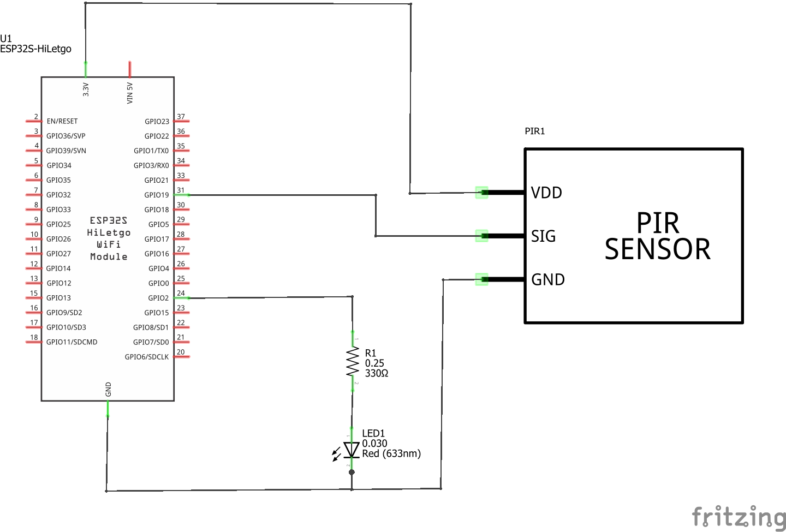
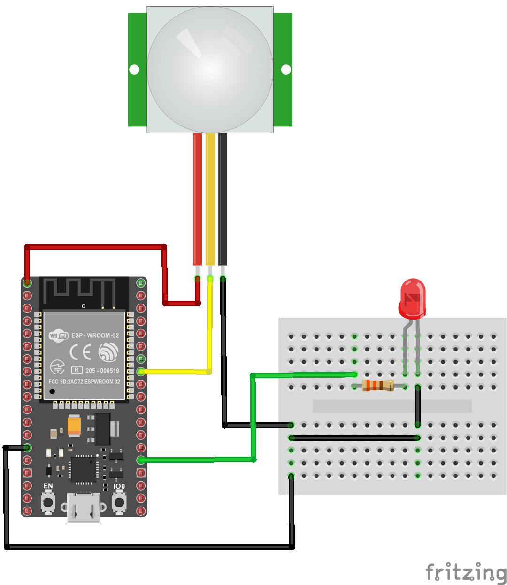
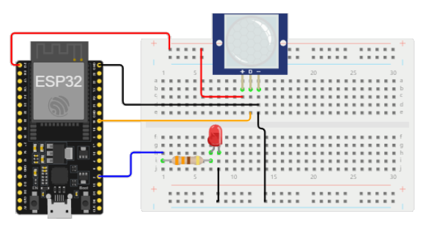

# Ejemplo 1 - Sensor PIR y ESP32

## Descripción

Activar un led cuando se detecte presencia a traves del uso de un sensor PIR. 

> **Para profundizar** </br> Para conocer mas sobre los sensores PIR puede consultar el siguiente [link](https://learn.adafruit.com/pir-passive-infrared-proximity-motion-sensor)

## Hardware

La siguiente tabla muestra los componentes principales del circuito a montar:


| Item # | Cantidad | Descripción    | Información |
| ------ | -------- | -------------- | ----------- |
| 1      | 1        | ESP32          | N/A         |
| 2      | 1        | HC-SR501 PIR MOTION SENSOR | Elegoo 37 SENSOR KIT|

### Esquematico

<p align="center">
  
</p>

### Conexión entre los componentes

A continuación se muestra la conexión entre los componentes:

<p align="center">
  
</p>

## Software

### Código

El código fue adaptado del siguiente [link](https://learn.adafruit.com/pir-passive-infrared-proximity-motion-sensor/using-a-pir-w-arduino)

```C++
/*
 * PIR sensor tester
 */
 
int ledPin = 13;                // choose the pin for the LED
int inputPin = 2;               // choose the input pin (for PIR sensor)
int pirState = LOW;             // we start, assuming no motion detected
int val = 0;                    // variable for reading the pin status
 
void setup() {
  pinMode(ledPin, OUTPUT);      // declare LED as output
  pinMode(inputPin, INPUT);     // declare sensor as input
 
  Serial.begin(9600);
}
 
void loop() {
  val = digitalRead(inputPin);  // read input value
  if (val == HIGH) {            // check if the input is HIGH
    digitalWrite(ledPin, HIGH);  // turn LED ON
    if (pirState == LOW) {
      // we have just turned on
      Serial.println("Motion detected!");
      // We only want to print on the output change, not state
      pirState = HIGH;
    }
  } else {
    digitalWrite(ledPin, LOW); // turn LED OFF
    if (pirState == HIGH){
      // we have just turned of
      Serial.println("Motion ended!");
      // We only want to print on the output change, not state
      pirState = LOW;
    }
  }
}
```

## Simulación

### Wokwi - Simulación

Para comprender el funcionamiento del programa, puede seguir el siguiente [link](https://wokwi.com/projects/391364172928279553)

<p align="center">
  
</p>

## Referencias

* https://github.com/adafruit/Adafruit_Sensor
* https://github.com/adafruit/Adafruit-Fingerprint-Sensor-Library
* https://github.com/adafruit/Adafruit_SensorLab
* https://github.com/adafruit/Adafruit_SensorLab
* https://github.com/RobTillaart/PIR
* https://registry.platformio.org/libraries/adafruit/Adafruit%20Sensor%20Lab