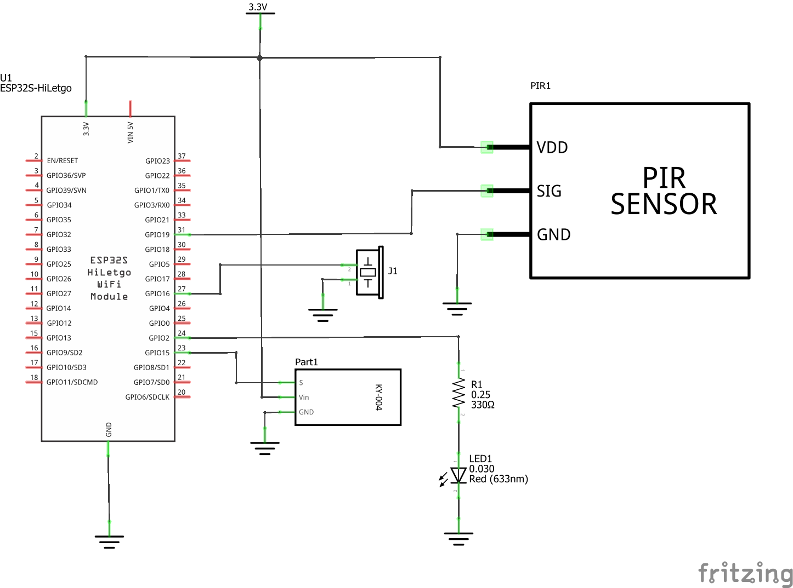

# Ejemplo 2 - Sensor PIR y ESP32

## Descripción

Activar un led cuando se detecte presencia a traves del uso de un sensor PIR. Ademas de la señal luminosa que empleada para indicar la presencia, el sistema contara con un buzzer para generar una alarma sonora. Esta alarma sonora se podrá desactivar o activar por medio de un pulsador.

## Hardware

La siguiente tabla muestra los componentes principales del circuito a montar:


| Item # | Cantidad | Descripción    | Información |
| ------ | -------- | -------------- | ----------- |
| 1      | 1        | ESP32          | N/A         |
| 2      | 1        | HC-SR501 PIR Sensor | Elegoo 37 SENSOR KIT|
| 3      | 1        | Button Switch Module | Elegoo 37 SENSOR KIT|
| 4      | 1        | Passive Buzzer Module | Elegoo 37 SENSOR KIT|

### Esquematico

<p align="center">
  
</p>

### Conexión entre los componentes

A continuación se muestra la conexión entre los componentes:

<p align="center">
  
</p>

## Software

### Código

```C++
/*
 * PIR sensor tester
 */

// Pines
const int buttonPin = 15;            // the number of the pushbutton pin
const int ledPin = 2;                // choose the pin for the LED
const int inputPin = 19;             // choose the input pin (for PIR sensor)
const int buzzerPin = 16;            // the number of the buzzer pin

// Variables
// Button
int buttonState;            // the current reading from the input pin
int lastButtonState = LOW;  // the previous reading from the input pin
// PIR
int pirState = LOW;             // we start, assuming no motion detected
int val = 0;                    // variable for reading the pin status
// Buzzer
int buzzerState = LOW;        // the current state of the output pin
int freq = 2000;
int channel = 0;
int resolution = 8;


// Time variables
unsigned long lastDebounceTime = 0;  // the last time the output pin was toggled
unsigned long debounceDelay = 50;    // the debounce time; increase if the output flickers

void setup() {
  // Init ports
  pinMode(ledPin, OUTPUT);      // declare LED as output
  pinMode(ledPin, OUTPUT);      // declare LED as output
  pinMode(inputPin, INPUT);     // declare sensor as input
  pinMode(buttonPin, INPUT);    // declare button as output
  // Init pwm (buzzer)
  ledcSetup(channel, freq, resolution);
  ledcAttachPin(buzzerPin, channel);

  // Init serial
  Serial.begin(9600);
}
 
void loop() {
  // ----- Read push button code -----
  int reading = digitalRead(buttonPin);

  if (reading != lastButtonState) {
    // reset the debouncing timer
    lastDebounceTime = millis();
  }

  if ((millis() - lastDebounceTime) > debounceDelay) {
    // whatever the reading is at, it's been there for longer than the debounce
    // delay, so take it as the actual current state:

    // if the button state has changed:
    if (reading != buttonState) {
      buttonState = reading;

      // only toggle the LED if the new button state is HIGH
      if (buttonState == HIGH) {
        buzzerState = !buzzerState;
        Serial.print("Buzzer: ");
        ledcWriteTone(channel, 0);
        if (buzzerState == HIGH) { 
          Serial.println("Enable");
        }
        else {
          Serial.println("Disable");
        }
      }
    }
  }

  // Read PIR sensor
  val = digitalRead(inputPin);  // read input value
  if (val == HIGH) {            // check if the input is HIGH
    digitalWrite(ledPin, HIGH);  // turn LED ON

    if (pirState == LOW) {
      // we have just turned on
      Serial.println("Motion detected!");
      // We only want to print on the output change, not state
      pirState = HIGH;
      // Buzer
      if (buzzerState == HIGH) {
        ledcWriteTone(channel, 300);
      }      
    }
  } else {
    digitalWrite(ledPin, LOW); // turn LED OFF
    if (pirState == HIGH){
      // we have just turned of
      Serial.println("Motion ended!");
      // We only want to print on the output change, not state
      pirState = LOW;
      ledcWriteTone(channel, 0);
    }
  }
  lastButtonState = reading;
}
```

## Simulación

### Wokwi - Simulación

Para comprender el funcionamiento del programa, puede seguir el siguiente [link](https://wokwi.com/projects/391364988125921281)

<p align="center">
  
</p>

## Referencias

* https://makeabilitylab.github.io/physcomp/esp32/tone.html
* https://learn.adafruit.com/pir-passive-infrared-proximity-motion-sensor/using-a-pir-w-arduino