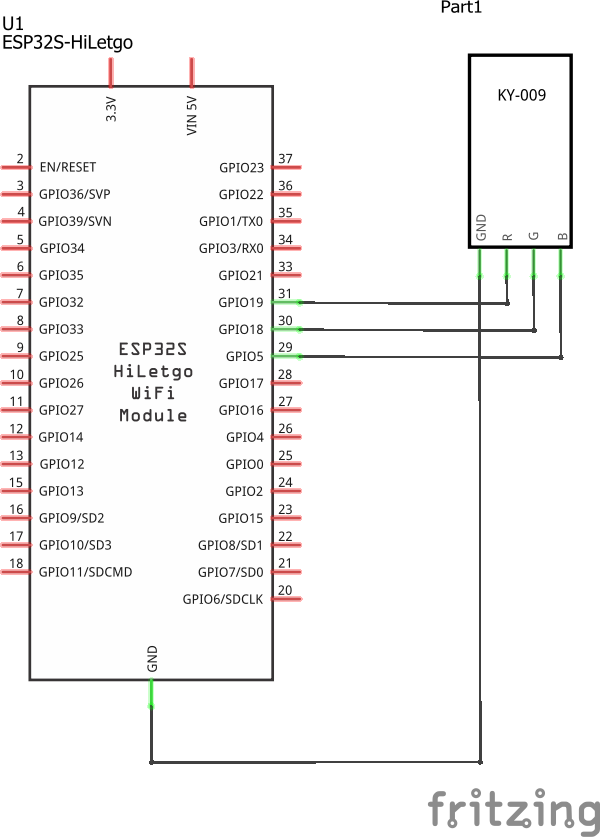
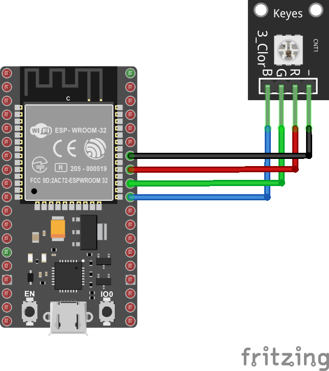

# Ejemplo 1 - Ejemplo usando led RGB y ESP32

## Descripción

Conectar al ESP32 un led RGB y ponerlo a alumbrar usando diferentes colores.

> **Herramienta** </br> En el siguiente [link](https://www.rapidtables.com/web/color/RGB_Color.html) se encuentra una herramienta para realizar la combinación de colores primarios (RGB) y obtener cualquier color.

## Hardware

La siguiente tabla muestra los componentes principales del circuito a montar:


| Item # | Cantidad | Descripción    | Información |
| ------ | -------- | -------------- | ----------- |
| 1      | 1        | ESP32          | N/A         |
| 2      | 1        | SMD RGB Module | Elegoo 37 SENSOR KIT TUTORIAL|

### Esquematico

<p align="center">
  
</p>

### Conexión entre los componentes

A continuación se muestra la conexión entre los componentes:

<p align="center">
  
</p>

## Software

### Código

```C++
int redPin = 19;
int greenPin = 18;
int bluePin = 5;

//uncomment this line if using a Common Anode LED
//#define COMMON_ANODE

void setup()
{
  pinMode(redPin, OUTPUT);
  pinMode(greenPin, OUTPUT);
  pinMode(bluePin, OUTPUT);  
}

void loop()
{
  setColor(255, 0, 0);  // red
  delay(1000);
  setColor(0, 255, 0);  // green
  delay(1000);
  setColor(0, 0, 255);  // blue
  delay(1000);
  setColor(255, 255, 0);  // yellow
  delay(1000);  
  setColor(80, 0, 80);  // purple
  delay(1000);
  setColor(0, 255, 255);  // aqua
  delay(1000);
}

void setColor(int red, int green, int blue)
{
  #ifdef COMMON_ANODE
    red = 255 - red;
    green = 255 - green;
    blue = 255 - blue;
  #endif
  analogWrite(redPin, red);
  analogWrite(greenPin, green);
  analogWrite(bluePin, blue);  
}
```

## Simulación

### Wokwi - Simulación

Para comprender el funcionamiento del programa, puede seguir el siguiente: 
* **Board**: board-esp32-devkit-c-v4 ([link](https://wokwi.com/projects/391210532094486529))

<p align="center">
  
</p>

## Referencias

* https://esp32io.com/tutorials/esp32-rgb-led
* https://learn.sparkfun.com/tutorials/tinker-kit-circuit-guide/circuit-4-rgb-night-light
* https://learn.adafruit.com/all-about-leds
* https://learn.sparkfun.com/tutorials/light-emitting-diodes-leds
* https://learn.adafruit.com/adafruit-arduino-lesson-3-rgb-leds/overview
* https://learn.adafruit.com/adafruit-arduino-lesson-3-rgb-leds/using-internet-colors
* https://htmlcolorcodes.com/color-names/
* https://learn.sparkfun.com/tutorials/experiment-guide-for-the-sparkfun-tinker-kit/experiment-4-driving-multiple-leds
* https://www.luisllamas.es/referencia-lenguaje-arduino/
* https://github.com/UdeA-IoT/ejemplos-mqtt/tree/main/ejemplo_2/thing_02
* https://arts.recursos.uoc.edu/programacio-disseny-arts/es/maxmsp-pure-data/
* https://github.com/UdeA-IoT/clases-IoT_capa-percepcion_2023-2/tree/main/dia3/esp32