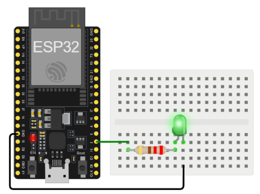

# Ejemplo 3 - PWM en el ESP32

## Descripción

Cambiar la intensidad del brillo de un led conectado al ESP32.

## Hardware

La siguiente tabla muestra los componentes principales del circuito a montar:


| Item # | Cantidad | Descripción    | Información |
| ------ | -------- | -------------- | ----------- |
| 1      | 1        | ESP32          | N/A         |

### Esquematico

<p align="center">
  
</p>

### Conexión entre los componentes

A continuación se muestra la conexión entre los componentes:

<p align="center">
  
</p>

## Software

### Código

```C++
// Puertos
const int ledPin = 2;    // GPIO2

// Inicializacion
void setup() {
  // nothing happens in setup
}

// Ciclo infinito
void loop() {
  for (int fadeValue = 0 ; fadeValue <= 255; fadeValue += 5) {
    analogWrite(ledPin, fadeValue);
    delay(30);
  }

  for (int fadeValue = 255 ; fadeValue >= 0; fadeValue -= 5) {
    analogWrite(ledPin, fadeValue);
    delay(30);
  }
}
```

## Simulación

### Wokwi - Simulación

Para comprender el funcionamiento del programa, puede seguir el siguiente: 
* **Board**: wokwi-esp32-devkit-v1 ([link](https://wokwi.com/projects/335030762714694227))

<p align="center">
  
</p>

* **Board**: board-esp32-devkit-c-v4 ([link](https://wokwi.com/projects/391187150765388801))

<p align="center">
  
</p>

