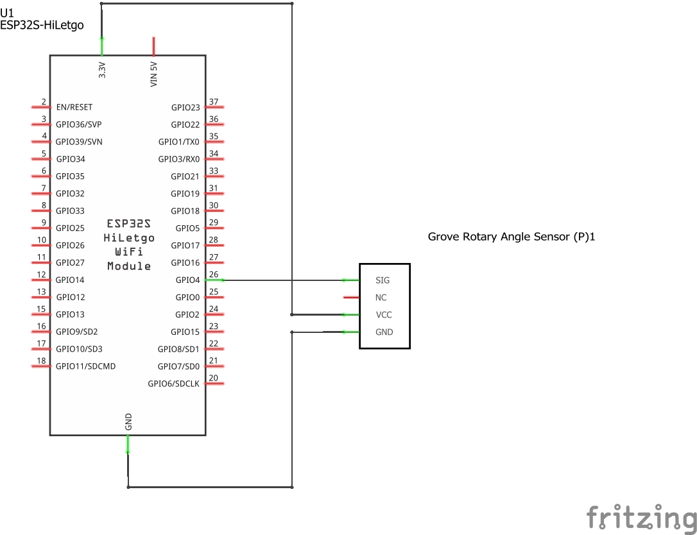
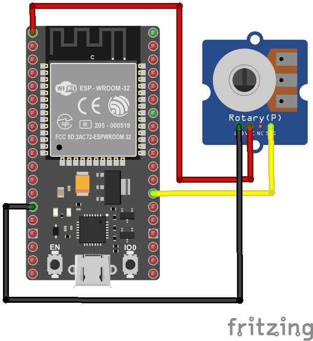
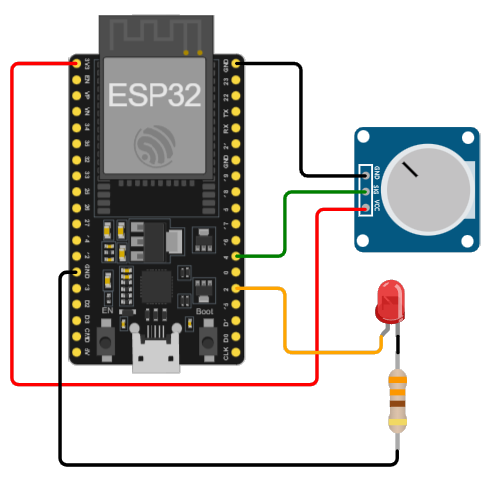

# Ejemplo 5 - Lectura analoga usando el ESP32

## Descripción

Cambiar la frecuencia de parpadeo de un led mediante el uso de una entrada analoga.

## Hardware

La siguiente tabla muestra los componentes principales del circuito a montar:


| Item # | Cantidad | Descripción    | Información |
| ------ | -------- | -------------- | ----------- |
| 1      | 1        | ESP32          | N/A         |
| 2      | 1        | Grove - Rotary Angle Sensor  | Grove - Starter Kit v3 ([link](https://wiki.seeedstudio.com/Grove_Starter_Kit_v3/#grove---rotary-angle-sensor))  |

### Esquematico

<p align="center">
  
</p>

### Conexión entre los componentes

A continuación se muestra la conexión entre los componentes:

<p align="center">
  
</p>

## Software

### Código

```C++
// ----- Pines ------
//const int voltsInPin = 4;
#define voltsInPin 4
//const int ledPin = 2;
#define ledPin 2

void setup() {
  pinMode(ledPin, OUTPUT);
}
void loop() {
  int rawReading = analogRead(voltsInPin);
  int period = map(rawReading, 0, 4095, 100, 500);
  digitalWrite(ledPin, HIGH);
  delay(period);
  digitalWrite(ledPin, LOW);
  delay(period);
}
```

## Simulación

### Wokwi - Simulación

Para comprender el funcionamiento del programa, puede seguir el siguiente: 
* **Board**: board-esp32-devkit-c-v4 ([link](https://wokwi.com/projects/391446096580622337))

<p align="center">
  
</p>

