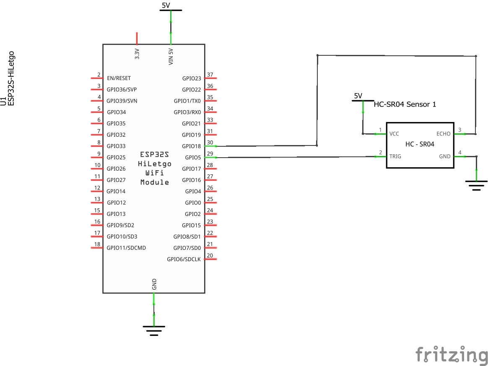
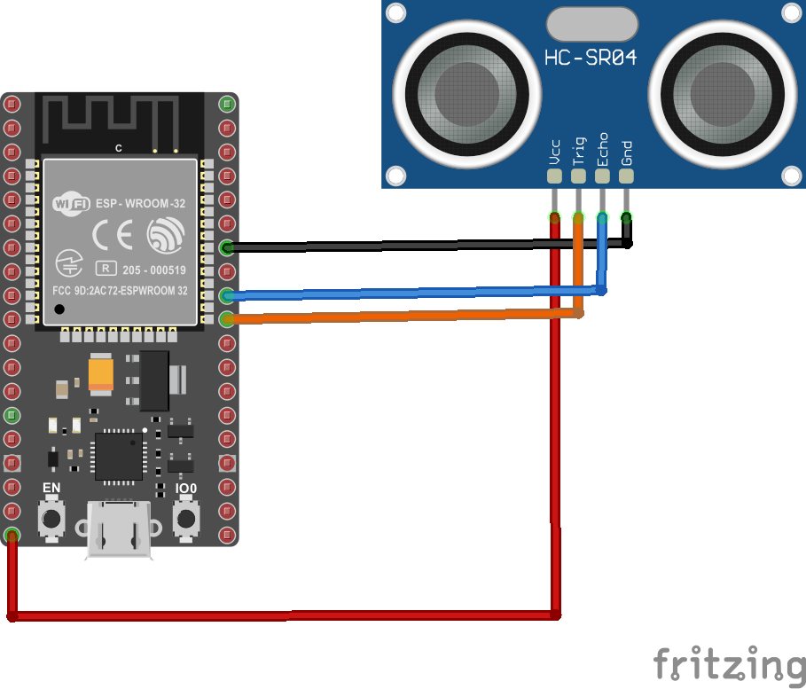
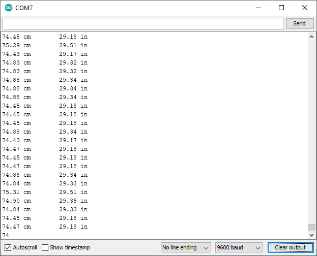
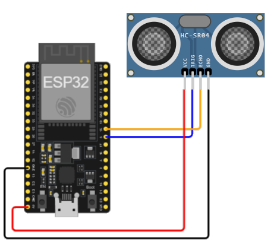

# Ejemplo 1 - Implementación del sensor de ultrasonido en el ESP32

## Descripción

Este ejemplo fue adaptado de  **SparkFun Inventor's Kit Experiment Guide - Project 3: Motion** ([link](https://learn.sparkfun.com/tutorials/sparkfun-inventors-kit-experiment-guide---v40/project-3-motion)) para el ESP32.

## Hardware

La siguiente tabla muestra los componentes principales del circuito a montar:


| Item # | Cantidad | Descripción    | Información |
| ------ | -------- | -------------- | ----------- |
| 1      | 1        | ESP32          | N/A         |
| 2      | 1        | Sensor de ultrasonido HC-SR04  | HC-SR04 Ultrasonic Sensor Module User Guide ([link](https://www.handsontec.com/dataspecs/HC-SR04-Ultrasonic.pdf)) |


### Esquematico

<p align="center">
  
</p>

### Conexión entre los componentes

La conexión entre el sensor de ultrasonido se muestra en la siguiente tabla:


|ESP32|HC-SR04|
|---|---|
|5V|VCC|
|5|Trig|
|18|Echo|
|GND|GND|


A continuación se muestra la conexión entre los componentes:

<p align="center">
  
</p>

## Software

### Código

A continuación se muestra el programa que se ejecuta en el ESP32, el cual basicamente es el mismo programa implementado para el Arduino UNO pero empleando otros pines:

```ino
/**
   Hardware Connections:

    ESP32 | HC-SR04
    -------------------
      5V    |   VCC
      5     |   Trig
      18    |   Echo
      GND   |   GND
*/

// Pins
const int TRIG_PIN = 5;
const int ECHO_PIN = 18;

// Anything over 400 cm (23200 us pulse) is "out of range"
const unsigned int MAX_DIST = 23200;

void setup() {

  // The Trigger pin will tell the sensor to range find
  pinMode(TRIG_PIN, OUTPUT);
  digitalWrite(TRIG_PIN, LOW);

  //Set Echo pin as input to measure the duration of 
  //pulses coming back from the distance sensor
  pinMode(ECHO_PIN, INPUT);

  // We'll use the serial monitor to view the sensor output
  Serial.begin(9600);
}

void loop() {

  unsigned long t1;
  unsigned long t2;
  unsigned long pulse_width;
  float cm;
  float inches;

  // Hold the trigger pin high for at least 10 us
  digitalWrite(TRIG_PIN, HIGH);
  delayMicroseconds(10);
  digitalWrite(TRIG_PIN, LOW);

  // Wait for pulse on echo pin
  while ( digitalRead(ECHO_PIN) == 0 );

  // Measure how long the echo pin was held high (pulse width)
  // Note: the micros() counter will overflow after ~70 min
  t1 = micros();
  while ( digitalRead(ECHO_PIN) == 1);
  t2 = micros();
  pulse_width = t2 - t1;

  // Calculate distance in centimeters and inches. The constants
  // are found in the datasheet, and calculated from the assumed speed
  //of sound in air at sea level (~340 m/s).
  cm = pulse_width / 58.0;
  inches = pulse_width / 148.0;

  // Print out results
  if ( pulse_width > MAX_DIST ) {
    Serial.println("Out of range");
  } else {
    Serial.print(cm);
    Serial.print(" cm \t");
    Serial.print(inches);
    Serial.println(" in");
  }

  // Wait at least 60ms before next measurement
  delay(60);
}
```

## Pruebas y simulación

### Arduino IDE - Test

La siguiente figura muestra la salida en el monitor serial cuando el programa es ejecutado:

<p align="center">
  
</p>

### Wokwi - Simulación

Para comprender el funcionamiento del programa, puede seguir el siguiente [link](https://wokwi.com/projects/391349504507707393) cuyo montaje se muestra a continuación:

<p align="center">
  
</p>

## Referencias
1. https://learn.sparkfun.com/tutorials/sparkfun-inventors-kit-experiment-guide---v40/circuit-3b-distance-sensor
2. https://github.com/sparkfun/HC-SR04_UltrasonicSensor
3. https://www.sparkfun.com/products/15569
4. https://www.handsontec.com/dataspecs/HC-SR04-Ultrasonic.pdf
5. https://randomnerdtutorials.com/esp32-hc-sr04-ultrasonic-arduino/
6. https://randomnerdtutorials.com/complete-guide-for-ultrasonic-sensor-hc-sr04/
7. https://randomnerdtutorials.com/esp8266-nodemcu-hc-sr04-ultrasonic-arduino/