# Uso de bibliotecas

## Objetivos

> * Aprender a instalar librerias de terceros en los IDEs en los IDEs Platformio y Arduino.
> * Aprender a usar las diferentes estructuras de datos y funciones de las librerias para el desarrollo de software que un sistema IoT.
> * Explorar algunos ejemplos de aplicación

## Referencias principales

1. Lección 3 **Interact with the phisycal world** ([link](https://github.com/microsoft/IoT-For-Beginners/blob/main/1-getting-started/lessons/2-deeper-dive/README.md)) del curso **IoT for Beginners** ([link](https://github.com/microsoft/IoT-For-Beginners)) de Microsoft.


## 1. Librerias

### 1.1. Conceptos preliminares

Cuando se adquiere una una impresora, el primer paso para que esta pueda usarse, consiste en obtener e instalar los drivers para que esta pueda funcionar correctamente en el sistema operativo. Normalmente, los fabricantes proporcionan los drivers de los dispositivos y por lo tanto, el procedimiento de poner en marcha el hardware consiste simplemente en ejecutar un simple instalador y listo; sin embargo, a veces se puede dar el caso en que el driver no existe y a menos que uno mismo lo cree, esta condenado a no poder usar dicho hardware y, generalmente, si esto ultimo pasa el resultado es que se quede con los crespos hechos a no ser que sea como Richard Stallman (Saint IGNUcius) (Ver: Cómo sería el mundo y la tecnología hoy en día sin el software libre y sin las ideas de Richard Stallman ([link](https://www.xataka.com/especiales/como-seria-mundo-tecnologia-hoy-dia-software-libre-ideas-richard-stallman)))

<p align="center">
  
</p>

Con el caso de los sistemas elecrónicos basados en microcontroladores sucede algo similar, cuando se desea que una aplicación use un hardware externo (sensor, actuador o memoria, por citar algunos casos), es necesario disponer de los ***drivers*** necesarios para permitir la interacción entre el ***firmware*** (programa descargado en el microcontrolador) y el ***hardware externo*** con el que este interactua.

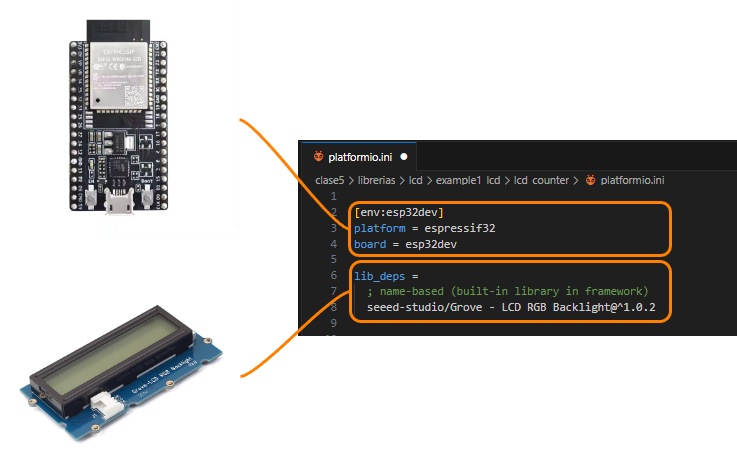


Existen casos en los que el hardware externo no posee soporte, de modo que, se hace necesario para el programador el diseño y la programación de los programas (drivers) necesarios para su interacción y control; sin embargo, esta es una tarea dificil por que exige conocimiento de hardware, protocolos y detalles de bajo nivel relacionados con el diseño del hardware. Afortunadamente, una de las caracteristicas del proyecto Arduino radica en su filosofia **Open Hardware y Software** lo cual hace que gran candidad de hardware sea soportada para la plataforma Arduino.

Gracias a este soporte, es posible encontrar gran cantidad de bibliotecas prediseñadas que ocultan todos los detalles de bajo nivel para controlar el hardware, lo cual permite que el programador se centre en la logica del sistema en vez de en los detalles de bajo nivel.

### 1.2. Agregando librerias

Exiten tutoriales en internet que explican muy bien como importar librerias portadas al API de Arduino, a continuación se listan estos enlaces:
1. **Installing an Arduino Library** de Sparkfun ([link](https://learn.sparkfun.com/tutorials/installing-an-arduino-library/all))
2. **All About Arduino Libraries** de Adafruit ([link](https://learn.adafruit.com/adafruit-all-about-arduino-libraries-install-use/arduino-libraries))
3. **Arduino Tips, Tricks, and Techniques** de Adafruit ([link](https://learn.adafruit.com/arduino-tips-tricks-and-techniques))
4. **Installing Libraries - Arduino IDE 1** de Arduino ([link](https://docs.arduino.cc/software/ide-v1/tutorials/installing-libraries))
5. **Installing Libraries - Arduino IDE 2** de Arduino ([link](https://docs.arduino.cc/software/ide-v2/tutorials/ide-v2-installing-a-library))
6. **Getting Started with VS Code and PlatformIO IDE for ESP32 and ESP8266 (Windows, Mac OS X, Linux Ubuntu)** de randomnerdtutorials ([link](https://randomnerdtutorials.com/vs-code-platformio-ide-esp32-esp8266-arduino/))
7. **Library Management** de Platformio ([link](https://docs.platformio.org/en/latest/librarymanager/index.html))

#### 1.2.1. Instalación de librerias en el Arduino IDE (Opcional)

El proceso de instalación de librerias en Arduino es sumamente facil, lo unico que se tiene que hacer es seguir las instrucciones de la pagina **Installing Libraries**. El procedimiento varia dependiendo de la version del IDE de Arduino que se tenga instalado, en los siguientes enlaces se puede consultar el procedimiento:
1. **Instalación de librerias para el IDE de Arduino (v1)** [[link]](https://docs.arduino.cc/software/ide-v1/tutorials/installing-libraries/)
2. **Instalación de librerias para el IDE de Arduino (v2)** [[link]](https://docs.arduino.cc/software/ide-v2/tutorials/ide-v2-installing-a-library/)


La siguiente imagen muestra el procedimiento de instalación de la biblioteca **Keypad** usando el gestor de librerias para el **IDE Arduino v2**:

<p align="center">
  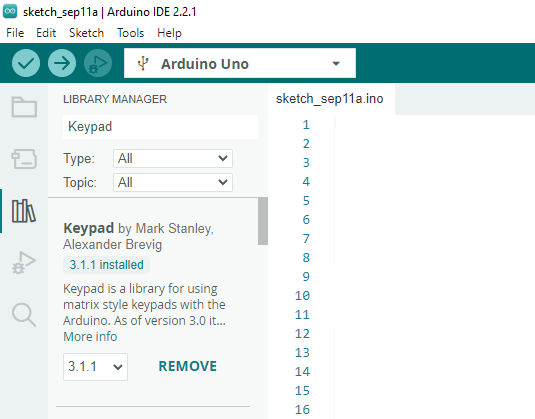
</p>

Despues de que se tiene instalada la biblioteca, es posible usar las funciones que esta tiene para lo cual, es necesario consultar la documentación. Por ejemplo, para la libreria **Keypad** la documentación se encuentra en el siguiente [repositorio](https://github.com/Chris--A/Keypad). En la siguiente figura se muestra el sketch del ejemplo que usa esta libreria:

<p align="center">
  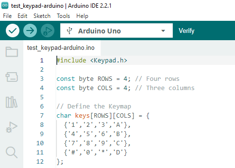
</p>

#### 1.2.2. Instalación de librerias en el Platformio

La instalación de librerias en el platformio se puede realizar de varias maneras. Para instalar librerias se accede al **Library manager** en la interfaz **PlatformIO Home** ([link](https://docs.platformio.org/en/stable/home/index.html))  dando click en el botón **Libraries** tal y como se muestra en la siguiente imagen:

<p align="center">
  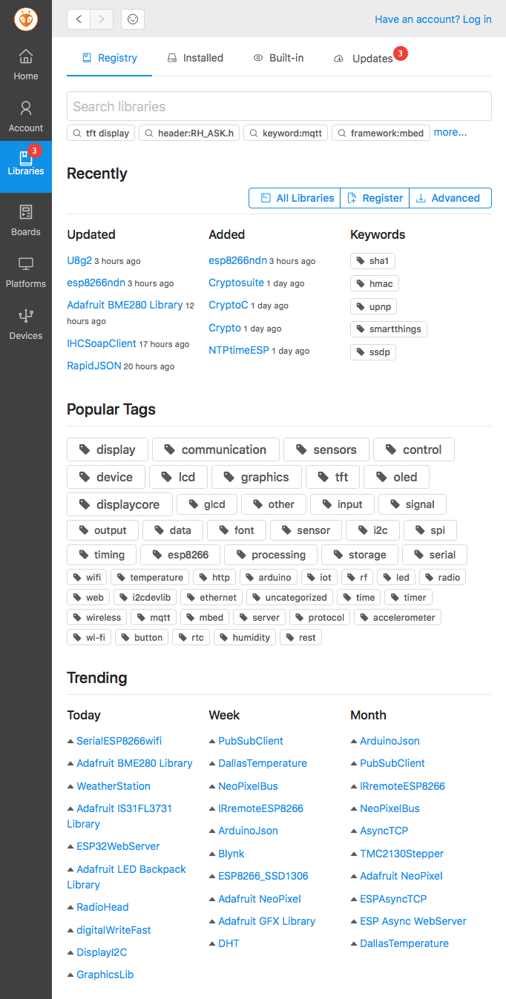
</p>

A continuación vamos a explorar de manera resumida como realizar el procedimiento completo cuando se usa el Platformio.
1. Crear y configurar el proyecto (si no lo recuerda puede consultar el siguiente [link](../1/README.md#platformio)). Supongamos que se creo un proyecto llamado **test-keypad_ESP32**. El archivo (**platformio.ini**) de configuración inicial se muestra a continuación:
   
   ```ini
   ; PlatformIO Project Configuration File
   ;
   ;   Build options: build flags, source filter
   ;   Upload options: custom upload port, speed and extra flags
   ;   Library options: dependencies, extra library storages
   ;   Advanced options: extra scripting
   ;
   ; Please visit documentation for the other options and examples
   ; https://docs.platformio.org/page/projectconf.html

   [env:nodemcu-32s]
   platform = espressif32
   board = nodemcu-32s
   framework = arduino
   ```
2. Usando el **Library manager** realizar los siguientes pasos:
   * Buscar la libreria por el nombre en el cuadro de texto del **Library manager**. Por ejemplo, si se quisiera instalar la libreria **Keypad** colocar su nombre en el cuadro de busqueda y luego seleccionar de la lista que aparece la libreria de interes:
  
   <p align="center">
   
   </p>

   * Despues de seleccionar la libreria dar click en **Add to Project** para agregarla a un proyecto.
   
   <p align="center">
   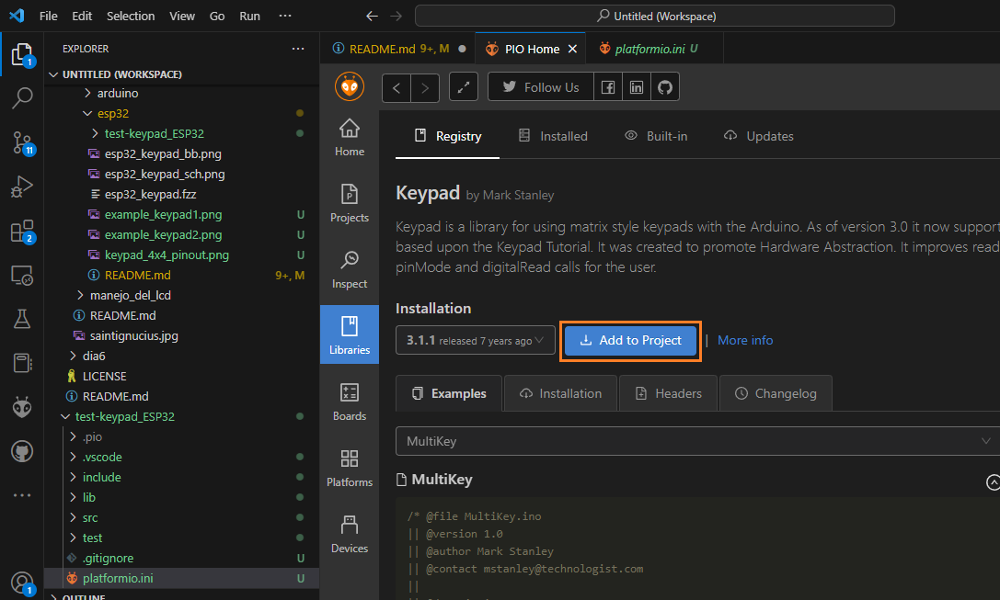
   </p>

   * De la lista de proyectos que aparecen, seleccionar el proyecto en el cual se quiere agregar esta. (en nuestro caso, el proyecto se llamaba **test-keypad_ESP32** de modo que este es el que se seleccina)
  
   <p align="center">
   
   </p>
  
   Una vez el proceso de agregar las librerias necesarias se ha completado, el archivo **platformio.ini** queda actualizado con la información de las librerias agregadas:

   ```ini
   ; PlatformIO Project Configuration File
   ;
   ;   Build options: build flags, source filter
   ;   Upload options: custom upload port, speed and extra flags
   ;   Library options: dependencies, extra library storages
   ;   Advanced options: extra scripting
   ;
   ; Please visit documentation for the other options and examples
   ; https://docs.platformio.org/page/projectconf.html

   [env:nodemcu-32s]
   platform = espressif32
   board = nodemcu-32s
   framework = arduino
   lib_deps = chris--a/Keypad@^3.1.1   
   ```

Una vez hecho lo anterior, ya es posible empezar a trabajar en el archivo **main.cpp** usando las funciones de la biblioteca **Keypad** tal y como se muestra a continuación:

<p align="center">
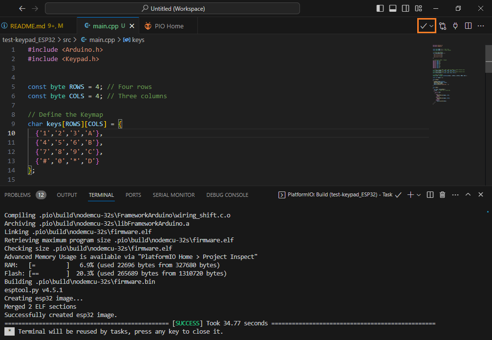
</p>

> **Para profundizar** </br> En el tutorial **Installing SimpleFOClibrary with PlatformIO** ([link](https://docs.simplefoc.com/library_platformio)) se muestra claramente un ejemplo completo del proceso de instalación.

### 1.3. Actividad de refuerzo (Aun no se ha probado)

1. **Prototipado en Fritzing**: Prototipar el Fritzing para el ESP32 un circuito similar a los descritos en la pagina **Grove - LCD RGB Backlight** [[link]](https://wiki.seeedstudio.com/Grove-LCD_RGB_Backlight/#play-with-arduino) agregando el Grove-LCD_RGB_Backlight (Buscar el componente en **Johnny-Five** [[repo]](https://github.com/rwaldron/johnny-five/tree/main)) al almacen de componentes ([grove-lcd-rgb.fzpz](grove-lcd-rgb.fzpz)).
2. Observe que en la siguiente figura se conecta este dispositivo para el Arduino a traves del puerto I2C.
   
   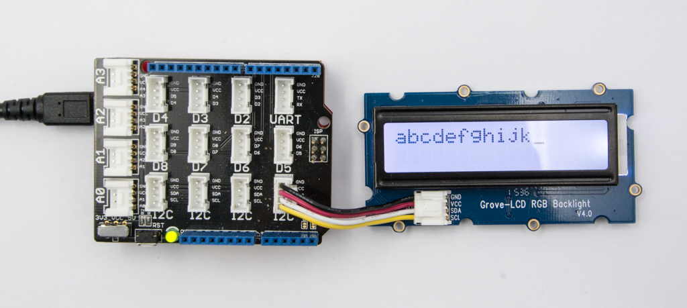

   Identifique en el ESP32 los pines I2C para realizar la conexión de este componente. Luego usando frizting realice la conexión a los pines apropiados.

3. Descargar el firmaware en el ESP32 siguiendo las siguientes instrucciones:
   - [x] Instalar la libreria necesaria para usar este LCD siguiendo los pasos descritos previamente. La siguiente tabla resume los detalles necesarios:
   
     |# | Libreria|	Tipo [H: Harware / S: Software]|Descripción|
     |---|---|---|---|
     |1 |Grove - LCD RGB Backlight [[link]](https://registry.platformio.org/libraries/seeed-studio/Grove%20-%20LCD%20RGB%20Backlight) [[repo]](https://github.com/Seeed-Studio/Grove_LCD_RGB_Backlight)|H|Grove - 16X2 LCD RGB Backlight - Full Color Display [[link]](https://www.seeedstudio.com/Grove-LCD-RGB-Backlight.html)|


   - [x] Codificar el siguiente ejemplo en el archivo `main.cpp`.
   
      ```cpp
      #include <Arduino>
      #include <Wire.h>
      #include "rgb_lcd.h"

      rgb_lcd lcd;

      const int colorR = 255;
      const int colorG = 0;
      const int colorB = 0;

      void setup()  {
        // set up the LCD's number of columns and rows:
        lcd.begin(16, 2);
    
        lcd.setRGB(colorR, colorG, colorB);
    
        // Print a message to the LCD.
        lcd.print("hello, world!");

        delay(1000);
      }

      void loop() {
        // set the cursor to column 0, line 1
        // (note: line 1 is the second row, since counting begins with 0):
        lcd.setCursor(0, 1);
        // print the number of seconds since reset:
        lcd.print(millis()/1000);

        delay(100);
      }
      ```

    - [x] Descargar la aplicación en el ESP32 para comprobar si el driver esta funcionando correctamente.
 

## 2. Ejemplos

A continuación se muestran algunos ejemplos en los cuales se emplean librerias de terceros para adaptar hardware externo a los diferentes proyectos sin necesidad de entrar en los detalles de su funcionamiento (casi como si se instalaran drivers por asi decirlo).

### 2.1. Teclado matricial

El teclado, es uno de los elementos mas comunes para la entrada de datos en un sistema embebido. Existen de todos los tipos y tamaños; sin embargo, en los siguientes ejemplos haremos uso del teclado matricial.

<p align = "center">
  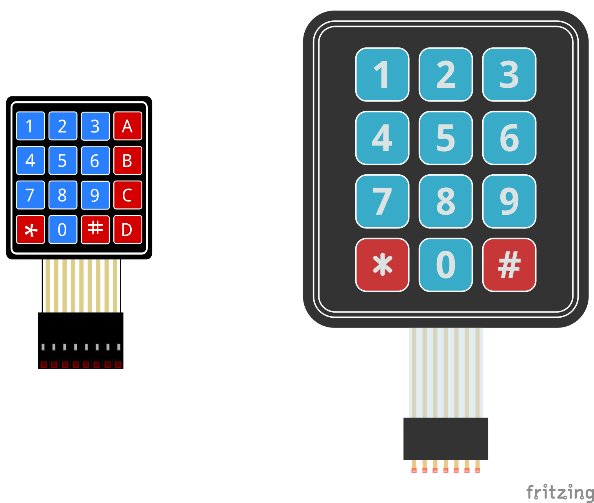
</p>

Los teclados son un elemento casi que obligado para facilitar la interacción del usuario con el sistema embebido.

> **Importante** </br> Antes de entrar a analizar los ejemplos sobre el uso del teclado matricial, se recomienda que de un vistazo rapido a la pagina **Interface 4×3 & 4×4 Membrane Keypad with Arduino** ([link](https://lastminuteengineers.com/arduino-keypad-tutorial/))

En los siguientes ejemplos se muestran como usar un teclado matricial. 

1. Instalación de la libreria **Keypad** para interactuar con un teclado matricial ([link](./librerias/keypad/example1_keypad/README.md)).
   
   <p align = "center">
   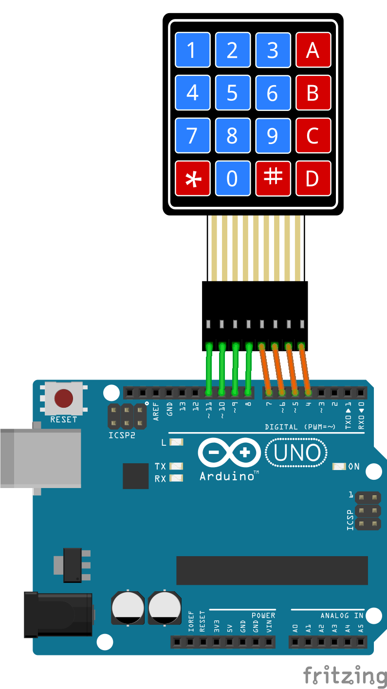
   </p>

2. Uso de un teclado matricial en un ESP32. Cada vez que se presiona una tecla, se produce un sonido para indicar el evento. ([link](./librerias/keypad/example2_keypad/README.md)).
   
   <p align = "center">
   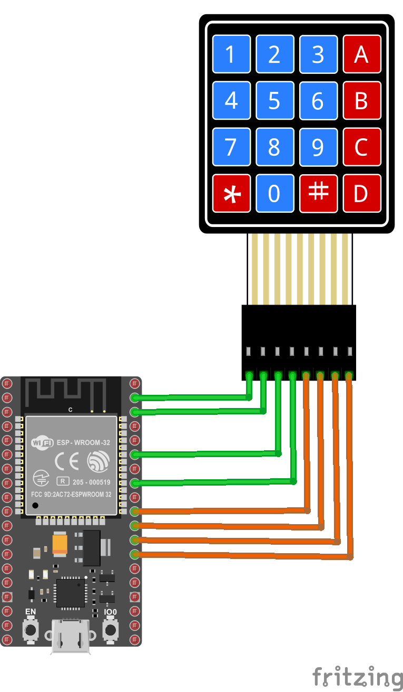
   </p>

### 2.2. Display LCD

Para que un usuario pueda usar facilmente un sistema embebido, éste tiene que disponer de alguna forma de desplegar los datos de manera clara para que el usuario pueda conocer el estado del sistema y pueda interactuar de manera correcta con este. En esta parte se abordara el display LCD, un periferico de salida mas robusto que los leds y los buzzer.

<p align = "center">
  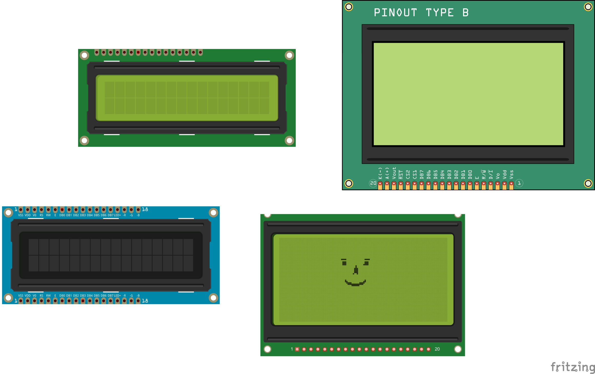
</p>

> **Importante** <br> Antes de analizar los ejemplos, se recomienda que explore la pagina **Liquid Crystal Displays (LCD) with Arduino** ([link](https://docs.arduino.cc/learn/electronics/lcd-displays/))

En los siguientes sencillos ejemplos se ilustra el uso del LCD.

1. Contador simple usando el LCD ([link](./librerias/lcd/example1_lcd/README.md)).
   
   <p align = "center">
   
   </p> 

2. Sistema de acceso sencillo ([link](./librerias/lcd/example2_lcd/README.md)).
   
   <p align = "center">
   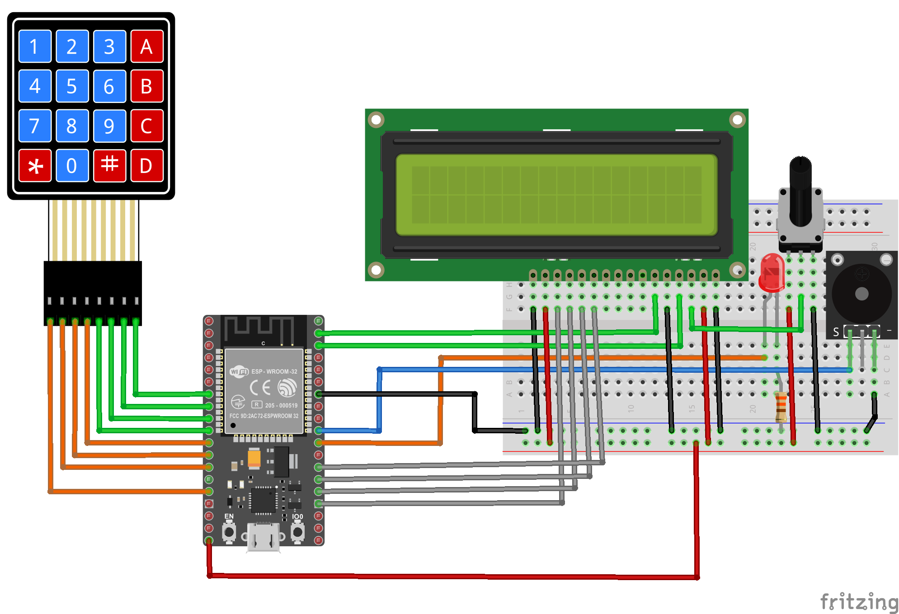
   </p> 

### 2.3. Sensor de temperatura y humedad - DTHxx

Los sistemas embebidos perciben el ambiente por medio de sensores. Los sensores permiten medir diferentes variables ambientales. En el siguiente ejemplo se explorara el sensore de temperatura y humedad DHT11.

<p align = "center">
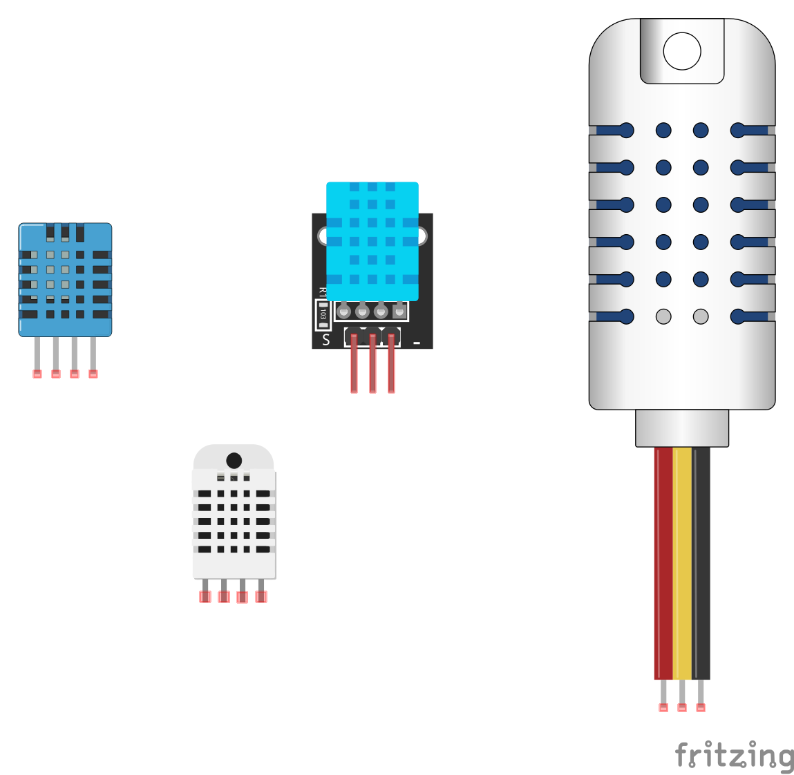
</p> 

Existen casos en los cuales la salida de los sensores es una trama de datos digitales lo cual implica el uso de un protocolo de comunicación serial. En el caso del DTH11, este emplea el protocolo **One Wire** para transferir la información de la temperarura y la humedad entre el sensor y el microcontrolador mediante una trama serial como la que se muestra a continuación:

<p align = "center">
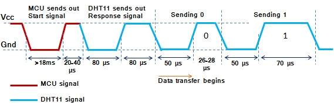
</p> 

De este modo, para poder usar este sensor, es necesario instalar las librerias necesarias para permitir la comunicación serial (mediante el protocolo one wire) y para interactuar con el sensor propiamente dicho.

> **Importante**: </br> Antes de empezar la recomendación es que le de una mirada a la pagina **DHT11, DHT22 and AM2302 Sensors** ([link](https://learn.adafruit.com/dht)) para entender sobre el sensor.

A continuación, se muestran un ejemplo relacionado.

1. Sensado de temperatura y humedad usando el DTH11 ([link](./librerias/dth11_esp32/README.md))
   
   <p align = "center">
   
   </p>

<!---
### 2.3. Ejemplo Grove - OLED Display 0.96" (SSD1315)

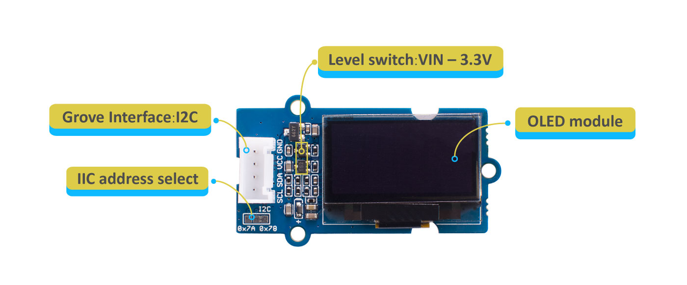

Enlaces:
* https://wiki.seeedstudio.com/Grove-Beginner-Kit-For-Arduino/
* https://wiki.seeedstudio.com/Grove-OLED-Display-0.96-SSD1315/
* https://docs.wokwi.com/parts/board-ssd1306
* https://randomnerdtutorials.com/esp32-ssd1306-oled-display-arduino-ide/
* 

Libreria:
* U8g2 is a monochrome graphics library for embedded devices. U8g2 supports monochrome OLEDs and LCDs, which include our chip SSD1315.
* https://github.com/olikraus/u8g2/wiki
* https://github.com/olikraus/u8g2/wiki/u8g2reference
* https://wokwi.com/projects/407297301135822849
* https://wokwi.com/projects/407293686594197505

-->

<!---
**En remojo**:
* https://randomnerdtutorials.com/esp32-flash-memory/
* https://randomnerdtutorials.com/esp32-pir-motion-sensor-interrupts-timers/#:~:text=In%20this%20example%2C%20when%20motion,LED%20is%20automatically%20turned%20off.
* 
* 
-->

## 3. Referencias

* https://www.makerguides.com/a4988-stepper-motor-driver-arduino-tutorial/
* https://docs.espressif.com/projects/esp-idf/en/v3.1.6/get-started-cmake/get-started-devkitc.html
* https://learn.sparkfun.com/tutorials/serial-communication/all
* https://resources.altium.com/es/p/spi-versus-i2c-how-choose-best-protocol-your-memory-chips
* https://resources.altium.com/es/p/i2c-vs-spi-vs-uart-how-layout-these-common-buses
* https://www.analog.com/en/resources/analog-dialogue/articles/uart-a-hardware-communication-protocol.html
* https://resources.altium.com/p/serial-communications-protocols-introduction
* https://resources.altium.com/p/serial-communications-protocols-part-two-uart
* https://resources.altium.com/p/serial-communications-protocols-part-three-rs-232
* https://resources.altium.com/p/serial-communications-protocols-rs-485
* https://resources.altium.com/p/serial-communications-protocols-part-5-spi
* https://resources.altium.com/p/6-serial-communications-protocols-i2c
* https://resources.altium.com/p/7-serial-communications-protocols-1-wire
* https://resources.altium.com/p/serial-communications-protocols-can-and-lin
* https://resources.altium.com/es/p/spi-versus-i2c-how-choose-best-protocol-your-memory-chips
* https://hackmd.io/2oRlH_ogSWigu6HOc99TYw
* https://learn.sparkfun.com/tutorials/installing-an-arduino-library/all
* https://learn.adafruit.com/adafruit-all-about-arduino-libraries-install-use/arduino-libraries
* https://learn.adafruit.com/arduino-tips-tricks-and-techniques/arduino-libraries
* https://docs.arduino.cc/software/ide-v1/tutorials/installing-libraries
* https://docs.arduino.cc/software/ide-v2/tutorials/ide-v2-installing-a-library
* https://github.com/UdeA-IoT/actividad-4
* https://www.arduino.cc/reference/en/libraries/
* https://esp32io.com/tutorials/esp32-keypad
* https://deepbluembedded.com/esp32-keypad-lcd-example-arduino/
* https://docs.simplefoc.com/library_platformio
* https://randomnerdtutorials.com/vs-code-platformio-ide-esp32-esp8266-arduino/
* https://dronebotworkshop.com/platformio/
* https://mcuoneclipse.com/2015/03/27/using-the-dht11-temperaturehumidity-sensor-with-a-frdm-board/
* https://embedded-lab.com/blog/measurement-of-temperature-and-relative-humidity-using-dht11-sensor-and-pic-microcontroller/
