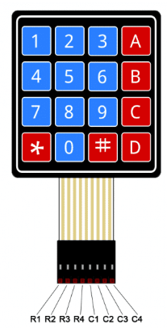
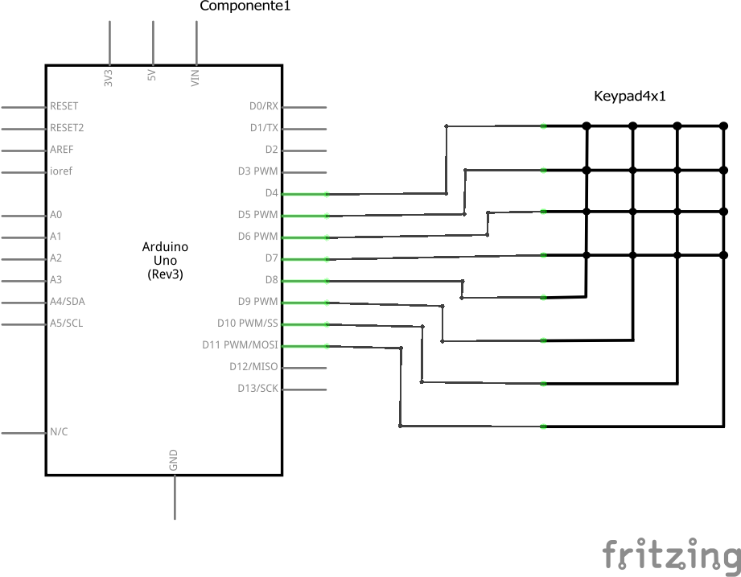
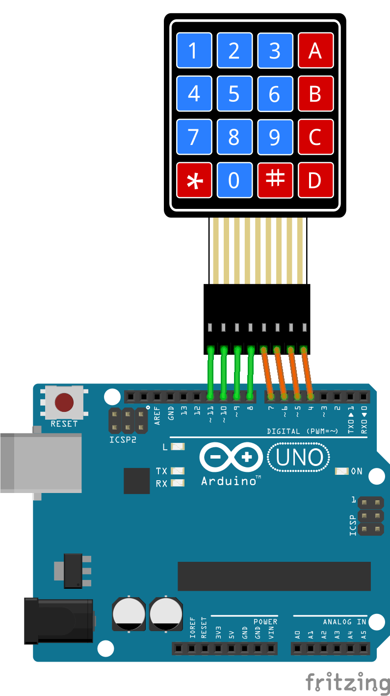
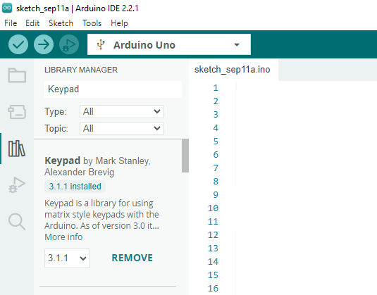
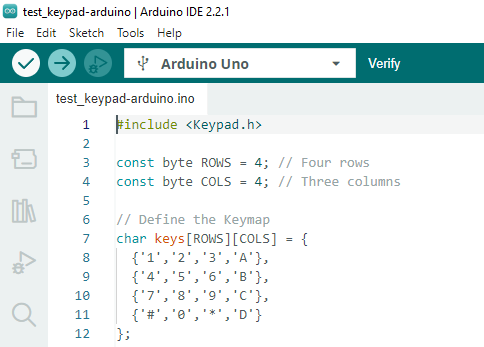
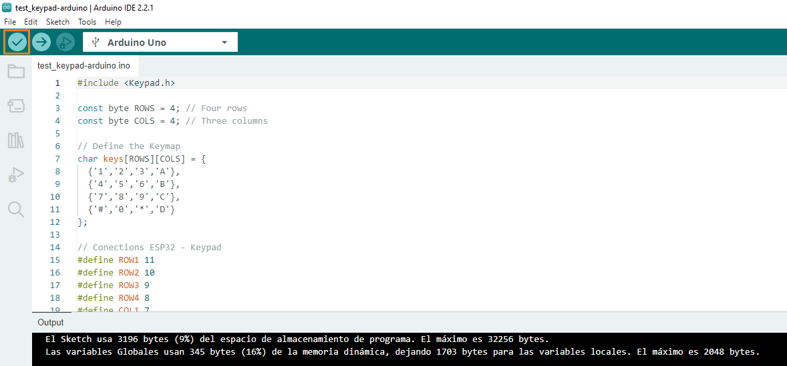
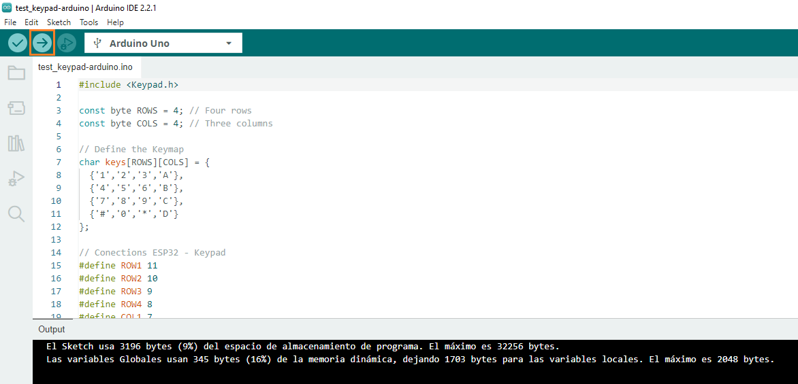

# Conexión de un teclado matricial 4x4 a un Arduino

## Resumen

Realizar una aplicación para el Arduino que despliegue serialmente todas las teclas de un teclado matricial 4x4 escepto las que se asocian a las teclas **```#```** y **```*```**. El comportamiento cuando se precione alguna de las teclas será, encender y apagar el led que viene integrado con la tarjeta de tal manera que una de estas lo apaga, la otra lo prenda.

## Hardware

### Componentes

La siguiente tabla muestra los componentes principales del circuito a montar:

|Componentes|Cantidad|Observaciones|
|---|---|---|
|Arduino|1||
|Teclado matricial de membrana|1|Disponible en el kit Elegoo ([datasheet](https://cdn.sparkfun.com/assets/f/f/a/5/0/DS-16038.pdf))|

Es importante conocer los pines del teclado matricial antes de empezar. A continuación se muestra un mapa de estos:



### Esquematico



### Diagrama de conexión

La conexión entre teclado matricial de membrana de 4x4 y el ESP32 se muestra en la siguiente tabla:

|ESP32|Teclado matricial 4x4|
|---|---|
|11 |R1|
|10 |R2|
|9  |R3|
|8  |R4|
|7  |C1|
|6  |C2|
|5  |C3|
|4  |C4|

A continuación se muestra la conexión entre el Arduino UNO y el teclado matricial



## Software

### Configuración en Arduino

1. Crear un archivo nuevo colocando el nombre del programa. En nuestro caso **test_keypad-arduino**.
2. Agregar las bibliotecas necesarias. En nuestro caso se instalo la biblioteca **Keypad**
   
   

3. Codificar el programa:
   
    ```ino
    #include <Keypad.h>
    
    const byte ROWS = 4; // Four rows
    const byte COLS = 4; // Three columns
    
    // Define the Keymap
    char keys[ROWS][COLS] = {
      {'1','2','3','A'},
      {'4','5','6','B'},
      {'7','8','9','C'},
      {'#','0','*','D'}
    };
    
    // Conections ESP32 - Keypad
    #define ROW1 11
    #define ROW2 10
    #define ROW3 9
    #define ROW4 8
    #define COL1 7
    #define COL2 6
    #define COL3 5
    #define COL4 4
    
    // Connect keypad ROW1, ROW2, ROW3 and ROW4 to these Arduino pins.
    byte rowPins[ROWS] = { ROW1, ROW2, ROW3, ROW4 };
    // Connect keypad COL0, COL1, COL2 and COL3 to these Arduino pins.
    byte colPins[COLS] = { COL1, COL2, COL3, COL4 }; 
    
    // Create the Keypad
    Keypad kpd = Keypad( makeKeymap(keys), rowPins, colPins, ROWS, COLS );
    
    const int ledpin = 13;
    
    void setup()
    {
      pinMode(ledpin,OUTPUT);
      digitalWrite(ledpin, HIGH);
      Serial.begin(9600);
      Serial.println("System Ok...");
    }
    
    void loop()
    {
      char key = kpd.getKey();
      if(key)  // Check for a valid key.
      {
        switch (key)
        {
          case '*':
            digitalWrite(ledpin, LOW);
            break;
          case '#':
            digitalWrite(ledpin, HIGH);
            break;
          default:
            Serial.println(key);
        }
      }
    }
    ```

    En la siguiente figura se muestra como quedo el programa:

    
    
4. Compilar el programa para verificar que no hayan errores.
   
   

5. Si el programa no tiene errores, proceder a descargar en la placa.
   
   

6. Probar el correcto funcionamiento del programa usando el monitor serial.
   
   

## Otros recursos

La simulación del programa descargado se encuentra en ([link](https://wokwi.com/projects/375582010592989185))

## Referencias

* https://playground.arduino.cc/Main/KeypadTutorial/
* https://learn.adafruit.com/matrix-keypad
* https://randomnerdtutorials.com/arduino-membrane-keypad-tutorial/