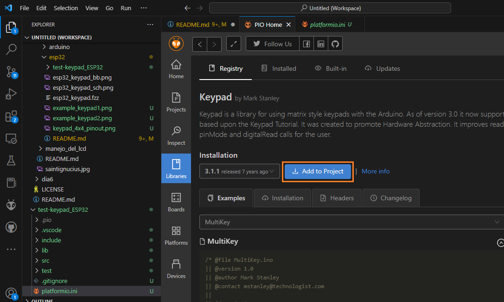

# Conexión de un teclado matricial 4x4 a un ESP32

## Resumen

Realizar una aplicación para el ESP32 que despliegue serialmente todas las teclas de un teclado matricial 4x4 escepto las que se asocian a las teclas **```#```** y **```*```**. El comportamiento cuando se precione alguna de las teclas será, encender y apagar el led que viene integrado con la tarjeta de tal manera que una de estas lo apaga, la otra lo prenda.

## Hardware

### Componentes

La siguiente tabla muestra los componentes principales del circuito a montar:

|Componentes|Cantidad|Observaciones|
|---|---|---|
|ESP32|1||
|Teclado matricial de membrana|1|Disponible en el kit Elegoo ([datasheet](https://cdn.sparkfun.com/assets/f/f/a/5/0/DS-16038.pdf))|

Es importante conocer los pines del teclado matricial antes de empezar. A continuación se muestra un mapa de estos:


### Esquematico


### Diagrama de conexión

La conexión entre teclado matricial de membrana de 4x4 y el ESP32 se muestra en la siguiente tabla:

|ESP32|Teclado matricial 4x4|
|---|---|
|P23 (GPIO23) |R1|
|P22 (GPIO22) |R2|
|P21 (GPIO21) |R3|
|P19 (GPIO19) |R4|
|P5 (GPIO5) |C1|
|P17 (GPIO17) |C2|
|P16 (GPIO16) |C3|
|P4 (GPIO4) |C4|


## Software

### Configuración en Platformio

1. Crear y configurar el proyecto (en nuestro caso se llamo **test-keypad_ESP32**), en nuestro caso se utilizaron los siguientes parametros:
   
   |Parámetro|Valor|
   |---|---|
   |**Name**|test-keypad_ESP32|
   |**Board**|NodeMCU-32S|
   |**Framework**|Arduino|
   
   El resultado de esto se muestra en la siguiente figura:

2. Agregue las librerias necesarias y sus dependencias (esto ultimo se hace de manera automatica). En nuestro caso se instalo la libreria **Keypad**. Para ello se siguen los siguientes pasos:
   
   * Buscar la libreria por el nombre (**Keypad** en nuestro caso). Si todo esta bien aparecera una lista de librerias:
  
     

    * Seleccionar de la lista, la libreria que se quiere agregar (**Keypad** en nuestro caso), luego, proceder a agregarla al proyecto.

     

     * De la lista de proyectos que aparecen, seleccionar el proyecto en el cual se quiere agregar esta. Para este ejemplo, el proyecto a elegir es **test-keypad_ESP32**.

       

   Una vez el proceso de agregar las librerias necesarias se ha completado, el archivo
   **platformio.ini** quedo actualizado con la información de las librerias:
    
    ```ini
    ; PlatformIO Project Configuration File
    ;
    ;   Build options: build flags, source filter
    ;   Upload options: custom upload port, speed and extra flags
    ;   Library options: dependencies, extra library storages
    ;   Advanced options: extra scripting
    ;
    ; Please visit documentation for the other options and examples
    ; https://docs.platformio.org/page/projectconf.html
    
    [env:nodemcu-32s]
    platform = espressif32
    board = nodemcu-32s
    framework = arduino
    lib_deps = chris--a/Keypad@^3.1.1
    ```
    
3. Proceda a codificar el programa en el archivo **main.cpp**. El cual para nuestro caso queda de la siguiente manera:
   
    ```ino
    #include <Arduino.h>
    #include <Keypad.h>
    
    const byte ROWS = 4; // Four rows
    const byte COLS = 4; // Three columns
    
    // Define the Keymap
    char keys[ROWS][COLS] = {
      {'1','2','3','A'},
      {'4','5','6','B'},
      {'7','8','9','C'},
      {'#','0','*','D'}
    };
    
    // Conections ESP32 - Keypad
    #define ROW1 23
    #define ROW2 22
    #define ROW3 21
    #define ROW4 19
    #define COL1 5
    #define COL2 17
    #define COL3 16
    #define COL4 4
    
    // Connect keypad ROW1, ROW2, ROW3 and ROW4 to these Arduino pins.
    byte rowPins[ROWS] = { ROW1, ROW2, ROW3, ROW4 };
    // Connect keypad COL0, COL1, COL2 and COL3 to these Arduino pins.
    byte colPins[COLS] = { COL1, COL2, COL3, COL4 }; 
    
    // Create the Keypad
    Keypad kpd = Keypad( makeKeymap(keys), rowPins, colPins, ROWS, COLS );
    
    const int ledpin = 2;
    
    void setup()
    {
      pinMode(ledpin,OUTPUT);
      digitalWrite(ledpin, HIGH);
      Serial.begin(9600);
      Serial.println("System Ok...");
    }
    
    void loop()
    {
      char key = kpd.getKey();
      if(key)  // Check for a valid key.
      {
        switch (key)
        {
          case '*':
            digitalWrite(ledpin, LOW);
            break;
          case '#':
            digitalWrite(ledpin, HIGH);
            break;
          default:
            Serial.println(key);
        }
      }
    }
    ```
    
4. Compile el programa para verificar si hay errores. 
   
   

5. Si no hay errores, proceda a subir el programa a la ESP32. 

   

6. Si todo sale bien ya puede proceder a probar el programa. Como el ejemplo usa comunicación serial, proceda a abrir la terminal serial:
   
   

   Para salir de la terminal serial use la combinación de teclas **```CTRL``` + ```C```**.

   Opcionalmente, tambien puede hacer uso del **monitor serial** para un mejor debug. La siguiente figura muestra esto:

   

## Otros recursos

La simulación del programa descargado se encuentra en ([link](https://wokwi.com/projects/375583898825876481))

## Referencias

* https://playground.arduino.cc/Main/KeypadTutorial/
* https://learn.adafruit.com/matrix-keypad
* https://randomnerdtutorials.com/arduino-membrane-keypad-tutorial/
* https://www.luisllamas.es/arduino-teclado-matricial/
* https://www.circuitbasics.com/how-to-set-up-a-keypad-on-an-arduino/


