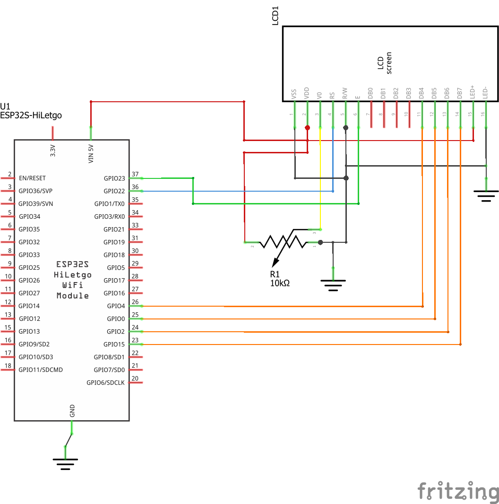
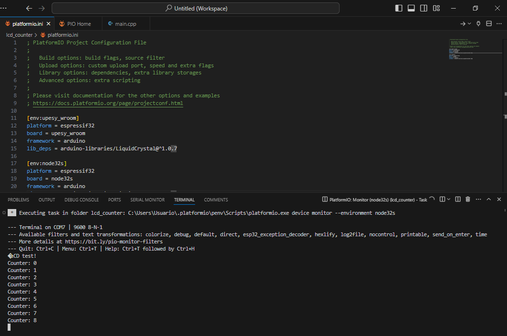
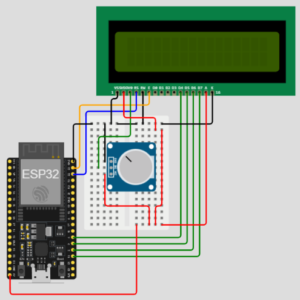

# Contador LCD en ESP32

## Resumen

Realizar una aplicación que muestre en un display LCD de 16x2 el valor de un contador cuyo valor se incrementa en uno cada un segundo.

## Hardware

El archivo fritzing del proyecto es [lcd-counter.fzz](lcd-counter.fzz)

### Componentes

La siguiente tabla muestra los componentes principales del circuito a montar:

|Componentes|Cantidad|Observaciones|
|---|---|---|
|ESP32|1|Placa ESP32 (Node-32s, YD-ESP32 o cualquier otra disponible en el laboratorio)|
|Display LCD 16x2|1|Disponible en el Elegoo 37 SENSOR KIT (Para mas información sobre el LCD ver el siguiente [link](../README.md))|

### Esquematico



### Diagrama de conexión

A continuación se muestra la conexión entre los componentes:


A continuación se detalla la conexión entre los componentes:

#### LCD 16x2

|ESP32|LCD 16x2|Observaciones|
|---|---|---|
|```VIN 5V```|```VSS```|Pin de Alimentacion del LCD|
|```GND```|```VDD```|Pin de Tierra del LCD|
||```V0```|Pin para control del contraste del LCD|
|```GPIO22```|```RS```||
|```GND```|```R/W```||
|```GPIO23```|```E```||
||```DB0```||
||```DB1```||
||```DB2```||
||```DB3```||
|```GPIO4```|```DB4```||
|```GPIO0```|```DB5```||
|```GPIO2```|```DB6```||
|```GPIO15```|```DB7```||
|```VIN 5V```|```LED+```||
|```GNG```|```LED-```||

## Software

El Proyecto generado por Platformio es **lcd_counter** y se encuentra en el siguiente directorio [lcd_counter](lcd_counter/)

### Placas

Las placas para las cuales se configuró el proyecto se resume en la siguiente tabla:

|Board|	Framework|
|----|----|
|	nodemcu-32s |	Arduino|
|	upesy_wroom |	Arduino|

### Librerias necesarias

Las librerias empleadas se muestran a continuación:

|#|	Libreria|	Observaciones|
|---|---|---|
|1|LiquidCrystal|LiquidCrystal de Arduino ([documentación](https://www.arduino.cc/reference/en/libraries/liquidcrystal/))|

### Configuración en Platformio

El archivo resultante al configurar el proyecto en el platformio con los parametros de las tablas anteriormente mostradas se muestra a continuación:
    
```ini
; PlatformIO Project Configuration File
;
;   Build options: build flags, source filter
;   Upload options: custom upload port, speed and extra flags
;   Library options: dependencies, extra library storages
;   Advanced options: extra scripting
;
; Please visit documentation for the other options and examples
; https://docs.platformio.org/page/projectconf.html

[env:upesy_wroom]
platform = espressif32
board = upesy_wroom
framework = arduino
lib_deps = arduino-libraries/LiquidCrystal@^1.0.7

[env:node32s]
platform = espressif32
board = node32s
framework = arduino
lib_deps = arduino-libraries/LiquidCrystal@^1.0.7
```

### Código

El código de la aplicación (**main.cpp**) se muestra a continuación:

```C++
#include <Arduino.h>
#include <LiquidCrystal.h>

// initialize the library by associating any needed LCD interface pin
// with the arduino pin number it is connected to
const int rs = 22, en = 23, d4 = 4, d5 = 0, d6 = 2, d7 = 15;
LiquidCrystal lcd(rs, en, d4, d5, d6, d7);

int counter = 0;

void setup() {
  Serial.begin(9600);
  Serial.println(F("LCD test!"));

  // set up the LCD's number of columns and rows:
  lcd.begin(16, 2);
  // Print a message to the LCD.
  lcd.print("LCD Ready!");
  lcd.setCursor(0, 1);
  delay(2000);  
  lcd.print("Counter: ");
}

void loop() {
  Serial.print("Counter: ");   
  Serial.println(counter);    
  lcd.print(counter,DEC);
  delay(1000);
  counter++;
  lcd.setCursor(9, 1);
}
```

## Pruebas

### Fisica

La salida en el monitor serial de platformio se encuentra c continuación:



### Simulación

La simulación del programa descargado se encuentra en ([link](https://wokwi.com/projects/391941764165031937))


