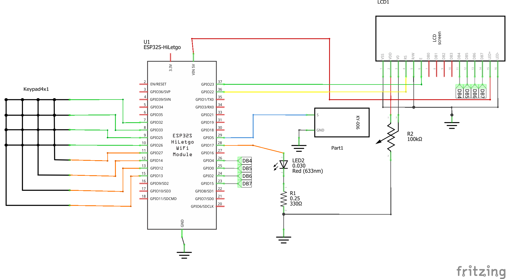
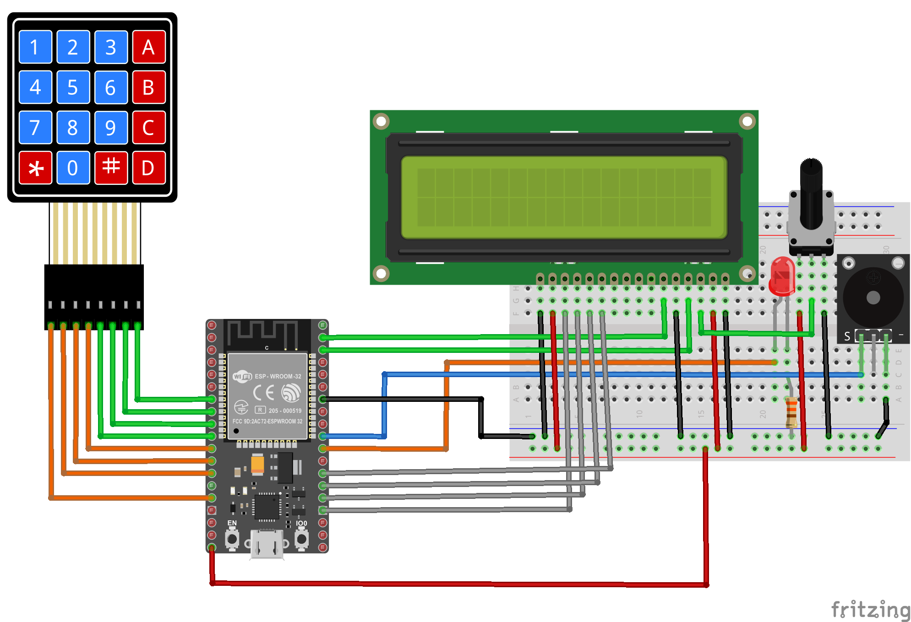
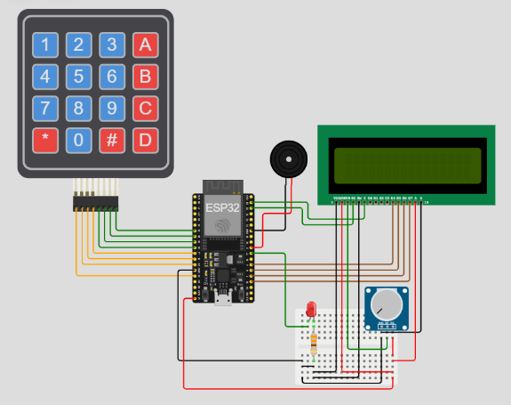

# Contador LCD en ESP32

## Resumen

Realizar un sistema acceso sencillo usando los siguientes elementos.
* **ESP32**: Donde estara el firmware de control 
* **Display LCD 16x2**: Para despliegue del ingreso de la clave y del estado de la puerta.
* **Led**: Para simular la apertura y cerrado de la puerta.
* **Buzzer**: Para hacer un beep cada vez que se presiona una tecla.

El sistema por el momento, solo contará con una sola clave (1234 en el caso) de 4 digitos. Cuando el usuario ingresa los 4 digitos, automaticamente se validan los datos de entrada con la clave almacenada y se procede a abrir la puerta durante tres segundos si la clave fue correcta.

## Hardware

El archivo fritzing del proyecto es [esp32_keypad_lcd.fzz](esp32_keypad_lcd.fzz)

### Componentes

La siguiente tabla muestra los componentes principales del circuito a montar:

|Componentes|Cantidad|Observaciones|
|---|---|---|
|ESP32|1|Placa ESP32 (Node-32s, YD-ESP32 o cualquier otra disponible en el laboratorio)|
|Display LCD 16x2|1|Disponible en el Elegoo 37 SENSOR KIT (Para mas información sobre el LCD ver el siguiente [link](../README.md))|

### Esquematico



### Diagrama de conexión

A continuación se muestra la conexión entre los componentes:



A continuación se detalla la conexión entre los componentes:

#### Teclado matricial

|ESP32|Teclado matricial 4x4|
|---|---|
|```GPIO13```|```R1 (ROW1)```|
|```GPIO12```|```R2 (ROW2)```|
|```GPIO14```|```R3 (ROW3)```|
|```GPIO27```|```R4 (ROW4)```|
|```GPIO26```|```C1 (COL1)```|
|```GPIO25```|```C2 (COL2)```|
|```GPIO33```|```C3 (COL3)```|
|```GPIO32```|```C4 (COL4)```|

#### Buzzer pasivo

|ESP32|Buzzer pasivo|
|---|---|
|```GPIO5```|```S```|

#### Led

|ESP32|LED|
|---|---|
|```GPIO17```|Anodo del led|

#### LCD 16x2

|ESP32|LCD 16x2|Observaciones|
|---|---|---|
|```VIN 5V```|```VSS```|Pin de Alimentacion del LCD|
|```GND```|```VDD```|Pin de Tierra del LCD|
||```V0```|Pin para control del contraste del LCD|
|```GPIO22```|```RS```||
|```GND```|```R/W```||
|```GPIO23```|```E```||
||```DB0```||
||```DB1```||
||```DB2```||
||```DB3```||
|```GPIO4```|```DB4```||
|```GPIO0```|```DB5```||
|```GPIO2```|```DB6```||
|```GPIO15```|```DB7```||
|```VIN 5V```|```LED+```||
|```GNG```|```LED-```||

## Software

El Proyecto generado por Platformio es **keypad_lcd** y se encuentra en el siguiente directorio [keypad_lcd](keypad_lcd/)

### Placas

Las placas para las cuales se configuró el proyecto se resume en la siguiente tabla:

|Board|	Framework|
|----|----|
|	nodemcu-32s |	Arduino|
|	upesy_wroom |	Arduino|

### Librerias necesarias

Las librerias empleadas se muestran a continuación:

|#|	Libreria|	Observaciones|
|---|---|---|
|1|Keypad|Libreria para el manejo del teclado matricial ([documentación](https://github.com/Chris--A/Keypad))|
|2|LiquidCrystal|LiquidCrystal de Arduino ([documentación](https://www.arduino.cc/reference/en/libraries/liquidcrystal/))|

### Configuración en Platformio

El archivo resultante al configurar el proyecto en el platformio con los parametros de las tablas anteriormente mostradas se muestra a continuación:
    
```ini
; PlatformIO Project Configuration File
;
;   Build options: build flags, source filter
;   Upload options: custom upload port, speed and extra flags
;   Library options: dependencies, extra library storages
;   Advanced options: extra scripting
;
; Please visit documentation for the other options and examples
; https://docs.platformio.org/page/projectconf.html

[env:upesy_wroom]
platform = espressif32
board = upesy_wroom
framework = arduino
lib_deps = chris--a/Keypad@^3.1.1
           arduino-libraries/LiquidCrystal@^1.0.7

[env:node32s]
platform = espressif32
board = node32s
framework = arduino
lib_deps = chris--a/Keypad@^3.1.1
           arduino-libraries/LiquidCrystal@^1.0.7
```

### Código

> **Recomendación**: <br>
> Antes de analizar el código se recomienda que tenga a la mano la documentación de las funciones de las librerias empleadas:
> * **Keypad library for Arduino** [[repo]](https://github.com/Chris--A/Keypad)
> * **LiquidCrystal** [[doc]](https://www.arduino.cc/reference/en/libraries/liquidcrystal/)

El código de la aplicación (**main.cpp**) se muestra a continuación:

```C++
#include <Keypad.h>
#include <LiquidCrystal.h>

// ---------------- Variables ---------------- //
// Clave
String password = "1234";
String input = "";
int num_key;
int key_len = 4;
// Estado
bool clave_completa = false;  // Indica que se metieron key_len digitos
bool ok = false;              // Indica si la clave ingresada fue correcta

// ---------------- Entradas ---------------- //
// ---- Keypad ----
const byte ROWS = 4; // Four rows
const byte COLS = 4; // Three columns
    
// Define the Keymap
char keys[ROWS][COLS] = {
  {'1','2','3','A'},
  {'4','5','6','B'},
  {'7','8','9','C'},
  {'#','0','*','D'}
};
    
// Conections ESP32 - Keypad
#define ROW1 13
#define ROW2 12
#define ROW3 14
#define ROW4 27
#define COL1 26
#define COL2 25
#define COL3 33
#define COL4 32 
// Connect keypad ROW1, ROW2, ROW3 and ROW4 to these Arduino pins.
byte rowPins[ROWS] = { ROW1, ROW2, ROW3, ROW4 };
// Connect keypad COL0, COL1, COL2 and COL3 to these Arduino pins.
byte colPins[COLS] = { COL1, COL2, COL3, COL4 }; 
    
// Create the Keypad
Keypad kpd = Keypad( makeKeymap(keys), rowPins, colPins, ROWS, COLS );

// ---------------- Salidas ---------------- //
// Led
const int ledpin = 17;  
// buzzer
const int buzzerPin = 5;   
int buzzerState = LOW;        // the current state of the output pin
int freq = 2000;
int channel = 0;
int resolution = 8;
// LCD
#define LCD_ROWS 2
#define LCD_COLUMNS 16
const int rs = 22, en = 23, d4 = 4, d5 = 0, d6 = 2, d7 = 15;
LiquidCrystal lcd(rs, en, d4, d5, d6, d7);

void setup() {
  // Inicializacion
  num_key = 0; // Numero de teclas ingresadas
  // Inicializacion del pin
  pinMode(ledpin,OUTPUT);
  digitalWrite(ledpin, LOW);
  // Init pwm (buzzer)
  ledcSetup(channel, freq, resolution);
  ledcAttachPin(buzzerPin, channel);
  // Init LCD
  lcd.begin(LCD_COLUMNS, LCD_ROWS);
  lcd.print("Clave: ");
  lcd.setCursor(0, 1);
  lcd.print("Puerta: ");
  lcd.print("cerrada");
  // Init serial
  Serial.begin(9600);
  Serial.println("System Ok...");
  lcd.setCursor(7, 0);
  lcd.blink();
}
    
void loop() {  
  char key = kpd.getKey();
  // Procesamiento de la tecla ingresada
  if(key) { 
    input.concat(key);    
    // Check for a valid key    
    Serial.println(key); // Impresion de la tecla en el monitor serial
    lcd.print("*"); // * en el LCD
    num_key++;
    if(num_key == key_len) {
      // Se metieron num_key digitos
      Serial.println(input);
      if (input.equals(password)) {
        // Clave correcta
        Serial.println("OK");    
        ok = true; 
      }
      else {
        // Clave errada
        Serial.println("Fail");    
        ok = false;     
      }
      input = "";
      num_key = 0; 
      clave_completa = true;    
    }     
    // Generacion del beep
    ledcWriteTone(channel, 1500);
    delay(100);
    ledcWriteTone(channel, 0);
  }
  // Verificacion de que la clave se metio completa
  if(clave_completa == true) {
    if(ok == true) {
      // Clave correcta (apertura puerta)
      lcd.noBlink();
      lcd.setCursor(8, 1);
      // Mensaje de apertura en el LCD
      lcd.print("abierta");
      digitalWrite(ledpin, HIGH); // Indicador puerta abierta  
      delay(3000);  // Tiempo que la puerta esta abierta
      digitalWrite(ledpin, LOW); // Indicador puerta cerrada
      // Mensaje de puerta cerrada en el LCD
      lcd.setCursor(8, 1);
      lcd.print("cerrada");
      // Borrado de los asteriscos
      lcd.setCursor(7, 0);
      lcd.print("    ");
      lcd.setCursor(7, 0); 
      lcd.blink();
      ok = false; // Se pasa nuevamente al estado inicial
    }
    else {
      delay(1000); // Espera de 1 seg
      // Borrado de los asteriscos
      lcd.setCursor(7, 0);
      lcd.print("    ");
      lcd.setCursor(7, 0); 
    }
    clave_completa = false;
  }
}
```

## Pruebas

### Fisica

La salida en el monitor serial de platformio se encuentra a continuación:

<p align = "center">
Falta probar en montaje real
</p>

### Simulación

La simulación del programa descargado se encuentra en ([link](https://wokwi.com/projects/392025013304457217))


