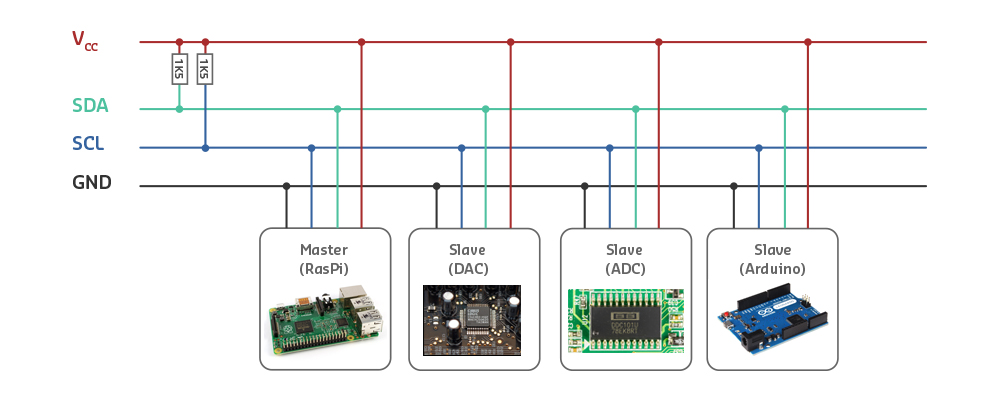
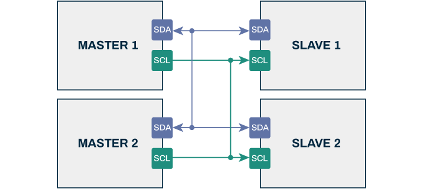
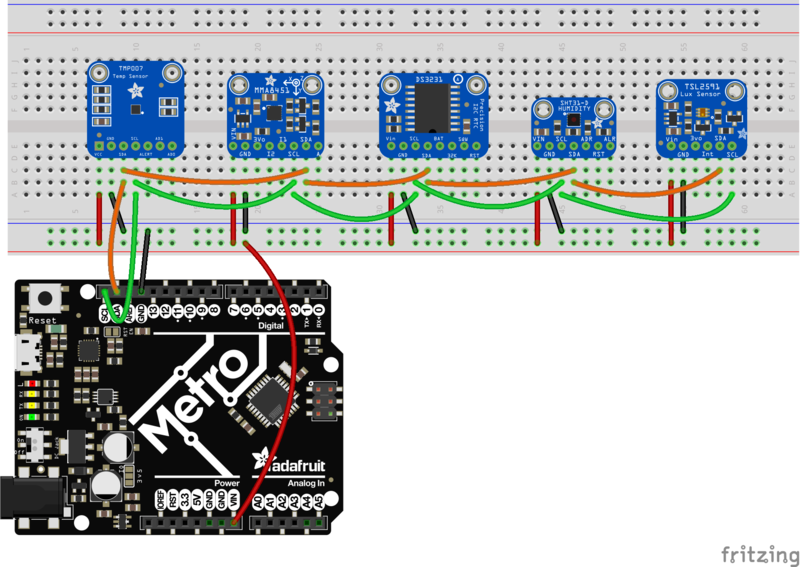
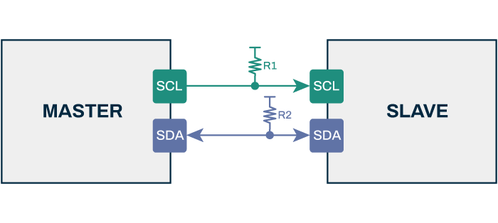
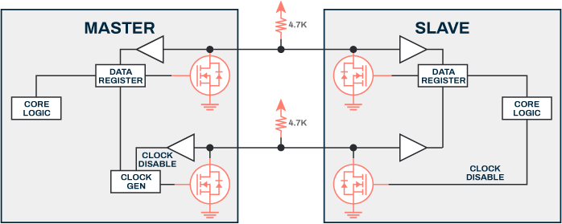
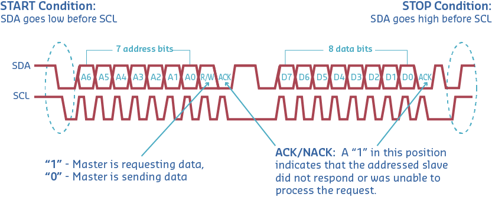
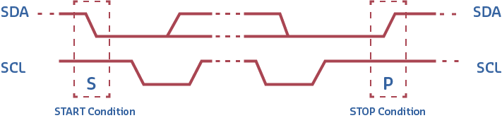
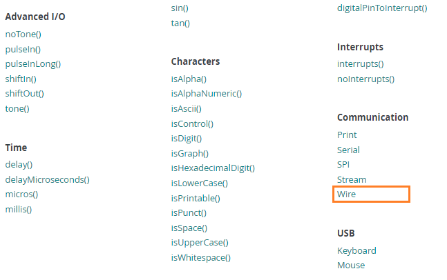

# Protocolo I2C

El procolo **Inter-Integrated Circuit** (**I2C**) es un protocolo pensado para permitir la comunicación entre multiples circuitos integrados "perifericos" se puedan comunicar con uno o mas chips "controladores". 

Este protocolo proporsiona una solución practica para la transferencia de datos entre dispositivos separados a distancias razonablemente cortas. Las aplicaciones tipicas incluyen la captura de grandes cantidades de datos producidos por perifericos conectados a microcontroladores.



## Bus I2C

El bus I2C tiene una arquitectura de tipo maestro-esclavo de modo que cualquier dispositivo que se conecte a este bus tendra uno de estos roles.
* **Dispositivo maestro (o controlador)**: Es el dispositivo encargado de general la señal de reloj e iniciar la comunicación con los esclavos.
* **Dispositivo esclavo (o periferico)**: Es el dispositivo que recibe la señal de reloj y responde cuando el maestro se dirige a el.



El bus I2C puede ser multi-esclavo, y multri-maestro, lo cual significa que un dispositivo maestro puede tener varios esclavos, y un dispositivo esclavo puede tener varios maestros, sin embargo, en este ultimo caso, solo un dispositivo puede ser maestro a la vez.

## Conexión

Para permitir la comunicación entre los dispositivos, se emplean dos lineas (escluyendo la tierra) las cuales son:
* **SDA**: Empleada para el intercambio de datos.
* **SCL**: Empleada como señal de reloj, esta linea es unidireccional y ve del maestro al esclavo.

Cada dispositivo que soporta el protocolo I2C tiene un par de pines rotulados con los nombres **SDA** y **SCL** de modo que la conexión consiste en unir estos pines a la respectiva linea.



La comunicación entre los dispositivos que estan conectados al bus I2C es half-duplex, lo cual significa que los datos solo pueden ser enviados en una sola dirección a la vez. Tambien, debido a las caracteristicas del bus, se emplean unas resistencias de **pull up** para mantener la señal del bus en alto cuando no hay ningun dispositivo usando el bus.



El valor de la resistencia elegida varia según los dispositivos en el bus, pero una buena regla general es iniciar con un valor de resistencia de $4.7 k\Omega$ e irla ajustando de ser necesario.



## Protocolo de comunicación

En I2C la información es transmitida de a un byte (8 bits) a la vez, seguido por un bit de reconocimiento (ACK). Los dispositivos son identificados con una dirección de 7-bit, por lo tanto, al menos teoricamente hablando, pueden haber conectados hasta 128 dispositivos al mismo bus. El la practica sin embargo, algunas direcciones son reservadas para propositos especiales de modo que solo hay 112 disponibles.

Los mensajes I2C se dividen en dos tipos de tramas de un byte (8 bits):
* **Trama de dirección**: Contiene la dirección donde el maestro indica el esclavo al que se envía el mensaje. La dirección es de 7-bit, por lo tanto, al menos teoricamente hablando, pueden haber conectados hasta 128 dispositivos al mismo bus. El la practica sin embargo, algunas direcciones son reservadas para propositos especiales de modo que solo hay 112 disponibles.
* **Trama de datos**: Consiste en una o mas tramas de 8 bits, en la cual se pasan los mensajes de datos del maestro al esclavo y vicersa. Los tipos de mensajes que se pasan pueden ser:
  * Mensaje simple, donde un maestro escribe datos un esclavo.
  * Mensaje simple, donde el maestro lee datos desde un esclavo.
  * Mensajes combinados, donde un maestro emite al menos dos lecturas y/o escrituras a uno o más esclavos.

En la siguiente figura se muestra un mensaje tipico



El dato es colocado en la linea SDA despues de que la linea SCL pasa a bajo, y es muestreado despues de que la linea SCL sube. El tiempo entre el flanco del reloj y la lectura/escritura de datos lo definen los dispositivos en el bus y varia de un chip a otro.



Para controlar el acceso al bus, es importante tener en cuenta las siguintes condiciones:
* **START condition**: transición de HIGH a LOW se da en la linea SDA mientras la linea SCL permanece en HIGH. Esto es siempre iniciado por el maestro.
* **STOP condition**: Una transición de LOW a HIGH se da en el SDA mientras la linea **SCL** esta en HIGH.
* **Clock Stretching**: Si un esclavo está ocupado, mantiene SCL LOW para forzar al maestro a entrar en estado de espera. La transferencia de datos continúa cuando el esclavo libera SCL.

## Sobre las direcciones 

Una de las cosas que hace increiblemente popular este protocolo es cantidad y tipos de dispositivos que pueden ser conectados con apenas dos lineas. Cada dispositivo tiene una dirección unica dentro del rango 0 y 127 (0 a 9x7F) lo cual puede ser problematico en algunos casos. Por ejemplo, si se tienen dos acelerometros cuya dirección es la misma (por ejemplo la 0x22) estos no pueden ser utilizados en el mismo bus I2C.

Existen varias maneras para conocer la dirección I2C de un dispositivo, a continuación se citan algunas:
* **Consulta del datasheet o documentación del dispositivo**: Esta es la forma más directa de obtener la dirección I2C pues el datasheet proporsiona toda la información necesaria del dispositivo, incluida la dirección I2C.
* **Mediante un programa de escaneo**: Es posible escribir un programa en una placa de desarrollo o en un microcontrolador para detectar dispositivos conectados al bus I2C y obtener sus direcciones.

En el siguiente [link](https://learn.adafruit.com/i2c-addresses/the-list) se muestra una lista con algunos de los modulos I2C mas comunes con su respectiva dirección. Es importante aclarar las direcciones I2C son asignadas por los fabricantes de dispositivos y pueden variar según el dispositivo y su configuración de modo que la lista anterior puede no ser la unica.

## Dispositivos

Exite un numero considerable de ICs que usan el bus I2C. Algunos ejemplos de estos componentes y sus aplicaciones son:
* RTC (Real-Time Clock)
* Low-speed DAC (Digital to Analog Converter) or ADC (Analog to Digital Converter)
* Color balance settings for a display data channel
* Changing sound volume in intelligent digital speakers
* Communicating with external memory devices, such as EEPROM
* Controlling OLED or LCD displays
* Turning power supplies ON and OFF 


## API Arduino para comunicación I2C

En el API de Arduino ([link](https://www.arduino.cc/reference/en/)) se encuentran las principales funciones, clases y estructuras de datos que se usan para hacer programas en Arduino.

En el link [Wire](https://www.arduino.cc/reference/en/language/functions/communication/wire/) del API de Arduino ([link](https://www.arduino.cc/reference/en/)) se encuentran todas las clases y métodos necesarios para comunicar con dispositivos I2C todas las board compatibles con el Framework de Arduno.



> **Para profundizar** <br>
> El documento **Comunicación I2C con Arduino lo mejor de dos mundos** ([link](https://udea-iot.github.io/UdeA_IoT-page/docs/sesiones/percepcion/sesion4a](https://programarfacil.com/blog/arduino-blog/comunicacion-i2c-con-arduino/))) de [programarfacil.com](https://programarfacil.com/) explica muy bien no solo el protocolo I2C sino tambien las principales funciones de la libreria ```Wire```.

Documentar usando: https://programarfacil.com/blog/arduino-blog/comunicacion-i2c-con-arduino/


|Función|Sintaxis|Descripción|
|---|---|---|
|`Wire.begin()`|`Wire.begin()`</br>`Wire.begin(address)`|Join a master - Join a slave @ addr - address: the 7-bit slave address (optional); if not specified, join the bus as a controller device.|
|`Wire.requestFrom()`|`Wire.requestFrom(address, count)`|This function is used by the controller device to request bytes from a peripheral device. - Esta función es utilizada por un dispositivo maestro para solicitar datos de un dispositivo esclavo. |
|`Wire.beginTransmission()`|`Wire.beginTransmission(address)`|// Step 1|
|`Wire.write()`|`Wire.write(value)` </br> `Wire.write(string)` </br> `Wire.write(data, length)`||
|`Wire.read()`|`Wire.read()`||
|`Wire.available()`|`Wire.available()`||
|`Wire.endTransmission()`|`Wire.endTransmission()` </br> `Wire.endTransmission(stop)`||
|`Wire.onReceive()`|`Wire.onReceive(handler)`||
|`Wire.onRequest()`|`Wire.onRequest(handler)`||

## Ejemplos

En construcción...