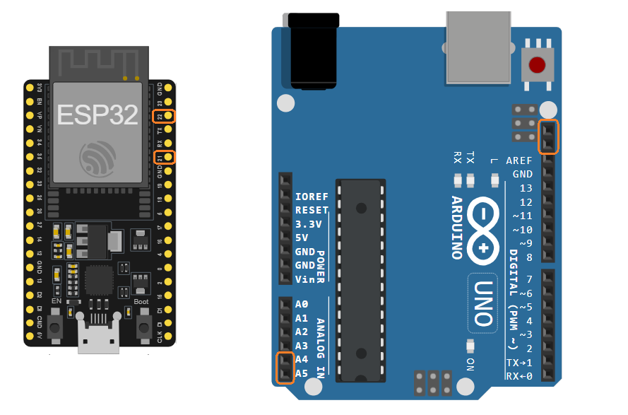
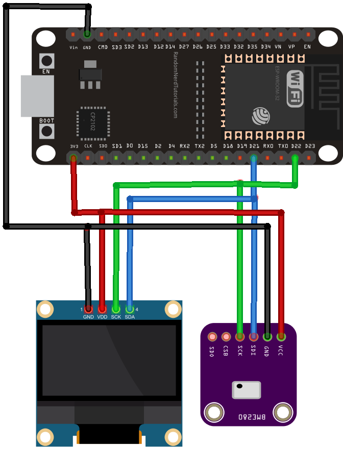
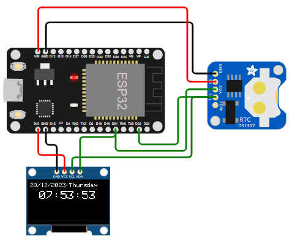

# Protocolo I2C

El procolo **Inter-Integrated Circuit** (**I2C**) es un protocolo pensado para permitir la comunicación entre multiples circuitos integrados "perifericos" se puedan comunicar con uno o mas chips "controladores". 

Este protocolo proporsiona una solución practica para la transferencia de datos entre dispositivos separados a distancias razonablemente cortas. Las aplicaciones tipicas incluyen la captura de grandes cantidades de datos producidos por perifericos conectados a microcontroladores.

## 1. Bus I2C

El bus I2C tiene una arquitectura de tipo maestro-esclavo de modo que cualquier dispositivo que se conecte a este bus tendra uno de estos roles.
* **Dispositivo maestro (o controlador)**: Es el dispositivo encargado de general la señal de reloj e iniciar la comunicación con los esclavos.
* **Dispositivo esclavo (o periferico)**: Es el dispositivo que recibe la señal de reloj y responde cuando el maestro se dirige a el.

El bus I2C puede ser multi-esclavo, y multri-maestro, lo cual significa que un dispositivo maestro puede tener varios esclavos, y un dispositivo esclavo puede tener varios maestros, sin embargo, en este ultimo caso, solo un dispositivo puede ser maestro a la vez.

## 2. Conexión

Para permitir la comunicación entre los dispositivos, se emplean dos lineas (escluyendo la tierra) las cuales son:
* **SDA**: Empleada para el intercambio de datos.
* **SCL**: Empleada como señal de reloj, esta linea es unidireccional y ve del maestro al esclavo.

Cada dispositivo que soporta el protocolo I2C tiene un par de pines rotulados con los nombres **SDA** y **SCL** de modo que la conexión consiste en unir estos pines a la respectiva linea.

La comunicación entre los dispositivos que estan conectados al bus I2C es half-duplex, lo cual significa que los datos solo pueden ser enviados en una sola dirección a la vez. Tambien, debido a las caracteristicas del bus, se emplean unas resistencias de **pull up** para mantener la señal del bus en alto cuando no hay ningun dispositivo usando el bus.

El valor de la resistencia elegida varia según los dispositivos en el bus, pero una buena regla general es iniciar con un valor de resistencia de $4.7 k\Omega$ e irla ajustando de ser necesario.

La conexión de cualquier dispositivo I2C con un cualquier sistema de desarrollo relativamente simple pues solo se reduce a los siguientes pasos:
1. Identificar los pines que se usan para la implementación del bus I2C (`SDA` y `SCL`). Para ello es importante que tenga a la mano la documentación de la tarjeta que usará:
   
   

2. Una vez identificados los pines I2C, conectar los pines I2C del hardware (sensores, actuadores, microcontroladores, etc) externo que emplea este protocolo ([link imagen](https://randomnerdtutorials.com/esp32-i2c-communication-arduino-ide/)):
   
   

3. Instalar las librerias de los dispositivos necesarios y analizar su documentación para comprender como usarlas.
4. Proceder a realizar la programación del microcontrolador teniendo en cuenta el framework empleado.

A continuación, se describirá la conexión para algunas de las placas disponibles en el laboratorio.

### 2.1. Conexión con el ESP32

Como punto de partida es necesario tener a la mano el diagrama de pines del ESP32 ([link](https://docs.espressif.com/projects/esp-idf/en/stable/esp32/hw-reference/esp32/get-started-devkitc.html))

Teniendo en cuenta el diagrama de pines, la siguiente tabla (tomada de **ESP32 I2C Communication: Set Pins, Multiple Bus Interfaces and Peripherals (Arduino IDE)** [[link]](https://randomnerdtutorials.com/esp32-i2c-communication-arduino-ide/)) muestra como seria la conexión entre un dispositivo I2C con los pines del ESP32:

|Dispositivo I2C|ESP32|
|---|---|
|`SDA`|`SDA` (default is GPIO 21)|
|`SCL`|`SCL` (default is GPIO 22)|
|`GND`|`GND`|
|`VCC`|usually `3.3V` or `5V`|

Una vez definida como va a ser la conexión con el hardware, el siguiente paso es mirar en la documentación del framework elegido para programar el dispositivo, cuales son las funciones que se emplean para la comunicacion I2C:
* **Espressif IoT Development Framework** [[link]](https://docs.espressif.com/projects/esp-idf/en/stable/esp32/): Mas exactamente consultar la sección **Inter-Integrated Circuit (I2C)** ([link](https://docs.espressif.com/projects/esp-idf/en/stable/esp32/api-reference/peripherals/i2c.html)).
* **Arduino Core for ESP32** [[link]](https://docs.espressif.com/projects/arduino-esp32/en/latest/): Mas exactamente consultar la sección relacionada con el protocolo **I2C** ([link](https://docs.espressif.com/projects/arduino-esp32/en/latest/api/i2c.html)).

Si el dispositivo a conectar no tiene drivers, es necesario ir mas alla para consultar los comandos de interación necesarios para establecer la comunicación I2C con el dispositivo (lo cual va mas alla del alcance de este curso), lo cual implica consultar el manual del hardware para hacer los drivers desde cero. 

Sin embargo, afortunadamente, muchos fabricantes proporsionan los drivers para usar sus dispositivos. Por ejemplo para el siguiente sistema ([link simulacion](https://wokwi.com/projects/385342221728294913)) que conecta un ESP32 con un RTC (para medir el tiempo) y una pantalla OLED (para mostrar el tiempo) usando el bus I2C:

Hace uso de los drivers mostrados en la siguiente tabla:

|Hardware|Driver|Link|
|---|---|---|
|Monochrome 128x64 OLED display with I2C interface [[ssd1306]](https://docs.wokwi.com/parts/board-ssd1306)|Adafruit GFX Library|https://github.com/adafruit/Adafruit-GFX-Library||
||Adafruit SSD1306|https://github.com/adafruit/Adafruit_SSD1306||
|RTC (Real Time Clock) module with I2C interface and 56 bytes of NV SRAM [[ds1307]](https://docs.wokwi.com/parts/wokwi-ds1307)|RTClib|https://github.com/adafruit/RTClib|

## 3. Protocolo de comunicación

En I2C la información es transmitida de a un byte (8 bits) a la vez, seguido por un bit de reconocimiento (ACK). Los dispositivos son identificados con una dirección de 7-bit, por lo tanto, al menos teoricamente hablando, pueden haber conectados hasta 128 dispositivos al mismo bus. El la practica sin embargo, algunas direcciones son reservadas para propositos especiales de modo que solo hay 112 disponibles.

Los mensajes I2C se dividen en dos tipos de tramas de un byte (8 bits):
* **Trama de dirección**: Contiene la dirección donde el maestro indica el esclavo al que se envía el mensaje. La dirección es de 7-bit, por lo tanto, al menos teoricamente hablando, pueden haber conectados hasta 128 dispositivos al mismo bus. El la practica sin embargo, algunas direcciones son reservadas para propositos especiales de modo que solo hay 112 disponibles.
* **Trama de datos**: Consiste en una o mas tramas de 8 bits, en la cual se pasan los mensajes de datos del maestro al esclavo y vicersa. Los tipos de mensajes que se pasan pueden ser:
  * Mensaje simple, donde un maestro escribe datos un esclavo.
  * Mensaje simple, donde el maestro lee datos desde un esclavo.
  * Mensajes combinados, donde un maestro emite al menos dos lecturas y/o escrituras a uno o más esclavos.

En la siguiente figura se muestra un mensaje tipico

El dato es colocado en la linea SDA despues de que la linea SCL pasa a bajo, y es muestreado despues de que la linea SCL sube. El tiempo entre el flanco del reloj y la lectura/escritura de datos lo definen los dispositivos en el bus y varia de un chip a otro.

Para controlar el acceso al bus, es importante tener en cuenta las siguintes condiciones:
* **START condition**: transición de HIGH a LOW se da en la linea SDA mientras la linea SCL permanece en HIGH. Esto es siempre iniciado por el maestro.
* **STOP condition**: Una transición de LOW a HIGH se da en el SDA mientras la linea **SCL** esta en HIGH.
* **Clock Stretching**: Si un esclavo está ocupado, mantiene SCL LOW para forzar al maestro a entrar en estado de espera. La transferencia de datos continúa cuando el esclavo libera SCL.

## 4. Sobre las direcciones 

Una de las cosas que hace increiblemente popular este protocolo es cantidad y tipos de dispositivos que pueden ser conectados con apenas dos lineas. Cada dispositivo tiene una dirección unica dentro del rango 0 y 127 (0 a 9x7F) lo cual puede ser problematico en algunos casos. Por ejemplo, si se tienen dos acelerometros cuya dirección es la misma (por ejemplo la 0x22) estos no pueden ser utilizados en el mismo bus I2C.

Existen varias maneras para conocer la dirección I2C de un dispositivo, a continuación se citan algunas:
* **Consulta del datasheet o documentación del dispositivo**: Esta es la forma más directa de obtener la dirección I2C pues el datasheet proporsiona toda la información necesaria del dispositivo, incluida la dirección I2C.
* **Mediante un programa de escaneo**: Es posible escribir un programa en una placa de desarrollo o en un microcontrolador para detectar dispositivos conectados al bus I2C y obtener sus direcciones.

En el siguiente [link](https://learn.adafruit.com/i2c-addresses/the-list) se muestra una lista con algunos de los modulos I2C mas comunes con su respectiva dirección. Es importante aclarar las direcciones I2C son asignadas por los fabricantes de dispositivos y pueden variar según el dispositivo y su configuración de modo que la lista anterior puede no ser la unica.

## 5. Dispositivos

Exite un numero considerable de ICs que usan el bus I2C. Algunos ejemplos de estos componentes y sus aplicaciones son:
* RTC (Real-Time Clock)
* Low-speed DAC (Digital to Analog Converter) or ADC (Analog to Digital Converter)
* Color balance settings for a display data channel
* Changing sound volume in intelligent digital speakers
* Communicating with external memory devices, such as EEPROM
* Controlling OLED or LCD displays
* Turning power supplies ON and OFF 

## 6. API Arduino para comunicación I2C

En el API de Arduino ([link](https://www.arduino.cc/reference/en/)) se encuentran las principales funciones, clases y estructuras de datos que se usan para hacer programas en Arduino.

En el link [Wire](https://www.arduino.cc/reference/en/language/functions/communication/wire/) del API de Arduino ([link](https://www.arduino.cc/reference/en/)) se encuentran todas las clases y métodos necesarios para comunicar con dispositivos I2C todas las board compatibles con el Framework de Arduno.

La siguiente tabla resume algunas de las funciones principalmente usadas:

|Función|Sintaxis|Descripción|
|---|---|---|
|`Wire.begin()`|`Wire.begin()` `Wire.begin(address)`||
|`Wire.requestFrom()`|`Wire.requestFrom(address, count)`| |
|`Wire.beginTransmission()`|`Wire.beginTransmission(address)`||
|`Wire.write()`|`Wire.write(value)`   `Wire.write(string)`   `Wire.write(data, length)`||
|`Wire.read()`|`Wire.read()`||
|`Wire.available()`|`Wire.available()`||
|`Wire.endTransmission()`|`Wire.endTransmission()`   `Wire.endTransmission(stop)`||
|`Wire.onReceive()`|`Wire.onReceive(handler)`||
|`Wire.onRequest()`|`Wire.onRequest(handler)`||

## 7. Ejemplos

1. I2C detection [[link]](https://wokwi.com/projects/377357264325640193)
2. LCD I2C [[link]](https://wokwi.com/projects/377357455279723521)
3. DTH 11 + LCD I2C [[link]](https://wokwi.com/projects/377357586406254593)

## 8. Referencias

* https://learn.sparkfun.com/tutorials/i2c
* https://learn.adafruit.com/working-with-i2c-devices/overview
* https://www.adafruit.com/category/613
* https://wiki.seeedstudio.com/I2C_And_I2C_Address_of_Seeed_Product/
* https://www.seeedstudio.com/Grove-I2C-Hub.html?srsltid=AfmBOoohI-9vqEF-bN9HdchhO_DWKvx7zzwOUEb5mhDDn7ZDJezKky_B
* https://randomnerdtutorials.com/esp32-i2c-communication-arduino-ide/
* https://www.luisllamas.es/en/esp32-hardware-details-pinout/
* https://espressif-docs.readthedocs-hosted.com/projects/arduino-esp32/en/latest/api/i2c.html
* https://espressif-docs.readthedocs-hosted.com/projects/arduino-esp32/en/latest/index.html
* https://docs.platformio.org/en/latest/frameworks/espidf.html#framework-espidf
* https://docs.platformio.org/en/latest/frameworks/arduino.html#framework-arduino
* https://www.luisllamas.es/esp32-detalles-hardware-pinout/
* https://programarfacil.com/blog/arduino-blog/comunicacion-i2c-con-arduino/
* https://blog.mbedded.ninja/electronics/communication-protocols/axi-bus/
* https://onion.io/kits/

