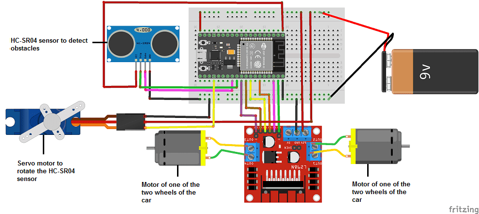
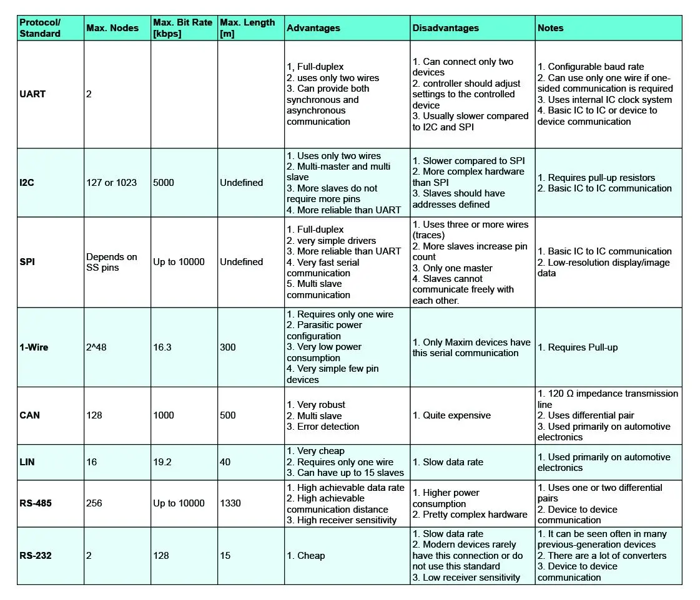
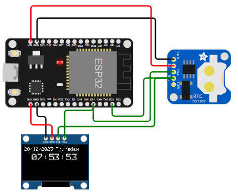

# Protocolos de comunicación entre los componentes de un nodo

## Objetivos

> * Comprender los diferentes protocolos de comunicación empleados por los componentes básicos de un nodo.
> * Explorar algunos ejemplos de aplicación

## 1. Referencias principales

1. Lección 3 **Interact with the phisycal world** ([link](https://github.com/microsoft/IoT-For-Beginners/blob/main/1-getting-started/lessons/2-deeper-dive/README.md)) del curso **IoT for Beginners** ([link](https://github.com/microsoft/IoT-For-Beginners)) de Microsoft.

## 2. Conceptos abordados

1. Comunicación serial [[link]](https://udea-iot.github.io/UdeA_IoT-page/docs/sesiones/percepcion/sesion4/)
2. Comunicación usando One Wire (En construcción...)
3. Comunicación usando I2C (En construcción...)
4. Comunicación usando SPI (En construcción...)

## 3. Contextualización

Hasta el momento hemos visto como conectar una placa de desarrollo con dispositivos simples (sensores y actuares) usando señales analogas y digitales simples. Para ilustrar esto, en la siguiente tabla se resumen algunos casos de uso sencillos:

|Sentido|Tipo|Ejemplos|Funciones tipicas|
|---|---|---|---|
|Entrada|Digital|Sensor PIR, boton, sensor de toque, receptor infrarrojo, teclado matricial, sensor de inclinación, interruptor magnetico, sensor de ultrasonido (HC-SR04)|`digitalRead`|
||Analoga|Sensor de luz (fotoresistencia), sensor de sonido, sensor de temperatura (termistor), sensor de efecto hall|`analogRead`|
||Digital + Analoga|Sensor de llama, Sensor Hall lineal, sensor de sonido ruido (Big Sound), sensor de sonido y voz (Small Sound), sensor de temperatura, joystick|`digitalRead`, `digitalRead`|
|Salida|Digital|Led, Relay, Buzzer, Led RGB|`digitalWrite`|
||Análoga (PWM)|Led RGB, Led, servo motor, motor DC|`analogWrite`|
||Digital + Analoga||`digitalWrite`, `analogWrite`|

Un ejemplo en la pagina **Obstacle avoiding robot using ESP32** ([link](https://www.robotique.tech/robotics/obstacle-avoiding-robot-using-esp32/)) se muestra como implementar un robot que evite obstaculos mediante diferentes tipos de sensores y actuadores conectados a un ESP32 tal y como se muestra en la siguiente figura:

Notese que con lo que se ha visto hasta el momento es facil dar manejo mediante las funciones basicas del Framework Arduino vistas hasta el momento. Sin embargo, ¿Que sucede si los dispositivos que se conectan son mas complejos?, ¿Usar estas funciones es suficiente o habra que hechar mano de otras posibilidades?

A continuación vamos a responder a estos interrogantes.

## 4. Protocolos IoT comumente usados

Para permitir la comunicación entre dispositivos se usan diferentes tipos de protocolos los cuales se pueden clasificar en dos grandes grupos:

|Tipo|Caracteristicas|Ejemplos|
|---|---|---|
|Inalambricos|Facilitan la movilidad entre los dispositivos conectados; sin embargo, tienen limitantes en lo que respecta el consumo de potencia, el rango de cobertura y (comparativamente) las tasas de transferencia y throughput.|802.11 WiFi, Bluetooth, Low Power Wide Area Network (LPWAN), LoRa, SigFox|
|Alambricos|Superan algunas de las limitaciones de la tecnología inalámbrica, en particular las velocidades de datos y la eficiencia energética; sin embargo, puede requerir la instalación de una infraestructura significativa por lo que solo se adaptan bien a dispositivos estacionarios.|SPI, I2C, Ethernet, RS232|

A continuación nos vamos a centrar en algunos de los del ultimo grupo.

## 5. Conexión alambrada

En la actualidad, se dispone de una gran cantidad de circuitos integrados IC como: memorias, sensores digitales, potenciometros digitales y circuitos de radio frecuencia entre otros. Todos estos dispositivos realizan diferentes operaciones que dependen de la información que es enviada entre sí para la implementación del funcionamiento del sistema electronico al que pertenecen (Thing).

Para permitir la comunicación de estos componentes, se emplean diferentes protocolos de comunicación definidos mediante estandares comunes para que haya independencia del fabricante.

Uno de los recursos mas limitados de cualquier componente electrónico es la cantidad de conexiones físicas disponibles (puertos). Conectar un componente requiere el uso de uno o varios puertos (cuando la transferencia entre datos es exclusivamente paralela) lo cual puede constituir un problema de escalabilidad en cuanto a la cantidad de elementos que puede tener una cosa. Para hacer frente a esto se implementan buses de comunicación serial con el fin de permitir la comunicación entre dos o mas dispositivos usando el minimo numero de puertos. La siguiente tabla tomada de la pagina **Comparación de protocolos de comunicación serial** ([link](https://resources.altium.com/es/p/comparing-all-serial-communications-protocols)) resume algunos de los principales:

El uso de un bus serial se puede evidenciar en la siguiente figura ([simulacion](https://wokwi.com/projects/385342221728294913)). Notese que hay dos dispositivos electronicos (display oled y RTC) conectados a traves de un mismo par de pines (cables verdea) a un ESP32.

A continuación se tratará, con un poco mas de detalle, algunos de los diferentes tipos de protocolos de comunicación serial empleados para la conexión de dispositivos:
* RS-232 [[link]](RS_232/README.md)
* One Wire [[link]](one-wire/README.md)
* I2C [[link]](I2C/README.md)
* SPI [[link]](SPI/README.md)

<!---

* https://wokwi.com/projects/408066567839849473
* https://wokwi.com/projects/385342221728294913
* https://how2electronics.com/esp32-ds3231-based-real-time-clock/
* https://medium.com/@sonyalfathani/pertemuan-3-fundamental-esp32-common-peripheral-19967ff0e9a2
* https://www.robotique.tech/robotics/obstacle-detection-system-with-esp32/
  
---

* https://www.hackster.io/ubidots/projects
* https://randomnerdtutorials.com/projects-esp32/
* https://circuitdigest.com/esp32-projects
* https://lastminuteengineers.com/electronics/esp32-projects/
* https://hackaday.io/projects?tag=ESP32
* https://learn.adafruit.com/digikey-iot-studio-smart-home/overview
* https://www.digikey.com/en/maker/platforms/e/esp32
* https://esp32io.com/tutorials/esp32-controls-car-via-web
* https://www.seeedstudio.com/blog/2021/02/02/fun-esp32-projects-you-need-to-try/
* https://microcontrollerslab.com/esp32-i2c-communication-tutorial-arduino-ide/
* 
-->

## Referencias

* https://learn.sparkfun.com/tutorials/serial-communication/all
* https://resources.altium.com/es/p/spi-versus-i2c-how-choose-best-protocol-your-memory-chips
* https://resources.altium.com/es/p/i2c-vs-spi-vs-uart-how-layout-these-common-buses
* https://www.analog.com/en/resources/analog-dialogue/articles/uart-a-hardware-communication-protocol.html
* https://resources.altium.com/p/serial-communications-protocols-introduction
* https://resources.altium.com/p/serial-communications-protocols-part-two-uart
* https://resources.altium.com/p/serial-communications-protocols-part-three-rs-232
* https://resources.altium.com/p/serial-communications-protocols-rs-485
* https://resources.altium.com/p/serial-communications-protocols-part-5-spi
* https://resources.altium.com/p/6-serial-communications-protocols-i2c
* https://resources.altium.com/p/7-serial-communications-protocols-1-wire
* https://resources.altium.com/p/serial-communications-protocols-can-and-lin
* https://resources.altium.com/es/p/spi-versus-i2c-how-choose-best-protocol-your-memory-chips
* https://hackmd.io/2oRlH_ogSWigu6HOc99TYw
* https://learn.sparkfun.com/tutorials/installing-an-arduino-library/all
* https://learn.adafruit.com/adafruit-all-about-arduino-libraries-install-use/arduino-libraries
* https://learn.adafruit.com/arduino-tips-tricks-and-techniques/arduino-libraries
* https://docs.arduino.cc/software/ide-v1/tutorials/installing-libraries
* https://docs.arduino.cc/software/ide-v2/tutorials/ide-v2-installing-a-library
* https://github.com/UdeA-IoT/actividad-4
* https://www.arduino.cc/reference/en/libraries/
* https://esp32io.com/tutorials/esp32-keypad
* https://deepbluembedded.com/esp32-keypad-lcd-example-arduino/
* https://docs.simplefoc.com/library_platformio
* https://randomnerdtutorials.com/vs-code-platformio-ide-esp32-esp8266-arduino/
* https://dronebotworkshop.com/platformio/
