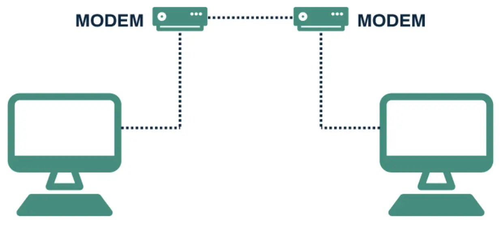
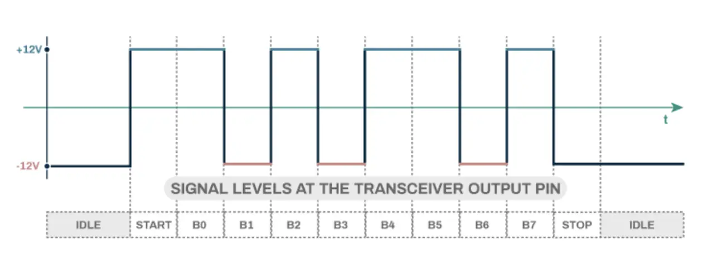
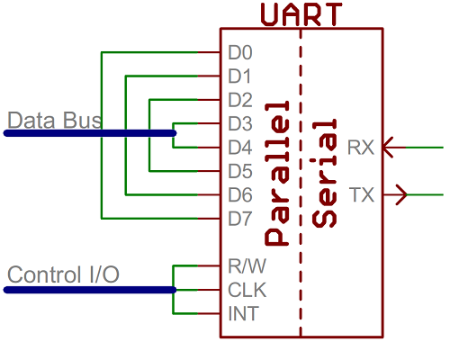
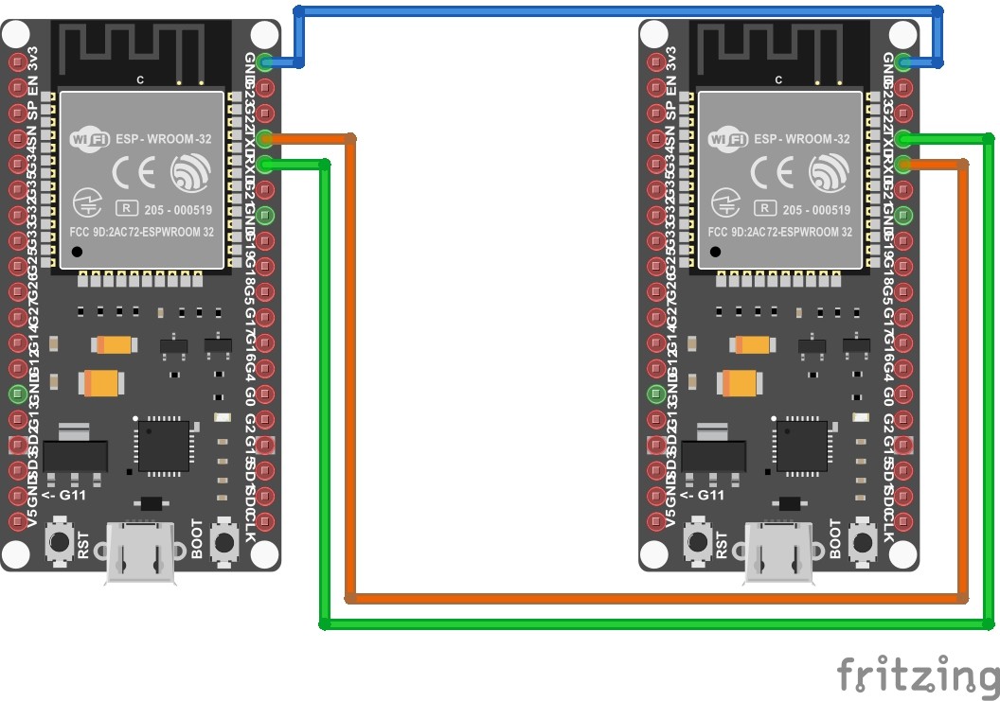
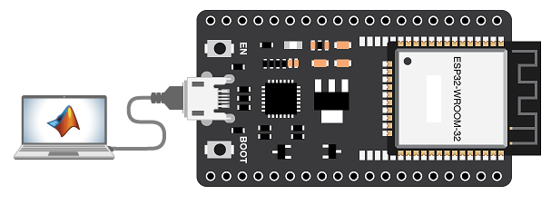
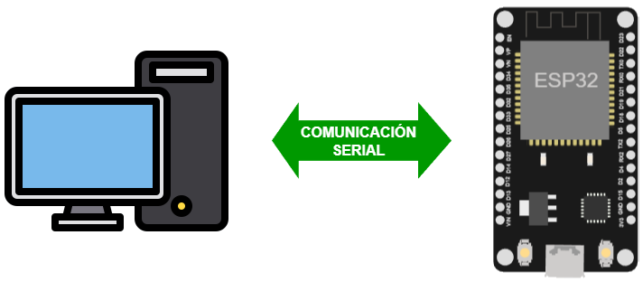
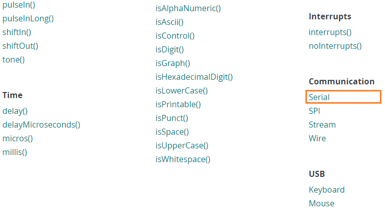

# RS-232

Se introdujo en 1960 para conectar computadores y modems denominados:
* **DTE**: Data Terminal Eqipment (computer)
* **DCE**: Data Communications Equipment (modem)

Este protocolo asíncrono utiliza líneas de control dedicadas para facilitar el intercambio de información entre el DTE y el DCE.

El RS-232 usa un voltaje positivo para la transmisión una señal cuyo nivel es bajo (0) y un voltaje negativo para la transmisión de un nivel logico alto (1).

La siguiente tabla resume los niveles logicos empleados.

|Nivel logico|Rango de voltaje|
|---|---|
|0|-18v to -5v|
|(Indefinido)|-5v to +5v|
|1|+5v to +18v|

La comunicación entre dos dispositivos usando RS-232 es simple. El dispositivo que envia almacena los datos en un buffer y los envia a traves de un cable destinado para esto (cable de datos), cuando le llegan los datos al receptor, entonces almacena estos datos en su buffer y una vez este se llena, el receptor puede proceder a leer los datos recibidos.

El hardware encargado de realizar la conversión de los datos de paralelo a serial (y viceversa) y asegura la transferencia serial de estos se conoce como **UART** (**Universal Asynchronous Receiver/Transmitter**) y viene integrado en los microcontroladores:

## Sobre la comunicación serial

Como el protocolo en serial asíncrono no tiene señal de reloj, tiene un conjunto de mecanismos que ayudan a garantizar la transferencia de los datos sin errores, estos son (en ingles):
* Data bits
* Synchronization bits
* Parity bits
* Baud rate

Cuando se envia la información, cada bloque (usualmente un byte) de datos es transmitido dentro de un paquete o trama de bits. Las tramas de bits se crean agregando bits de sincronización y paridad a los datos.

## Conexión 

Un bus serial consiste solamente de dos cables, uno para enviar los datos y otro para recibirlos. En un dispostivo con capacidad de transmisión serial tienen minimo un par de pines rotulados como **RX** para el receptor y **TX** para en trasmisor.

Cuando dos dispositivos se conectan, se hace de tal manera que el pin de transmisión del primero este conectado al pin de recepción del segundo y viceversa.

## Aplicaciones de la comunicación serial

Cualquiera de las placas disponibles en el laboratorio tiene al menos un puerto serial (UART o SUART). A traves de este puerto es posible:
1. La comunicación entre entre dos placas a traves de la conexión cruzada entre los pines de transmisión (`TX`) y recepción (`RX`) de estas ([link](https://www.hackster.io/onedeadmatch/custom-uart-protocol-on-esp32-1e2fa4)).
   
   

2. La comunicación entre una placa y el computador mediante USB (haciendo uso de un adaptador USB a Serial) el cual suele venir integrado con las placas ([link](https://www.mathworks.com/help/supportpkg/arduinoio/ug/configure-setup-for-esp32-hardware.html)).
   
   

## Escenarios de aplicación

Cuando se hace uso del puerto serial tenemos principalmente dos escenarios de aplicacion:
1. Debug de aplicaciones complejas.
2. Comunicación y transmisición de diferentes tipos de información (comandos, estado, Valor de variables, etc.) según el tipo de aplicación que se use.

### Escenario 1 - Debug de aplicaciones

Una de las aplicaciones mas utilies del puerto serial es que facilita el debug de aplicaciones gracias a que por medio de este se pueden imprimir, en tiempo de ejecución, mensajes de log que sirven como verificar el correcto funcionamiento de la logica del programa al usar un programa como el monitor serial o cualquier programa similar.

Es muy comun imprimir variables (que pueden indican el estado o valor de un sensor, mensajes de la aplicación, etc).

El siguiente ejemplo ([link](https://wokwi.com/projects/358500354708861953)) muestra un caso de uso en el que se aplica este escenario:

### Escenario 2 - Comunicación con otras placas y con el PC

Por medio de operaciones de lectura y escritura en el puerto serial, es posible transmitir información desde y hacia otro dispositivo de hardware que tenga interfaz serial (Otra placa, computador o hardware especifico).

Para comprender esto en el siguiente directorio explicara paso a paso una aplicación mediante la cual se enviaran comandos por serial desde un el PC al ESP32 para una tarea sencilla como prender y apagar un led.

## API para comunicación serial de Arduino

En el API de Arduino ([link](https://www.arduino.cc/reference/en/)) se encuentran las principales funciones, clases y estructuras de datos que se usan para hacer programas en Arduino. En el link [Serial](https://www.arduino.cc/reference/en/language/functions/communication/serial/) la sección **Communication** se acceden a la documentación de todas las funciones para establecer comunicación serial.

> **Para profundizar**  
> Puede consultar las notas de clase donde se encuentra un resumen de las funciones mas comunes del API de Arduino para la comunicación serial en el siguiente [link](https://udea-iot.github.io/UdeA_IoT-page/docs/sesiones/percepcion/sesion4a)

La siguiente tabla resume de manera breve algunas de las principales funciones de la libreria serial.

|Función|Sintaxis|Descripción|
|---|---|---|
|`Serial.begin()`|`Serial.begin(speed)`|Configura la velocidad de transmisión serial (bits por segundo = baud).|
|`Serial.print()`   `Serial.println()`|`Serial.print(data)`  `Serial.println(data)`|Imprime los datos del puerto serial en formato ASCII, cuando se usa el método `.println(data)` se pone un salto de linea al final.|
|`Serial.available()`|`Serial.available()`|Devuelve la cantidad de bytes disponibles (pendientes por leer) en el puerto serial|
|`Serial.read()`|`Serial.read()`|Lee un dato a traves del puerto serial. Cuando no hay datos devuelve `-1`|
|`Serial.end()`|`Serial.end()`|Deshabilita la comunicación serial permitiendo que los pines `RX` y `TX` puedan ser usados como pines de entrada y salida `(I/O)`.|
|`Serial.write()`|`Serial.write(val)`   `Serial.write(str)`   `Serial.write(buf, len)`|Escribe un dato (o una cadena de datos) en formato binario al puerto serial|
|`Serial.flush()`|`Serial.flush()`|Espera hasta que la transmisión de los datos seriales que salen se complete|
|`Serial.peek()`|`Serial.peek()`|Permite lectura del puerto serial sin remover datos del buffer interno. |
|`Serial.SerialEvent()`|`Serial.SerialEvent()`|Funcion que se llama cuando hay datos disponibles en el puerto serial.|

## Ejemplos 

A continuación se listan algunos de los ejemplos que ilustran la comunicación serial:
1. Ejemplo 1 - Encendido y apagado de un LED usando comunicación serial [[link]](ejemplo1/README.md)
2. Ejemplo 2 - Debug de una aplicación usando el monitor serial [[link]](ejemplo2/README.md)
3. Ejemplo 3 - ESP32 y joystick [[link]](ejemplo3/README.md)
4. Ejemplo 4 - Aplicación para control de una ESP32 usando serial [[link]](ejemplo4/README.md)
5. Ejemplo 5 - Aplicación de escritorio que recibe los datos sensados por un ESP32 mediante comunicación serial [[link]](ejemplo5/README.md)
6. Ejemplo 6 - Comunicación serial usando NodeRed [[link]](ejemplo6/README.md)
