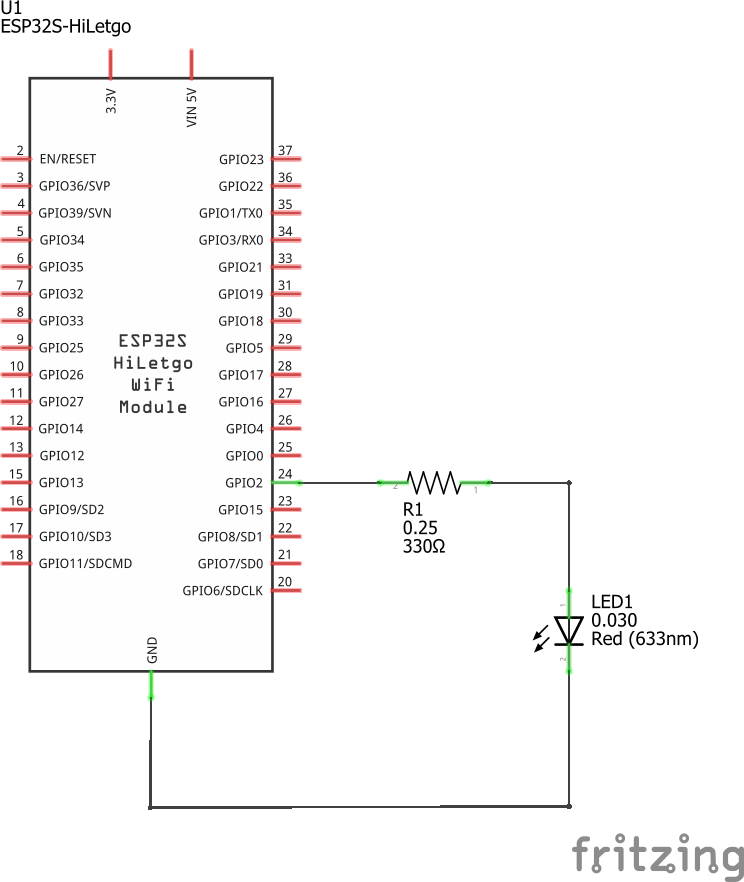
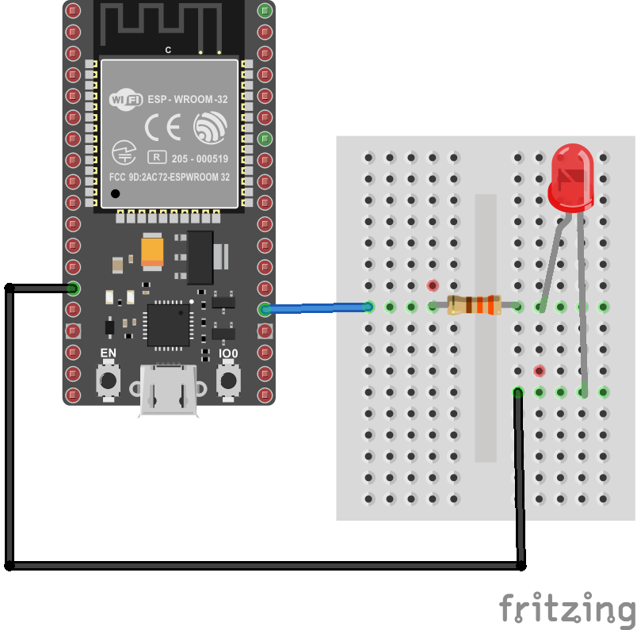
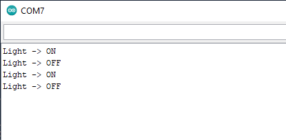
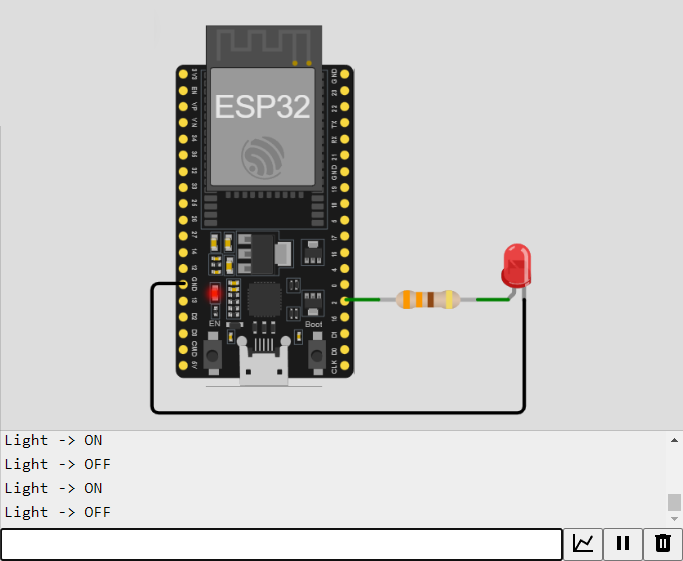

# Ejemplo 1 - Encendido y apagado de un LED usando comunicación serial

## Descripción

Desarrollar una aplicación enviar comandos de manera serial para el control del encedido y apagado de un LED que se conecta en un ESP32.

## Hardware

La siguiente tabla muestra los componentes principales del circuito a montar:


| Item # | Cantidad | Descripción    | Información |
| ------ | -------- | -------------- | ----------- |
| 1      | 1        | ESP32          | N/A         |
| 2      | 1        | Led            | N/A         |
| 3      | 1        | Resistencia  $330 \Omega$  | N/A         |


### Esquematico

<p align="center">
  
</p>

### Conexión entre los componentes

A continuación se muestra la conexión entre los componentes:

<p align="center">
  
</p>

La siguiente tabla resume las conexiones:


|Puerto| Pin| Tipo| Nombre| Descripción|
|---|---|---|---|---|
|`24`|`GPIO2`| Output| `LIGHT1`| Puerto de control del LED|


## Software

Una vez definido el hardware, el siguiente paso consiste en determinar el software de acuerdo a los requerimientos que se dan. Para empezar, es necesario determinar los comandos que recibira la placa ESP32 para encender y apagar el led conectado a esta. Estos, se describen en la siguiente tabla:

|Comando | Descripción |
|---|---|
|`H` |Comando empleado para encender el Led.|
|`L` |Comando empleado para apagar el Led.|

### Código

Con los requerimientos claros, el codigo fuente a implementar en el ESP32 se muestra a continuación:

```C++
/* Entradas y salidas */
#define LIGHT1 2          // P24 (GPIO2)

/* Comandos */
#define LIGHT_ON 'H'       // Luz encendida  
#define LIGHT_OFF 'L'      // Luz apagada  

int cmd = 0; // Comnado entrado por serial

void setup() {
  // Configuración de los puertos digitales
  pinMode(LIGHT1, OUTPUT);    
  digitalWrite(LIGHT1, LOW);
  // Configuracion del puerto serial
  Serial.begin(9600); 
  
}

void loop() {
  // reply only when you receive data:
  if (Serial.available() > 0) {
    // read the incoming byte:
    cmd = Serial.read();

    // Encendido o apagado de la luz segun el comando
    if(cmd == LIGHT_ON) {
      digitalWrite(LIGHT1, HIGH);
      Serial.println("Light -> ON");
    }
    else if(cmd == LIGHT_OFF) {
      digitalWrite(LIGHT1, LOW);    
      Serial.println("Light -> OFF");
    } 
  }
}
```

Despues de codificar el programa en el IDE y descargarlo en la placa ESP32, el siguiente paso consiste en probar su funcionamiento.

## Pruebas

Una vez descargado el programa en el ESP, el siguiente paso consiste en probar el correcto funcionamiento del programa enviando comandos para lo cual se procede a realizar la prueba empleando el monitor serial del Arduino IDE (o empleando cualquier otra terminal serial [link](https://learn.sparkfun.com/tutorials/terminal-basics/arduino-serial-monitor-windows-mac-linux)). La siguiente figura muestra este procedimiento:



En la figura anterior, con la terminal serial a configurada a **9600 bps**, si se envian los caracteres `H` (prender luz) y `L` y el led apaga y prende tal y como se espera, todo estará bien y la prueba estará completada.

## Simulación

Para comprender el funcionamiento del programa, puede seguir el siguiente [link](https://wokwi.com/projects/391476063038319617) en [wokwi](https://wokwi.com/)

<p align="center">
  
</p>

## Referencias

* https://makeabilitylab.github.io/physcomp/esp32/tone.html
* https://learn.adafruit.com/pir-passive-infrared-proximity-motion-sensor/using-a-pir-w-arduino
* https://github.com/UdeA-IoT/clases-IoT_capa-percepcion_2023-2/blob/main/dia4/serial-esp32-platformio/README.md