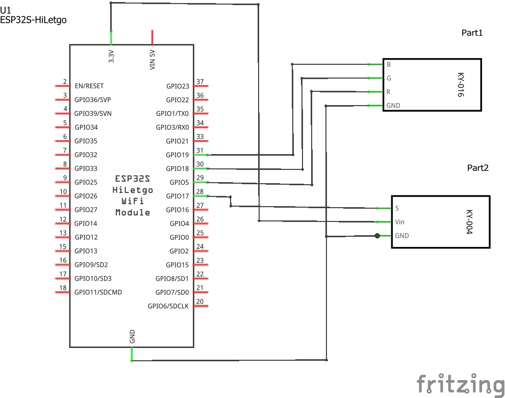
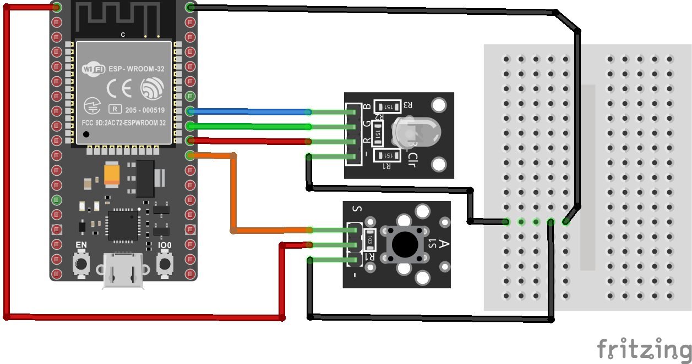
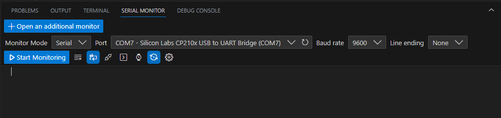
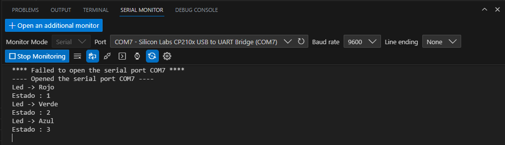
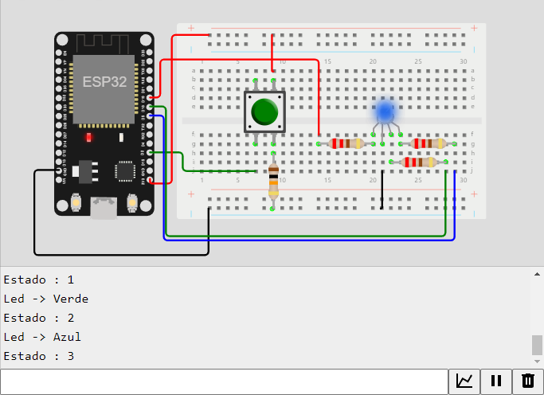

# Ejemplo 2 - Debug de una aplicación usando el monitor serial

## Descripción

La siguiente aplicación muestra un ejemplo en el que se usa la comunicación serial para realizar un debug de una aplicación imprimiendo mensajes enviados desde el ESP32 con el fin de hacer una prueba de escritorio que determine que el funcionamiento de la aplicación es coherente con lo que se espera.

## Hardware

La siguiente tabla muestra los componentes principales del circuito a montar:


| Item # | Cantidad | Descripción    | Información |
| ------ | -------- | -------------- | ----------- |
| 1      | 1        | ESP32          | N/A         |
| 2      | 1        | Pulsador       | Se empleo el modulo **Reed Switch Module** del **37 Sensor Kit - Elegoo**  |
| 3      | 1        | Led RGB  | Se uso el modulo **RGB LED Module** del **37 Sensor Kit - Elegoo** |


### Esquematico

<p align="center">
  
</p>

### Conexión entre los componentes

El diagrama de conexión asociado al esquematico anterior, se muestra a continuación:

<p align="center">
  
</p>

La siguiente tabla muestra las conexiones entre la placa ESP32 y los modulos externos (led y switch):

|Puerto| Pin| Tipo| Nombre| Descripción|
|---|---|---|---|---|
|`31`|`GPIO19`|Output|`PIN_BLUE`|Puerto que se conecta al pin B (azul) del modulo del led RGB|
|`30`|`GPIO18`|Output|`PIN_GREEN`|Puerto que se conecta al pin G (verde) del modulo del led RGB|
|`29`|`GPIO5`|Output|`PIN_RED`|Puerto que se conecta al pin R (red) del modulo del led RGB|
|`28`|`GPIO17`|Input|`PIN_BUTTON`|Puerto de control que se conecta pin S del modulo switch|


## Software

### Código

Con los requerimientos claros, el codigo fuente a implementar en el ESP32 se muestra a continuación:

```C++
/* Constantes */

// Para debug
#define DEBUG 1

// Estados 
#define OFF_STATE 0
#define RED_STATE 1
#define GREEN_STATE 2
#define BLUE_STATE 3

// Comunicacion serial
const int baud_rate = 9600;

// Para el programa
const int DEBOUNCE_WINDOW = 40; // in ms

/* Entradas y salidas */

// Entradas
const int PIN_BUTTON = 17;

// Salidas
#define PIN_RED 5      // P5 (GPIO5)
#define PIN_GREEN 18   // P18 (GPI18)
#define PIN_BLUE 19     // P19 (GPI19)

/* Variables*/
int state;          // Estado
int button_val_prev;  // Valor del boton anterior
int button_val_act;  // Valor del boton anterior

/* Funciones */

void put_color(int, int, int);

void setup() {  
  pinMode(PIN_BUTTON, INPUT);  
  state = OFF_STATE;
  button_val_act = LOW; // Valor inicial del boton
  put_color(0, 0, 0);   // Led inicia apagado
  Serial.begin(baud_rate);   
  Serial.println("Dispositivo iniciado: OK");
  Serial.println("Led -> Apagado");
  #ifdef DEBUG   
    Serial.print("Estado actual: ");
    Serial.println(state);
  #endif
}

void loop() {
  // Lectura inicial del boton  
  button_val_act = digitalRead(PIN_BUTTON); // Se lee el boton
  
  // Ventan de tiempo para el debounce
  delay(DEBOUNCE_WINDOW);                   
  
  // Lectura despues de que pasa el rebote del boton 
  button_val_prev = button_val_act;         // Se almacena el valor previo del boton
  button_val_act = digitalRead(PIN_BUTTON); // Se vuelve a leer el boton

  // Comparacion de los valores previo y actual del boton
  if (button_val_act != button_val_prev) {
    // Se pulso el boton
    if(button_val_act == HIGH) {
      // Se verifica que el boton haya cambiado de LOW a HIGH
      // Maquina de estados
      switch (state) {
      case OFF_STATE:            
        state = RED_STATE;    // Proximo estado -> Rojo
        put_color(255, 0, 0); // Led se pone en rojo
        Serial.println("Led -> Rojo");
        #ifdef DEBUG          
          Serial.print("Estado : ");
          Serial.println(state);
        #endif
        break;
      case RED_STATE:            
        state = GREEN_STATE;  // Proximo estado -> Verde
        put_color(0, 255, 0); // Led se pone en verde
        Serial.println("Led -> Verde");
        #ifdef DEBUG          
          Serial.print("Estado : ");
          Serial.println(state);
        #endif
        break;
      case GREEN_STATE:            
        state = BLUE_STATE;   // Proximo estado -> Azul
        put_color(0, 0, 255); // Led se pone en azul
        Serial.println("Led -> Azul");
        #ifdef DEBUG          
          Serial.print("Estado : ");
          Serial.println(state);
        #endif
        break;
      case BLUE_STATE:            
        state = OFF_STATE;   // Proximo estado -> Apagado
        put_color(0, 0, 0); // Led se apaga
        Serial.println("Led -> Apagado");
        #ifdef DEBUG          
          Serial.print("Estado : ");
          Serial.println(state);
        #endif
        break;
      }    
    }
  }
}

// Funciones
void put_color(int R, int G, int B) {
  analogWrite(PIN_RED,R);
  analogWrite(PIN_GREEN,G);
  analogWrite(PIN_BLUE,B);
}
```

Despues de codificar el programa en el IDE y descargarlo en la placa ESP32, el siguiente paso consiste en probar su funcionamiento.

## Pruebas

A continuación se muestra el resultado de realizar las pruebas empleando la terminal serial en el platformio.


### Uso del monitor serial de platformio

Se puede hacer debug serial empleando el **Monitor serial** tal y como se muestra en la siguiente figura. Para usarlo se presiona el boton **Start Monitoring**:



A continuación se muestra la prueba de funcionamiento en la cual se puede observar la información que es envia desde el ESP32 al monitor serial en el PC:



## Simulación

### Wokwi - Simulación

Para comprender el funcionamiento del programa, puede seguir el siguiente [link](https://wokwi.com/projects/375183687075033089)

<p align="center">
  
</p>

## Referencias

* https://makeabilitylab.github.io/physcomp/esp32/tone.html
* https://learn.adafruit.com/pir-passive-infrared-proximity-motion-sensor/using-a-pir-w-arduino
* https://github.com/UdeA-IoT/clases-IoT_capa-percepcion_2023-2/blob/main/dia4/serial-esp32-platformio/README.md