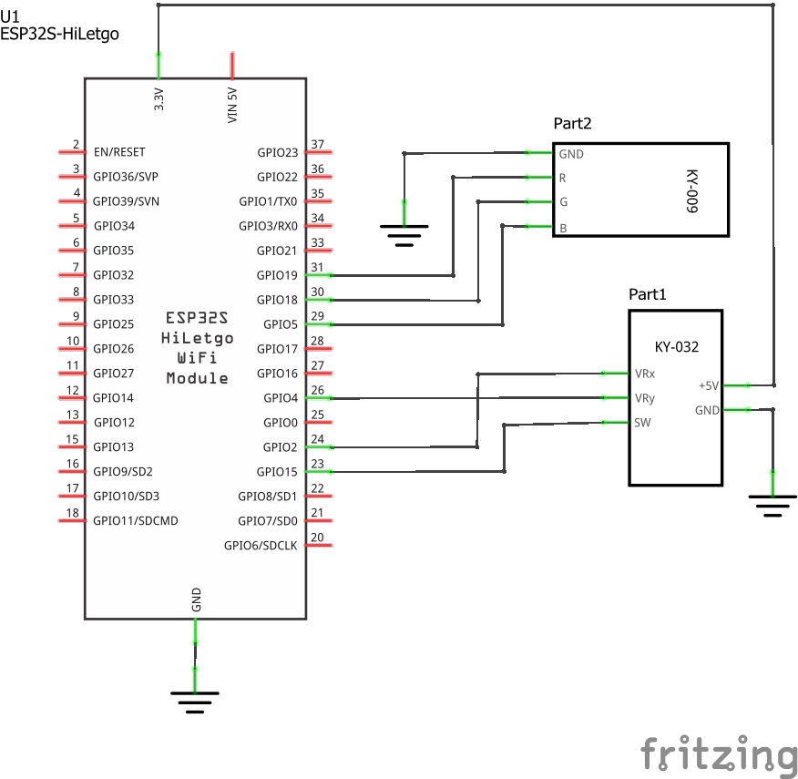
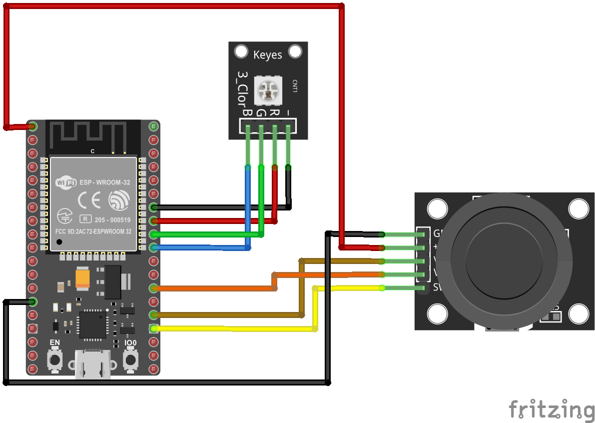
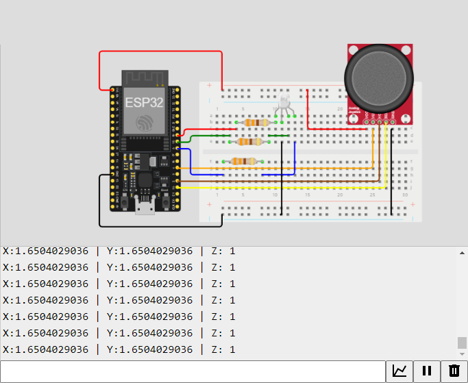

# Ejemplo 3 - ESP32 y joystick

## Descripción

Realizar una aplicación que permita cambiar los colores de un led RGB usando un joystick. Los valores leidos en al joystick deben imprimirse en el monitor serial

## Hardware

La siguiente tabla muestra los componentes principales del circuito a montar:


| Item # | Cantidad | Descripción    | Información |
| ------ | -------- | -------------- | ----------- |
| 1      | 1        | ESP32          | N/A         |
| 2      | 1        | Joystick Module |  37 Sensor Kit - Elegoo  |
| 3      | 1        | SMD RGB Module  | 37 Sensor Kit - Elegoo |

### Esquematico


<p align="center">
  
</p>

### Conexión entre los componentes

El diagrama de conexión asociado al esquematico anterior, se muestra a continuación:

<p align="center">
  
</p>


## Software

### Código

Con los requerimientos claros, el codigo fuente a implementar en el ESP32 se muestra a continuación:

```C++
//uncomment this line if using a Common Anode LED
//#define COMMON_ANODE

/* ------- Pinout ------- */ 
// Joystick
const int pinX = 2;        //  GPIO02
const int pinY = 4;        //  GPIO04
const int pinSW = 15;      //  GPIO15
// Led RGB
const int redPin = 19;     //  GPIO19
const int greenPin = 18;   //  GPIO18
const int bluePin = 5;     //  GPIO05

/* ------- Variables ------- */ 
// Joystick variables
int valueX = 0;        //  Analog
int valueY = 0;        //  Analog
int valueZ = 0;        //  Digital

void setup() {
  // Setup serial
  Serial.begin(9600);
  // Setup outputs
  pinMode(redPin, OUTPUT);
  pinMode(greenPin, OUTPUT);
  pinMode(bluePin, OUTPUT);  
}

void loop() {
  // Local variables  
  float x_volt, y_volt;
  int red_value, green_value, blue_value;
  // Read joystick inputs
  valueX = analogRead(pinX); 
  valueY = analogRead(pinY); 
  valueZ = digitalRead(pinSW);  
  // Convert digital value to voltage 
  x_volt = ( ( valueX * 3.3 ) / 4095 );  
  y_volt = ( ( valueY * 3.3 ) / 4095 ); 
  // Serial.println(x_volt);
  // Serial.println(y_volt);
  // Map joystick values
  red_value = map(valueX, 0, 4095, 0, 255);  
  green_value = map(valueY, 0, 4095, 0, 255);  
  if (valueZ == HIGH) {
    blue_value = 0;
  }
  else {
    blue_value = 255;
  }
  // Set RGB color
  // Serial.println(red_value);
  // Serial.println(green_value);
  // Serial.println(blue_value);
  setColor(red_value, green_value, blue_value);

  // Print serial values
  Serial.print("X:");
  Serial.print(x_volt, DEC);   
  Serial.print(" | Y:"); 
  Serial.print(y_volt, DEC);   
  Serial.print(" | Z: "); 
  Serial.println(valueZ, DEC); 
  delay(100);
}

void setColor(int red, int green, int blue)
{
  #ifdef COMMON_ANODE
    red = 255 - red;
    green = 255 - green;
    blue = 255 - blue;
  #endif
  analogWrite(redPin, red);
  analogWrite(greenPin, green);
  analogWrite(bluePin, blue);  
}
```

Despues de codificar el programa en el IDE y descargarlo en la placa ESP32, el siguiente paso consiste en probar su funcionamiento.

## Pruebas

Pendiente...

## Simulación

Para comprender el funcionamiento del programa, puede seguir el siguiente [link](https://wokwi.com/projects/391481032220635137)

<p align="center">
  
</p>


## Referencias

* https://www.dfrobot.com/blog-996.html
* https://wiki.dfrobot.com/Joystick_Module_For_Arduino_SKU_DFR0061
* https://lastminuteengineers.com/joystick-interfacing-arduino-processing/
* https://forum.arduino.cc/t/code-trigonometry-joystick-how-to-map-x-y-values/585018/2
* https://exploreembedded.com/wiki/Analog_JoyStick_with_Arduino
* http://www.electronicapty.com/component/k2/item/68-manual-modulo-joystick/68-manual-modulo-joystick
* https://www.electronicwings.com/esp32/analog-joystick-interfacing-with-esp32
* https://esp32io.com/tutorials/esp32-joystick
* https://www.geekering.com/categories/embedded-sytems/esp8266/ricardocarreira/arduino-mega-2-axis-joystick/
* https://components101.com/modules/joystick-module
* https://www.luisllamas.es/arduino-joystick/
* https://programarfacil.com/blog/arduino-blog/joystick-con-arduino/

