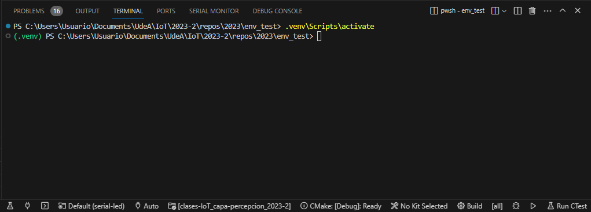
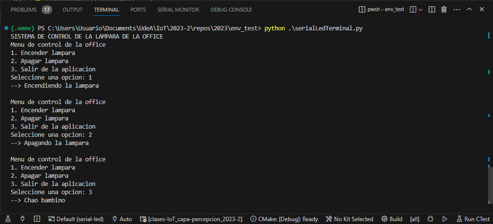

# Paso 2 - Desarrollo de la aplicación en python (Texto)

## Requerimientos

1. Acceder al entorno virtual ya configurado:

   ```
   cd cd env_test
   .venv\Scripts\activate
   ```

   La siguiente figura muestra el resultado:

   

   La documentación de esta libreria se encuentra en: [pySerial’s documentation](https://pythonhosted.org/pyserial/)

2. Tener el hardware funcionando correctamente (paso 1).
   
## Software

Una vez se tiene la certeza de que el hardware funciona de acuerdo a lo esperado, codifique el siguiente programa en python. Guardelo como ```serialLedTerminal.py```:

```python
import serial

SERIAL_PORT = 'COM7' # Cambiar
BAUD_RATE = 9600
ser = serial.Serial(port = SERIAL_PORT, baudrate = BAUD_RATE, timeout=.1)

def menu():
    print("Menu de control de la office " )
    print("1. Encender lampara" )
    print("2. Apagar lampara" )
    print("3. Salir de la aplicacion" )    

def lightON():
    ser.write(b'h')

def lightOFF():
    ser.write(b'l')

    
def main():
    print("SISTEMA DE CONTROL DE LA LAMPARA DE LA OFFICE")
    while True:
        menu()
        opc = input("Seleccione una opcion: ")
        if opc == '1':
            print("--> Encendiendo la lampara\n")
            lightON()     
        elif opc == '2':
            print("--> Apagando la lampara\n")
            lightOFF()
        elif opc == '3':
            ser.close()
            print("--> Chao bambino\n")
            break
        else:
            print("--> OPCION INVALIDA\n")

if __name__ == "__main__":
    main()
```

## Probando la aplicación

Antes de probar la aplicación tenga en cuenta lo siguiente:
1. Tras haber realizado exitosamente las pruebas de funcionamiento en el ESP32, cierre el monitor serial (de Arduino o Platformio) si lo tiene abierto.
2. Tenga el hardware:
   

   

3. Ejecute el script de python:
   
   ```bash
   python serialLedTerminal.py
   ```
      
   La salida de este se muestra a continuación:

   

   Si todo esta bien, el comportamiento deberá ser similar (Encendido y apagado del led) al que se obtuvo cuando se empleo la terminal serial en el paso 1 ([link](../paso1/README.md)). 

   Si todo lo realizado en este paso fue correcto, vaya al paso 3 ([link](../paso3/README.md))


