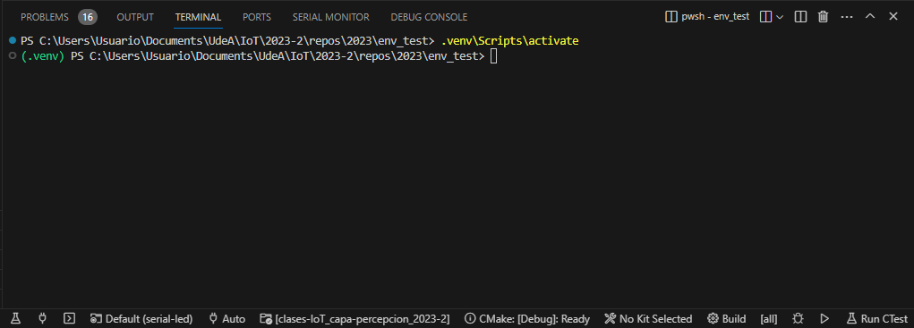
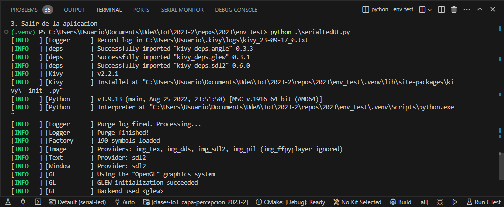
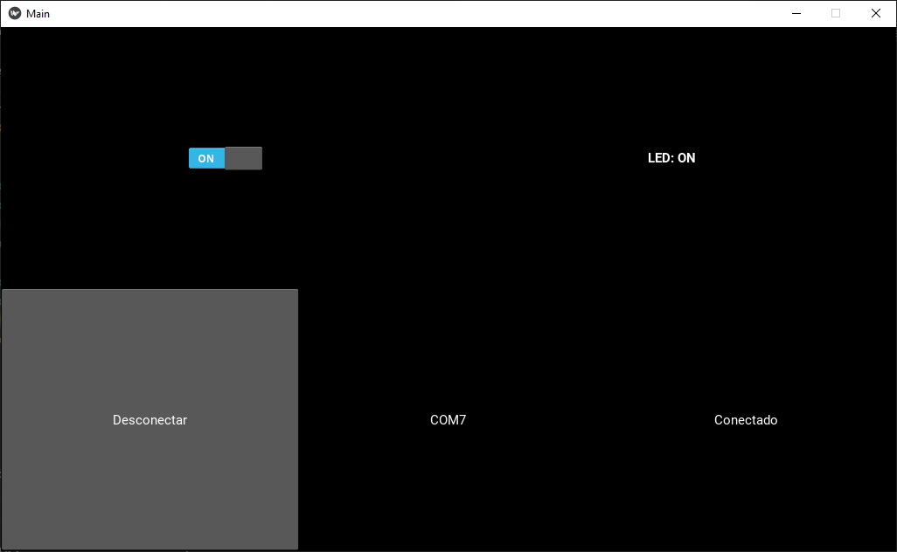

# Paso 3 - Desarrollo de la aplicación en python (Interfaz grafica)

## Prerequisitos

1. Acceder al entorno virtual ya configurado:

   ```
   cd cd env_test
   .venv\Scripts\activate
   ```

   La siguiente figura muestra el resultado:

   

## Software

Una vez se tiene la certeza de que el hardware funciona de acuerdo a lo esperado, codifique el siguiente programa en python . Guardelo como ```serialLedUI.py```:

```python
# -*- coding: utf-8 -*-

import sys
import glob
import serial
from serial.tools import list_ports

from kivy.app import App
from kivy.uix.boxlayout import BoxLayout
from kivy.uix.button import Button
from kivy.uix.textinput import TextInput
from kivy.uix.label import Label
from kivy.uix.switch import Switch
from kivy.uix.dropdown import DropDown
from kivy.logger import Logger

class MainApp(App):   
    
    def on_stop(self):
        self.lightOFF()
        print("Cerrando puerto")
        if (self.ser.is_open == True):
            self.ser.close()
        print("Cerrando la aplicacion")
            
    def build(self):
        self.conect_status = False
        self.PORT = self.listPorts()[0]
        self.ser = serial.Serial(port=self.PORT, baudrate=9600, timeout=.1)
        self.ser.close() 
        
        main_layout = BoxLayout(orientation="vertical")
        
        # Top layout
        self.top_layout = BoxLayout(orientation="horizontal")        
        # Top layout - light_switch (Switch)
        self.light_switch = Switch(active=True)
        self.light_switch.disabled = True

        self.light_switch.bind(active=self.change_light)
        self.top_layout.add_widget(self.light_switch)        
        # Top layout - light_status (Label)
        self.light_status = Label(text='[b]LED[b]: OFF',markup=True)
        self.top_layout.add_widget(self.light_status)
        
        # Botton layout
        self.botton_layout = BoxLayout(orientation="horizontal")        
        # Botton layout - connect_button (Button)
        self.connect_button = Button(text = "Conectar")
        self.connect_button.bind(on_press = self.connect)
        self.botton_layout.add_widget(self.connect_button)
        # Botton layout - port (Label)
        self.port = Label(text = self.PORT)
        self.botton_layout.add_widget(self.port)
        # Botton layout - connection_status (Label)
        self.connection_status = Label(text='Desconectado')
        self.botton_layout.add_widget(self.connection_status)
                 
        # Agregando elementos al widget principal
        main_layout.add_widget(self.top_layout)
        main_layout.add_widget(self.botton_layout)        
        return main_layout
    
    def change_light(self, instance, value):
        print("Pateame!!")
        print(value)
        if(value == True):
            self.light_status.text='[b]LED[b]: ON'
            Logger.debug("Ligth On")
            self.lightON()
        else:
            self.light_status.text='[b]LED[b]: OFF'
            Logger.debug("Ligth Off")
            self.lightOFF()
            
    def connect(self, instance):
        if(self.conect_status == False):
            self.connect_button.text = "Desconectar"
            self.connection_status.text = "Conectado" 
            self.ser.open()
            self.light_switch.disabled = False
            self.conect_status = True
        else:
            self.connect_button.text = "Conectar"
            self.connection_status.text = "Desconectado"
            self.ser.close()
            self.light_switch.disabled = True
            self.conect_status = False
        Logger.debug(self.ser.is_open)
    
    def listPorts(self):
        ports = []
        for port in list_ports.comports():
            ports.append(port.device)
        return ports

    def lightON(self):
        self.ser.write(b'h')

    def lightOFF(self):
        self.ser.write(b'l')
    
if __name__ == "__main__":
    app = MainApp()
    app.run()
```

## Probando la aplicación

Antes de probar la aplicación, se asume que los pasos 1 y 2 previamente descritos, fueron exitos. No resta de mas, recordar los pasos basicos antes de poner a funcionar la aplicación:
1. Cierre el monitor serial o cualquier otra aplicación que este haciendo uso del puerto serial.
2. Tenga el hardware conectado a la Maquina:
   
   

3. Ejecute el script de python:
   
   ```bash
   python serialLedUI.py
   ```

   La salida de este se muestra a continuación:

   

   El resultado mostrara una interfaz grafica que es lanzada:

   

   Si todo esta bien, el comportamiento deberá ser similar (Encendido y apagado del led) al que se obtuvo cuando se empleo la terminal serial en el paso 1.